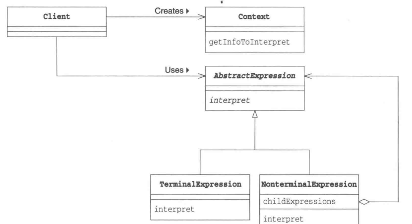

<!-- START doctoc generated TOC please keep comment here to allow auto update -->
<!-- DON'T EDIT THIS SECTION, INSTEAD RE-RUN doctoc TO UPDATE -->
**Table of Contents**  *generated with [DocToc](https://github.com/thlorenz/doctoc)*

- [解释器模式（Interpreter）](#%E8%A7%A3%E9%87%8A%E5%99%A8%E6%A8%A1%E5%BC%8Finterpreter)
  - [场景](#%E5%9C%BA%E6%99%AF)
  - [优点:](#%E4%BC%98%E7%82%B9)

<!-- END doctoc generated TOC please keep comment here to allow auto update -->

# 解释器模式（Interpreter）

## 场景
针对特定问题设计的一种解决方案。例如，匹配字符串的时候，由于匹配条件非常灵活，使得通过代码来实现非常不灵活

举个例子，针对以下的匹配条件：
1. 以+开头的数字表示的区号和电话号码，如+861012345678；
2. 以英文开头，后接英文和数字，并以.分隔的域名，如www.baidu.com；
3. 以/开头的文件路径，如/path/to/file.txt；

## 优点:

1.可扩展性比较好，灵活。

2.增加了新的解释表达式的方式。

3.易于实现文法

缺点:

1. 执行效率比较低，可利用场景比较少。

2. 对于复杂的文法比较难维护
