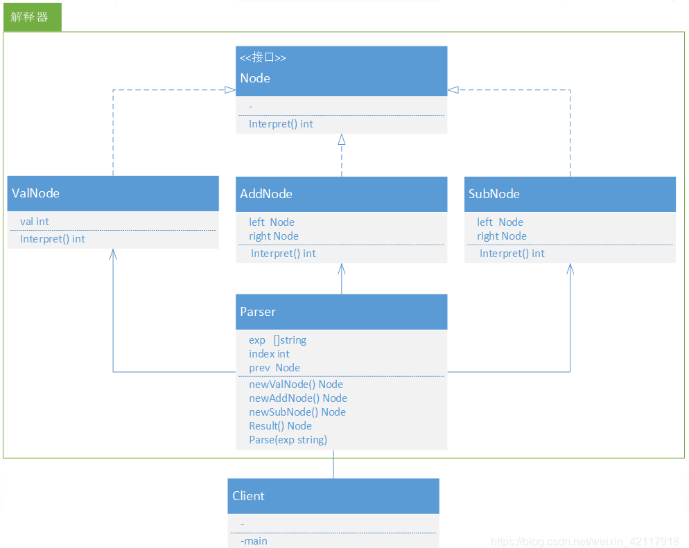

# 解释器模式（Interpreter）

## 场景
针对特定问题设计的一种解决方案。例如，匹配字符串的时候，由于匹配条件非常灵活，使得通过代码来实现非常不灵活

举个例子，针对以下的匹配条件：
1. 以+开头的数字表示的区号和电话号码，如+861012345678；
2. 以英文开头，后接英文和数字，并以.分隔的域名，如www.baidu.com；
3. 以/开头的文件路径，如/path/to/file.txt；

## 优点:

1.可扩展性比较好，灵活。

2.增加了新的解释表达式的方式。

3.易于实现文法

缺点:

1. 执行效率比较低，可利用场景比较少。

2. 对于复杂的文法比较难维护
