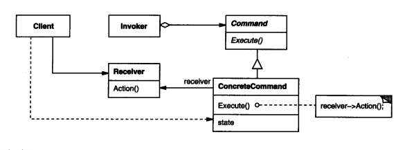

<!-- START doctoc generated TOC please keep comment here to allow auto update -->
<!-- DON'T EDIT THIS SECTION, INSTEAD RE-RUN doctoc TO UPDATE -->
**Table of Contents**  *generated with [DocToc](https://github.com/thlorenz/doctoc)*

- [Command 命令模式](#command-%E5%91%BD%E4%BB%A4%E6%A8%A1%E5%BC%8F)
  - [形象描述：](#%E5%BD%A2%E8%B1%A1%E6%8F%8F%E8%BF%B0)
  - [场景](#%E5%9C%BA%E6%99%AF)
  - [第三方应用 ： go-redis源码分析](#%E7%AC%AC%E4%B8%89%E6%96%B9%E5%BA%94%E7%94%A8--go-redis%E6%BA%90%E7%A0%81%E5%88%86%E6%9E%90)

<!-- END doctoc generated TOC please keep comment here to allow auto update -->

# Command 命令模式


客户端通过调用者发送命令,命令调用接收者执行相应操作

## 形象描述：
在命令模式中有如下几个角色:
- Command: 命令
- Invoker: 调用者
- Receiver: 接受者
- Client: 客户端

协作过程：
1. Client创建一个ConcreteCommand对象并指定它的Receiver对象
2. 某Invoker对象存储该ConcreteCommand对象
3. 该Invoker通过调用Command对象的Excute操作来提交一个请求。若该命令是可撤消的，ConcreteCommand就在执行Excute操作之前存储当前状态以用于取消该命令
4. ConcreteCommand对象对调用它的Receiver的一些操作以执行该请求


## 场景
遥控器对应上面的角色就是调用者,电视就是接收者,命令呢?对应的就是遥控器上的按键,最后客户端就是我们人啦,当我们想打开电视的时候,
就会通过遥控器(调用者)的电源按钮(命令)来打开电视(接收者),在这个过程中遥控器是不知道电视的,但是电源按钮是知道他要控制谁的什么操作.

## 第三方应用 ： go-redis源码分析
```go


// commands.go

// 所有的命令
type Cmdable interface {
      Pipeline() Pipeliner
      Pipelined(ctx context.Context, fn func(Pipeliner) error) ([]Cmder, error)
      TxPipelined(ctx context.Context, fn func(Pipeliner) error) ([]Cmder, error)
      TxPipeline() Pipeliner
      Command(ctx context.Context) *CommandsInfoCmd
      ClientGetName(ctx context.Context) *StringCmd
      // ...
      // 和所有Redis命令的相关方法
}

// cmdable实现了Cmdable接口
type cmdable func(ctx context.Context, cmd Cmder) error
func (c cmdable) Echo(ctx context.Context, message interface{}) *StringCmd {
    cmd := NewStringCmd(ctx, "echo", message)
    _ = c(ctx, cmd)
    return cmd
}
//这里值得一提的是cmdable是一个函数类型，func(ctx context.Context, cmd Cmder) error
//并且每个cmdable方法里都会有_ = c(ctx, cmd)

type Client struct {
      *baseClient
      cmdable
      hooks
      ctx context.Context
}

func NewClient(opt *Options) *Client {
      opt.init()

      c := Client{
            baseClient: newBaseClient(opt, newConnPool(opt)),
            ctx:        context.Background(),
      }
      c.cmdable = c.Process //划线

      return &c
}

```