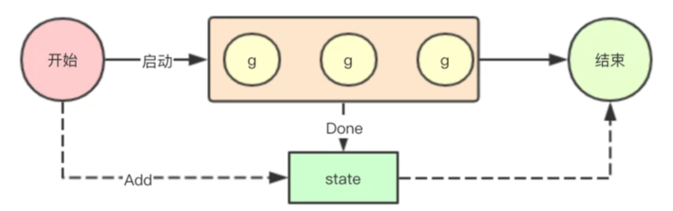
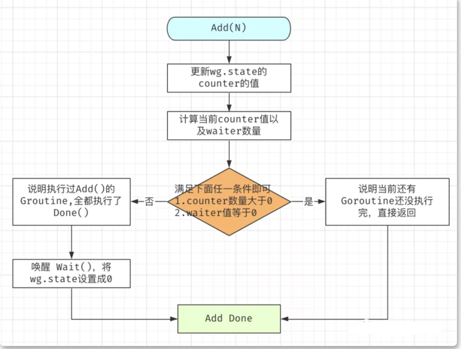
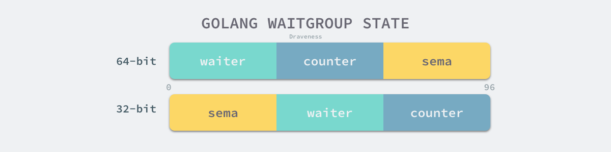
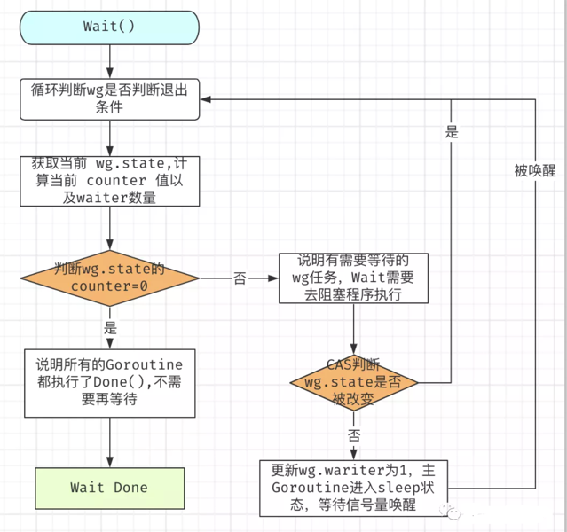

# waitGroup同步等待组对象

## 使用场景

批量发出 RPC 或者 HTTP 请求.


sync.WaitGroup主要用于等待一组goroutine退出，本质上其实就是一个计数器，我们可以通过Add指定我们需要等待退出的goroutine的数量，然后通过Done来递减，如果为0,则可以退出


## 结构体
```go
type WaitGroup struct {
    noCopy noCopy
    state1 [3]uint32
}
```
WaitGroup.state1 其实代表三个字段：counter，waiter，sema。
- counter ：可以理解为一个计数器，计算经过 wg.Add(N), wg.Done() 后的值。
- waiter ：当前等待 WaitGroup 任务结束的等待者数量。其实就是调用 wg.Wait() 的次数，所以通常这个值是 1 。
- sema ：信号量，用来唤醒 Wait() 函数。


## 1. add()


### 为什么要将 counter 和 waiter 放在一起 ？

当同时发现 wg.counter <= 0 && wg.waiter != 0 时，才会去唤醒等待的 waiters，让等待的协程继续运行。
但是使用 WaitGroup 的调用方一般都是并发操作，如果不同时获取的 counter 和 waiter 的话，就会造成获取到的 counter 和 waiter 可能不匹配，造成程序 deadlock 或者程序提前结束等待

```go
// sync/waitgroup.go
func (wg *WaitGroup) Add(delta int) {
	// 获取当前计数
	statep, semap := wg.state()
	if race.Enabled {
		_ = *statep // trigger nil deref early
		if delta < 0 {
			// Synchronize decrements with Wait.
			race.ReleaseMerge(unsafe.Pointer(wg))
		}
		race.Disable()
		defer race.Enable()
	}
	// // 使用高32位进行counter计数
	state := atomic.AddUint64(statep, uint64(delta)<<32)
	// 获取当前需要等待done的数量
	v := int32(state >> 32)
	// 获取低32位即waiter等待计数
	w := uint32(state)
	if race.Enabled && delta > 0 && v == int32(delta) {
		// The first increment must be synchronized with Wait.
		// Need to model this as a read, because there can be
		// several concurrent wg.counter transitions from 0.
		race.Read(unsafe.Pointer(semap))
	}
	if v < 0 {
		panic("sync: negative WaitGroup counter")
	}

	if w != 0 && delta > 0 && v == int32(delta) {
		panic("sync: WaitGroup misuse: Add called concurrently with Wait")
	}
    // 如果当前v>0,则表示还需要继续未完成的goroutine进行Done操作
    // 如果w ==0,则表示当前并没有goroutine在wait等待结束
    // 以上两种情况直接返回即可
	if v > 0 || w == 0 {
		return
	}
	// This goroutine has set counter to 0 when waiters > 0.
	// Now there can't be concurrent mutations of state:
	// - Adds must not happen concurrently with Wait,
	// - Wait does not increment waiters if it sees counter == 0.
	// Still do a cheap sanity check to detect WaitGroup misuse.
	
	// 当waiters > 0 的时候，并且当前v==0，这个时候如果检查发现state状态前后发生改变，则
	// 证明当前有人修改过，则删除
	// 如果走到这个地方则证明经过之前的操作后，当前的v==0,w!=0,就证明之前一轮的Done已经全部完成，现在需要唤醒所有在wait的goroutine
	// 此时如果发现当前的*statep值又发生了改变，则证明有有人进行了Add操作
	// 也就是这里的WaitGroup滥用
	if *statep != state {
		panic("sync: WaitGroup misuse: Add called concurrently with Wait")
	}
	// Reset waiters count to 0.
	//  将当前state的状态设置为0，就可以进行下次的重用了
	*statep = 0
	for ; w != 0; w-- {
		//  // 释放所有排队的waiter
		runtime_Semrelease(semap, false, 0)
	}
}
```
对于 wg.state 的状态变更，WaitGroup 的 Add()，Wait() 是使用 atomic 来做原子计算的(为了避免锁竞争)。但是由于 atomic 需要使用者保证其 64 位对齐，
所以将 counter 和 waiter 都设置成 uint32，同时作为一个变量，即满足了 atomic 的要求，同时也保证了获取 waiter 和 counter 的状态完整性。但这也就导致了 32位，64位机器上获取 state 的方式并不相同。


```go
// state returns pointers to the state and sema fields stored within wg.state1.
func (wg *WaitGroup) state() (statep *uint64, semap *uint32) {
	if uintptr(unsafe.Pointer(&wg.state1))%8 == 0 {
		return (*uint64)(unsafe.Pointer(&wg.state1)), &wg.state1[2]
	} else {
		return (*uint64)(unsafe.Pointer(&wg.state1[1])), &wg.state1[0]
	}
}
```

因为 64 位机器上本身就能保证 64 位对齐，所以按照 64 位对齐来取数据，拿到 state1[0], state1[1] 本身就是64 位对齐的。
但是 32 位机器上并不能保证 64 位对齐，因为 32 位机器是 4 字节对齐，如果也按照 64 位机器取 state[0]，state[1] 就有可能会造成 atmoic 的使用错误。

于是 32 位机器上空出第一个 32 位，也就使后面 64 位天然满足 64 位对齐，第一个 32 位放入 sema 刚好合适。
早期 WaitGroup 的实现 sema 是和 state1 分开的，也就造成了使用 WaitGroup 就会造成 4 个字节浪费，不过 go1.11 之后就是现在的结构了。


## Done()
```go
```go
func (wg *WaitGroup) Done() {
    // 减去一个-1
    wg.Add(-1)
}
```


## 3. wait()

```go
func (wg *WaitGroup) Wait() {
    statep, semap := wg.state()
    if race.Enabled {
        _ = *statep // trigger nil deref early
        race.Disable()
    }
    for {
        // 获取state的状态
        state := atomic.LoadUint64(statep)
        v := int32(state >> 32) // 获取高32位的count
        w := uint32(state) // 获取当前正在Wait的数量
        if v == 0 { // 如果当前v ==0就直接return， 表示当前不需要等待
            // Counter is 0, no need to wait.
            if race.Enabled {
                race.Enable()
                race.Acquire(unsafe.Pointer(wg))
            }
            return
        }
        // 进行低位的waiter计数统计
        if atomic.CompareAndSwapUint64(statep, state, state+1) {
            if race.Enabled && w == 0 {
                // Wait must be synchronized with the first Add.
                // Need to model this is as a write to race with the read in Add.
                // As a consequence, can do the write only for the first waiter,
                // otherwise concurrent Waits will race with each other.
                race.Write(unsafe.Pointer(semap))
            }
            // 如果成功则进行排队休眠等待唤醒
            runtime_Semacquire(semap)
            // 如果唤醒后发现state的状态不为0，则证明在唤醒的过程中WaitGroup又被重用，则panic
            if *statep != 0 {
                panic("sync: WaitGroup is reused before previous Wait has returned")
            }
            if race.Enabled {
                race.Enable()
                race.Acquire(unsafe.Pointer(wg))
            }
            return
        }
    }
}
```
