<!-- START doctoc generated TOC please keep comment here to allow auto update -->
<!-- DON'T EDIT THIS SECTION, INSTEAD RE-RUN doctoc TO UPDATE -->
**Table of Contents**  *generated with [DocToc](https://github.com/thlorenz/doctoc)*

- [锁](#%E9%94%81)
  - [什么时候需要用到锁？](#%E4%BB%80%E4%B9%88%E6%97%B6%E5%80%99%E9%9C%80%E8%A6%81%E7%94%A8%E5%88%B0%E9%94%81)
  - [死锁](#%E6%AD%BB%E9%94%81)
    - [死锁产生的原因](#%E6%AD%BB%E9%94%81%E4%BA%A7%E7%94%9F%E7%9A%84%E5%8E%9F%E5%9B%A0)
  - [锁的种类](#%E9%94%81%E7%9A%84%E7%A7%8D%E7%B1%BB)
    - [runtime lock](#runtime-lock)
    - [自旋锁](#%E8%87%AA%E6%97%8B%E9%94%81)
      - [自旋锁的优缺点](#%E8%87%AA%E6%97%8B%E9%94%81%E7%9A%84%E4%BC%98%E7%BC%BA%E7%82%B9)
    - [Mutex 互斥锁](#mutex-%E4%BA%92%E6%96%A5%E9%94%81)
      - [互斥锁的状态](#%E4%BA%92%E6%96%A5%E9%94%81%E7%9A%84%E7%8A%B6%E6%80%81)
      - [lock加锁过程](#lock%E5%8A%A0%E9%94%81%E8%BF%87%E7%A8%8B)
      - [源码分析](#%E6%BA%90%E7%A0%81%E5%88%86%E6%9E%90)
      - [解锁过程](#%E8%A7%A3%E9%94%81%E8%BF%87%E7%A8%8B)
      - [案例1 一个goroutine](#%E6%A1%88%E4%BE%8B1-%E4%B8%80%E4%B8%AAgoroutine)
      - [案例2 两个goroutine](#%E6%A1%88%E4%BE%8B2-%E4%B8%A4%E4%B8%AAgoroutine)
      - [案例3 三个goroutine](#%E6%A1%88%E4%BE%8B3-%E4%B8%89%E4%B8%AAgoroutine)
      - [案例4 没有加锁，直接解锁问题-异常](#%E6%A1%88%E4%BE%8B4-%E6%B2%A1%E6%9C%89%E5%8A%A0%E9%94%81%E7%9B%B4%E6%8E%A5%E8%A7%A3%E9%94%81%E9%97%AE%E9%A2%98-%E5%BC%82%E5%B8%B8)
    - [RWMutex 读写锁](#rwmutex-%E8%AF%BB%E5%86%99%E9%94%81)
      - [背景](#%E8%83%8C%E6%99%AF)
      - [readers-writers 问题一般有三类](#readers-writers-%E9%97%AE%E9%A2%98%E4%B8%80%E8%88%AC%E6%9C%89%E4%B8%89%E7%B1%BB)
      - [RWMutex 结构体](#rwmutex-%E7%BB%93%E6%9E%84%E4%BD%93)
      - [5 个方法](#5-%E4%B8%AA%E6%96%B9%E6%B3%95)
      - [读和写锁关系](#%E8%AF%BB%E5%92%8C%E5%86%99%E9%94%81%E5%85%B3%E7%B3%BB)
      - [写锁饥饿问题](#%E5%86%99%E9%94%81%E9%A5%A5%E9%A5%BF%E9%97%AE%E9%A2%98)
      - [写锁计数](#%E5%86%99%E9%94%81%E8%AE%A1%E6%95%B0)
      - [读锁加锁实现](#%E8%AF%BB%E9%94%81%E5%8A%A0%E9%94%81%E5%AE%9E%E7%8E%B0)
      - [读锁释放实现](#%E8%AF%BB%E9%94%81%E9%87%8A%E6%94%BE%E5%AE%9E%E7%8E%B0)
      - [写锁加锁实现](#%E5%86%99%E9%94%81%E5%8A%A0%E9%94%81%E5%AE%9E%E7%8E%B0)
      - [写锁释放实现](#%E5%86%99%E9%94%81%E9%87%8A%E6%94%BE%E5%AE%9E%E7%8E%B0)
      - [写锁与读锁的公平性](#%E5%86%99%E9%94%81%E4%B8%8E%E8%AF%BB%E9%94%81%E7%9A%84%E5%85%AC%E5%B9%B3%E6%80%A7)
      - [总结 读写互斥锁的实现](#%E6%80%BB%E7%BB%93-%E8%AF%BB%E5%86%99%E4%BA%92%E6%96%A5%E9%94%81%E7%9A%84%E5%AE%9E%E7%8E%B0)
  - [参考](#%E5%8F%82%E8%80%83)

<!-- END doctoc generated TOC please keep comment here to allow auto update -->

# 锁


## 什么时候需要用到锁？

当程序中就一个线程的时候，是不需要加锁的，但是通常实际的代码不会只是单线程，所以这个时候就需要用到锁了，那么关于锁的使用场景主要涉及到哪些呢？
1. 多个线程在读相同的数据时
2. 多个线程在写相同的数据时
3. 同一个资源，有读又有写


## 死锁
多线程以及多进程改善了系统资源的利用率并提高了系统的处理能力。然而，并发执行也带来了新的问题——死锁。
死锁是指两个或两个以上的进程（线程）在运行过程中因争夺资源而造成的一种僵局（Deadly-Embrace) ) ，若无外力作用，这些进程（线程）都将无法向前推进。

### 死锁产生的原因

- 竞争不可抢占资源引起死锁
通常系统中拥有的不可抢占资源，其数量不足以满足多个进程运行的需要，使得进程在运行过程中，会因争夺资源而陷入僵局，如磁带机、打印机等。只有对不可抢占资源的竞争 才可能产生死锁，对可抢占资源的竞争是不会引起死锁的。
- 竞争可消耗资源引起死锁
- 进程推进顺序不当引起死锁
进程在运行过程中，请求和释放资源的顺序不当，也同样会导致死锁。例如，并发进程 P1、P2分别保持了资源R1、R2，而进程P1申请资源R2，进程P2申请资源R1时，两者都会因为所需资源被占用而阻塞。
信号量使用不当也会造成死锁。进程间彼此相互等待对方发来的消息，结果也会使得这 些进程间无法继续向前推进。例如，进程A等待进程B发的消息，进程B又在等待进程A 发的消息，可以看出进程A和B不是因为竞争同一资源，而是在等待对方的资源导致死锁。

## 锁的种类

根据表现形式，常见的锁有互斥锁、自旋锁(spinlock)、读写锁。


sync.Mutex 事实上是标准库 sync 提供给开发者使用的同步原语，Go 自己 runtime 使用的锁事实上是 lock / unlock 函数（src/runtime/lock_sema.go, src/runtime/lock_futex.go）

### runtime lock
lock 在 golang 中基于不同操作系统有不同的实现，在 runtime 源码文件夹下也可以看到以 lock_ 为前缀的三个文件，对应不同操作系统的实现：

- lock_sema.go 基于操作系统信号量系统调用实现的锁，支持的操作系统有：aix、darwin、netbsd、openbsd、plan9、solaris、windows
- lock_futex.go 基于 Futex 实现的锁，支持的操作系统有：dragonfly、freebsd、linux
- lock_js.go 目标为 JS 及 WebAssembly 平台的实现。

### 自旋锁
自旋锁是指在进程试图取得锁失败的时候选择忙等待而不是阻塞自己。选择忙等待的优点在于如果该进程在其自身的CPU时间片内拿到锁（说明锁占用时间都比较短），则相比阻塞少了上下文切换。注意这里还有一个隐藏条件：多处理器。因为单个处理器的情况下，由于当前自旋进程占用着CPU，持有锁的进程只有等待自旋进程耗尽CPU时间才有机会执行，这样CPU就空转了。
```go
// github.com/panjf2000/ants/v2@v2.5.0/internal/spinlock.go

type spinLock uint32

const maxBackoff = 16

func (sl *spinLock) Lock() {
	backoff := 1
	for !atomic.CompareAndSwapUint32((*uint32)(sl), 0, 1) {
		// Leverage the exponential backoff algorithm, see https://en.wikipedia.org/wiki/Exponential_backoff.
		for i := 0; i < backoff; i++ {
			runtime.Gosched()
		}
		if backoff < maxBackoff {
			backoff <<= 1
		}
	}
}

func (sl *spinLock) Unlock() {
	atomic.StoreUint32((*uint32)(sl), 0)
}

// NewSpinLock instantiates a spin-lock.
func NewSpinLock() sync.Locker {
}
```

#### 自旋锁的优缺点

自旋锁尽可能的减少线程的阻塞，这对于锁的竞争不激烈，且占用锁时间非常短的代码块来说性能能大幅度的提升，因为自旋的消耗会小于线程阻塞挂起再唤醒的操作的消耗，这些操作会导致线程发生两次上下文切换！

但是如果锁的竞争激烈，或者持有锁的线程需要长时间占用锁执行同步块，这时候就不适合使用自旋锁了，因为自旋锁在获取锁前一直都是占用 cpu 做无用功，占着 XX 不 XX，同时有大量线程在竞争一个锁，会导致获取锁的时间很长，线程自旋的消耗大于线程阻塞挂起操作的消耗，其它需要 cpu 的线程又不能获取到 cpu，造成 cpu 的浪费。所以这种情况下我们要关闭自旋锁


### Mutex 互斥锁

只有取得互斥锁的进程才能进入临界区，无论读写

```go
type Mutex struct {
    state int32  // 当前互斥锁的状态
    sema  uint32 // 信号
}
```
Mutex 的实现主要借助了 CAS 指令 + 自旋 + 信号量来实现

#### 互斥锁的状态
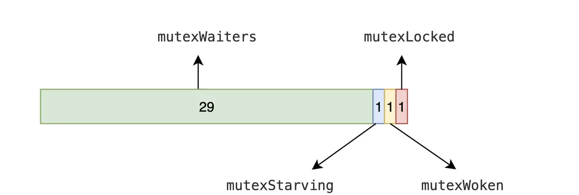
在默认情况下，互斥锁的所有状态位都是 0，int32 中的不同位分别表示了不同的状态：
```go
const (
	mutexLocked = 1 << iota // 表示互斥锁的锁定状态；
	mutexWoken  // 表示从正常模式被从唤醒；
	mutexStarving  // 当前的互斥锁进入饥饿状态；
	mutexWaiterShift = iota // 值为3,代表移动3位, old>>mutexWaiterShift 
	
	starvationThresholdNs = 1e6 // 判断是否要进入饥饿状态的阈值
)

```


Mutex 有两种模式：正常模式和饥饿模式:
- 正常模式下，如果当前锁正在被持有，抢不到锁的就会进入一个先进先出的等待队列。当持有锁的 goroutine 释放锁之后，按照从前到后的顺序唤醒等待队列的第一个等待者，但是不会直接给被唤醒者锁，还是需要他去抢，即在唤醒等待队列等待者这个时间，同时也会有正在运行且还未进入等待队列的 goroutine 正在抢锁 （数量可能还很多），这些都会和刚唤醒的等待者一起去抢，刚唤醒的可能还没有分到 CPU，而正在运行的正在占据了CPU，所以正在运行的更有可能获取到锁，被唤醒的等待者可能抢锁失败。如果等待者抢锁失败，他会被放到等待队列的队首，如果超过 1ms 都没抢到锁，就会从 正常模式 切换到 饥饿模式。
- 饥饿模式下，要释放锁的 goroutine 会将锁直接交给等待队列的第一个等待者，不需要去抢了，而且新来的 goroutine 也不会尝试去抢锁，直接加入到等待队列的尾部。那么什么时候会从饥饿模式切换到正常模式呢：

（1）如果当前被唤醒的等待者获得到锁后，发现自己是队列中的最后一个，队列中没有其他等待者了，此时会切换到正常模式

（2）如果当前被唤醒的等待者获得到锁后，发现自己总共的等待时间不超过 1ms，就获得到锁了，此时也会切换到正常模式

正常模式会带来更高的吞吐量：一个 goroutine 要释放锁，更大可能会被正在运行的 goroutine 抢到，这就避免了协程的上下文切换，运行更多的 goroutine，但是有可能造成一个问题，就是锁始终被新来的 goroutine 抢走，在等待队列中的等待者始终抢不到锁，这就会导致饥饿问题。饥饿模式就是为了解决这个问题出现的，保证了每个 goroutine 都有运行的机会，防止等待时间过长。


Note：注意Mutex 状态（mutexLocked，mutexWoken，mutexStarving，mutexWaiterShift） 与 Goroutine 之间的状态（starving，awoke）改变


#### lock加锁过程
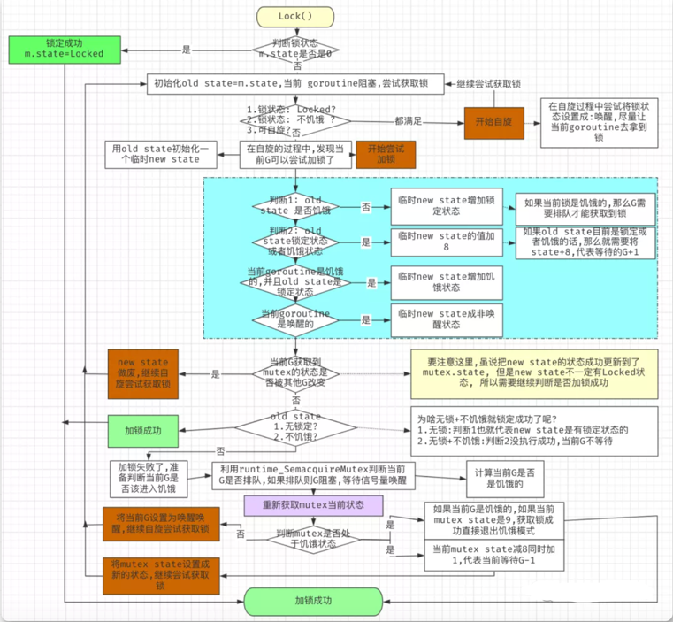

分为两部分，第一部分是 fast path，可以理解为快捷通道，如果当前锁没被占用，直接获得锁返回；否则需要进入 slow path，判断各种条件去竞争锁，主要逻辑都在此处.

如果互斥锁的状态不是 0 时就会调用 sync.Mutex.lockSlow 尝试通过自旋（Spinning）等方式等待锁的释放，该方法的主体是一个非常大 for 循环，这里将它分成几个部分介绍获取锁的过程：
1. 判断当前 Goroutine 能否进入自旋；
2. 通过自旋等待互斥锁的释放；
3. 计算互斥锁的最新状态；
4. 更新互斥锁的状态并获取锁


#### 源码分析
```go
// go1.21.5/src/sync/mutex.go
func (m *Mutex) Lock() {
	// fastpath：期望当前锁没有被占用，可以快速获取到锁， CAS 修改 state 最后一位的值为1（标记锁是否被占用）
	if atomic.CompareAndSwapInt32(&m.state, 0, mutexLocked) {
		if race.Enabled {
			race.Acquire(unsafe.Pointer(m))
		}
		return
	}
	// Slow path (单独抽出来放到一个函数里，方便 fast path 被内联)
	m.lockSlow()
}
```

```go
func (m *Mutex) lockSlow() {
	var waitStartTime int64 // 记录等待时间
	starving := false // 当前的 goroutine 是否已经饥饿了（如果已经饥饿，就会将 state 的饥饿状态置为 1）
	awoke := false // 当前的 goroutine 是否被唤醒的
	iter := 0 // 自旋次数
	old := m.state // 保存当前的 state 状态
	for {
        /*
            自旋：如果满足如下条件，就会进入 if 语句，然后 continue，不断自旋:
            1. 锁被占用，且不处于饥饿模式（饥饿状态直接去排队，不允许尝试获取锁）
            2. 基于当前自旋的次数，再次自旋有意义 runtime_canSpin(iter)
        
            那么退出自旋的条件也就是：
            1. 锁被释放了，当前处于没被占用状态（说明等到了，该goroutine就会立即去获取锁）
                2. mutex进入了饥饿模式，不自旋了，没意义（饥饿状态会直接把锁交给等待队列队首的goroutine）
                3. 不符合自旋状态（自旋次数太多了，自旋失去了意义）
        
            如下代码是位操作：
            mutexLocked|mutexStarving = 00000...101
            mutexLocked = 00000...001
            如果要满足 old & 00000...101 = 00000...001，需要 old = ...0*1,即状态为：锁被占用，且不处于饥饿状态
        
            runtime_canSpin(iter) 会根据自旋次数，判断是否可以继续自旋
        */


		// Don't spin in starvation mode, ownership is handed off to waiters
		// so we won't be able to acquire the mutex anyway.
		if old&(mutexLocked|mutexStarving) == mutexLocked && runtime_canSpin(iter) {
            /*
               如果
                1. 当前goroutine不是被唤醒的 (awoke=false)
                2. 锁状态唤醒标志位为0（old&mutexWoken == 0）
                3. 等待者数量不为0 （old>>mutexWaiterShift != 0  右移三位得到的就是等待者数量）
            
                那么利用CAS，将 state 的唤醒标记置为1，标记自己是被唤醒的 （将state的唤醒标记置为1，说明外面有唤醒着的goroutine，那么在释放锁的时候，就不去等待队列叫号了，毕竟已经有唤醒的了）
            
                如果有其他 goroutine 已经设置了 state 的唤醒标记位，那么本次就会失败
            */
			if !awoke && old&mutexWoken == 0 && old>>mutexWaiterShift != 0 &&
				atomic.CompareAndSwapInt32(&m.state, old, old|mutexWoken) {
				awoke = true
			}
			runtime_doSpin()
			iter++
			// 获取最新的状态
			old = m.state
            // 想再次自旋，看看锁释放了没
			continue
		}
		// 到这里，说明退出了自旋，当前锁没被占用 或者  系统处于饥饿模式 或者 自旋次数太多导致不符合自旋条件
		
		// new 代表当前goroutine 基于当前状态要设置的新状态
		new := old
		//  只要不是饥饿状态，就需要获取锁（饥饿状态直接去排队，不能抢锁）
		if old&mutexStarving == 0 {
			new |= mutexLocked
		}
		// 锁被占用 或者 处于饥饿模式下，新增一个等待者
		if old&(mutexLocked|mutexStarving) != 0 {
			new += 1 << mutexWaiterShift
		}
		// 当前 goroutine 已经进入饥饿了，且锁还没有释放，需要把 Mutex 的状态改为饥饿状态
		if starving && old&mutexLocked != 0 {
			new |= mutexStarving
		}
		
		// /如果是被唤醒的，把唤醒标志位置0，表示外面没有被唤醒的goroutine了（抢到就获得锁、抢不到就睡眠，把唤醒标志置0）
		if awoke {
			// The goroutine has been woken from sleep,
			// so we need to reset the flag in either case.
			if new&mutexWoken == 0 {
				throw("sync: inconsistent mutex state")
			}
			// a &^ b 的意思就是 清零a中，ab都为1的位，即清除唤醒标记
			new &^= mutexWoken
		}
		if atomic.CompareAndSwapInt32(&m.state, old, new) {
			if old&(mutexLocked|mutexStarving) == 0 {
                // 如果改状态之前，锁未被占用 且 处于正常模式，那么就相当于获取到锁了
				break // locked the mutex with CAS
			}
            // 到这里说明：1. 之前锁被占用  或者 2.之前是处于饥饿状态 
			// If we were already waiting before, queue at the front of the queue.
			queueLifo := waitStartTime != 0
			if waitStartTime == 0 {
				waitStartTime = runtime_nanotime()
			}
            // queueLifo 判断: 之前排过队的老人，放到等待队列队首；新人放到队尾，然后等待获取信号量
			runtime_SemacquireMutex(&m.sema, queueLifo, 1)
			
			//  设置当前 goroutine 饥饿状态，如果之前已经饥饿，或者距离等待开始时间超过了 1ms，也变饥饿
			starving = starving || runtime_nanotime()-waitStartTime > starvationThresholdNs
			old = m.state
			
			// 如果 state 饥饿标记为1，说明当前在饥饿模式，饥饿模式下被唤醒，已经获取到锁了；
            // 饥饿状态下，释放锁没有更新等待者数量和饥饿标记，需要获得锁的goroutine去更新状态
            if old&mutexStarving != 0 {
				
				if old&(mutexLocked|mutexWoken) != 0 || old>>mutexWaiterShift == 0 {
					throw("sync: inconsistent mutex state")
				}
                // 加锁，减去一个等待者
				delta := int32(mutexLocked - 1<<mutexWaiterShift)
				if !starving || old>>mutexWaiterShift == 1 {
					// 如果当前的 goroutine 非饥饿，或者等待者只有一个（也就是只有当前goroutine，等待队列空了），可以取消饥饿状态，进入正常状态
					delta -= mutexStarving
				}
				// 修改状态：
                // 加锁，减去一个等待者： m.state + mutexLocked - 1<<mutexWaiterShift : 
                // 满足非饥饿条件，加锁，减去一个等待者，取消饥饿状态：
                // m.state + mutexLocked - 1<<mutexWaiterShift - mutexStarving:
				atomic.AddInt32(&m.state, delta)
				break
			}
			// 之前是处于锁被占用且非饥饿状态，被唤醒，去继续抢锁
			awoke = true
			// 新唤醒的，自旋数量置0
			iter = 0
		} else {
			old = m.state
		}
	}

	if race.Enabled {
		race.Acquire(unsafe.Pointer(m))
	}
}
```

1. Goroutine 第一次被阻塞：
   由于 waitStartTime 等于 0，runtime_SemacquireMutex 的 queueLifo 等于 false, 于是该 Goroutine 放入到队列的尾部.

2. goroutine 被唤醒过，但是没加锁成功，再次被阻塞：由于 Goroutine 被唤醒过，waitStartTime 不等于 0，runtime_SemacquireMutex 的 queueLifo 等于 true, 于是该 Goroutine 放入到队列的头部


#### 解锁过程

```go
func (m *Mutex) Unlock() {
	if race.Enabled {
		_ = m.state
		race.Release(unsafe.Pointer(m))
	}

	// Fast path: 把锁标记清除
	new := atomic.AddInt32(&m.state, -mutexLocked)
	if new != 0 { // 清除完锁标记，发现还有其他状态，比如等待队列不为空，需要唤醒其他 goroutine
		// Outlined slow path to allow inlining the fast path.
		// To hide unlockSlow during tracing we skip one extra frame when tracing GoUnblock.
		m.unlockSlow(new)
	}
}

```
Unlock()解锁方法也分为两部分，第一部分是 fast path，可以理解为快捷通道，直接把锁状态位清除，如果此时系统状态恢复到初始状态，说明没有 goroutine 在抢锁等锁，直接返回，否则进入 slow path；

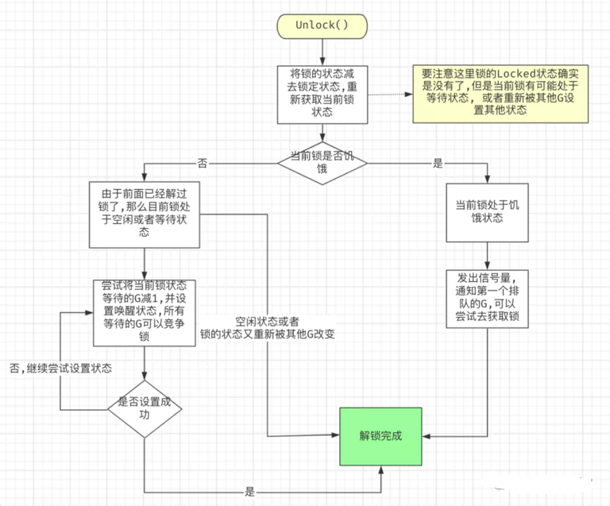


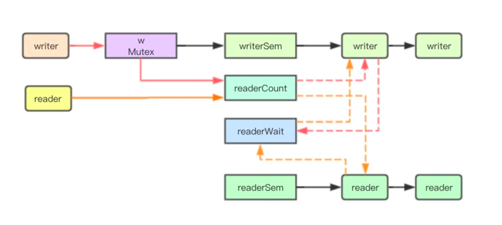

```go
func (m *Mutex) unlockSlow(new int32) {
	if (new+mutexLocked)&mutexLocked == 0 {
		throw("sync: unlock of unlocked mutex")
	}
	if new&mutexStarving == 0 {
		// 正常模式，非饥饿，可能需要唤醒队列中的 goroutine，饥饿状态直接移交锁
		old := new
		for {
			// If there are no waiters or a goroutine has already
			// been woken or grabbed the lock, no need to wake anyone.
			// In starvation mode ownership is directly handed off from unlocking
			// goroutine to the next waiter. We are not part of this chain,
			// since we did not observe mutexStarving when we unlocked the mutex above.
			// So get off the way.
			if old>>mutexWaiterShift == 0 || old&(mutexLocked|mutexWoken|mutexStarving) != 0 {
				return
			}
			// Grab the right to wake someone.
			new = (old - 1<<mutexWaiterShift) | mutexWoken
			if atomic.CompareAndSwapInt32(&m.state, old, new) {
				//  第二个参数为false, 唤醒队首的 goroutine 去抢锁(不一定能抢到)
				runtime_Semrelease(&m.sema, false, 1)
				return
			}
			old = m.state
		}
	} else {
		// 当前 mutex 已经是饥饿状态

		// 第二个参数为 true，直接将锁的所有权，交给等待队列的第一个等待者
		runtime_Semrelease(&m.sema, true, 1)
	}
}
```
1. 当互斥锁已经被解锁时，调用 sync.Mutex.Unlock 会直接抛出异常；
2. 当互斥锁处于饥饿模式时，将锁的所有权交给队列中的下一个等待者，等待者会负责设置 mutexLocked 标志位；
3. 当互斥锁处于普通模式时，如果没有 Goroutine 等待锁的释放或者已经有被唤醒的 Goroutine 获得了锁，会直接返回；在其他情况下会通过 sync.runtime_Semrelease 唤醒对应的 Goroutine


#### 案例1 一个goroutine

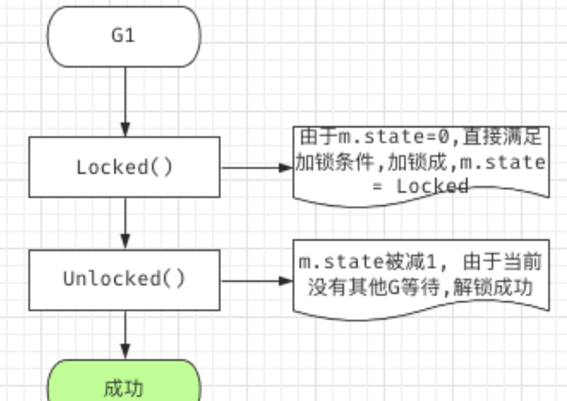
#### 案例2 两个goroutine

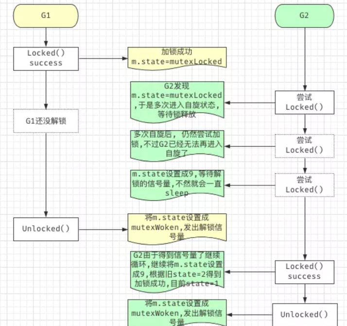
#### 案例3 三个goroutine
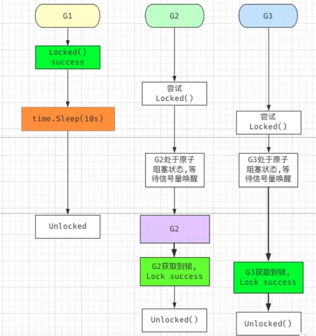

#### 案例4 没有加锁，直接解锁问题-异常
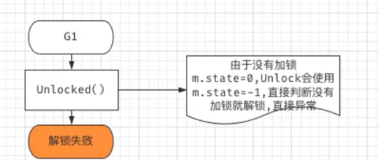

### RWMutex 读写锁
标准库中的 RWMutex 是一个 reader/writer 互斥锁。RWMutex 在某一时刻只能由任意数量的 reader 持有，或者是只被单个的 writer 持有。

#### 背景
即 Mutex，我们使用它来保证读写共享资源的安全性。不管是读还是写，我们都通过 Mutex 来保证只有一个 goroutine 访问共享资源，这在某些情况下有点“浪费”。
比如说，在写少读多的情况下，即使一段时间内没有写操作，大量并发的读访问也不得不在 Mutex 的保护下变成了串行访问，这个时候，使用 Mutex，对性能的影响就比较大。


解决方式:区分读写操作

如果某个读操作的 goroutine 持有了锁，在这种情况下，其它读操作的 goroutine 就不必一直傻傻地等待了，而是可以并发地访问共享变量，这样我们就可以将串行的读变成并行读，提高读操作的性能。
当写操作的 goroutine 持有锁的时候，它就是一个排外锁，其它的写操作和读操作的 goroutine，需要阻塞等待持有这个锁的 goroutine 释放锁。


#### readers-writers 问题一般有三类

Read-preferring：读优先的设计可以提供很高的并发性，但是，在竞争激烈的情况下可能会导致写饥饿。这是因为，如果有大量的读，这种设计会导致只有所有的读都释放了锁之后，写才可能获取到锁。

Write-preferring：写优先的设计意味着，如果已经有一个 writer 在等待请求锁的话，它会阻止新来的请求锁的 reader 获取到锁，所以优先保障 writer。当然，如果有一些 reader 已经请求了锁的话，新请求的 writer 也会等待已经存在的 reader 都释放锁之后才能获取。所以，写优先级设计中的优先权是针对新来的请求而言的。这种设计主要避免了 writer 的饥饿问题。

不指定优先级：这种设计比较简单，不区分 reader 和 writer 优先级，某些场景下这种不指定优先级的设计反而更有效，因为第一类优先级会导致写饥饿，第二类优先级可能会导致读饥饿，这种不指定优先级的访问不再区分读写，大家都是同一个优先级，解决了饥饿的问题

#### RWMutex 结构体 
读写锁要根据进程进入临界区的具体行为（读，写）来决定锁的占用情况。这样锁的状态就有三种了：读模式加锁、写模式加锁、无锁。
```go

type RWMutex struct {
    w           Mutex  // held if there are pending writers
    writerSem   uint32 // 用于writer等待读完成排队的信号量
    readerSem   uint32 // 用于reader等待写完成排队的信号量
    readerCount atomic.Int32   // 读锁的计数器
    readerWait  atomic.Int32   // 获取写锁时需要等待的写者的数量，用于防止写者饿死
}
```

在读多写少的环境中，可以优先使用读写互斥锁（sync.RWMutex），它比互斥锁更加高效。sync 包中的 RWMutex 提供了读写互斥锁的封装

分类:读锁和写锁
- 如果设置了一个写锁，那么其它读的线程以及写的线程都拿不到锁，这个时候，与互斥锁的功能相同
- 如果设置了一个读锁，那么其它写的线程是拿不到锁的，但是其它读的线程是可以拿到锁

```go
const rwmutexMaxReaders = 1 << 30 // 支持最多2^30个读锁
```
#### 5 个方法

- Lock/Unlock：写操作时调用的方法。如果锁已经被 reader 或者 writer 持有，那么，Lock 方法会一直阻塞，直到能获取到锁；Unlock 则是配对的释放锁的方法。
- RLock/RUnlock：读操作时调用的方法。如果锁已经被 writer 持有的话，RLock 方法会一直阻塞，直到能获取到锁，否则就直接返回；而 RUnlock 是 reader 释放锁的方法。
- RLocker：这个方法的作用是为读操作返回一个 Locker 接口的对象。它的 Lock 方法会调用 RWMutex 的 RLock 方法，它的 Unlock 方法会调用 RWMutex 的 RUnlock 方法。

#### 读和写锁关系
调用 sync.RWMutex.Lock 尝试获取写锁时；
1. 每次 sync.RWMutex.RUnlock 都会将 readerCount 其减一，当它归零时该 Goroutine 会获得写锁；
2. 将 readerCount 减少 rwmutexMaxReaders 个数以阻塞后续的读操作；

调用 sync.RWMutex.Unlock 释放写锁时，会先通知所有的读操作，然后才会释放持有的互斥锁

#### 写锁饥饿问题
因为读锁是共享的，所以如果当前已经有读锁，那后续goroutine继续加读锁正常情况下是可以加锁成功，
但是如果一直有读锁进行加锁，那尝试加写锁的goroutine则可能会长期获取不到锁，这就是因为读锁而导致的写锁饥饿问题.

Go 标准库中的 RWMutex 设计是 Write-preferring 方案。一个正在阻塞的 Lock 调用会排除新的 reader 请求到锁。


#### 写锁计数

读写锁中允许加读锁的最大数量是4294967296，在go里面对写锁的计数采用了负值进行，通过递减最大允许加读锁的数量从而进行写锁对读锁的抢占
```go
const rwmutexMaxReaders = 1 << 30
```

#### 读锁加锁实现
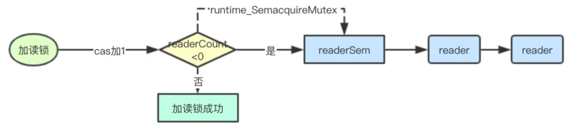

```go
func (rw *RWMutex) RLock() {
	// // 竞争检测代码，不看
    if race.Enabled {
        _ = rw.w.state
        race.Disable()
    }
    // 累加reader计数器，如果小于0则表明有writer正在等待
    if atomic.AddInt32(&rw.readerCount, 1) < 0 {
        // 当前有writer正在等待读锁，读锁就加入排队
        runtime_SemacquireMutex(&rw.readerSem, false)
    }
    if race.Enabled {
        race.Enable()
        race.Acquire(unsafe.Pointer(&rw.readerSem))
    }
}
```
```go
// go1.21.5/src/sync/rwmutex.go
func (rw *RWMutex) RLock() {
    // 移除了 race 等无关紧要的代码
	
	if rw.readerCount.Add(1) < 0 {
		//  rw.readerCount是负值的时候，意味着此时有writer等待请求锁，因为writer优先级高，所以把后来的reader阻塞休眠
		runtime_SemacquireRWMutexR(&rw.readerSem, false, 0)
	}
    
}
```

#### 读锁释放实现
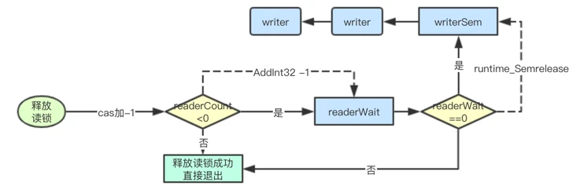

```go
func (rw *RWMutex) RUnlock() {
	// ..
	if r := rw.readerCount.Add(-1); r < 0 {
		// 有等待的writer
		rw.rUnlockSlow(r)
	}
    //..
}

func (rw *RWMutex) rUnlockSlow(r int32) {
	if r+1 == 0 || r+1 == -rwmutexMaxReaders {
		race.Enable()
		fatal("sync: RUnlock of unlocked RWMutex")
	}
	// A writer is pending.
	if rw.readerWait.Add(-1) == 0 {
		// 最后一个reader了，writer终于有机会获得锁了
		runtime_Semrelease(&rw.writerSem, false, 1)
	}
}
```

#### 写锁加锁实现
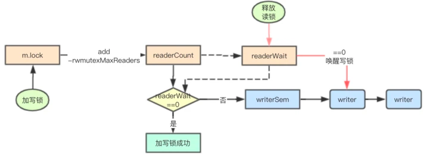


```go
func (rw *RWMutex) Lock() {
    // ..
	// 首先解决其他writer竞争问题
	rw.w.Lock()
	// readerCount 字段保持两个含义（既保存了 reader 的数量，又表示当前有 writer）
	r := rw.readerCount.Add(-rwmutexMaxReaders) + rwmutexMaxReaders
	// Wait for active readers.
	if r != 0 && rw.readerWait.Add(r) != 0 {
		// 如果当前有reader持有锁，那么需要等待
		runtime_SemacquireRWMutex(&rw.writerSem, false, 0)
	}
    // ..
}
```

#### 写锁释放实现
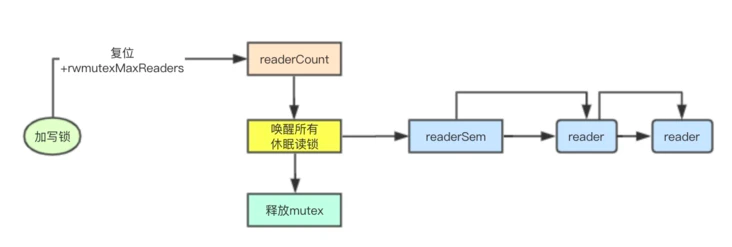


```go
func (rw *RWMutex) Unlock() {
    // ..

	// 将reader计数器复位，上面减去了一个rwmutexMaxReaders现在再重新加回去即可复位
	r := rw.readerCount.Add(rwmutexMaxReaders)
	if r >= rwmutexMaxReaders {
		race.Enable()
		fatal("sync: Unlock of unlocked RWMutex")
	}
	// 唤醒所有的读锁
	for i := 0; i < int(r); i++ {
		runtime_Semrelease(&rw.readerSem, false, 0)
	}
	// 释放内部的互斥锁
	rw.w.Unlock()
	if race.Enabled {
		race.Enable()
	}
}
```

#### 写锁与读锁的公平性

在加读锁和写锁的工程中都使用atomic.AddInt32来进行递增，而该指令在底层是会通过LOCK来进行CPU总线加锁的，

因此多个CPU同时执行readerCount其实只会有一个成功，从这上面看其实是写锁与读锁之间是相对公平的，
谁先达到谁先被CPU调度执行，进行LOCK锁cache line成功，谁就加成功锁


#### 总结 读写互斥锁的实现

1. 读锁不能阻塞读锁，引入readerCount实现
2. 读锁需要阻塞写锁，直到所有读锁都释放，引入readerSem实现
3. 写锁需要阻塞读锁，直到所有写锁都释放，引入writerSem实现
4. 写锁需要阻塞写锁，引入Mutex实现


## 参考
- [Go Mutex 源码详解](https://juejin.cn/post/7147714649708822558)
- [Go 语言设计与实现](https://grzhan.tech/2024/06/12/GoLockNotes/)
- [linux--futex原理分析](https://www.openeuler.org/zh/blog/wangshuo/Linux_Futex_Principle_Analysis/Linux_Futex_Principle_Analysis.html)
- [Go 并发编程实战课-02 | Mutex：庖丁解牛看实现](https://time.geekbang.org/column/article/295850)
- [Go 并发编程实战课-05 | RWMutex：读写锁的实现原理及避坑指南](https://time.geekbang.org/column/article/297868)