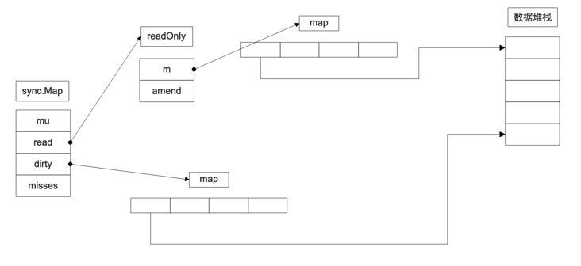
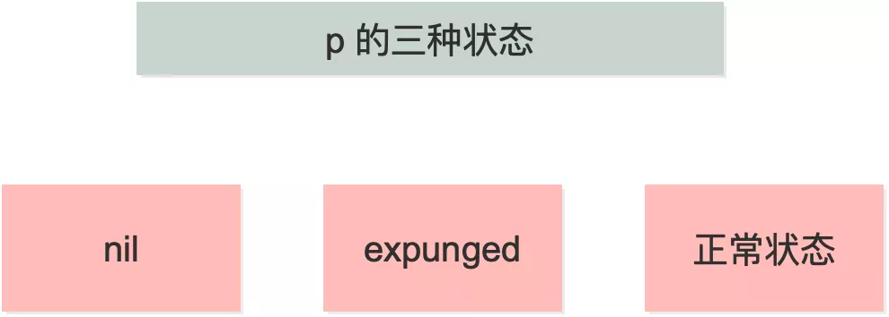

#sync.Map
背景：
	Go语言中的 map 在并发情况下，只读是线程安全的，同时读写是线程不安全的。
做法：

    一般情况下解决并发读写 map 的思路是加一把大锁，或者把一个 map 分成若干个小 map，对 key 进行哈希，只操作相应的小 map。前者锁的粒度比较大，影响效率；后者实现起来比较复杂，容易出错。
    
    而使用 sync.map 之后，对 map 的读写，不需要加锁。并且它通过空间换时间的方式，使用 read 和 dirty 两个 map 来进行读写分离，降低锁时间来提高效率
    
	Go语言在 1.9 版本中提供了一种效率较高的并发安全的 sync.Map，sync.Map 和 map 不同，不是以语言原生形态提供，而是在 sync 包下的特殊结构。
使用：

	1. 使用Store(interface {}，interface {})添加元素。
	2. 使用Load(interface {}) interface {}检索元素。
	3. 使用Delete(interface {})删除元素。
	4. 使用LoadOrStore(interface {}，interface {}) (interface {}，bool)检索或添加之前不存在的元素。
		如果键之前在map中存在，则返回的布尔值为true。
	5. 使用Range遍历元素。	
##源码结构：
###1。结构体

```go
type Map struct {
    mu Mutex

  	// 后面是readOnly结构体，依靠map实现，仅仅只用来读
    read atomic.Value // readOnly

    // 这个map主要用来写的，部分时候也承担读的能力
    dirty map[interface{}]*entry

    // 记录自从上次更新了read之后，从read读取key失败的次数
    misses int
}
```
解析

    read 是 atomic.Value 类型，可以并发地读。但如果需要更新 read，则需要加锁保护。
    对于 read 中存储的 entry 字段，可能会被并发地 CAS 更新。
    但是如果要更新一个之前已被删除的 entry，则需要先将其状态从 expunged 改为 nil，再拷贝到 dirty 中，然后再更新
    
    dirty 是一个非线程安全的原始 map。包含新写入的 key，并且包含 read 中的所有未被删除的 key。
    这样，可以快速地将 dirty 提升为 read 对外提供服务。
    如果 dirty 为 nil，那么下一次写入时，会新建一个新的 dirty，这个初始的 dirty 是 read 的一个拷贝，但除掉了其中已被删除的 key
    
    每当从 read 中读取失败，都会将 misses 的计数值加 1，当加到一定阈值以后，需要将 dirty 提升为 read，以期减少 miss 的情形。
简单来说

    read map 和 dirty map 的存储方式是不一致的。
    
    前者使用 atomic.Value，后者只是单纯的使用 map。
    
    原因是 read map 使用 lock free 操作，必须保证 load/store 的原子性；而 dirty map 的 load+store 操作是由 lock（就是 mu）来保护的
read 字段里实际上是存储的是
```go
type readOnly struct {
	m       map[interface{}]*entry
	amended bool // true if the dirty map contains some key not in m.
}
```
read 和 dirty 里存储的东西都包含 entry
```go
type entry struct {
	p unsafe.Pointer // *interface{}
}
```
    它是一个指针，指向 value。看来，read 和 dirty 各自维护一套 key，key 指向的都是同一个 value。也就是说，
    只要修改了这个 entry，对 read 和 dirty 都是可见的。这个指针的状态有三


    当 p == nil 时，说明这个键值对已被删除，并且 m.dirty == nil，或 m.dirty[k] 指向该 entry。
    
    当 p == expunged 时，说明这条键值对已被删除，并且 m.dirty != nil，且 m.dirty 中没有这个 key。
    
    其他情况，p 指向一个正常的值，表示实际 interface{} 的地址，并且被记录在 m.read.m[key] 中。
    如果这时 m.dirty 不为 nil，那么它也被记录在 m.dirty[key] 中。两者实际上指向的是同一个值。
    
    当删除 key 时，并不实际删除。一个 entry 可以通过原子地（CAS 操作）设置 p 为 nil 被删除。
    如果之后创建 m.dirty，nil 又会被原子地设置为 expunged，且不会拷贝到 dirty 中。
    
    如果 p 不为 expunged，和 entry 相关联的这个 value 可以被原子地更新；如果 p == expunged，那么仅当它初次被设置到 m.dirty 之后，才可以被更新

###存储store
看 expunged(抹去):它是一个指向任意类型的指针，用来标记从 dirty map 中删除的 entry
```go
var expunged = unsafe.Pointer(new(interface{}))
```

```go
// Store sets the value for a key.
func (m *Map) Store(key, value interface{}) {
	read, _ := m.read.Load().(readOnly)
    // 如果 read map 中存在该 key  则尝试直接更改(由于修改的是 entry 内部的 pointer，因此 dirty map 也可见)
	if e, ok := read.m[key]; ok && e.tryStore(&value) {
		return
	}

	m.mu.Lock()
	read, _ = m.read.Load().(readOnly)
	if e, ok := read.m[key]; ok {
		if e.unexpungeLocked() {
           // 如果 read map 中存在该 key，但 p == expunged，则说明 m.dirty != nil 并且 m.dirty 中不存在该 key 值 此时:
           //    a. 将 p 的状态由 expunged  更改为 nil
           //    b. dirty map 插入 key
			m.dirty[key] = e
		}
		e.storeLocked(&value)
	} else if e, ok := m.dirty[key]; ok {
    // 如果 read map 中不存在该 key，但 dirty map 中存在该 key，直接写入更新 entry(read map 中仍然没有这个 key)
		e.storeLocked(&value)
	} else {
      // 如果 read map 和 dirty map 中都不存在该 key，则：
      //   a. 如果 dirty map 为空，则需要创建 dirty map，并从 read map 中拷贝未删除的元素到新创建的 dirty map
      //    b. 更新 amended 字段，标识 dirty map 中存在 read map 中没有的 key
      //    c. 将 kv 写入 dirty map 中，read 不变
            if !read.amended {
             // 到这里就意味着，当前的 key 是第一次被加到 dirty map 中。
           // store 之前先判断一下 dirty map 是否为空，如果为空，就把 read map 浅拷贝一次
			m.dirtyLocked()
			m.read.Store(readOnly{m: read.m, amended: true})
		}
        // 写入新 key，在 dirty 中存储 value
		m.dirty[key] = newEntry(value)
	}
	m.mu.Unlock()
}
```
整体流程：

    1.如果在 read 里能够找到待存储的 key，并且对应的 entry 的 p 值不为 expunged，也就是没被删除时，直接更新对应的 entry 即可。
    
    2.第一步没有成功：要么 read 中没有这个 key，要么 key 被标记为删除。则先加锁，再进行后续的操作。
    
    3.再次在 read 中查找是否存在这个 key，也就是 double check 一下，这也是 lock-free 编程里的常见套路。
    如果 read 中存在该 key，但 p == expunged，说明 m.dirty != nil 并且 m.dirty 中不存在该 key 值
    此时: a. 将 p 的状态由 expunged  更改为 nil；b. dirty map 插入 key。然后，直接更新对应的 value。
    
    
    4.如果 read 中没有此 key，那就查看 dirty 中是否有此 key，如果有，则直接更新对应的 value，这时 read 中还是没有此 key。
    
    5.最后一步，如果 read 和 dirty 中都不存在该 key，
    则：a. 如果 dirty 为空，则需要创建 dirty，并从 read 中拷贝未被删除的元素；
    b. 更新 amended 字段，标识 dirty map 中存在 read map 中没有的 key；
    c. 将 k-v 写入 dirty map 中，read.m 不变。最后，更新此 key 对应的 value
sync.Map特性：

	1.无须初始化，直接声明即可。
	2.sync.Map 不能使用 map 的方式进行取值和设置等操作，而是使用 sync.Map 的方法进行调用，Store 表示存储，Load 表示获取，Delete 表示删除。
	3.使用 Range 配合一个回调函数进行遍历操作，通过回调函数返回内部遍历出来的值，Range 参数中回调函数的返回值在需要继续迭代遍历时，返回 true，终止迭代遍历时，返回 false。

适用场景

    sync.map 适用于读多写少的场景。对于写多的场景，会导致 read map 缓存失效，需要加锁，导致冲突变多；
    而且由于未命中 read map 次数过多，导致 dirty map 提升为 read map，这是一个 O(N) 的操作，会进一步降低性能
