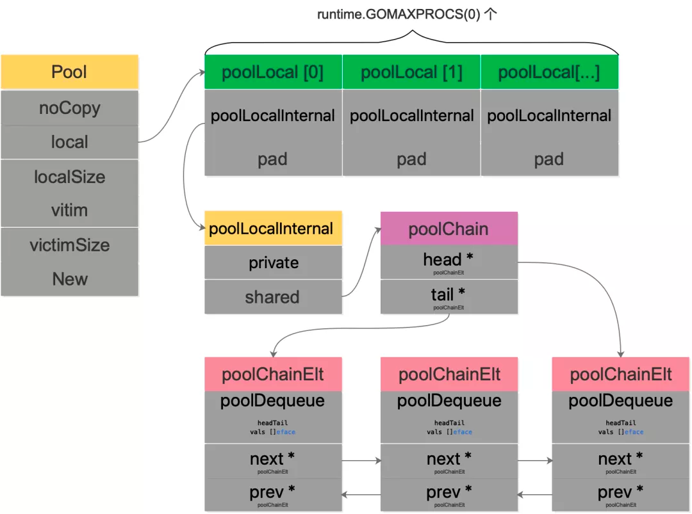
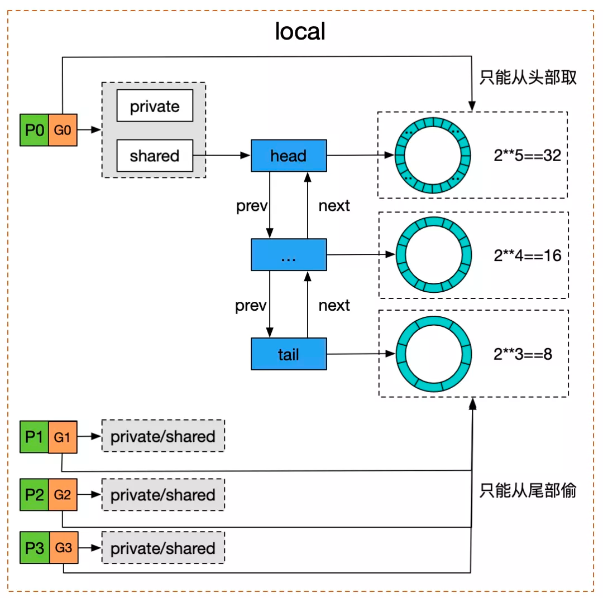
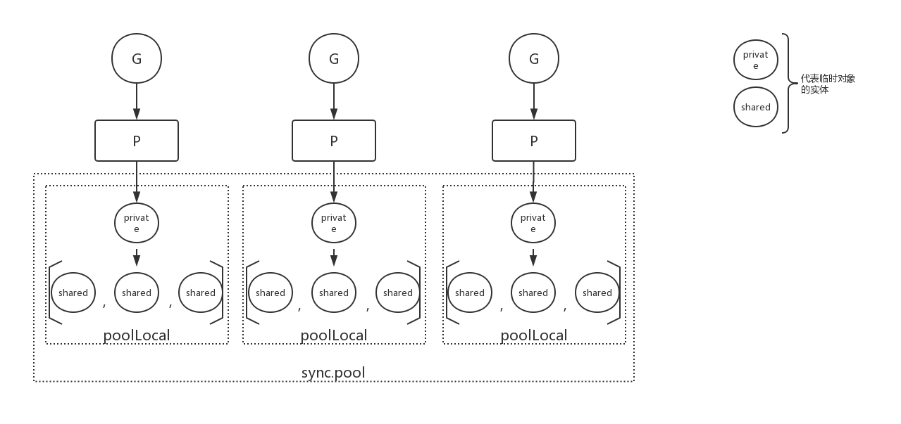
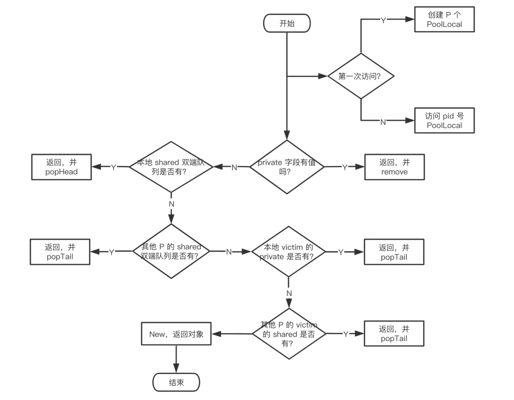
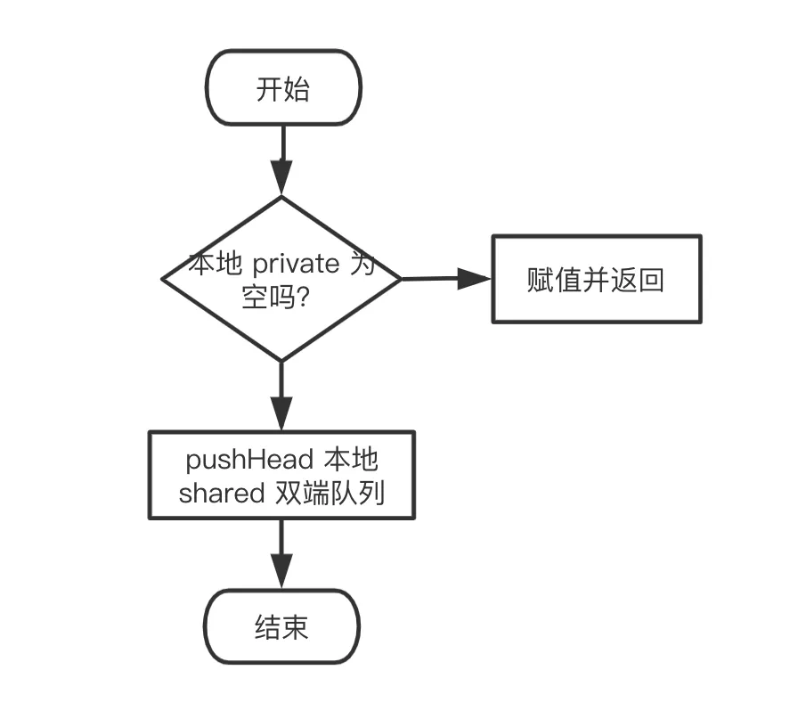

# sync.Pool 
    定位不是做类似连接池的东西，它的用途仅仅是增加对象重用的几率，减少gc的负担
## 背景：
    Go是自动垃圾回收的(garbage collector)，这大大减少了程序编程负担。但gc是一把双刃剑，带来了编程的方便但同时也增加了运行时开销，
    使用不当甚至会严重影响程序的性能。因此性能要求高的场景不能任意产生太多的垃圾（有gc但又不能完全依赖它挺恶心的），如何解决呢？
    那就是要重用对象了，我们可以简单的使用一个chan把这些可重用的对象缓存起来，但如果很多goroutine竞争一个chan性能肯定是问题

缺点：
    上面我们可以看到pool创建的时候是不能指定大小的，所有sync.Pool的缓存对象数量是没有限制的（只受限于内存），
    因此使用sync.pool是没办法做到控制缓存对象数量的个数的。另外sync.pool缓存对象的期限是很诡异的，这是很多人错误理解的地方，

## 源码分析
### Pool结构体

```go
type Pool struct {
	noCopy noCopy

	// 每个 P 的本地队列，实际类型为 [P]poolLocal
	local     unsafe.Pointer // local fixed-size per-P pool, actual type is [P]poolLocal

	// [P]poolLocal的大小
	localSize uintptr        // size of the local array

	victim     unsafe.Pointer // local from previous cycle
	victimSize uintptr        // size of victims array

    // 自定义的对象创建回调函数，当 pool 中无可用对象时会调用此函数.
	New func() interface{}
}
```

    local 字段存储指向 [P]poolLocal 数组（严格来说，它是一个切片）的指针，localSize 则表示 local 数组的大小。
    访问时，P 的 id 对应 [P]poolLocal 下标索引。通过这样的设计，多个 goroutine 使用同一个 Pool 时，减少了竞争，提升了性能。、

    在一轮 GC 到来时，victim 和 victimSize 会分别“接管” local 和 localSize。
    victim 的机制用于减少 GC 后冷启动导致的性能抖动，让分配对象更平滑

    Victim Cache 本来是计算机架构里面的一个概念，是 CPU 硬件处理缓存的一种技术，sync.Pool 引入的意图在于降低 GC 压力的同时提高命中率

```go
// Local per-P Pool appendix.
type poolLocalInternal struct {
    // P 的私有缓存区，使用时无需要加锁
	private interface{} // Can be used only by the respective P.

    // 公共缓存区。本地 P 可以 pushHead/popHead；其他 P 则只能 popTail
	shared  poolChain   // Local P can pushHead/popHead; any P can popTail.
}

type poolLocal struct {
	poolLocalInternal

	// 将 poolLocal 补齐至两个缓存行的倍数，防止 false sharing,
	// 每个缓存行具有 64 bytes，即 512 bit
	// 目前我们的处理器一般拥有 32 * 1024 / 64 = 512 条缓存行
	// 伪共享，仅占位用，防止在 cache line 上分配多个 poolLocalInternal
	pad [128 - unsafe.Sizeof(poolLocalInternal{})%128]byte
}

```
[伪共享](chapter02_goroutine/03_cache/cache.md)

    现代 cpu 中，cache 都划分成以 cache line (cache block) 为单位，在 x86_64 体系下一般都是 64 字节，cache line 是操作的最小单元。

    程序即使只想读内存中的 1 个字节数据，也要同时把附近 63 节字加载到 cache 中，如果读取超个 64 字节，那么就要加载到多个 cache line 中。

    简单来说，如果没有 pad 字段，那么当需要访问 0 号索引的 poolLocal 时，CPU 同时会把 0 号和 1 号索引同时加载到 cpu cache。
    在只修改 0 号索引的情况下，会让 1 号索引的 poolLocal 失效。这样，当其他线程想要读取 1 号索引时，发生 cache miss，还得重新再加载，对性能有损。
    增加一个 pad，补齐缓存行，让相关的字段能独立地加载到缓存行就不会出现 false sharding 了。
```go
// poolChain 是一个双端队列的实现
type poolChain struct {
    // 只有生产者会 push to，不用加锁
	head *poolChainElt

	// 读写需要原子控制。pop from
	tail *poolChainElt
}

type poolChainElt struct {
	poolDequeue

	// next 被 producer 写，consumer 读。所以只会从 nil 变成 non-nil
	// prev 被 consumer 写，producer 读。所以只会从 non-nil 变成 nil
	next, prev *poolChainElt
}


```

```go
type poolDequeue struct {
    // headTail 包含一个 32 位的 head 和一个 32 位的 tail 指针。这两个值都和 len(vals)-1 取模过。
    // tail 是队列中最老的数据，head 指向下一个将要填充的 slot
    // slots 的有效范围是 [tail, head)，由 consumers 持有。
	headTail uint64

	// vals 是一个存储 interface{} 的环形队列，它的 size 必须是 2 的幂
	// 如果 slot 为空，则 vals[i].typ 为空；否则，非空。
	// 一个 slot 在这时宣告无效：tail 不指向它了，vals[i].typ 为 nil
	// 由 consumer 设置成 nil，由 producer 读
	vals []eface
}
```
    poolDequeue 被实现为单生产者、多消费者的固定大小的无锁（atomic 实现） Ring 式队列（底层存储使用数组，使用两个指针标记 head、tail）。
    生产者可以从 head 插入、head 删除，而消费者仅可从 tail 删除。

    headTail 指向队列的头和尾，通过位运算将 head 和 tail 存入 headTail 变量中。

    我们看到 Pool 并没有直接使用 poolDequeue，原因是它的大小是固定的，而 Pool 的大小是没有限制的。因此，在 poolDequeue 之上包装了一下，变成了一个 poolChainElt 的双向链表，可以动态增长
### sync.Pool 的 init 函数
    对于 Pool 而言，并不能无限扩展，否则对象占用内存太多了，会引起内存溢出。
```go
func init() {
    runtime_registerPoolCleanup(poolCleanup)
}
func runtime_registerPoolCleanup(cleanup func())


// src/runtime/mgc.go

// Hooks for other packages

var poolcleanup func()

// 利用编译器标志将 sync 包中的清理注册到运行时
//go:linkname sync_runtime_registerPoolCleanup sync.runtime_registerPoolCleanup
func sync_runtime_registerPoolCleanup(f func()) {
    poolcleanup = f
}
```

    可以看到pool包在init的时候注册了一个poolCleanup函数，它会清除所有的pool里面的所有缓存的对象，该函数注册进去之后会在每次gc之前都会调用，
    因此sync.Pool缓存的期限只是两次gc之间这段时间
    
    正因为这样，我们是不可以使用sync.Pool去实现一个socket连接池的。


一个goroutine固定在一个局部调度器P上，从当前 P 对应的 poolLocal 取值， 若取不到，则从对应的 shared 数组上取，若还是取不到；
则尝试从其他 P 的 shared 中偷。 若偷不到，则调用 New 创建一个新的对象。池中所有临时对象在一次 GC 后会被全部清空。

### sync.Pool的 Get 函数


```go

func (p *Pool) Get() interface{} {
    // ......
  l, pid := p.pin()
  x := l.private
  l.private = nil
  if x == nil {
    x, _ = l.shared.popHead()
    if x == nil {
      x = p.getSlow(pid)
    }
  }
  runtime_procUnpin()
    // ......
  if x == nil && p.New != nil {
    x = p.New()
  }
  return x
}
```
### sync.Pool的 Put 函数

```go
// src/sync/pool.go

// Put 将对象添加到 Pool 
func (p *Pool) Put(x interface{}) {
  if x == nil {
    return
  }
  // ……
  l, _ := p.pin()
  if l.private == nil {
    l.private = x
    x = nil
  }
  if x != nil {
    l.shared.pushHead(x)
  }
  runtime_procUnpin()
    //…… 
}
```


## 官方包fmt源码分析
```go
func Printf(format string, a ...interface{}) (n int, err error) {
	return Fprintf(os.Stdout, format, a...)
}

func Fprintf(w io.Writer, format string, a ...interface{}) (n int, err error) {
    p := newPrinter()
    p.doPrintf(format, a)
    n, err = w.Write(p.buf)
    p.free()
    return
}
```
获取对象
```go
// newPrinter allocates a new pp struct or grabs a cached one.
func newPrinter() *pp {
    p := ppFree.Get().(*pp)
    p.panicking = false
    p.erroring = false
    p.wrapErrs = false
    p.fmt.init(&p.buf)
    return p
}

var ppFree = sync.Pool{
    New: func() interface{} { return new(pp) },
}
```
归还
```go
func (p *pp) free() {
  if cap(p.buf) > 64<<10 {
    return
  }

  p.buf = p.buf[:0]
  p.arg = nil
  p.value = reflect.Value{}
  p.wrappedErr = nil
  ppFree.Put(p)
}
```