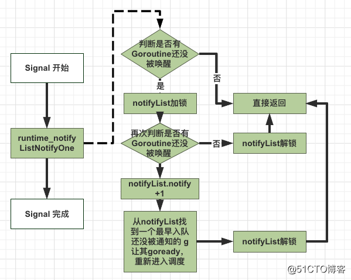
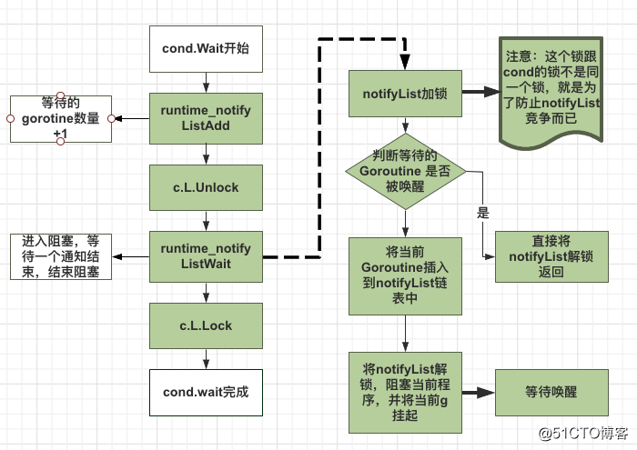

# Cond条件变量

Golang 的 sync 包中的 Cond 实现了一种条件变量，可以使用在多个Reader等待共享资源 ready 的场景（如果只有一读一写，一个锁或者channel就搞定了）。

Cond的汇合点：多个goroutines等待、1个goroutine通知事件发生。

## 与channel对比：

提供了 Broadcast 方法，可以通知所有的等待者。

## 背景
怎么去通知阻塞协程继续运行：
如果一个协程走到某个逻辑后，需要在某种条件达成后才能继续往下走，这怎么实现呢。对于单个协程，golang中的channel完全可以实现协程的通信。
```go

func main() {
	s := &signal{
		reRUn: make(chan  struct{}, 1),
	}
	go func() {
		time.Sleep(2 * time.Second)
		s.signalReRun()
	}()

	go func(s *signal) {
		//阻塞
		<- s.reRUn
		fmt.Println("goroutine start!")
	}(s)

	time.Sleep(5 * time.Second)

}

//通知协程继续执行
func (s *signal) signalReRun() {
	select {
	case s.reRUn <- struct{}{}:
		fmt.Println("notify wait goroutine!")
	default:
		fmt.Println("default")
		// The Channel is already full, so a reconnection attempt will occur.
	}
}


```

但如果是多个协程同时等待某个条件呢，怎么实现呢？golang中提供了sync.cond即条件变量来完成这件事。

比较适合任务调用场景，一个 Master goroutine 通知事件发生，多个 Worker goroutine 在资源没准备好的时候就挂起，等待通知。

## 源码体现
结构体
```go
type Cond struct {
    noCopy noCopy  //不允许copy

    // L is held while observing or changing the condition
    L Locker

    notify  notifyList
    checker copyChecker
}
// copyChecker 对象，实际上是 uintptr 对象，保存自身对象地址。.
type copyChecker uintptr

func (c *copyChecker) check() {
	// 检查当前 checker 对象的地址是否等于保存在 checker 中的地址,由于第一次比较的时候 checker 中没有存地址所以第一次比较肯定是不相等的
    if uintptr(*c) != uintptr(unsafe.Pointer(c)) &&
    	// 对 checker 进行 CAS 操作，如果 checker 中存储的地址值为空（就是0）就把当前 checker 对象的地址值存进去
    	// 第二步 CAS 之前，其他 goroutine 也在执行这个方法，并发的将 checker 赋值了，导致这里判定的时候第二步 CAS 失败
        !atomic.CompareAndSwapUintptr((*uintptr)(c), 0, uintptr(unsafe.Pointer(c))) &&
        uintptr(*c) != uintptr(unsafe.Pointer(c)) {
        panic("sync.Cond is copied")
    }
}
```
check 方法在第一次调用的时候，会将 checker 对象地址赋值给 checker，也就是将自身内存地址赋值给自身。 再次调用 checker 方法的时候，会将当前 checker 对象地址值与 checker 中保存的地址值（原始地址）进行比较，若不相同则表示当前 checker 的地址不是第一次调用 check 方法时候的地址，即 cond 对象被复制了，导致checker 被重新分配了内存地址。

notifyList 对象，维护等待唤醒的 goroutine 队列,使用链表实现
```go
// /usr/local/go/src/sync/runtime2.go
type notifyList struct {
	wait   uint32
	notify uint32
	lock   uintptr // key field of the mutex
	head   unsafe.Pointer
	tail   unsafe.Pointer
}
```

## 流程
### cond.Signal()

```go
func (c *Cond) Signal() {
    // 1.复制检查
    c.checker.check() 
    // 2.顺序唤醒一个等待的gorountine
    runtime_notifyListNotifyOne(&c.notify)
}
```
```go
// /usr/local/go/src/runtime/sema.go
func notifyListNotifyOne(l *notifyList) {
   // 1.等待序号和唤醒序号相同则说明没有需要唤醒的 goroutine 直接返回
   if atomic.Load(&l.wait) == atomic.Load(&l.notify) {
        return
   }
   // 2.锁住队列后再检查一遍等待序号和唤醒序号是否相同即判断有没有需要唤醒的 goroutine，没有则解锁后直接返回
   lock(&l.lock) 
   t := l.notify
   if t == atomic.Load(&l.wait) {
        unlock(&l.lock)
        return
   }
   // 3.到这里就说明有需要唤醒的 goroutine，于是先将 notify序号+1
   atomic.Store(&l.notify, t+1)  
   // 4.然后就开始唤醒 goroutine 了
   for p, s := (*sudog)(nil), l.head; s != nil; p, s = s, s.next {
        // 4.1 找到 ticket等于当前唤醒序号的 goroutine
        if s.ticket == t {
           // 4.2 然后将其从等待唤醒链表中移除（因为这个 goroutine 马上就要被唤醒了）
           n := s.next
           if p != nil {
               p.next = n
           } else {
               l.head = n
           }
           if n == nil {
               l.tail = p
           }
           unlock(&l.lock)
           s.next = nil
           // 4.3 然后唤醒这个 goroutine 
           readyWithTime(s, 4)
           return
       }
   }
   // 4.4 最后解锁队列 
   unlock(&l.lock)
}
```

### cond.Broadcast()


```go
func (c *Cond) Broadcast() {
    // 1.复制检查
    c.checker.check()
    // 2.唤醒所有在等待的 goroutine
    runtime_notifyListNotifyAll(&c.notify)
}
```
```go
func notifyListNotifyAll(l *notifyList) {
    // 1.等待序号和唤醒序号相同则说明没有需要唤醒的 goroutine 直接返回
    if atomic.Load(&l.wait) == atomic.Load(&l.notify) {
        return
    }

    // 2. 将链表头尾指针置为空（可以看做是清空整个等待队列）
    // 但是需要将当前的链表头保存下来，不然等会找不到链表中的数据了
    lock(&l.lock)
    s := l.head
    l.head = nil
    l.tail = nil

    // 3.直接将notify需要赋值成等待序号（这样表示当前没有需要唤醒的 goroutine 了）
    // 前面唤醒一个的时候这里是+1
    atomic.Store(&l.notify, atomic.Load(&l.wait))
    unlock(&l.lock)

   // 4.最后 for 循环唤醒链表中所有等待状态的 goroutine
    for s != nil {
        next := s.next
        s.next = nil
        readyWithTime(s, 4)
        s = next
    }
}
```

### cond.Wait()

```go
func (c *Cond) Wait() {
    // 1.每次操作之前都要检测一下 cond 是否被复制了。
    c.checker.check() 
    // 2.将 notifyList 中的 wait 值加1并返回之前的值
    t := runtime_notifyListAdd(&c.notify) 
    // 3.释放锁，因此在调用Wait方法前，必须保证获取到了cond的锁，否则会报错
    c.L.Unlock()
    // 4.将当前goroutine挂起，等待唤醒信号
    runtime_notifyListWait(&c.notify, t) 
    // 5.gorountine被唤醒，重新获取锁
    c.L.Lock()
}
```

```go
func notifyListAdd(l *notifyList) uint32 {
    return atomic.Xadd(&l.wait, 1) - 1
}
```
```go
// 获取当前 goroutine 添加到链表末端，然后 goparkunlock 函数休眠阻塞当前 goroutine
// goparkunlock 函数会让出当前处理器的使用权并等待调度器的唤醒
func notifyListWait(l *notifyList, t uint32) {
    // 1.锁住 notify 队列
    lock(&l.lock)
    // 2.判断传入的等待序号t是否小于当前已经唤醒的序号notify
    // 如果是则说明当前 goroutine 不需要阻塞了 直接解锁并返回
    // 有可能执行这步之前 goroutine 就已经被唤醒了
    if less(t, l.notify) {
        unlock(&l.lock)
        return
    }
    // 3.获取当前 goroutine，设置相关参数，将当前等待数赋值给 ticket
    s := acquireSudog()
    s.g = getg()
    s.ticket = t
    s.releasetime = 0
    t0 := int64(0)
    if blockprofilerate > 0 {
        t0 = cputicks()
        s.releasetime = -1
    }
    // 4.将当前 goroutine 写入到链表尾部
    if l.tail == nil {
        l.head = s
    } else {
        l.tail.next = s
    }
    l.tail = s
    // 5. 调用 goparkunlock 函数将当前 goroutine 挂起，等待唤醒信号
    goparkunlock(&l.lock, "semacquire", traceEvGoBlockCond, 3)
    if t0 != 0 {
        blockevent(s.releasetime-t0, 2)
    }
    releaseSudog(s)
}
```


## 注意事项
1. 不能不加锁直接调用 cond.Wait
我们看到 Wait 内部会先调用 c.L.Unlock()，来先释放锁。如果调用方不先加锁的话，会触发“fatal error: sync: unlock of unlocked mutex”。

2. 为什么不能 sync.Cond 不能复制 ？
sync.Cond 不能被复制的原因，并不是因为 sync.Cond 内部嵌套了 Locker。因为 NewCond 时传入的 Mutex/RWMutex 指针，对于 Mutex 指针复制是没有问题的。
主要原因是 sync.Cond 内部是维护着一个 notifyList。如果这个队列被复制的话，那么就在并发场景下导致不同 goroutine 之间操作的 notifyList.wait、notifyList.notify 并不是同一个，这会导致出现有些 goroutine 会一直堵塞。

## NoCopy机制

noCopy 是 go1.7 开始引入的一个静态检查机制。它不仅仅工作在运行时或标准库，同时也对用户代码有效
强调no copy的原因是为了安全，因为结构体对象中包含指针对象的话，直接赋值拷贝是浅拷贝，是极不安全的

### 工具
go vet工具来检查，那么这个对象必须实现sync.Locker
```go
// A Locker represents an object that can be locked and unlocked.
type Locker interface {
    Lock()
    Unlock()
}

// noCopy 用于嵌入一个结构体中来保证其第一次使用后不会被复制
type noCopy struct{}

// Lock is a no-op used by -copylocks checker from `go vet`.
func (*noCopy) Lock()   {}
func (*noCopy) Unlock() {}
```

## 第三方库实现-->熔断框架hystrix-go
因为我们有一个条件是最大并发控制，采用的是令牌的方式进行流量控制，每一个请求都要获取一个令牌，使用完毕要把令牌还回去
```go
{
    ticketCond := sync.NewCond(cmd)
    ticketChecked := false
    // When the caller extracts error from returned errChan, it's assumed that
    // the ticket's been returned to executorPool. Therefore, returnTicket() can
    // not run after cmd.errorWithFallback().
    returnTicket := func () {
        cmd.Lock()
        // Avoid releasing before a ticket is acquired.
        for !ticketChecked {
            ticketCond.Wait()
        }
        cmd.circuit.executorPool.Return(cmd.ticket)
        cmd.Unlock()
    }
}
```
使用sync.NewCond创建一个条件变量，用来协调通知你可以归还令牌了.