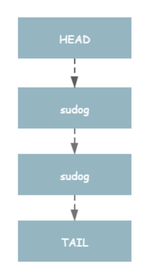
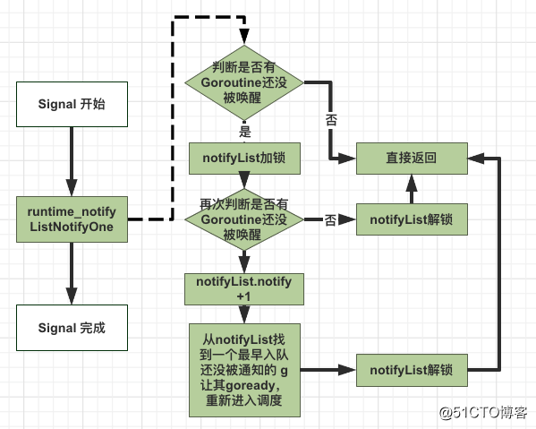
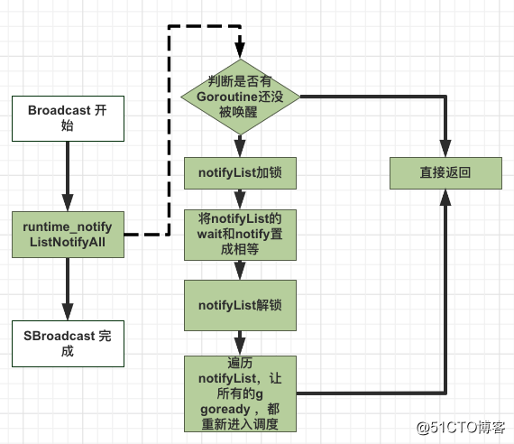
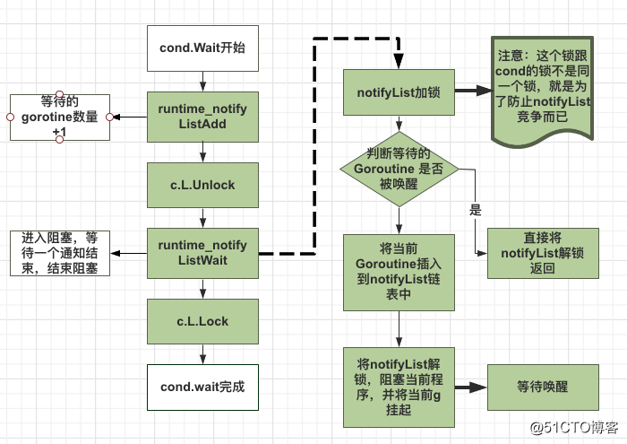
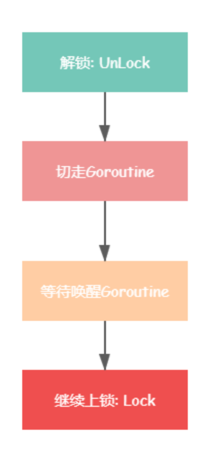

<!-- START doctoc generated TOC please keep comment here to allow auto update -->
<!-- DON'T EDIT THIS SECTION, INSTEAD RE-RUN doctoc TO UPDATE -->
**Table of Contents**  *generated with [DocToc](https://github.com/thlorenz/doctoc)*

- [Cond条件变量](#cond%E6%9D%A1%E4%BB%B6%E5%8F%98%E9%87%8F)
  - [与channel对比](#%E4%B8%8Echannel%E5%AF%B9%E6%AF%94)
  - [sync.Cond 基于互斥锁/读写锁，它和互斥锁的区别是什么呢](#synccond-%E5%9F%BA%E4%BA%8E%E4%BA%92%E6%96%A5%E9%94%81%E8%AF%BB%E5%86%99%E9%94%81%E5%AE%83%E5%92%8C%E4%BA%92%E6%96%A5%E9%94%81%E7%9A%84%E5%8C%BA%E5%88%AB%E6%98%AF%E4%BB%80%E4%B9%88%E5%91%A2)
  - [背景](#%E8%83%8C%E6%99%AF)
  - [源码体现](#%E6%BA%90%E7%A0%81%E4%BD%93%E7%8E%B0)
  - [流程](#%E6%B5%81%E7%A8%8B)
    - [NewCond 创建实例](#newcond-%E5%88%9B%E5%BB%BA%E5%AE%9E%E4%BE%8B)
    - [cond.Signal() 唤醒一个协程](#condsignal-%E5%94%A4%E9%86%92%E4%B8%80%E4%B8%AA%E5%8D%8F%E7%A8%8B)
    - [cond.Broadcast() 广播唤醒](#condbroadcast-%E5%B9%BF%E6%92%AD%E5%94%A4%E9%86%92)
    - [cond.Wait()](#condwait)
  - [注意事项](#%E6%B3%A8%E6%84%8F%E4%BA%8B%E9%A1%B9)
  - [第三方库实现-->熔断框架hystrix-go](#%E7%AC%AC%E4%B8%89%E6%96%B9%E5%BA%93%E5%AE%9E%E7%8E%B0--%E7%86%94%E6%96%AD%E6%A1%86%E6%9E%B6hystrix-go)

<!-- END doctoc generated TOC please keep comment here to allow auto update -->

# Cond条件变量

sync.Cond 条件变量用来协调想要访问共享资源的 那些 goroutine，当共享资源的状态发生变化的时候，它可以用来通知被互斥锁阻塞的 goroutine。

Cond的汇合点：多个goroutines等待、1个goroutine通知事件发生。

## 与channel对比

提供了 Broadcast 方法，可以通知所有的等待者。

## sync.Cond 基于互斥锁/读写锁，它和互斥锁的区别是什么呢

- 互斥锁 sync.Mutex 通常用来保护临界区和共享资源

- 条件变量 sync.Cond 用来协调想要访问共享资源的 goroutine，sync.Cond 经常用在多个 goroutine 等待，一个 goroutine 通知（事件发生）的场景。如果是一个通知，一个等待，使用互斥锁或 channel 就能搞定了


## 背景
怎么去通知阻塞协程继续运行：
如果一个协程走到某个逻辑后，需要在某种条件达成后才能继续往下走，这怎么实现呢。对于单个协程，golang中的channel完全可以实现协程的通信。
```go

func main() {
	s := &signal{
		reRUn: make(chan  struct{}, 1),
	}
	go func() {
		time.Sleep(2 * time.Second)
		s.signalReRun()
	}()

	go func(s *signal) {
		//阻塞
		<- s.reRUn
		fmt.Println("goroutine start!")
	}(s)

	time.Sleep(5 * time.Second)

}

//通知协程继续执行
func (s *signal) signalReRun() {
	select {
	case s.reRUn <- struct{}{}:
		fmt.Println("notify wait goroutine!")
	default:
		fmt.Println("default")
		// The Channel is already full, so a reconnection attempt will occur.
	}
}


```

但如果是多个协程同时等待某个条件呢，怎么实现呢？golang中提供了sync.cond即条件变量来完成这件事。

比较适合任务调用场景，一个 Master goroutine 通知事件发生，多个 Worker goroutine 在资源没准备好的时候就挂起，等待通知。

## 源码体现
数据结构
```go
type Cond struct {
    noCopy noCopy  //不允许copy

    // L is held while observing or changing the condition
    L Locker

    notify  notifyList // 通知唤起列表
    checker copyChecker // 复制检测，禁止第一次使用的Cond被复制拷贝
}
// copyChecker 对象，实际上是 uintptr 对象，保存自身对象地址。.
type copyChecker uintptr

func (c *copyChecker) check() {
	// 检查当前 checker 对象的地址是否等于保存在 checker 中的地址,由于第一次比较的时候 checker 中没有存地址所以第一次比较肯定是不相等的
    if uintptr(*c) != uintptr(unsafe.Pointer(c)) &&
    	// 对 checker 进行 CAS 操作，如果 checker 中存储的地址值为空（就是0）就把当前 checker 对象的地址值存进去
    	// 第二步 CAS 之前，其他 goroutine 也在执行这个方法，并发的将 checker 赋值了，导致这里判定的时候第二步 CAS 失败
        !atomic.CompareAndSwapUintptr((*uintptr)(c), 0, uintptr(unsafe.Pointer(c))) &&
        uintptr(*c) != uintptr(unsafe.Pointer(c)) {
        panic("sync.Cond is copied")
    }
}
```
check 方法在第一次调用的时候，会将 checker 对象地址赋值给 checker，也就是将自身内存地址赋值给自身。 再次调用 checker 方法的时候，会将当前 checker 对象地址值与 checker 中保存的地址值（原始地址）进行比较，若不相同则表示当前 checker 的地址不是第一次调用 check 方法时候的地址，即 cond 对象被复制了，导致checker 被重新分配了内存地址。

notifyList 对象，维护等待唤醒的 goroutine 队列,使用链表实现

```go
// /usr/local/go/src/sync/runtime2.go
type notifyList struct {
	wait   uint32 // 当前wait的index
	notify uint32 // 当前notify的index
	lock   uintptr // key field of the mutex
	head   unsafe.Pointer
	tail   unsafe.Pointer
}
```
wait 和 notify。这两个都是ticket值，每次调 Wait 时，ticket 都会递增. 
wait 表示下次 sync.Cond Wait 的 ticket 值，notify 表示下次要唤醒的 goroutine 的 ticket 的值。这两个值都只增不减的。

## 流程
条件变量有四个方法，创建实例(NewCond )，等待通知(wait)，单发通知(signal)，广播通知(broadcast)。当互斥锁锁定时，可以进行等待通知；当互斥锁解锁时，可以进行单发通知和广播通知
### NewCond 创建实例

```go
// NewCond returns a new Cond with Locker l.
func NewCond(l Locker) *Cond {
	return &Cond{L: l}
}

```

### cond.Signal() 唤醒一个协程

```go
func (c *Cond) Signal() {
    // 1.复制检查
    c.checker.check() 
    // 2.顺序唤醒一个等待的goroutine
    runtime_notifyListNotifyOne(&c.notify)
}
```
```go

//go:linkname notifyListNotifyOne sync.runtime_notifyListNotifyOne
func notifyListNotifyOne(l *notifyList) {
   // 1.等待序号和唤醒序号相同则说明没有需要唤醒的 goroutine 直接返回
   if atomic.Load(&l.wait) == atomic.Load(&l.notify) {
        return
   }
   // 2.锁住队列后再检查一遍等待序号和唤醒序号是否相同即判断有没有需要唤醒的 goroutine，没有则解锁后直接返回
   lock(&l.lock) 
   t := l.notify
   if t == atomic.Load(&l.wait) {
        unlock(&l.lock)
        return
   }
   // 3.到这里就说明有需要唤醒的 goroutine，于是先将 notify序号+1
   atomic.Store(&l.notify, t+1)  
   // 4.然后就开始唤醒 goroutine 了
   for p, s := (*sudog)(nil), l.head; s != nil; p, s = s, s.next {
        // 4.1 找到 ticket等于当前唤醒序号的 goroutine
        if s.ticket == t {
           // 4.2 然后将其从等待唤醒链表中移除（因为这个 goroutine 马上就要被唤醒了）
           n := s.next
           if p != nil {
               p.next = n
           } else {
               l.head = n
           }
           if n == nil {
               l.tail = p
           }
           unlock(&l.lock)
           s.next = nil
           // 4.3 然后唤醒这个 goroutine 
           readyWithTime(s, 4)
           return
       }
   }
   // 4.4 最后解锁队列 
   unlock(&l.lock)
}
```

### cond.Broadcast() 广播唤醒


```go
func (c *Cond) Broadcast() {
    // 1.复制检查
    c.checker.check()
    // 2.唤醒所有在等待的 goroutine
    runtime_notifyListNotifyAll(&c.notify)
}
```
```go
//go:linkname notifyListNotifyAll sync.runtime_notifyListNotifyAll
func notifyListNotifyAll(l *notifyList) {
    // 1.等待序号和唤醒序号相同则说明没有需要唤醒的 goroutine 直接返回
    if atomic.Load(&l.wait) == atomic.Load(&l.notify) {
        return
    }

    // 2. 将链表头尾指针置为空（可以看做是清空整个等待队列）
    // 但是需要将当前的链表头保存下来，不然等会找不到链表中的数据了
    lock(&l.lock)
    s := l.head
    l.head = nil
    l.tail = nil

    // 3.直接将notify需要赋值成等待序号（这样表示当前没有需要唤醒的 goroutine 了）
    // 前面唤醒一个的时候这里是+1
    atomic.Store(&l.notify, atomic.Load(&l.wait))
    unlock(&l.lock)

   // 4.最后 for 循环唤醒链表中所有等待状态的 goroutine
    for s != nil {
        next := s.next
        s.next = nil
        readyWithTime(s, 4)
        s = next
    }
}
```

### cond.Wait()



调用 Wait 会自动释放锁 c.L，并挂起调用者所在的 goroutine，因此当前协程会阻塞在 Wait 方法调用的地方。如果其他协程调用了 Signal 或 Broadcast 唤醒了该协程，那么 Wait 方法在结束阻塞时，会重新给 c.L 加锁，并且继续执行 Wait 后面的代码

```go
func (c *Cond) Wait() {
    // 1.每次操作之前都要检测一下 cond 是否被复制了。
    c.checker.check() 
    // 2.将 notifyList 中的 wait 值加1并返回之前的值
    t := runtime_notifyListAdd(&c.notify) 
    // 3.释放锁，切走之前，必须先把 Locker 解锁了。要不然其他 goroutine 获取不到这个锁，将会造成死锁问题。
    c.L.Unlock()
    // 4.将当前goroutine挂起，等待唤醒信号
    runtime_notifyListWait(&c.notify, t) 
    // 5.goroutine被唤醒，重新获取锁.如果其他 goroutine 调用了 Signal 或者 Broadcast 唤醒了该 goroutine。
    c.L.Lock()
}
```

```go
// go1.20/src/runtime/sema.go
// //go:linkname notifyListAdd sync.runtime_notifyListAdd
func notifyListAdd(l *notifyList) uint32 {
    return atomic.Xadd(&l.wait, 1) - 1
}
```

主要将当前 goroutine 追加到 notifyList 链表最后以及调用 gopark 切走 goroutine。
```go
// 获取当前 goroutine 添加到链表末端，然后 goparkunlock 函数休眠阻塞当前 goroutine
// goparkunlock 函数会让出当前处理器的使用权并等待调度器的唤醒
//go:linkname notifyListWait sync.runtime_notifyListWait
func notifyListWait(l *notifyList, t uint32) {
    // 1.锁住 notify 队列
    lock(&l.lock)
    // 2.判断传入的等待序号t是否小于当前已经唤醒的序号notify
    // 如果是则说明当前 goroutine 不需要阻塞了 直接解锁并返回
    // 有可能执行这步之前 goroutine 就已经被唤醒了
    if less(t, l.notify) {
        unlock(&l.lock)
        return
    }
    // 3.获取当前 goroutine，设置相关参数，将当前等待数赋值给 ticket
    s := acquireSudog()
    s.g = getg()
    s.ticket = t
    s.releasetime = 0
    t0 := int64(0)
    if blockprofilerate > 0 {
        t0 = cputicks()
        s.releasetime = -1
    }
    // 4.将当前 goroutine 写入到链表尾部
    if l.tail == nil {
        l.head = s
    } else {
        l.tail.next = s
    }
    l.tail = s
    // 5. 调用 goparkunlock 函数将当前 goroutine 挂起，等待唤醒信号
    goparkunlock(&l.lock, "semacquire", traceEvGoBlockCond, 3)
    if t0 != 0 {
        blockevent(s.releasetime-t0, 2)
    }
    releaseSudog(s)
}
```


## 注意事项
1. 不能不加锁直接调用 cond.Wait()
我们看到 Wait 内部会先调用 c.L.Unlock()，来先释放锁。如果调用方不先加锁的话，会触发“fatal error: sync: unlock of unlocked mutex”。

2. 为什么不能 sync.Cond 不能复制 ？
sync.Cond 不能被复制的原因，并不是因为 sync.Cond 内部嵌套了 Locker。因为 NewCond 时传入的 Mutex/RWMutex 指针，对于 Mutex 指针复制是没有问题的。
主要原因是 sync.Cond 内部是维护着一个 notifyList。如果这个队列被复制的话，那么就在并发场景下导致不同 goroutine 之间操作的 notifyList.wait、notifyList.notify 并不是同一个，这会导致出现有些 goroutine 会一直堵塞。

3. Wait 调用的条件检查一定要放在 for 循环中，代码如上。这是因为当 Boardcast 唤醒时，有可能其他 goroutine 先于当前 goroutine 唤醒并抢到锁，导致轮到当前 goroutine 抢到锁的时候，条件又不再满足了。因此，需要将条件检查放在 for 循环中。

4. Signal 和 Broadcast 两个唤醒操作不需要加锁

## 第三方库实现-->熔断框架hystrix-go
因为我们有一个条件是最大并发控制，采用的是令牌的方式进行流量控制，每一个请求都要获取一个令牌，使用完毕要把令牌还回去
```go
{
    ticketCond := sync.NewCond(cmd)
    ticketChecked := false
    // When the caller extracts error from returned errChan, it's assumed that
    // the ticket's been returned to executorPool. Therefore, returnTicket() can
    // not run after cmd.errorWithFallback().
    returnTicket := func () {
        cmd.Lock()
        // Avoid releasing before a ticket is acquired.
        for !ticketChecked {
            ticketCond.Wait()
        }
        cmd.circuit.executorPool.Return(cmd.ticket)
        cmd.Unlock()
    }
}
```
使用sync.NewCond创建一个条件变量，用来协调通知你可以归还令牌了.