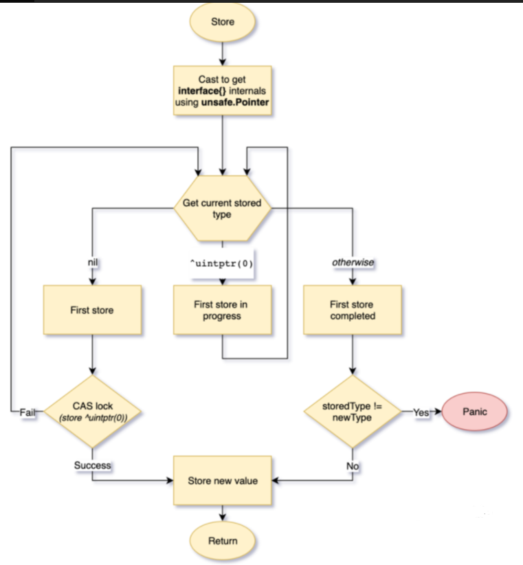
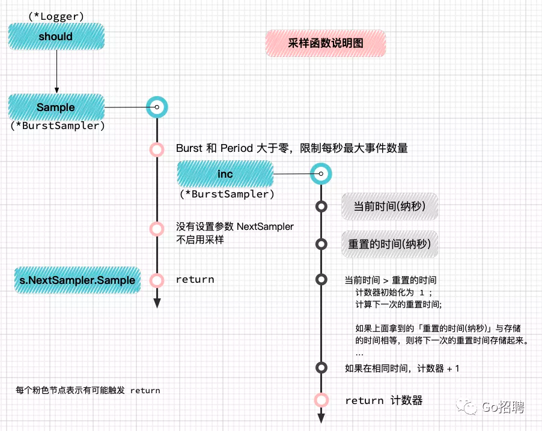

<!-- START doctoc generated TOC please keep comment here to allow auto update -->
<!-- DON'T EDIT THIS SECTION, INSTEAD RE-RUN doctoc TO UPDATE -->
**Table of Contents**  *generated with [DocToc](https://github.com/thlorenz/doctoc)*

- [扩大原子操作的适用范围：atomic.Value](#%E6%89%A9%E5%A4%A7%E5%8E%9F%E5%AD%90%E6%93%8D%E4%BD%9C%E7%9A%84%E9%80%82%E7%94%A8%E8%8C%83%E5%9B%B4atomicvalue)
  - [背景](#%E8%83%8C%E6%99%AF)
    - [做法](#%E5%81%9A%E6%B3%95)
    - [问题](#%E9%97%AE%E9%A2%98)
    - [原因](#%E5%8E%9F%E5%9B%A0)
  - [原子性](#%E5%8E%9F%E5%AD%90%E6%80%A7)
  - [atomic.Value源码分析](#atomicvalue%E6%BA%90%E7%A0%81%E5%88%86%E6%9E%90)
  - [第三方应用实现:zeroLog](#%E7%AC%AC%E4%B8%89%E6%96%B9%E5%BA%94%E7%94%A8%E5%AE%9E%E7%8E%B0zerolog)

<!-- END doctoc generated TOC please keep comment here to allow auto update -->

# 扩大原子操作的适用范围：atomic.Value

在 Go 语言标准库中，sync/atomic包将底层硬件提供的原子操作封装成了 Go 的函数。但这些操作只支持几种基本数据类型，因此为了扩大原子操作的适用范围，
Go 语言在 1.4 版本的时候向sync/atomic包中添加了一个新的类型Value。此类型的值相当于一个容器，可以被用来“原子地"存储（Store）和加载（Load）任意类型的值
    

## 背景

> 我在golang-dev邮件列表中翻到了14年的这段讨论，有用户报告了encoding/gob包在多核机器上（80-core）上的性能问题，
> 认为encoding/gob之所以不能完全利用到多核的特性是因为它里面使用了大量的互斥锁（mutex），
>如果把这些互斥锁换成用atomic.LoadPointer/StorePointer来做并发控制，那性能将能提升20倍。

### 做法

有人提议在已有的atomic包的基础上封装出一个atomic.Value类型，这样用户就可以在不依赖 Go 内部类型unsafe.Pointer的情况下使用到atomic提供的原子操作。
所以我们现在看到的atomic包中除了atomic.Value外，其余都是早期由汇编写成的，并且atomic.Value类型的底层实现也是建立在已有的atomic包的基础上

### 问题

为什么在上面的场景中，atomic会比mutex性能好很多呢？

### 原因

> Mutexes do no scale. Atomic loads do.------ Dmitry Vyukov

Mutex由操作系统实现，而atomic包中的原子操作则由底层硬件直接提供支持。在 CPU 实现的指令集里，有一些指令被封装进了atomic包，这些指令在执行的过程中是不允许中断（interrupt）的，
因此原子操作可以在lock-free的情况下保证并发安全，并且它的性能也能做到随 CPU 个数的增多而线性扩展。

## 原子性


一个或者多个操作在 CPU 执行的过程中不被中断的特性，称为原子性（atomicity） 。这些操作对外表现成一个不可分割的整体，他们要么都执行，要么都不执行，外界不会看到他们只执行到一半的状态。
而在现实世界中，CPU 不可能不中断的执行一系列操作，但如果我们在执行多个操作时，能让他们的中间状态对外不可见，那我们就可以宣称他们拥有了"不可分割”的原子性。
有些朋友可能不知道，在 Go（甚至是大部分语言）中，一条普通的赋值语句其实不是一个原子操作。

例如，在32位机器上写int64类型的变量就会有中间状态，因为它会被拆成两次写操作（MOV）——写低 32 位和写高 32 位.
如果一个线程刚写完低32位，还没来得及写高32位时，另一个线程读取了这个变量，那它得到的就是一个毫无逻辑的中间变量，这很有可能使我们的程序出现诡异的 Bug。

这还只是一个基础类型，如果我们对一个结构体进行赋值，那它出现并发问题的概率就更高了。很可能写线程刚写完一小半的字段，读线程就来读取这个变量，那么就只能读到仅修改了一部分的值。
这显然破坏了变量的完整性，读出来的值也是完全错误的。

面对这种多线程下变量的读写问题，我们的主角——atomic.Value登场了，它使得我们可以不依赖于不保证兼容性的unsafe.Pointer类型，同时又能将任意数据类型的读写操作封装成原子性操作（让中间状态对外不可见）
atomic.Value类型使用：

操作的数据类型几种操作：

    六种类型：int32, int64, uint32, uint64, uintptr, unsafe.Pinter
    五种操作：Add增减， CompareAndSwap比较并交换， Swap交换， Load载入， Store存储
    函数名以"操作+类型"组合而来。例如AddInt32/AddUint64/LoadInt32/LoadUint64.

```go
//1. LoadXXX(addr): 原子性的获取*addr的值，等价于
return *addr

//2.StoreXXX(addr, val): 原子性的将val的值保存到*addr，等价于：
addr = val

//3.AddXXX(addr, delta): 原子性的将delta的值添加到*addr并返回新值（unsafe.Pointer不支持），等价于
*addr += delta
return *addr

//4.SwapXXX(addr, new) old: 原子性的将new的值保存到*addr并返回旧值，等价于：
old = *addr
*addr = new
return old
//5.CompareAndSwapXXX(addr, old, new) bool: 原子性的比较*addr和old，如果相同则将new赋值给*addr并返回true
if *addr == old {
*addr = new
return true
}
return false
```

## atomic.Value源码分析

```go

type Value struct {
    v interface{}
}
func(v *Value) Load() (x interface{}) //读操作，从线程安全的v中读取上一步存放的内容
func(v *Value) Store(x interface{}) //写操作，将原始的变量x存放在atomic.Value类型的v


// ifaceWords is interface{} internal representation.
type ifaceWords struct {
    typ  unsafe.Pointer  // 接口表指针，指向类型信息  --->动态类型
    data unsafe.Pointer 
}
```
1. unsafe.Pointer

    Go语言并不支持直接操作内存，但是它的标准库提供一种不保证向后兼容的指针类型unsafe.Pointer， 让程序可以灵活的操作内存，它的特别之处在于：可以绕过Go语言类型系统的检查
    
    也就是说：如果两种类型具有相同的内存结构，我们可以将unsafe.Pointer当作桥梁，让这两种类型的指针相互转换，从而实现同一份内存拥有两种解读方式
    int类型和int32类型内部的存储结构是一致的，但是对于指针类型的转换需要这么做：
```go

var a int32
// 获得a的*int类型指针
(*int)(unsafe.Pointer(&a))
```


2. 实现原子性的读取任意结构操作    

```go

func (v *Value) Load() (x interface{}) {
    // 将*Value指针类型转换为*ifaceWords指针类型
	vp := (*ifaceWords)(unsafe.Pointer(v))
	// 原子性的获取到v的类型typ的指针
	typ := LoadPointer(&vp.typ)
	// 如果没有写入或者正在写入，先返回，^uintptr(0)代表过渡状态，见下文
	if typ == nil || uintptr(typ) == ^uintptr(0) {
		return nil
	}
	// 原子性的获取到v的真正的值data的指针，然后返回
	data := LoadPointer(&vp.data)
	// 获得x的*ifaceWords类型指针
	xp := (*ifaceWords)(unsafe.Pointer(&x))
	xp.typ = typ
	xp.data = data
	return
}
```
3. 实现原子性的存储任意结构操作
```go
func runtime_procPin()  //可以将一个goroutine死死占用当前使用的P ,不允许其他的goroutine抢占
func runtime_procUnpin() //释放
```
```go
func (v *Value) Store(x interface{}) {
	if x == nil {
		panic("sync/atomic: store of nil value into Value")
	}
	// 将现有的值和要写入的值转换为ifaceWords类型，这样下一步就能获取到它们的原始类型和真正的值
	vp := (*ifaceWords)(unsafe.Pointer(v))
	xp := (*ifaceWords)(unsafe.Pointer(&x))
	for {
		// 获取现有的值的type
		typ := LoadPointer(&vp.typ)
		// 如果typ为nil说明这是第一次Store
		if typ == nil {
			// 如果你是第一次，就死死占住当前的processor，不允许其他goroutine再抢
			runtime_procPin()
			// 使用CAS操作，先尝试将typ设置为^uintptr(0)这个中间状态
			// 如果失败，则证明已经有别的线程抢先完成了赋值操作
			// 那它就解除抢占锁，然后重新回到 for 循环第一步
			if !CompareAndSwapPointer(&vp.typ, nil, unsafe.Pointer(^uintptr(0))) {
				runtime_procUnpin()
				continue
			}
			// 如果设置成功，说明当前goroutine中了jackpot
			// 那么就原子性的更新对应的指针，最后解除抢占锁
			StorePointer(&vp.data, xp.data)
			StorePointer(&vp.typ, xp.typ)
			runtime_procUnpin()
			return
		}
		// 如果typ为^uintptr(0)说明第一次写入还没有完成，继续循环等待
		if uintptr(typ) == ^uintptr(0) {
			continue
		}
		// 如果要写入的类型和现有的类型不一致，则panic
		if typ != xp.typ {
			panic("sync/atomic: store of inconsistently typed value into Value")
		}
		// 更新data
		StorePointer(&vp.data, xp.data)
		return
	}
}
```

## 第三方应用实现:zeroLog
使用
```go
package main

import (
	"github.com/rs/zerolog"
	"github.com/rs/zerolog/log"
	"time"
)

func main() {
	sampled := log.Sample(&zerolog.BurstSampler{
		Burst:       5,
		Period:      1 * time.Second,
		NextSampler: &zerolog.BasicSampler{N: 20}, //下个采样器
	})
	for i := 0; i <= 50; i++ {
		sampled.Info().Msgf("logged messages : %2d ", i)

	}
}
```
使用结果:本来应该输出 50 条日志，使用了采样，在一秒内输出最大 5 条日志，当大于 5 条后，每 20 条日志输出一次。
```go
{"level":"info","time":"2021-12-30T17:31:15+08:00","message":"logged messages :  0 "}
{"level":"info","time":"2021-12-30T17:31:15+08:00","message":"logged messages :  1 "}
{"level":"info","time":"2021-12-30T17:31:15+08:00","message":"logged messages :  2 "}
{"level":"info","time":"2021-12-30T17:31:15+08:00","message":"logged messages :  3 "}
{"level":"info","time":"2021-12-30T17:31:15+08:00","message":"logged messages :  4 "}
{"level":"info","time":"2021-12-30T17:31:15+08:00","message":"logged messages :  5 "}
{"level":"info","time":"2021-12-30T17:31:15+08:00","message":"logged messages : 25 "}
{"level":"info","time":"2021-12-30T17:31:15+08:00","message":"logged messages : 45 "}

```

在 inc 函数中，使用 atomic 包将竞争的接收器对象的参数变成局部变量
```go
// =========== sampler.go ===

// 采样器接口
type Sampler interface {
    // 如果事件是样本的一部分返回 true
    Sample(lvl Level) bool
}

// BasicSampler 基本采样器
// 每 N 个事件发送一次，不考虑日志级别
type BasicSampler struct {
    N
    counter uint32
}
// 实现采样器接口
func (s *BasicSampler) Sample(lvl Level) bool {
    n := s.N
    if n == 1 {
        return true
    }
    // 加一
    c := atomic.AddUint32(&s.counter, 1)
    return c%n == 1
}


type BurstSampler struct {
    // 调用 NextSampler 之前每个时间段(Period)调用的最大事件数量
    Burst uint32
    // 如果为 0，则始终调用 NextSampler
    Period time.Duration
    // 采样器
    NextSampler Sampler
    // 用于计数在一定时间内(Period)的调用数量
    counter uint32
    // 时间段的结束时间(纳秒)，即 当前时间+Period
    resetAt int64
}

// 实现 Sampler 接口
func (s *BurstSampler) Sample(lvl Level) bool {
    // 当设置了 Burst 和 Period，大于零时限制 一定时间内的最大事件数量
    if s.Burst > 0 && s.Period > 0 {
        if s.inc() <= s.Burst {
            return true
        }
    }
    // 没有采样器，结束
    if s.NextSampler == nil {
        return false
    }
    // 调用采样器
    return s.NextSampler.Sample(lvl)
}

func (s *BurstSampler) inc() uint32 {
    // 当前时间 (纳秒)
    now := time.Now().UnixNano()
    // 重置时间 (纳秒)
    resetAt := atomic.LoadInt64(&s.resetAt)
    var c uint32
    // 当前时间 > 重置时间
    if now > resetAt {
        c = 1
        // 重置 s.counter 为 1
        atomic.StoreUint32(&s.counter, c)
        // 计算下一次的重置时间
        newResetAt := now + s.Period.Nanoseconds()
        // 比较函数开头获取的重置时间与存储的时间是否相等
        // 相等时，将下一次的重置时间存储到 s.resetAt，并返回 true
        reset := atomic.CompareAndSwapInt64(&s.resetAt, resetAt, newResetAt)
        if !reset {
              // 在上面比较赋值那一步没有抢到的 goroutine 计数器+1
            c = atomic.AddUint32(&s.counter, 1)
        }
    } else {
        c = atomic.AddUint32(&s.counter, 1)
    }
    return c
}
```
