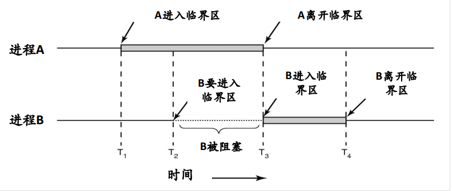

<!-- START doctoc generated TOC please keep comment here to allow auto update -->
<!-- DON'T EDIT THIS SECTION, INSTEAD RE-RUN doctoc TO UPDATE -->
**Table of Contents**  *generated with [DocToc](https://github.com/thlorenz/doctoc)*

- [Sync 同步模块(synchronization)](#sync-%E5%90%8C%E6%AD%A5%E6%A8%A1%E5%9D%97synchronization)
  - [进程间通信（Inter Process Communication, IPC）](#%E8%BF%9B%E7%A8%8B%E9%97%B4%E9%80%9A%E4%BF%A1inter-process-communication-ipc)

<!-- END doctoc generated TOC please keep comment here to allow auto update -->

# Sync 同步模块(synchronization)

sync是synchronization同步这个词的缩写，所以也会叫做同步包

## 进程间通信（Inter Process Communication, IPC）

多个进程（线程）通过共享内存（或者共享文件）的方式进行通信就会出现竞争条件。竞争条件的意思是说两个或者多个进程读写某些共享数据，而最后的结果取决于进程运行的精确时序。
