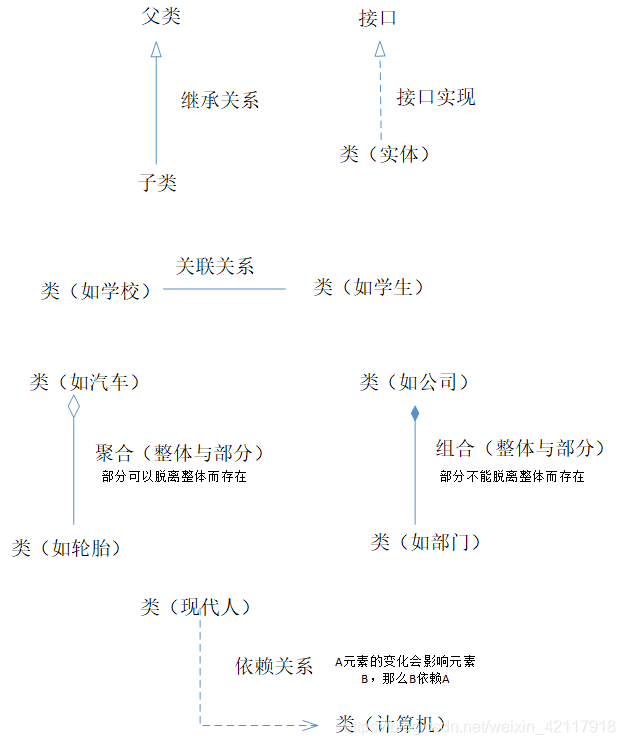
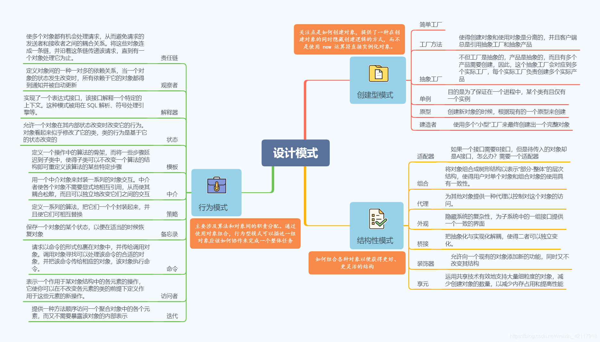

<!-- START doctoc generated TOC please keep comment here to allow auto update -->
<!-- DON'T EDIT THIS SECTION, INSTEAD RE-RUN doctoc TO UPDATE -->
**Table of Contents**  *generated with [DocToc](https://github.com/thlorenz/doctoc)*

- [设计模式](#%E8%AE%BE%E8%AE%A1%E6%A8%A1%E5%BC%8F)
  - [关系](#%E5%85%B3%E7%B3%BB)
  - [OOP 七大原则](#oop-%E4%B8%83%E5%A4%A7%E5%8E%9F%E5%88%99)
  - [历史分类：23种设计模式](#%E5%8E%86%E5%8F%B2%E5%88%86%E7%B1%BB23%E7%A7%8D%E8%AE%BE%E8%AE%A1%E6%A8%A1%E5%BC%8F)
  - [最新分类](#%E6%9C%80%E6%96%B0%E5%88%86%E7%B1%BB)
    - [创建型模式](#%E5%88%9B%E5%BB%BA%E5%9E%8B%E6%A8%A1%E5%BC%8F)
    - [结构模式](#%E7%BB%93%E6%9E%84%E6%A8%A1%E5%BC%8F)
    - [行为模式](#%E8%A1%8C%E4%B8%BA%E6%A8%A1%E5%BC%8F)
    - [同步模式](#%E5%90%8C%E6%AD%A5%E6%A8%A1%E5%BC%8F)
    - [并行模式](#%E5%B9%B6%E8%A1%8C%E6%A8%A1%E5%BC%8F)
    - [消息传递模式](#%E6%B6%88%E6%81%AF%E4%BC%A0%E9%80%92%E6%A8%A1%E5%BC%8F)
    - [稳定模式](#%E7%A8%B3%E5%AE%9A%E6%A8%A1%E5%BC%8F)
    - [剖析模式](#%E5%89%96%E6%9E%90%E6%A8%A1%E5%BC%8F)
    - [成例](#%E6%88%90%E4%BE%8B)
    - [反模式](#%E5%8F%8D%E6%A8%A1%E5%BC%8F)
  - [参考资料](#%E5%8F%82%E8%80%83%E8%B5%84%E6%96%99)

<!-- END doctoc generated TOC please keep comment here to allow auto update -->

# 设计模式
是一套被反复使用、多数人知晓的、经过分类的、代码设计经验的总结

## 关系

## OOP 七大原则
* 开放封闭原则 OCP（Open-Closed Principle）：对扩展开发，对修改关闭
* Liskov替换原则 LSP(Liskov Substitution Principle)：继承必须确保超类拥有的性质在子类中依然成立
* 依赖倒置原则 DIP(Dependency Inversion Principle)：要面向接口b编程，不要面向s实现编程
* 单一职责原则 SRP(Single Responsibility Principle)：控制类的粒度大小，将对象解耦，提高其内聚性
* 接口隔离原则 ISP（Interface Isolation Principle）：要为各个类建立他们需要的专用接口
* 迪米特原则或最少知识原则 LoD(Law Of Demeter or Principle of Least Knowledge)：只与你的直接朋友交谈，不跟“陌生人”交谈
* 合成/聚合复用原则 CARP（Composite/Aggregate Reuse Principle）：尽量先使用组合和聚合等关系来实现，其次再考虑继承关系实现

## 历史分类：23种设计模式

1. 创建型(单例模式、简单工厂模式、工厂方法模式、抽象厂模式、建造者模式、原型模式)
2. 结构型(代理模式、适配器模式、装饰模式、桥接模式、组合模式、享元模式、外观模式)
3. 行为型(观察者模式、模板方法模式、命令模式、状态模式、职责链模式、解释器模式、中介者模式、访问者模式、策略模式、备忘录模式、迭代器模式)

- 单例模式包含饿汉式和懒汉式两种实现
- 工厂模式包含简单工厂、工厂方法、抽象工厂、DI容器
- 代理模式包含静态代理、动态代理（采用 go generate 模拟）
- 观察者模式包含观察者模式、eventbus

## 最新分类

### 创建型模式

- 抽象工厂模式：提供一个接口用于创建相关对象的家族；
- Builder模式：使用简单的对象来构建复杂的对象；
- 工厂方法模式：一个创建产品对象的工厂接口，将实际创建工作推迟到子类当中；
- 对象池模式：实例化并维护一组相同类型的对象实例；
- 单例模式：限制类的实例，保证一个类只有一个实例。

### 结构模式
结构型模式（Structural Pattern）关注如何将现有类或对象组织在一起形成更加强大的结构。

分为两种：

1. 类结构型模式：关心类的组合，由多个类可以组合成一个更大的系统，在类结构型模式中一般只存在继承关系和实现关系；
2. 对象结构型模式：关心类与对象的组合，通过关联关系使得在一个类中定义另一个类的实例对象，然后通过该对象调用其方法，更符合“合成复用原则”。

- 适配器模式：适配另一个不兼容的接口来一起工作；
- 桥接模式：将抽象化(Abstraction)与实现化(Implementation)脱耦，使得二者可以独立地变化；
- 合成模式：将对象组织到树中，用来描述树的关系；
- 装饰模式：给一个静态或动态对象添加行为；
- 门面（Facade）模式：为子系统中的各类（或结构与方法）提供一个简明一致的界面，隐藏子系统的复杂性，使子系统更加容易使用；
- Flyweight模式：运用共享技术有效地支持大量细粒度的对象；
- MVC模式：是模型(model)－视图(view)－控制器(controller)的缩写，将一个应用程序划分成三个相互关联的部分，用一种业务逻辑、数据、界面显示分离的方法组织代码，将业务逻辑聚集到一个部件里，在改进和个性化定制界面及用户交互的同时，不需要重新编写业务逻辑。
- 代理模式：为其他对象提供一种代理以控制对这个对象的访问。

### 行为模式
- 责任链模式：使多个对象都有机会处理请求，从而避免请求的发送者和接收者之间的耦合关系；
- 命令模式：就是客户端发布一个命令（也就是“请求”），而这个命令已经被封装成一个对象。即这个命令对象的内部可能已经指定了该命令具体由谁负责执行；
- 中介（Mediator）模式：用一个中介对象来封装一系列关于对象交互行为；
- 观察者模式：对象间的一种一对多的依赖关系，以便一个对象的状态发生变化时，所有依赖于它的对象都得到通知并自动刷新；
- 注册（Registry）模式：跟踪给定类的所有子类；
- 状态模式：基于一个对象的内部状态，给相同对象提供多种行为；
- 策略模式：定义一系列算法，并将每一个算法封装起来，而且使它们可以相互替换；
- 模板（Template）模式：定义一个操作中算法的框架，而将一些步骤延迟到子类中。模板方法模式使得子类可以不改变一个算法的结构即可重定义该算法的某些特定步骤；
- 访问者模式：表示一个作用于某对象结构中的各元素的操作，它使开发者可以在不改变各元素类的前提下定义作用于这些元素的新操作。

### 同步模式
- 条件变量：利用线程间共享的全局变量进行同步的一种机制，主要包括两个动作：一个线程等待”条件变量的条件成立”而挂起；另一个线程使”条件成立”（给出条件成立信号）；
- Lock/Mutex：执行互斥限制资源获得独占访问；
- 监视器模式：互斥锁和条件变量的组合模式；
- 读写锁定模式：它把对共享资源的访问者划分成读者和写者，读者只对共享资源进行读访问，写者则需要对共享资源进行写操作；
- Semaphore：负责协调各个线程，以保证它们能够正确、合理地使用公共资源。

### 并行模式
- [Bounded Parallelism](https://github.com/tmrts/go-patterns/blob/master/concurrency/bounded_parallelism.go)：完成大量资源限制的独立任务
- 广播（Broadcast）：把一个消息同时传输到所有接收端；
- 协同（Coroutines）：允许在特定地方暂停和继续执行的子程序；
- 生成器：一次性生成一系列值；
- Reactor模式：在事件驱动的应用中，将一个或多个客户的服务请求分离（demultiplex）和调度（dispatch）给应用程序。同步、有序地处理同时接收的多个服务请求。
- 并行（Parallelism）：完成大量的独立任务；
- 生产者消费者：从任务执行中分离任务；
- 调度器（Scheduler）：协调任务步骤。
	
### 消息传递模式
- 扇入（Fan-In）：该模块直接调用上级模块的个数，像漏斗型一样去工作；
- 扇出（Fan-Out）：该模块直接调用的下级模块的个数；
- Futures & Promises：扮演一个占位角色，对未知的结果用于同步；
- Publish/Subscribe：将信息传递给订阅者；
- Push & Pull：把一个管道上的消息分发给多人。

### 稳定模式
- Bulkheads：实施故障遏制原则，例如防止级联故障；
- 断路器（Circuit-Breaker）模式：当请求有可能失败时，停止流动的请求；
- 截止日期（Deadline）：一旦响应变缓，允许客户端停止一个正在等待的响应；
- Fail-Fast机制：集合的一种错误检测机制。当多个线程对集合进行结构上的改变操作时，有可能会产生fail-fast机制；
- Handshaking：如果一个组件的不能访问请求被拒绝，询问是否还能承担更多负载；
- 稳定状态（Steady-State）：为每一个服务积累一个资源，其它服务必须回收这些资源；

### 剖析模式
- [Timing Functions](https://github.com/tmrts/go-patterns/blob/master/profiling/timing.md)：包装和执行日志的函数；
	
### 成例
- Functional Options：允许给默认值创建clean API和惯用重载；
	
### 反模式
- 级联故障：一个系统的某部分出现错误，与之有关的上下级也随之出现故障，导致多米诺效应。

## 参考资料

1. https://github.com/mohuishou/go-design-pattern
2. https://github.com/tmrts/go-patterns
3. https://github.com/hitzhangjie/go-patterns

