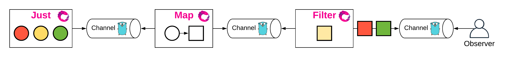

<!-- START doctoc generated TOC please keep comment here to allow auto update -->
<!-- DON'T EDIT THIS SECTION, INSTEAD RE-RUN doctoc TO UPDATE -->
**Table of Contents**  *generated with [DocToc](https://github.com/thlorenz/doctoc)*

- [RXGo](#rxgo)
  - [参考资料](#%E5%8F%82%E8%80%83%E8%B5%84%E6%96%99)

<!-- END doctoc generated TOC please keep comment here to allow auto update -->

# RXGo

- 首先使用Just创建一个仅有若干固定数据的 Observable；
- 使用Map()方法执行转换（将圆形转为方形）；
- 使用Filter()方法执行过滤（过滤掉黄色的方形）

## 参考资料
1. [每日一库rxgo](https://darjun.github.io/2020/10/11/godailylib/rxgo/)
2. 