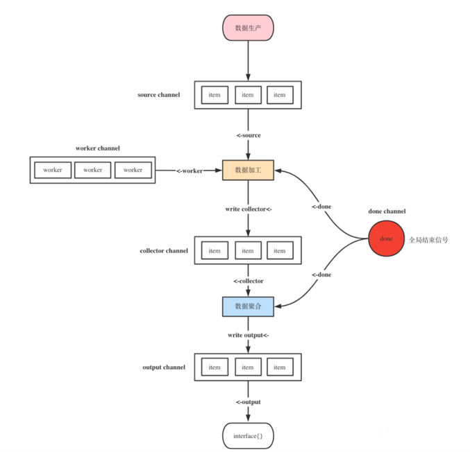

# 映射Map、归约reduce与过滤filter

## 背景
> I wanted to see how hard it was to implement this sort of thing in Go, with as nice an API as I could manage. It wasn't hard.
> Having written it a couple of years ago, I haven't had occasion to use it once. Instead, I just use "for" loops.
> You shouldn't use it either.

其实，在全世界范围内，有大量的程序员都在问Go语言官方什么时候在标准库中支持 Map/Reduce，Rob Pike说，这种东西难写吗？
还要我们官方来帮你们写么？
这种代码我多少年前就写过了，但是，我从来一次都没有用过，我还是喜欢用“For循环”，我觉得你最好也跟我一起用 “For循环”

可参考  [Rob Pike 的版本](https://github.com/robpike/filter) 

## 介绍
- Map 是一对一的场景，是循环中对数据加工处理
- Reduce 是多对一，是数据聚合处理
- Filter是过滤的处理，是数据有效性

## 场景
- 统计消费总额 - Reduce
- 统计用户A - Filter
- 统计本月 - Filter
- 费用转化为美金 - Map

1. 调用第三方接口的时候， 一个需求你需要调用不同的接口，做数据组装。
2. 一个应用首页可能依托于很多服务。那就涉及到在加载页面时需要同时请求多个服务的接口。这一步往往是由后端统一调用组装数据再返回给前端，也就是所谓的 BFF(Backend For Frontend) 层。

   

## 参考资料

1. [Go-zero官网推荐链接](https://go-zero.dev/cn/mapreduce.html) 

