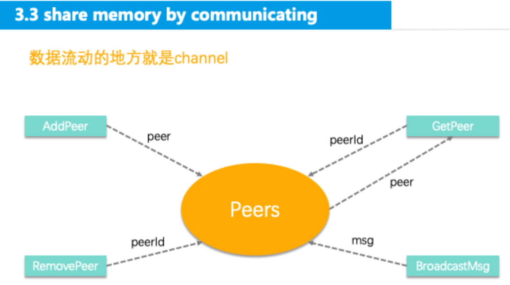

# 问题描述

区块链是构建在P2P网络之上，在P2P网络中：

1. 一个节点即可以是服务器也可以是客户端，被称为Host，
2. 和本节点连接的所有节点都被称为Peer。

## 需求：
具体的场景是：Host需要保存所有建立连接的Peer，并对这些Peer进行维护：增加和删除Peer，并且提供Peer的查询和向所有Peer广播消息的接口

## 实现

Host有4个方法，分别是：

1. AddPeer: 增加1个Peer。
2. RemovePeer: 删除1个Peer。
3. GetPeer: 通过Peer.ID查询1个Peer。
4. BroadcastMsg: 向所有Peer发送消息。

### 1. 通过内存进行交流
使用锁共享数据

### 2. 通过交流分享内存

把数据流动画出来，并把要流动的数据标上，然后那些数据流动的线条，就是channel，线条上的数据就是channel要传递的数据，图中也把这些线条和数据标上了.

GetPeer是双向的:
有很多goroutine调用GetPeer，我们需要向每一个goroutine发送结果，这就需要每一个goroutine都需要对应的1个接收结果的channel。

### 3. 通过channel中的函数进行交流

### 总结：
版本一：使用锁共享数据，
版本二：使用channel传输数据，没办法实现GetPeer
版本三：使用channel传输函数,不能对Peer进行同时读，不容易做单元测试

这3种方式本身并无优劣之分，具体要用那种实现，要依赖自身的实际场景进行取舍