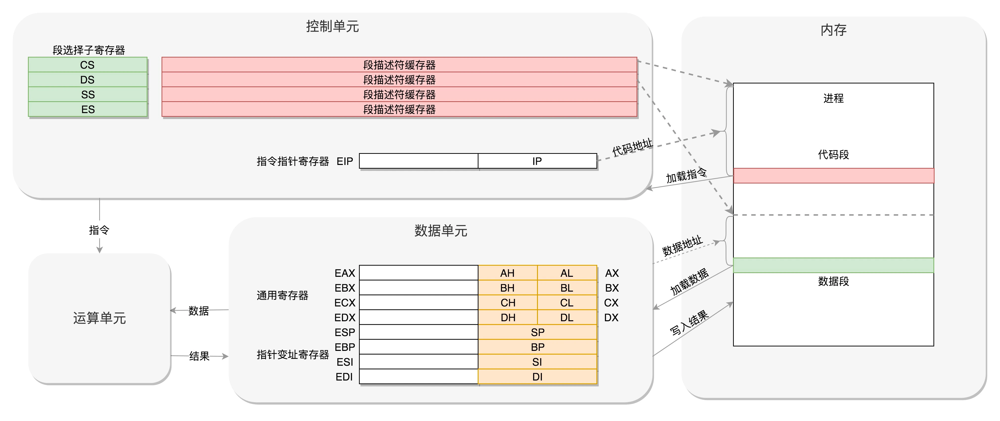
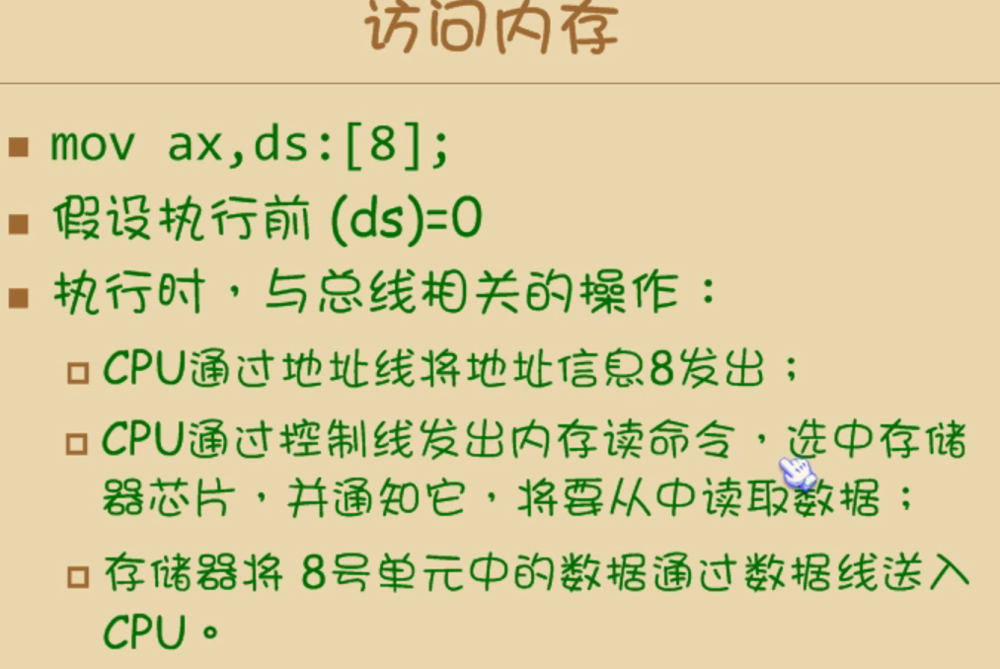
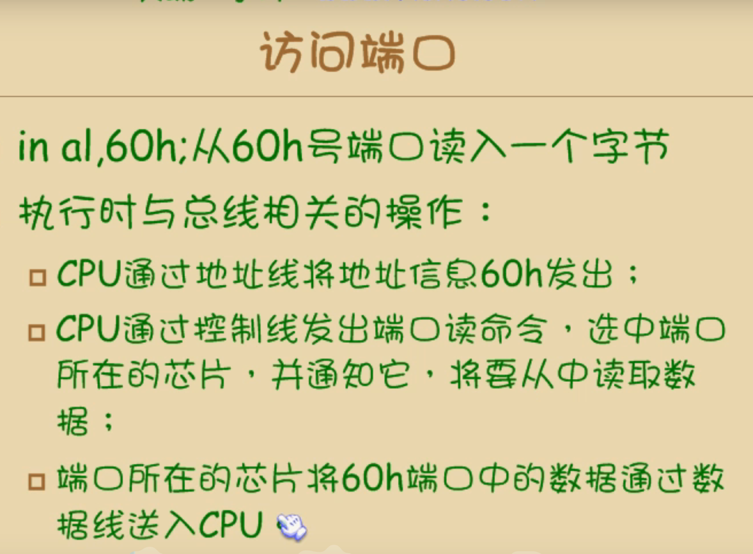
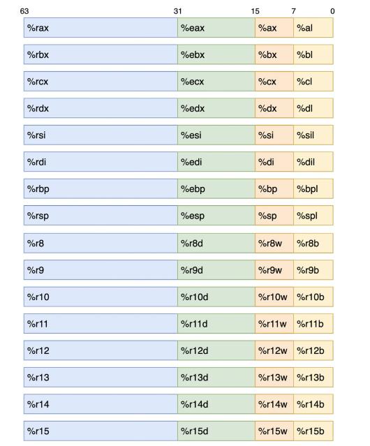

<!-- START doctoc generated TOC please keep comment here to allow auto update -->
<!-- DON'T EDIT THIS SECTION, INSTEAD RE-RUN doctoc TO UPDATE -->
**Table of Contents**  *generated with [DocToc](https://github.com/thlorenz/doctoc)*

- [汇编](#%E6%B1%87%E7%BC%96)
  - [为什么需要汇编](#%E4%B8%BA%E4%BB%80%E4%B9%88%E9%9C%80%E8%A6%81%E6%B1%87%E7%BC%96)
  - [汇编器,链接器,调试器,编译器](#%E6%B1%87%E7%BC%96%E5%99%A8%E9%93%BE%E6%8E%A5%E5%99%A8%E8%B0%83%E8%AF%95%E5%99%A8%E7%BC%96%E8%AF%91%E5%99%A8)
  - [汇编语言与机器语言有什么关系:](#%E6%B1%87%E7%BC%96%E8%AF%AD%E8%A8%80%E4%B8%8E%E6%9C%BA%E5%99%A8%E8%AF%AD%E8%A8%80%E6%9C%89%E4%BB%80%E4%B9%88%E5%85%B3%E7%B3%BB)
  - [汇编语言优缺点](#%E6%B1%87%E7%BC%96%E8%AF%AD%E8%A8%80%E4%BC%98%E7%BC%BA%E7%82%B9)
    - [优点](#%E4%BC%98%E7%82%B9)
    - [缺点](#%E7%BC%BA%E7%82%B9)
  - [语言组成](#%E8%AF%AD%E8%A8%80%E7%BB%84%E6%88%90)
  - [cpu可以直接读取数据的地方](#cpu%E5%8F%AF%E4%BB%A5%E7%9B%B4%E6%8E%A5%E8%AF%BB%E5%8F%96%E6%95%B0%E6%8D%AE%E7%9A%84%E5%9C%B0%E6%96%B9)
  - [cpu对存储器(内存)的读写操作过程](#cpu%E5%AF%B9%E5%AD%98%E5%82%A8%E5%99%A8%E5%86%85%E5%AD%98%E7%9A%84%E8%AF%BB%E5%86%99%E6%93%8D%E4%BD%9C%E8%BF%87%E7%A8%8B)
    - [1. 数据总线:宽度决定与外界的数据传输速度](#1-%E6%95%B0%E6%8D%AE%E6%80%BB%E7%BA%BF%E5%AE%BD%E5%BA%A6%E5%86%B3%E5%AE%9A%E4%B8%8E%E5%A4%96%E7%95%8C%E7%9A%84%E6%95%B0%E6%8D%AE%E4%BC%A0%E8%BE%93%E9%80%9F%E5%BA%A6)
    - [2. 控制总线：读和写](#2-%E6%8E%A7%E5%88%B6%E6%80%BB%E7%BA%BF%E8%AF%BB%E5%92%8C%E5%86%99)
    - [3. 数据总线](#3-%E6%95%B0%E6%8D%AE%E6%80%BB%E7%BA%BF)
  - [存储器](#%E5%AD%98%E5%82%A8%E5%99%A8)
  - [指令集中的寄存器](#%E6%8C%87%E4%BB%A4%E9%9B%86%E4%B8%AD%E7%9A%84%E5%AF%84%E5%AD%98%E5%99%A8)
    - [寄存器位数区分](#%E5%AF%84%E5%AD%98%E5%99%A8%E4%BD%8D%E6%95%B0%E5%8C%BA%E5%88%86)
    - [应用层代码一般只会用到如下分为三类的19个寄存器](#%E5%BA%94%E7%94%A8%E5%B1%82%E4%BB%A3%E7%A0%81%E4%B8%80%E8%88%AC%E5%8F%AA%E4%BC%9A%E7%94%A8%E5%88%B0%E5%A6%82%E4%B8%8B%E5%88%86%E4%B8%BA%E4%B8%89%E7%B1%BB%E7%9A%8419%E4%B8%AA%E5%AF%84%E5%AD%98%E5%99%A8)
  - [汇编指令格式](#%E6%B1%87%E7%BC%96%E6%8C%87%E4%BB%A4%E6%A0%BC%E5%BC%8F)
  - [常用指令详解](#%E5%B8%B8%E7%94%A8%E6%8C%87%E4%BB%A4%E8%AF%A6%E8%A7%A3)
    - [mov指令-传送指令](#mov%E6%8C%87%E4%BB%A4-%E4%BC%A0%E9%80%81%E6%8C%87%E4%BB%A4)
    - [add/sub指令](#addsub%E6%8C%87%E4%BB%A4)
    - [call/ret指令](#callret%E6%8C%87%E4%BB%A4)
    - [cmp指令：影响标志寄存器](#cmp%E6%8C%87%E4%BB%A4%E5%BD%B1%E5%93%8D%E6%A0%87%E5%BF%97%E5%AF%84%E5%AD%98%E5%99%A8)
      - [标志位flag](#%E6%A0%87%E5%BF%97%E4%BD%8Dflag)
    - [jmp/je/jle/jg/jge等等j开头的指令--转移指令，例如可以修改8086cpu的cs段寄存器，ip指令寄存器](#jmpjejlejgjge%E7%AD%89%E7%AD%89j%E5%BC%80%E5%A4%B4%E7%9A%84%E6%8C%87%E4%BB%A4--%E8%BD%AC%E7%A7%BB%E6%8C%87%E4%BB%A4%E4%BE%8B%E5%A6%82%E5%8F%AF%E4%BB%A5%E4%BF%AE%E6%94%B98086cpu%E7%9A%84cs%E6%AE%B5%E5%AF%84%E5%AD%98%E5%99%A8ip%E6%8C%87%E4%BB%A4%E5%AF%84%E5%AD%98%E5%99%A8)
    - [push/pop指令-可以直接操作段寄存器](#pushpop%E6%8C%87%E4%BB%A4-%E5%8F%AF%E4%BB%A5%E7%9B%B4%E6%8E%A5%E6%93%8D%E4%BD%9C%E6%AE%B5%E5%AF%84%E5%AD%98%E5%99%A8)
    - [leave指令](#leave%E6%8C%87%E4%BB%A4)
    - [loop指令](#loop%E6%8C%87%E4%BB%A4)
    - [loop指令](#loop%E6%8C%87%E4%BB%A4-1)
    - [shl和shr逻辑移位指令](#shl%E5%92%8Cshr%E9%80%BB%E8%BE%91%E7%A7%BB%E4%BD%8D%E6%8C%87%E4%BB%A4)
  - [定位方式](#%E5%AE%9A%E4%BD%8D%E6%96%B9%E5%BC%8F)
  - [案例:c语言中](#%E6%A1%88%E4%BE%8Bc%E8%AF%AD%E8%A8%80%E4%B8%AD)
    - [和系统打交道](#%E5%92%8C%E7%B3%BB%E7%BB%9F%E6%89%93%E4%BA%A4%E9%81%93)
  - [案例:go语言编写](#%E6%A1%88%E4%BE%8Bgo%E8%AF%AD%E8%A8%80%E7%BC%96%E5%86%99)
  - [中断](#%E4%B8%AD%E6%96%AD)
    - [内中断过程](#%E5%86%85%E4%B8%AD%E6%96%AD%E8%BF%87%E7%A8%8B)
    - [外中断](#%E5%A4%96%E4%B8%AD%E6%96%AD)
      - [可屏蔽](#%E5%8F%AF%E5%B1%8F%E8%94%BD)
      - [不可屏蔽](#%E4%B8%8D%E5%8F%AF%E5%B1%8F%E8%94%BD)
  - [标号](#%E6%A0%87%E5%8F%B7)

<!-- END doctoc generated TOC please keep comment here to allow auto update -->

# 汇编


汇编语言（assembly language):用于电子计算机、微处理器、微控制器或其他可编程器件的低级语言，亦称为符号语言

1. 助记符（Mnemonics）代替机器指令的操作码
2. 用地址符号（Symbol）或标号（Label）代替指令或操作数的地址

## 为什么需要汇编

在计算机的世界里，只有 2 种类型。那就是：0 和 1。

计算机工作是由一系列的机器指令进行驱动的，这些指令又是一组二进制数字，其对应计算机的高低电平。而这些机器指令的集合就是机器语言，这些机器语言在最底层是与硬件一一对应的。

这样的机器指令有一个致命的缺点：可阅读性太差。

汇编语言更像一种助记符，这些人们容易记住的每一条助记符都映射着一条不容易记住的由 0、1 组成的机器指令

## 汇编器,链接器,调试器,编译器

一个现代编译器的主要工作流程：
```css
源代码 (source code) → 预处理器(preprocessor) → 编译器 (compiler) → 目标代码 (object code) → 链接器 (Linker) → 可执行程序(executables)

```  

- 汇编器（assembler）是一种工具程序，用于将汇编语言源程序转换为机器语言
  1. windows: Microsoft 宏汇编器（称为 MASM）,TASM（Turbo 汇编器），NASM（Netwide 汇编器）和 MASM32（MASM 的一种变体）
  2. linux: GAS（GNU 汇编器）和 NASM,NASM 的语法与 MASM 的最相似
- 链接器（linker）:将目标文件、共享库、系统启动代码链接到一起构建可执行程序
- 调试器（debugger）:使程序员可以在程序运行时，单步执行程序并检查寄存器和内存状态。跟踪正在运行的进程或者装载一个core文件，加载程序或core文件调试符号信息，探查、修改、控制进程运行时状态，如暂停执行并查看内存、寄存器
- 编译器(Compiler)：编译源代码为目标文件.编译器就是将“一种语言（通常为高级语言）”翻译为“另一种语言（通常为低级语言）”的程序。
- DWARF: 是一种调试信息标准，指导编译器将调试信息生成到目标文件中，指导链接器合并存储在多个目标文件中的调试信息，调试器将加载此调试信息。简言之，DWARF用来协调编译器、链接器和调试器之间的工作


## 汇编语言与机器语言有什么关系:

- 机器语言（machine language）是一种数字语言， 专门设计成能被计算机处理器（CPU）理解。所有 x86 处理器都理解共同的机器语言。
- 汇编语言（assembly language）包含用短助记符如 ADD、MOV、SUB 和 CALL 书写的语句。汇编语言与机器语言是一对一（one-to-one）的关系：
    每一条汇编语言指令对应一条机器语言指令。寄存器（register）是 CPU 中被命名的存储位置，用于保存操作的中间结果。


## 汇编语言优缺点
### 优点
    
1. 因为用汇编语言设计的程序最终被转换成机器指令，故能够保持机器语言的一致性，直接、简捷，并能像机器指令一样访问、控制计算机的各种硬件设备，
如磁盘、存储器、CPU、I/O端口等。使用汇编语言，可以访问所有能够被访问的软、硬件资源。

2. 目标代码简短，占用内存少，执行速度快，是高效的程序设计语言，经常与高级语言配合使用，以改善程序的执行速度和效率，弥补高级语言在硬件控制方面的不足，应用十分广泛


### 缺点
    
1. 汇编语言是面向机器的，处于整个计算机语言层次结构的底层，故被视为一种低级语言，通常是为特定的计算机或系列计算机专门设计的。
不同的处理器有不同的汇编语言语法和编译器，编译的程序无法在不同的处理器上执行，缺乏可移植性；
2. 难于从汇编语言代码上理解程序设计意图，可维护性差，即使是完成简单的工作也需要大量的汇编语言代码，很容易产生bug，难于调试；
3. 使用汇编语言必须对某种处理器非常了解，而且只能针对特定的体系结构和处理器进行优化，开发效率很低，周期长且单调。

## 语言组成
    
1. 数据传送指令:通用数据传送指令MOV、条件传送指令CMOVcc、堆栈操作指令PUSH/PUSHA/PUSHAD/POP/POPA/POPAD、
交换指令XCHG/XLAT/BSWAP、地址或段描述符选择子传送指令LEA/LDS/LES/LFS/LGS/LSS等

2. 整数和逻辑运算指令:加法指令ADD/ADC、减法指令SUB/SBB、加一指令INC、减一指令DEC、比较操作指令CMP、
乘法指令MUL/IMUL、除法指令DIV/IDIV、符号扩展指令CBW/CWDE/CDQE、十进制调整指令DAA/DAS/AAA/AAS、逻辑运算指令NOT/AND/OR/XOR/TEST等。

3. 移位指令:将寄存器或内存操作数移动指定的次数。包括逻辑左移指令SHL、逻辑右移指令SHR、算术左移指令SAL、算术右移指令SAR、循环左移指令ROL、循环右移指令ROR等

4. 位操作指令:位测试指令BT、位测试并置位指令BTS、位测试并复位指令BTR、位测试并取反指令BTC、位向前扫描指令BSF、位向后扫描指令BSR等

5. 条件设置指令: 这不是一条具体的指令，而是一个指令簇，包括大约30条指令，用于根据EFLAGS寄存器的某些位状态来设置一个8位的寄存器或者内存操作数。
比如SETE/SETNE/SETGE等等

6. 控制转移指令:这部分包括无条件转移指令JMP、条件转移指令Jcc/JCXZ、循环指令LOOP/LOOPE/LOOPNE、过程调用指令CALL、子过程返回指令RET、
中断指令INTn、INT3、INTO、IRET等。注意，Jcc是一个指令簇，包含了很多指令，用于根据EFLAGS寄存器的某些位状态来决定是否转移；
INT n是软中断指令，n可以是0到255之间的数，用于指示中断向量号。

7. 串操作指令:这部分指令用于对数据串进行操作，包括串传送指令MOVS、串比较指令CMPS、串扫描指令SCANS、串加载指令LODS、串保存指令STOS，
这些指令可以有选择地使用REP/REPE/REPZ/REPNE和REPNZ的前缀以连续操作


si:源寄存器  di:目标寄存器
movsb -> move string byte(以字节单元传送): 将ds:si指向的内存单元中的字节 送入 es:di中，然后根据标志寄存器DF位的值，将si和di递增1或则递减1。
movsw -> move string word(以字单元传送): 将ds:si指向的内存单元中的字节 送入 es:di中，然后根据标志寄存器DF位的值，将si和di递增2或则递减2。
一般和rep搭配，如rep movsb，rep的作用是根据cx的值，重复执行后面的 串操作指令。

8. 输入输出指令: 这部分指令用于同外围设备交换数据，包括端口输入指令IN/INS、端口输出指令OUT/OUTS

## cpu可以直接读取数据的地方
- RAM(Random-Access Memory随机存取存储器 )即运行内存
- ROM(Read-Only Memory 只读存储器 )即只读内存都是来存储东西
  
比如我们熟悉的CPU缓存，电脑手机的内存就属于RAM，而固态硬盘，u盘还有手机时所说的32G.64G的存储空间就属于ROM

我们RAM之所以断电后会数据丢失，是因为RAM是通过电容存储的电荷，来保存数据的。那么RAM又分为动态和静态的。电脑内存就是动态RAM。像CPU的缓存就属于静态RAM，静态RAM的好处是速度块不用像动态RAM一样不用给电容充电来维持数据


1. cpu 内部寄存器
2. 内存单元

3. 硬件端口


## cpu对存储器(内存)的读写操作过程

   
地址总线：64位cpu，代表查找能力

### 1. 数据总线:宽度决定与外界的数据传输速度


### 2. 控制总线：读和写


### 3. 数据总线


## 存储器
  
- 从读写属性上分：随机存储器(ram)和只读存储器(rom).
- 功能上分：bios(BASIC INPUT/OUTPUT SYSTEM)基本输入输出系统上的rom.

## 指令集中的寄存器
寄存器是中央处理器内的组成部分。寄存器是有限存贮容量的高速存贮部件，它们可用来暂存指令、数据和地址。

CPU 本身只负责运算，不负责储存数据。数据一般都储存在内存之中，CPU 要用的时候就去内存读写数据。但是，CPU的运算速度远高于内存的读写速度，
为了避免被拖慢，CPU 都自带一级缓存和二级缓存。基本上，CPU 缓存可以看作是读写速度较快的内存。

但是，CPU 缓存还是不够快，另外数据在缓存里面的地址是不固定的，CPU 每次读写都要寻址也会拖慢速度。
因此，除了缓存之外，CPU 还自带了寄存器（register），用来储存最常用的数据。也就是说，那些最频繁读写的数据（比如循环变量），都会放在寄存器里面，
CPU 优先读写寄存器，再由寄存器跟内存交换数据.

通常来说，寄存器可以使用 SRAM 来实现。SRAM 是一种高速随机访问存储器，它将每个位的数据存放在一个对应的“双稳态”存储器中，从而保持较强的抗干扰能力和较快的数据访问速度。在整个计算机体系架构中，寄存器拥有最快的数据访问速度和最低的延迟。


### 寄存器位数区分

```
ah/al => 8 位
ax/bx => 16 位
eax/ebx => 32 位
rax/rbx => 64 位，8 byte

rax : 0x0000000000000000

```

### 应用层代码一般只会用到如下分为三类的19个寄存器

们在汇编代码中使用的寄存器（比如之前提到的 ebx）可能并不与 CPU 上的物理寄存器完全一一对应，CPU 会使用额外的方式来保证它们之间的动态对应关系。
这些参与到程序运行过程的寄存器，一般可以分为：通用目的寄存器、状态寄存器、系统寄存器，以及用于支持浮点数计算和 SIMD 的 AVX、SSE 寄存器等。


1. 通用寄存器：rax, rbx, rcx, rdx, rsi, rdi, rbp, rsp, r8, r9, r10, r11, r12, r13, r14, r15寄存器。
```go
// /Users/python/go/go1.18/src/syscall/ztypes_linux_amd64.go
type PtraceRegs struct {
	R15      uint64
	R14      uint64
	R13      uint64
	R12      uint64
	Rbp      uint64
	Rbx      uint64
	R11      uint64
	R10      uint64
	R9       uint64
	R8       uint64
	Rax      uint64
	Rcx      uint64
	Rdx      uint64
	Rsi      uint64
	Rdi      uint64
	Orig_rax uint64
	Rip      uint64
	Cs       uint64
	Eflags   uint64
	Rsp      uint64
	Ss       uint64
	Fs_base  uint64
	Gs_base  uint64
	Ds       uint64
	Es       uint64
	Fs       uint64
	Gs       uint64
}
```

通用目的寄存器一般用于存放程序运行过程中产生的临时数据，这些寄存器在大多数情况下都可以被当作普通寄存器使用。
而在某些特殊情况下，它们可能会被用于存放指令计算结果、系统调用号，以及与栈帧相关的内存地址等信息

在 x86-64 架构下，CPU 指令集架构（ISA）中一共定义了 16 个通用目的寄存器。
这里我们提到的“指令字”与之前介绍的用于描述 CPU 硬件特征的“硬件字”有所不同（指令字与硬件字这两个叫法只是我用来区分这两种字概念的）。
由于历史原因，在现代 x86 系列 CPU 的指令集文档中，你可能会看到对 WORD 一词的使用。
虽然这个单词可以被翻译为“字”，但在这样的环境下，它实则代表着固定 16 位的长度。

还需注意的一点是：我们可以通过不同的寄存器别名来读写同一寄存器不同位置上的数据。当某个指令需要重写寄存器的低 16 位或低 8 位数据时，寄存器中其他位上的数据不会被修改。
而当指令需要重写寄存器低 32 位的数据时，高 32 位的数据会被同时复位，即置零.

```c
#include <stdio.h>

int main(void) {
  // 将值 0x100000000 放入寄存器 rax 中
  register long num asm("rax") = 0x100000000;
  // 将值 0x1 通过 movl 移动到 rax 寄存器的低 32 位
  asm("movl $0x1, %eax");
  // 将值 0x1 通过 movw 移动到 rax 寄存器的低 16 位
  // asm("movw $0x1, %ax");
  printf("%ld\n", num);
  return 0;
}
```


- rsp 栈顶寄存器和rbp栈基址寄存器:   
这两个寄存器都跟函数调用栈有关，其中rsp寄存器一般用来存放函数调用栈的栈顶地址，而rbp寄存器通常用来存放函数的栈帧起始地址，
编译器一般使用这两个寄存器加一定偏移的方式来访问函数局部变量或函数参数，比如
```shell
mov    0x8(%rsp),%rdx
```
这条指令把地址为 0x8(%rsp) 的内存中的值拷贝到rdx寄存器，这里的0x8(%rsp) 就利用了 rsp 寄存器加偏移 8 的方式来读取内存中的值.

2. 程序计数寄存器(PC寄存器，有时也叫IP寄存器,rip寄存器): 它用来存放下一条即将执行的指令的地址，这个寄存器决定了程序的执行流程.表示当前我的代码运行到哪里了.

rip寄存器里面存放的是CPU即将执行的下一条指令在内存中的地址。看如下汇编语言代码片段：
```shell
0x0000000000400770: add   %rdx,%rax
0x0000000000400773: mov   $0x0,%ecx
```

假设当前CPU正在执行第一条指令，这条指令在内存中的地址是0x0000000000400770，紧接它后面的下一条指令的地址是0x0000000000400773，所以此时rip寄存器里面存放的值是0x0000000000400773。
这里需要牢记的就是rip寄存器的值不是正在被CPU执行的指令在内存中的地址，而是紧挨这条正在被执行的指令后面那一条指令的地址.

在前面的两个汇编指令片段中并没有指令修改 rip寄存器的值，是怎么做到让它一直指向下一条即将执行的指令的呢？其实修改rip寄存器的值是CPU自动控制的，不需要我们用指令去修改，
当然CPU也提供了几条可以间接修改rip寄存器的指令.

3. 段寄存器：
- cs代码段寄存器（Code Segment Register）:	存放当前正在运行的程序代码所在段的段基址，表示当前使用的指令代码可以从该段寄存器指定的存储器段中取得，相应的偏移量则由IP提供。通过它可以找到代码在内存中的位置.
- ds数据段寄存器： 当前程序使用的数据所存放段的最低地址，即存放数据段的段基址.通过它可以找到数据在内存中的位置。
- ss是堆栈段寄存器（Stack Register）： 当前堆栈的底部地址，即存放堆栈段的段基址
- es是扩展段寄存器： 当前程序使用附加数据段的段基址，该段是串操作指令中目的串所在的段
- fs标志段寄存器: fs是80386起增加的两个辅助段寄存器之一,在这之前只有一个辅助段寄存器ES,FS寄存器指向当前活动线程的TEB结构（线程结构)
- gs全局段寄存器。

如果运算中需要加载内存中的数据，需要通过 DS 找到内存中的数据，加载到通用寄存器中，应该如何加载呢？对于一个段，有一个起始的地址，而段内的具体位置，我们称为偏移量（Offset）。例如 8 号会议室的第三排，8 号会议室就是起始地址，第三排就是偏移量。

在 CS 和 DS 中都存放着一个段的起始地址。代码段的偏移量在 IP 寄存器中，数据段的偏移量会放在通用寄存器中


fs,gs 一般用它来实现线程本地存储（TLS），比如AMD64 linux平台下go语言和pthread都使用fs寄存器来实现系统线程的TLS
```css
偏移  说明
000  指向SEH链指针
004  线程堆栈顶部
008  线程堆栈底部
00C  SubSystemTib
010  FiberData
014  ArbitraryUserPointer
018  FS段寄存器在内存中的镜像地址
020  进程PID
024  线程ID
02C  指向线程局部存储指针
030  PEB结构地址（进程结构）
034  上个错误号
```
上述这些寄存器除了fs和gs段寄存器是16位的，其它都是64位的，也就是8个字节，其中的16个通用寄存器还可以作为32/16/8位寄存器使用，
只是使用时需要换一个名字，比如可以用eax这个名字来表示一个32位的寄存器，它使用的是rax寄存器的低32位

Note:标志寄存器如 eflags:记录各种运算结果(是否为 0，是否发生溢出)的标志位。


## 汇编指令格式   
AT&T格式说明:


1. 立即操作数需要加上$符号做前缀，如  "mov $0x1 %rdi" 这条指令中第一个操作数不是寄存器，也不是内存地址，而是直接写在指令中的一个常数，
这种操作数叫做立即操作数。这条指令表示把数值0x1放入rdi寄存器中

2. 寄存器间接寻址的格式为 offset(%register)，如果offset为0，则可以略去偏移不写直接写成(%register)。何为间接寻址呢？

其实就是指指令中的寄存器并不是真正的源操作数或目的操作数，寄存器的值是一个内存地址，这个地址对应的内存才是真正的源或目的操作数，比如 mov %rax, (%rsp)这条指令，
第二个操作数(%rsp)中的寄存器的名字用括号括起来了，表示间接寻址，rsp的值是一个内存地址，这条指令的真实意图是把rax寄存器中的值赋值给rsp寄存器的值（内存地址）对应的内存，
rsp寄存器本身的值不会被修改，

作为比较，我们看一下 mov%rax, %rsp 这条指令 ，这里第二个操作数仅仅少了个括号，变成了直接寻址，意思完全不一样了，
这条指令的意思是把rax的值赋给rsp，这样rsp寄存器的值被修改为跟rax寄存器一样的值了。上面面的2张图展示了这两种寻址方式的不同

3. 与内存相关的一些指令的操作码会加上b, w, l和q字母分别表示操作的内存是1，2，4还是8个字节，比如指令 movl $0x0,-0x8(%rbp) ，
这条指令操作码movl的后缀字母l说明我们要把从-0x8(%rbp) 这个地址开始的4个内存单元赋值为0。可能有读者会问，那如果我要操作3个，或5个内存单元呢？
很遗憾的是cpu没有提供相应的单条指令，我们只能通过多条指令组合起来达到目的

主要专注于AMD64 Linux平台下的go调度器，因此下面我们只介绍该平台下所使用的AT&T格式的汇编指令，AT&T汇编指令的基本格式为：
```shell
操作码  [操作数]
MOV r/m, r
MOV r, r/m
MOV r/m, imm
```
r 表示 register，即寄存器；m 表示 memory，即内存中的某个具体位置；imm 表示 immediate，即直接书写在指令中的立即数

```shell
add   %rdx,%rax  
```
可以看到每一条汇编指令通常都由两部分组成：
    
- 操作码：操作码指示CPU执行什么操作，比如是执行加法，减法还是读写内存。每条指令都必须要有操作码。

- 操作数：操作数是操作的对象，比如加法操作需要两个加数，这两个加数就是这条指令的操作数。操作数的个数一般是0个，1个或2个。

AT&T格式的汇编指令中，寄存器名需要加%作为前缀.
这条指令的操作码是add，表示执行加法操作，它有两个操作数，rdx和rax。
如果一条指令有两个操作数，那么第一个操作数叫做源操作数，第二个操作数叫做目的操作数，

    顾名思义，目的操作数表示这条指令执行完后结果应该保存的地方。所以上面这条指令表示对rax和rdx寄存器里面的值求和，并把结果保存在rax寄存器中。
    其实这条指令的第二个操作数rax寄存器既是源操作数也是目的操作数，因为rax既是加法操作的两个加数之一，又得存放加法操作的结果。
    这条指令执行完后rax寄存器的值发生了改变，指令执行前的值被覆盖而丢失了，如果rax寄存器之前的值还有用，那么就得先用指令把它保存到其它寄存器或内存之中

```shell
mov ebx,1
```


将立即数 1 存放到寄存器 ebx 中（右侧参数为数据来源 src，左侧参数为移动的目的地 dest）。需要注意的是，在 x86 指令集中，受限于 CPU 实现的复杂度，不存在可以将两个内存地址同时作为 src 和 dest 参数的指令


再来看一个只有一个操作数的例子
```shell
callq  0x400526 
#这条指令的操作码是callq，表示调用函数，操作数是0x400526，它是被调用函数的地址。
```

最后来看一条没有操作数的指令：
```shell
retq
#这条指令只有操作码retq，表示从被调用函数返回到调用函数继续执行
```

## 常用指令详解
```
MOVQ	传送	数据传送        MOVQ 48, AX表示把48传送AX中    
LEAQ	传送	地址传送        LEAQ AX, BX表示把AX有效地址传送到BX中    
PUSHQ	传送	栈压入         PUSHQ AX表示先修改栈顶指针，将AX内容送入新的栈顶位置(在go汇编中使用SUBQ代替)    
POPQ	传送	栈弹出         POPQ AX表示先弹出栈顶的数据，然后修改栈顶指针(在go汇编中使用ADDQ代替)   
ADDQ	运算	相加并赋值       ADDQ BX, AX表示BX和AX的值相加并赋值给AX    
SUBQ	运算	相减并赋值       略，同上   
IMULQ	运算	无符号乘法       略，同上   
IDIVQ	运算	无符号除法       IDIVQ CX除数是CX，被除数是AX，结果存储到AX中   
CMPQ	运算	对两数相减，比较大小	CMPQ SI CX表示比较SI和CX的大小。与SUBQ类似，只是不返回相减的结果   
CALL	转移	调用函数        CALL runtime.printnl(SB)表示通过<mark>printnl</mark>函数的内存地址发起调用   
JMP     转移	无条件转移指令     JMP 389无条件转至0x0185地址处(十进制389转换成十六进制0x0185)   
JLS     转移	条件转移指令      JLS 389上一行的比较结果，左边小于右边则执行跳到0x0185地址处(十进制389转换成十六进制0x0185)   
```
### mov指令-传送指令
```shell

mov 源操作数 目的操作数
mov %rsp,%rbp       # 直接寻址，把rsp的值拷贝给rbp，相当于 rbp = rsp
mov -0x8(%rbp),%edx # 源操作数间接寻址，目的操作数直接寻址。从内存中读取4个字节到edx寄存器
mov %rsi,-0x8(%rbp) # 源操作数直接寻址，目的操作数间接寻址。把rsi寄存器中的8字节值写入内存
```
### add/sub指令
```shell
add 源操作数 目的操作数
sub 源操作数 目的操作数
sub $0x350,%rsp  # 源操作数是立即操作数，目的操作数直接寻址。rsp = rsp - 0x350
add %rdx,%rax    # 直接寻址。rax = rax + rdx
addl $0x1,-0x8(%rbp) # 源操作数是立即操作数，目的操作数间接寻址。内存中的值加1（addl后缀字母l表示操作内存中的4个字节）
```

指令类ADD由四条加法指令组成:addb、addw、addl和addq,分别是字节加法、字加法、双字加法和四字加法。

### call/ret指令
 
```shell
# 解析
call 目标地址  (相当于=>) push pc(push ip); jmp to callee addr;
ret (相当于=>) pop pc;

```
call指令执行函数调用。CPU执行call指令时首先会把rip寄存器中的值入栈，然后设置rip值为目标地址，又因为rip寄存器决定了下一条需要执行的指令，
所以当CPU执行完当前call指令后就会跳转到目标地址去执行。

ret指令从被调用函数返回调用函数，它的实现原理是把call指令入栈的返回地址弹出给rip寄存器

```shell
#调用函数片段
0x0000000000400559 : callq 0x400526 <sum>
0x000000000040055e : mov   %eax,-0x4(%rbp)

#被调用函数片段
0x0000000000400526 : push   %rbp
......
0x000000000040053f : retq 
```


从上图可以看到call指令执行之初rip寄存器的值是紧跟call后面那一条指令的地址，即0x40055e，但当call指令完成后但还未开始执行下一条指令之前，
rip寄存器的值变成了call指令的操作数，即被调用函数的地址0x400526，这样CPU就会跳转到被调用函数去执行了。

同时还需要注意的是这里的call指令执行时把call指令后面那一条指令的地址 0x40055e PUSH到了栈上，所以一条call指令修改了3个地方的值：rip寄存器、rsp和栈


可以看到ret指令执行的操作跟call指令执行的操作完全相反，ret指令开始执行时rip寄存器的值是紧跟ret指令后面的那个地址，也就是0x400540，
但ret指令执行过程中会把之前call指令PUSH到栈上的返回地址 0x40055e POP给rip寄存器，这样，当ret执行完成后就会从被调用函数返回到调用函数的call指令的下一条指令继续执行。
这里同样要注意的是retq指令也会修改rsp寄存器的

### cmp指令：影响标志寄存器

通过做减法运算，影响标志寄存器，标志寄存器的相关位记录了比较的结果

#### 标志位flag
```css
助记符	名字	用途    
OF	溢出	0为无溢出 1为溢出    
CF	进位	0为最高位无进位或错位 1为有       
PF	奇偶	0表示数据最低8位中1的个数为奇数，1则表示1的个数为偶数   
AF	辅助进位	   
ZF	零	0表示结果不为0 1表示结果为0   
SF	符号	0表示最高位为0 1表示最高位为1   

```

### jmp/je/jle/jg/jge等等j开头的指令--转移指令，例如可以修改8086cpu的cs段寄存器，ip指令寄存器


这些都属于跳转指令，操作码后面直接跟要跳转到的地址或存有地址的寄存器，这些指令与高级编程语言中的 goto 和 if 等语句对应。用法示例：
```shell
jmp    0x4005f2 #-->相当于jmp IP  0x4005f2,仅仅修改ip指令寄存器
jle    0x4005ee
jl     0x4005b8
```
通常cmp和跳转指令为一对，就像call和ret指令一样.

### push/pop指令-可以直接操作段寄存器
```shell
push 源操作数
pop 目的操作数
```


专用于函数调用栈的入栈出栈指令，这两个指令都会自动修改rsp寄存器
1. push入栈时rsp寄存器的值先减去8把栈位置留出来，然后把操作数复制到rsp所指位置。push指令相当于
```shell
sub $8,%rsp
mov 源操作数,(%rsp)
```
push指令需要重点注意rsp寄存器的变化。

2. pop出栈时先把rsp寄存器所指位置的数据复制到目的操作数中，然后rsp寄存器的值加8。pop指令相当于

```assembly
mov (%rsp),目的操作数
add $8,%rsp
```
同样，pop指令也需要重点注意rsp寄存器的变化

### leave指令
leave指令没有操作数，它一般放在函数的尾部ret指令之前，用于调整rsp和rbp，这条指令相当于如下两条指令
```assembly
mov %rbp,%rsp
pop %rbp
```

<<<<<<< HEAD
    mov %rbp,%rsp
    pop %rbp

### loop指令   
=======
    
### loop指令
>>>>>>> main

cx存储循环的次数,s为标号

### shl和shr逻辑移位指令
shl: 将一个寄存器或内存单元中的数据向左移位，将最后移出的一位写入CF中，最低位用0补充。
```assembly
mov al,01001000b;
shl al, 1;
```
结果al=1001000b,CF=0

如果超过1位，移动位数放在cl中.
```assembly
mov al, 01001000b;
mov cl, 3;
shl al, cl;
```


## 定位方式

bx+idata，为高级语言提供方便


## 案例:c语言中


### 和系统打交道
程序的基本分段
```assembly
.data : 有初始化值的全局变量；定义常量。 .bss : 没有初始化值的全局变量。
.text : 代码段。
.rodata: 只读数据段。

```

```assembly
# 数据段
section .data
message: db 'hello, world!', 10

# 代码段
section .text
global _start

_start:
    mov     rax, 1              ; 'write' syscall number
    mov     rdi, 1              ; stdout descriptor
    mov     rsi, message        ; string address
    mov     rdx, 14             ; string length in bytes
    syscall   ; 重点在这里

```

## 案例:go语言编写
```go
c=a+b
```
对应AMD64 Linux平台代码

```shell
mov   (%rsp),%rdx          //把变量a的值从内存中读取到寄存器rdx中
mov    0x8(%rsp),%rax   //把变量b的值从内存中读取到寄存器rax中
add   %rdx,%rax             //把寄存器rdx和rax中的值相加，并把结果放回rax寄存器中
mov   %rax,0x10(%rsp)  //把寄存器rax中的值写回变量c所在的内存
```
     

对这个图做个简单的说明：

- 这里假定rsp寄存器的值是X
    
- 图中的内存部分，每一行有8个内存单元，它们的地址从右向左依次加一，即如果最右边的内存单元的地址为X的话，则同一行最左边的内存单元的地址为X+7。
    
- 灰色箭头表述数据流动方向
    
- 紫红色数字n表示上述代码片段中的第n条指令

对内存部分介绍
    
1. 内存中的每个字节都有一个地址；

2. 任何大于一个字节的变量在内存中都存储在相邻连续的的几个内存单元之中；

3. 大端存储模式指数据的高字节保存在内存的低地址中，低字节保存在内存的高地址中；小端存储模式指数据的高字节保存在内存的高地址中，低字节保存在内存的低地址中。


- 大端存储模式：数据的高字节保存在内存的低地址中，低字节保存在内存的高地址中。
- 小端存储模式：数据的高字节保存在内存的高地址中，低字节保存在内存的低地址中。

注意的是大小端存储模式与CPU相关，而与内存无关，内存只管保存数据而不关心数据是什么以及怎么解释这些数据.

## 中断
### 内中断过程
内中断的中断类型码是由cpu内部产生的.


### 外中断
外中断分为可屏蔽和不可屏蔽，可屏蔽中断信息来自cpu外部，中断类型码通过数据总线送入cpu。
#### 可屏蔽
与内中断就第一步中断类型码不同。

案例：pc端键盘


#### 不可屏蔽

标志寄存器IF设置位0，禁止其他的可屏蔽中断。8086cpu，sti设置IF=1,cli设置IF=0。


## 标号


start,s仅仅表示内存单元的地址。还有的可以内存单元的长度，注意冒号变化。


