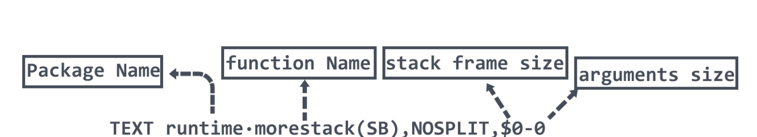
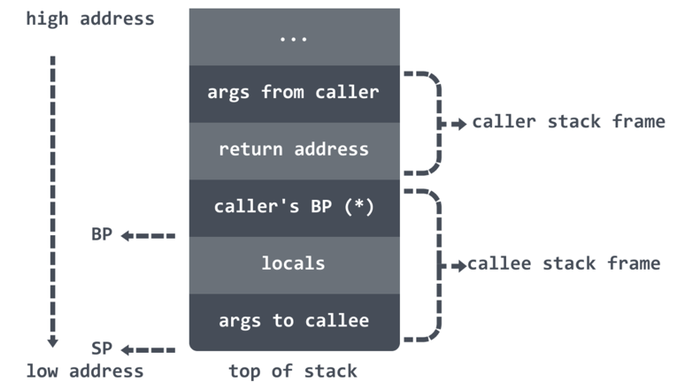
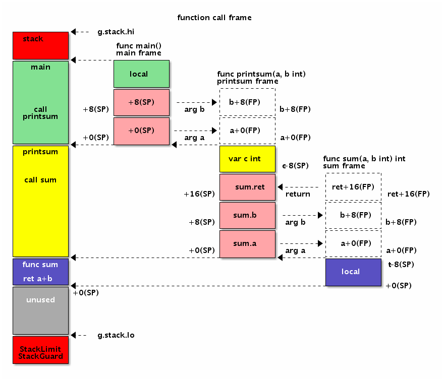
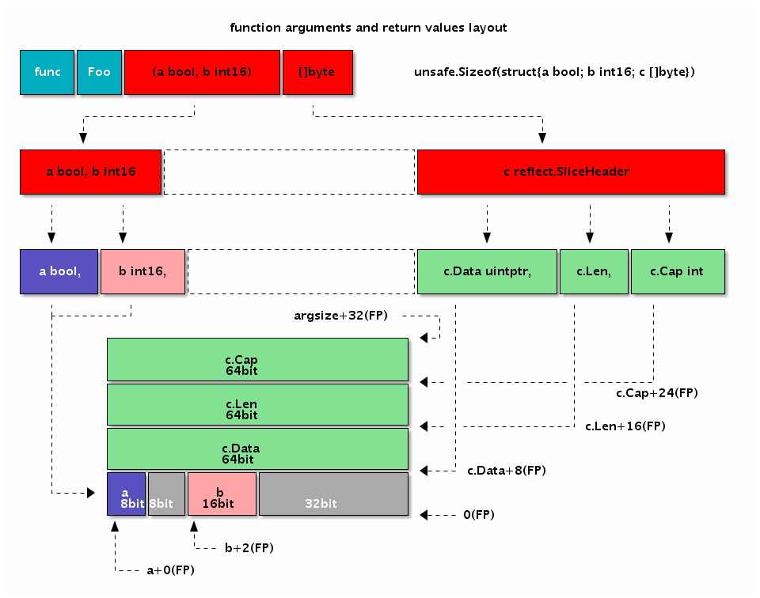
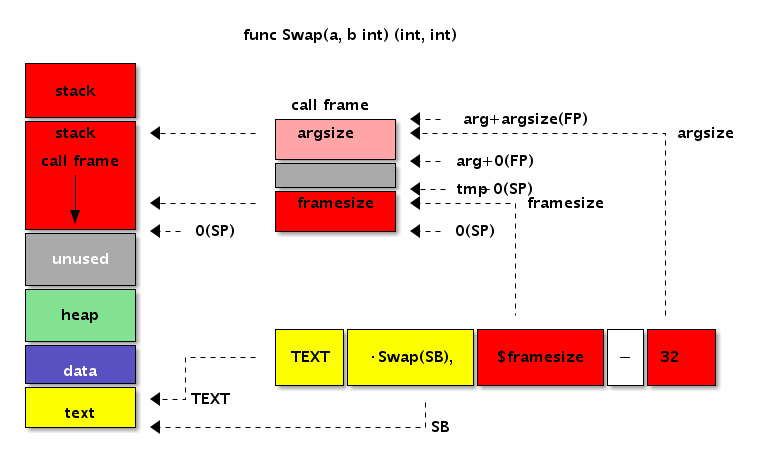
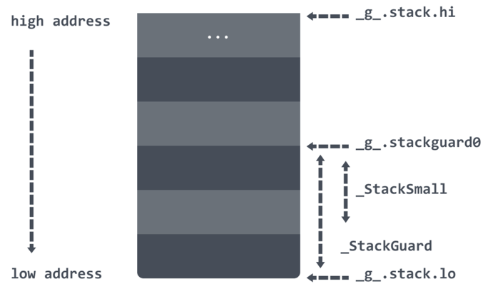

<!-- START doctoc generated TOC please keep comment here to allow auto update -->
<!-- DON'T EDIT THIS SECTION, INSTEAD RE-RUN doctoc TO UPDATE -->
**Table of Contents**  *generated with [DocToc](https://github.com/thlorenz/doctoc)*

- [高级汇编语言--以stack操作为例](#%E9%AB%98%E7%BA%A7%E6%B1%87%E7%BC%96%E8%AF%AD%E8%A8%80--%E4%BB%A5stack%E6%93%8D%E4%BD%9C%E4%B8%BA%E4%BE%8B)
  - [函数声明](#%E5%87%BD%E6%95%B0%E5%A3%B0%E6%98%8E)
  - [GO版本变化： 函数调用时，传递参数做了修改](#go%E7%89%88%E6%9C%AC%E5%8F%98%E5%8C%96-%E5%87%BD%E6%95%B0%E8%B0%83%E7%94%A8%E6%97%B6%E4%BC%A0%E9%80%92%E5%8F%82%E6%95%B0%E5%81%9A%E4%BA%86%E4%BF%AE%E6%94%B9)
  - [栈](#%E6%A0%88)
  - [栈结构](#%E6%A0%88%E7%BB%93%E6%9E%84)
  - [Goroutine 栈操作](#goroutine-%E6%A0%88%E6%93%8D%E4%BD%9C)
  - [G 的创建](#g-%E7%9A%84%E5%88%9B%E5%BB%BA)
  - [G 的销毁](#g-%E7%9A%84%E9%94%80%E6%AF%81)
  - [栈的初始化](#%E6%A0%88%E7%9A%84%E5%88%9D%E5%A7%8B%E5%8C%96)
  - [案例](#%E6%A1%88%E4%BE%8B)

<!-- END doctoc generated TOC please keep comment here to allow auto update -->

# 高级汇编语言--以stack操作为例

Go汇编语言其实是一种高级的汇编语言。在这里高级一词并没有任何褒义或贬义的色彩，而是要强调Go汇编代码和最终真实执行的代码并不完全等价。
Go汇编语言中一个指令在最终的目标代码中可能会被编译为其它等价的机器指令。Go汇编实现的函数或调用函数的指令在最终代码中也会被插入额外的指令。
要彻底理解Go汇编语言就需要彻底了解汇编器到底插入了哪些指令。

##  函数声明


```css
pkgname 包名可以不写，一般都是不写的，可以参考 go 的源码， 另外 add 前的 · 不是 .

代码存储在TEXT段中
                           argsize参数及返回值大小,例如入参是 3 个 int64 类型，返回值是 1 个 int64 类型，那么返回值就是 sizeof(int64) * 4,不过真实世界永远没有我们假设的这么美好，函数参数往往混合了多种类型，还需要考虑内存对齐问题。
                                 |
 TEXT pkgname·add(SB),NOSPLIT,$0-16    -->$framesize-argsize   
         |     |               |
        包名  函数名    framesize栈帧大小(局部变量+如果有对其它函数调用时的话，调用时需要将 callee 的参数、返回值考虑在内。虽然 return address(rip)的值也是存储在 caller 的 stack frame 上的，但是这个过程是由 CALL 指令和 RET 指令完成 PC 寄存器的保存和恢复的，在手写汇编时，同样也是不需要考虑这个 PC 寄存器在栈上所需占用的 8 个字节的)
```
- 为什么要叫 TEXT ？如果对程序数据在文件中和内存中的分段稍有了解的同学应该知道，我们的代码在二进制文件中，是存储在 .text 段中的，这里也就是一种约定俗成的起名方式。实际上在 plan9 中 TEXT 是一个指令，用来定义一个函数。除了 TEXT 之外还有前面变量声明说到的 DATA/GLOBL

- 定义中的 pkgname 部分是可以省略的，非想写也可以写上。不过写上 pkgname 的话，在重命名 package 之后还需要改代码，所以推荐最好还是不要写

- 中点 · 比较特殊，是一个 unicode 的中点，该点在 mac 下的输入方法是 option+shift+9。在程序被链接之后，所有的中点 · 都会被替换为句号 . ，比如你的方法是 runtime·main，在编译之后的程序里的符号则是 runtime.main。
- framesize:
    - 原则上来说，调用函数时只要不把局部变量覆盖掉就可以了。稍微多分配几个字节的 framesize 也不会死。
    - 在确保逻辑没有问题的前提下，你愿意覆盖局部变量也没有问题。只要保证进入和退出汇编函数时的 caller 和 callee 能正确拿到返回值就可以

以上使用的 RODATA，NOSPLIT flag，还有其他的值，可以参考：https://golang.org/doc/asm#directives
```shell
#include textflag.h

NOPROF = 1
#(For TEXT items.) Don’t profile the marked function. This flag is deprecated.

DUPOK = 2 
# DUPOK表示该变量对应的标识符可能有多个，在链接时只选择其中一个即可（一般用于合并相同的常量字符串，减少重复数据占用的空间）。

NOSPLIT = 4
# 不会生成或包含栈分裂代码，这一般用于没有任何其它函数调用的叶子函数，这样可以适当提高性能。
#(代码段.) Don’t insert the preamble to check if the stack must be split. 
# The frame for the routine, plus anything it calls, must fit in the spare space at the top of the stack segment. 
# Used to protect routines such as the stack splitting code itself.

RODATA = 8
#RODATA标志表示将变量定义在只读内存段，因此后续任何对此变量的修改操作将导致异常（recover也无法捕获）。

NOPTR = 16
#NOPTR则表示此变量的内部不含指针数据，让垃圾回收器忽略对该变量的扫描。如果变量已经在Go代码中声明过的话，Go编译器会自动分析出该变量是否包含指针，这种时候可以不用手写NOPTR标志

WRAPPER = 32
#(代码段.) WRAPPER标志则表示这个是一个包装函数，在panic或runtime.caller等某些处理函数帧的地方不会增加函数帧计数。

NEEDCTXT = 64
#(代码段.) 表示需要一个上下文参数，一般用于闭包函数.
```


## GO版本变化： 函数调用时，传递参数做了修改
- go1.17之前，函数参数是通过栈空间来传递的
- go1.17时做出了改变，在一些平台上（AMD64）可以像C,C++那样使用寄存器传递参数和函数返回值

栈空间：
- 优点：实现简单，不用区分不同的平台，通用性强
- 缺点：效率低
寄存器：
- 优点：速度快
- 缺点：通用性差，不同的平台需要单独处理 当然，这里说的通用性差是对于编译器来说的


## 栈



调用栈call stack，简称栈，是一种栈数据结构，用于存储有关计算机程序的活动 subroutines 信息。在计算机编程中，subroutines 是执行特定任务的一系列程序指令，打包为一个单元。


## 栈结构
典型的函数的栈结构图





```css
低地址
                       -----------------                                           
                       current func arg0                                           
                       ----------------- <----------- FP(pseudo FP)                
                        caller ret addr                                            
                       +---------------+                                           
                       | caller BP(*)  |                                           
                       ----------------- <----------- SP(pseudo SP，实际上是当前栈帧的 BP 位置)
                       |   Local Var0  |                                           
                       -----------------                                           
                       |   Local Var1  |                                           
                       -----------------                                           
                       |   Local Var2  |                                           
                       -----------------                -                          
                       |   ........    |                                           
                       -----------------                                           
                       |   Local VarN  |                                           
                       -----------------                                           
                       |               |                                           
                       |               |                                           
                       |  temporarily  |                                           
                       |  unused space |                                           
                       |               |                                           
                       |               |                                           
                       -----------------                                           
                       |  call retn    |                                           
                       -----------------                                           
                       |  call ret(n-1)|                                           
                       -----------------                                           
                       |  ..........   |                                           
                       -----------------                                           
                       |  call ret1    |                                           
                       -----------------                                           
                       |  call argn    |                                           
                       -----------------                                           
                       |   .....       |                                           
                       -----------------                                           
                       |  call arg3    |                                           
                       -----------------                                           
                       |  call arg2    |                                           
                       |---------------|                                           
                       |  call arg1    |                                           
                       -----------------   <------------  hardware SP 位置           
                         return addr                                               
                       +---------------+                                           
                                                                                   
高地址
```
从原理上来讲，如果当前函数调用了其它函数，那么 return addr 也是在 caller 的栈上的，不过往栈上插 return addr 的过程是由 CALL 指令完成的，在 RET 时，SP 又会恢复到图上位置。我们在计算 SP 和参数相对位置时，可以认为硬件 SP 指向的就是图上的位置。

图上的 caller BP，指的是 caller 的 BP 寄存器值，有些人把 caller BP 叫作 caller 的 frame pointer，实际上这个习惯是从 x86 架构沿袭来的。Go 的 asm 文档中把伪寄存器 FP 也称为 frame pointer，但是这两个 frame pointer 根本不是一回事。

此外需要注意的是，caller BP 是在编译期由编译器插入的，用户手写代码时，计算 frame size 时是不包括这个 caller BP 部分的。是否插入 caller BP 的主要判断依据是:

1. 函数的栈帧大小大于 0
2. 下述函数返回 true
```go
func Framepointer_enabled(goos, goarch string) bool {
    return framepointer_enabled != 0 && goarch == "amd64" && goos != "nacl"
}
```
如果编译器在最终的汇编结果中没有插入 caller BP(源代码中所称的 frame pointer)的情况下，伪 SP 和伪 FP 之间只有 8 个字节的 caller 的 return address，而插入了 BP 的话，就会多出额外的 8 字节。也就说伪 SP 和伪 FP 的相对位置是不固定的，有可能是间隔 8 个字节，也有可能间隔 16 个字节。并且判断依据会根据平台和 Go 的版本有所不同。

- FP 伪寄存器指向函数的传入参数的开始位置，因为栈是朝低地址方向增长，为了通过寄存器引用参数时方便，所以参数的摆放方向和栈的增长方向是相反的，即：
```css
                              FP
high ----------------------> low
argN, ... arg3, arg2, arg1, arg0
```

假设所有参数均为 8 字节，这样我们就可以用 symname+0(FP) 访问第一个 参数，symname+8(FP) 访问第二个参数，以此类推。

- 用伪 SP 来引用局部变量，原理上来讲差不多，不过因为伪 SP 指向的是局部变量的底部，所以 symname-8(SP) 表示的是第一个局部变量，symname-16(SP)表示第二个，以此类推。当然，这里假设局部变量都占用 8 个字节。

图的最上部的 caller return address 和 current func arg0 都是由 caller 来分配空间的。不算在当前的栈帧内。


## Goroutine 栈操作

在 Goroutine 中有一个 stack 数据结构，里面有两个属性 lo 与 hi，描述了实际的栈内存地址：

- stack.lo：栈空间的低地址；
- stack.hi：栈空间的高地址

在 Goroutine 中会通过 stackguard0 来判断是否要进行栈增长：

- stackguard0：stack.lo + StackGuard, 用于stack overlow的检测；
- StackGuard：保护区大小，常量Linux上为 928 字节；
- StackSmall：常量大小为 128 字节，用于小函数调用的优化；
- StackBig：常量大小为 4096 字节；

需要注意的是，由于栈是由高地址向低地址增长的，所以对比的时候，都是小于才执行扩容，这里需要大家品品。


## G 的创建
因为栈都是在 Goroutine 上的，所以先从 G 的创建开始看如何创建以及初始化栈空间的。

G 的创建会调用 runtime·newproc进行创建：
```go
func newproc(siz int32, fn *funcval) {
    argp := add(unsafe.Pointer(&fn), sys.PtrSize)
    gp := getg()
    // 获取 caller 的 PC 寄存器
    pc := getcallerpc()
    // 切换到 G0 进行创建
    systemstack(func() {
        newg := newproc1(fn, argp, siz, gp, pc)
        //...
    })
}
```
newproc 方法会切换到 G0 上调用 newproc1 函数进行 G 的创建。
```go
//分配 2K 大小的栈内存
const _StackMin = 2048 
func newproc1(fn *funcval, argp unsafe.Pointer, narg int32, callergp *g, callerpc uintptr) *g {
    _g_ := getg()
    ...
    _p_ := _g_.m.p.ptr()
    // 从 P 的空闲链表中获取一个新的 G
    newg := gfget(_p_)
    // 获取不到则调用 malg 进行创建
    if newg == nil {
        newg = malg(_StackMin)
        casgstatus(newg, _Gidle, _Gdead)
        allgadd(newg) // publishes with a g->status of Gdead so GC scanner doesn't look at uninitialized stack.
    }
    ...
    return newg
}
```

newproc1 方法很长，里面主要是获取 G ，然后对获取到的 G 做一些初始化的工作。我们这里只看 malg 函数的调用。

在调用 malg 函数的时候会传入一个最小栈大小的值：_StackMin（2048）。
```go
func malg(stacksize int32) *g {
    // 创建 G 结构体
    newg := new(g)
    if stacksize >= 0 {
        // 这里会在 stacksize 的基础上为每个栈预留系统调用所需的内存大小 _StackSystem
        // 在 Linux/Darwin 上（ _StackSystem == 0 ）本行不改变 stacksize 的大小
        stacksize = round2(_StackSystem + stacksize)
        // 切换到 G0 为 newg 初始化栈内存
        systemstack(func() {
            newg.stack = stackalloc(uint32(stacksize))
        })
        // 设置 stackguard0 ，用来判断是否要进行栈扩容
        newg.stackguard0 = newg.stack.lo + _StackGuard
        newg.stackguard1 = ^uintptr(0) 
        *(*uintptr)(unsafe.Pointer(newg.stack.lo)) = 0
    }
    return newg
}
```
在调用 malg 的时候会将传入的内存大小加上一个 _StackSystem 值预留给系统调用使用，round2 函数会将传入的值舍入为 2 的指数。然后会切换到 G0 执行 stackalloc 函数进行栈内存分配。

分配完毕之后会设置 stackguard0 为 stack.lo + _StackGuard，作为判断是否需要进行栈扩容使用

## G 的销毁

G 在退出时会执行goexit函数，状态从_Grunning变为_Gdead，G 对象并不会直接释放，而是通过gfput函数放入关联 P 的本地空闲列表，或者全局空闲列表，以便复用。

```go
// go1.21.5/src/runtime/proc.go
func gfput(pp *p, gp *g) {
	// G 状态检查
	if readgstatus(gp) != _Gdead {
		throw("gfput: bad status (not Gdead)")
	}
    //  G 的栈内存检查，如果不是标准栈大小，释放栈空间
	stksize := gp.stack.hi - gp.stack.lo

	if stksize != uintptr(startingStackSize) {
		// non-standard stack size - free it.
		stackfree(gp.stack)
		gp.stack.lo = 0
		gp.stack.hi = 0
		gp.stackguard0 = 0
	}

	// // 放入 p.gFree 列表, 如果列表中g个数超过64，仅会在P本地列表保存32个，超过的部分放到全局空闲G列表sched.gFree
	pp.gFree.push(gp)
	pp.gFree.n++
	if pp.gFree.n >= 64 {
		var (
			inc      int32
			stackQ   gQueue
			noStackQ gQueue
		)
		for pp.gFree.n >= 32 {
			gp := pp.gFree.pop()
			pp.gFree.n--
			if gp.stack.lo == 0 {
				noStackQ.push(gp)
			} else {
				stackQ.push(gp)
			}
			inc++
		}
		lock(&sched.gFree.lock)
		sched.gFree.noStack.pushAll(noStackQ)
		sched.gFree.stack.pushAll(stackQ)
		sched.gFree.n += inc
		unlock(&sched.gFree.lock)
	}
}

```

## 栈的初始化
```go
const (
    // Number of orders that get caching. Order 0 is FixedStack
    // and each successive order is twice as large.
    // We want to cache 2KB, 4KB, 8KB, and 16KB stacks. Larger stacks
    // will be allocated directly.
    // Since FixedStack is different on different systems, we
    // must vary NumStackOrders to keep the same maximum cached size.
    //   OS               | FixedStack | NumStackOrders
    //   -----------------+------------+---------------
    //   linux/darwin/bsd | 2KB        | 4
    //   windows/32       | 4KB        | 3
    //   windows/64       | 8KB        | 2
    //   plan9            | 4KB        | 3
    _NumStackOrders = 4 - sys.PtrSize/4*sys.GoosWindows - 1*sys.GoosPlan9
)
// src/runtime/stack.go
// 全局的栈缓存，分配 32KB以下内存
var stackpool [_NumStackOrders]struct {
    item stackpoolItem
    _    [cpu.CacheLinePadSize - unsafe.Sizeof(stackpoolItem{})%cpu.CacheLinePadSize]byte
}

//go:notinheap
type stackpoolItem struct {
    mu   mutex
    span mSpanList
} 

// 全局的栈缓存，分配 32KB 以上内存
var stackLarge struct {
    lock mutex
    free [heapAddrBits - pageShift]mSpanList // free lists by log_2(s.npages)
}

// 初始化stackpool/stackLarge全局变量
func stackinit() {
    if _StackCacheSize&_PageMask != 0 {
        throw("cache size must be a multiple of page size")
    }
    for i := range stackpool {
        stackpool[i].item.span.init()
        lockInit(&stackpool[i].item.mu, lockRankStackpool)
    }
    for i := range stackLarge.free {
        stackLarge.free[i].init()
        lockInit(&stackLarge.lock, lockRankStackLarge)
    }
}
```

需要注意的是，stackinit 是在调用 runtime·schedinit初始化的，是在调用 runtime·newproc之前进行的。

在执行栈初始化的时候会初始化两个全局变量 stackpool 和 stackLarge。stackpool 可以分配小于 32KB 的内存，stackLarge 用来分配大于 32KB 的栈空间。


## 案例
为了便于分析，我们先构造一个禁止栈分裂的printnl函数。printnl函数内部都通过调用runtime.printnl函数输出换行：
```
TEXT ·printnl_nosplit(SB), NOSPLIT, $8
	CALL runtime·printnl(SB)
	RET
```

然后通过`go tool asm -S main_amd64.s`指令查看编译后的目标代码：

```shell
"".printnl_nosplit STEXT nosplit size=29 args=0xffffffff80000000 locals=0x10
0x0000 00000 (main_amd64.s:5) TEXT "".printnl_nosplit(SB), NOSPLIT	$16
0x0000 00000 (main_amd64.s:5) SUBQ $16, SP

0x0004 00004 (main_amd64.s:5) MOVQ BP, 8(SP)
0x0009 00009 (main_amd64.s:5) LEAQ 8(SP), BP

0x000e 00014 (main_amd64.s:6) CALL runtime.printnl(SB)

0x0013 00019 (main_amd64.s:7) MOVQ 8(SP), BP
0x0018 00024 (main_amd64.s:7) ADDQ $16, SP
0x001c 00028 (main_amd64.s:7) RET
```
输出代码中我们删除了非指令的部分。为了便于讲述，我们将上述代码重新排版，并根据缩进表示相关的功能：

```shell
TEXT "".printnl(SB), NOSPLIT, $16
	SUBQ $16, SP
		MOVQ BP, 8(SP)
		LEAQ 8(SP), BP
			CALL runtime.printnl(SB)
		MOVQ 8(SP), BP
	ADDQ $16, SP
RET
```

第一层是TEXT指令表示函数开始，到RET指令表示函数返回。第二层是`SUBQ $16, SP`指令为当前函数帧分配16字节的空间，在函数返回前通过`ADDQ $16, SP`指令回收16字节的栈空间。
我们谨慎猜测在第二层是为函数多分配了8个字节的空间。那么为何要多分配8个字节的空间呢？
再继续查看第三层的指令：开始部分有两个指令`MOVQ BP, 8(SP)`和`LEAQ 8(SP), BP`，首先是将BP寄存器保持到多分配的8字节栈空间，然后将`8(SP)`地址重新保持到了BP寄存器中；
结束部分是`MOVQ 8(SP), BP`指令则是从栈中恢复之前备份的前BP寄存器的值。最里面第四次层才是我们写的代码，调用runtime.printnl函数输出换行。

如果去掉NOSPILT标志，再重新查看生成的目标代码，会发现在函数的开头和结尾的地方又增加了新的指令。下面是经过缩进格式化的结果：

```
TEXT "".printnl_nosplit(SB), $16
L_BEGIN:
	MOVQ (TLS), CX
	CMPQ SP, 16(CX)
	JLS  L_MORE_STK

		SUBQ $16, SP
			MOVQ BP, 8(SP)
			LEAQ 8(SP), BP
				CALL runtime.printnl(SB)
			MOVQ 8(SP), BP
		ADDQ $16, SP

L_MORE_STK:
	CALL runtime.morestack_noctxt(SB)
	JMP  L_BEGIN
RET
```
其中开头有三个新指令，`MOVQ (TLS), CX`用于加载g结构体指针，然后第二个指令`CMPQ SP, 16(CX)`SP栈指针和g结构体中stackguard0成员比较，如果比较的结果小于0则跳转到结尾的L_MORE_STK部分。当获取到更多栈空间之后，通过`JMP L_BEGIN`指令跳转到函数的开始位置重新进行栈空间的检测。

g结构体在`$GOROOT/src/runtime/runtime2.go`文件定义，开头的结构成员如下：

```go
type g struct {
	// Stack parameters.
	stack       stack   // offset known to runtime/cgo
	stackguard0 uintptr // offset known to liblink
	stackguard1 uintptr // offset known to liblink

	...
}
```

第一个成员是stack类型，表示当前栈的开始和结束地址。stack的定义如下：
```go
// Stack describes a Go execution stack.
// The bounds of the stack are exactly [lo, hi),
// with no implicit data structures on either side.
type stack struct {
	lo uintptr  //栈空间的低地址；
	hi uintptr  // 栈空间的高地址；
}
```
在g结构体中的stackguard0成员是出现爆栈前的警戒线。

1. 扩容：在 Goroutine 中会通过 stackguard0 来判断是否要进行栈增长：
```go
func newstack() {
    thisg := getg() 

    gp := thisg.m.curg

    // 初始化寄存器相关变量
    morebuf := thisg.m.morebuf
    thisg.m.morebuf.pc = 0
    thisg.m.morebuf.lr = 0
    thisg.m.morebuf.sp = 0
    thisg.m.morebuf.g = 0
    ...
    // 校验是否被抢占
    preempt := atomic.Loaduintptr(&gp.stackguard0) == stackPreempt

    // 如果被抢占
    if preempt {
        // 校验是否可以安全的被抢占
        // 如果 M 上有锁
        // 如果正在进行内存分配
        // 如果明确禁止抢占
        // 如果 P 的状态不是 running
        // 那么就不执行抢占了
        if !canPreemptM(thisg.m) {
            // 到这里表示不能被抢占？
            // Let the goroutine keep running for now.
            // gp->preempt is set, so it will be preempted next time.
            gp.stackguard0 = gp.stack.lo + _StackGuard
            // 触发调度器的调度
            gogo(&gp.sched) // never return
        }
    }

    if gp.stack.lo == 0 {
        throw("missing stack in newstack")
    }
    // 寄存器 sp
    sp := gp.sched.sp
    if sys.ArchFamily == sys.AMD64 || sys.ArchFamily == sys.I386 || sys.ArchFamily == sys.WASM {
        // The call to morestack cost a word.
        sp -= sys.PtrSize
    } 
    ...
    if preempt {
        //需要收缩栈
        if gp.preemptShrink { 
            gp.preemptShrink = false
            shrinkstack(gp)
        }
        // 被 runtime.suspendG 函数挂起
        if gp.preemptStop {
            // 被动让出当前处理器的控制权
            preemptPark(gp) // never returns
        }

        //主动让出当前处理器的控制权
        gopreempt_m(gp) // never return
    }

    // 计算新的栈空间是原来的两倍
    oldsize := gp.stack.hi - gp.stack.lo
    newsize := oldsize * 2 
    ... 
    //将 Goroutine 切换至 _Gcopystack 状态
    casgstatus(gp, _Grunning, _Gcopystack)

    //开始栈拷贝
    copystack(gp, newsize) 
    casgstatus(gp, _Gcopystack, _Grunning)
    gogo(&gp.sched)
}
```
在开始执行栈拷贝之前会先计算新栈的大小是原来的两倍，然后将 Goroutine 状态切换至 _Gcopystack 状态。


2. 收缩

   我们知道Go运行时会定期进行垃圾回收操作，这其中包含栈的回收工作。如果栈使用到比例小于一定到阈值，则分配一个较小到栈空间，然后将栈上面到数据移动到新的栈中，
   栈移动的过程和栈扩容的过程类似.
```go
func scanstack(gp *g, gcw *gcWork) {
    ... 
    // 进行栈收缩
    shrinkstack(gp)
    ...
}
```

```go
func shrinkstack(gp *g) {
    ...
    oldsize := gp.stack.hi - gp.stack.lo
    newsize := oldsize / 2 
    // 当收缩后的大小小于最小的栈的大小时，不再进行收缩
    if newsize < _FixedStack {
        return
    }
    avail := gp.stack.hi - gp.stack.lo
    // 计算当前正在使用的栈数量，如果 gp 使用的当前栈少于四分之一，则对栈进行收缩
    // 当前使用的栈包括到 SP 的所有内容以及栈保护空间，以确保有 nosplit 功能的空间
    if used := gp.stack.hi - gp.sched.sp + _StackLimit; used >= avail/4 {
        return
    }
    // 将旧栈拷贝到新收缩后的栈上
    copystack(gp, newsize)
}
```
新栈的大小会缩小至原来的一半，如果小于 _FixedStack （2KB）那么不再进行收缩。除此之外还会计算一下当前栈的使用情况是否不足 1/4 ，如果使用超过 1/4 那么也不会进行收缩。

最后判断确定要进行收缩则调用 copystack 函数进行栈拷贝的逻辑

