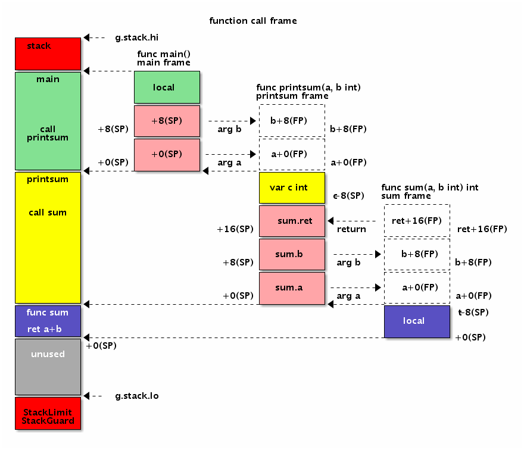
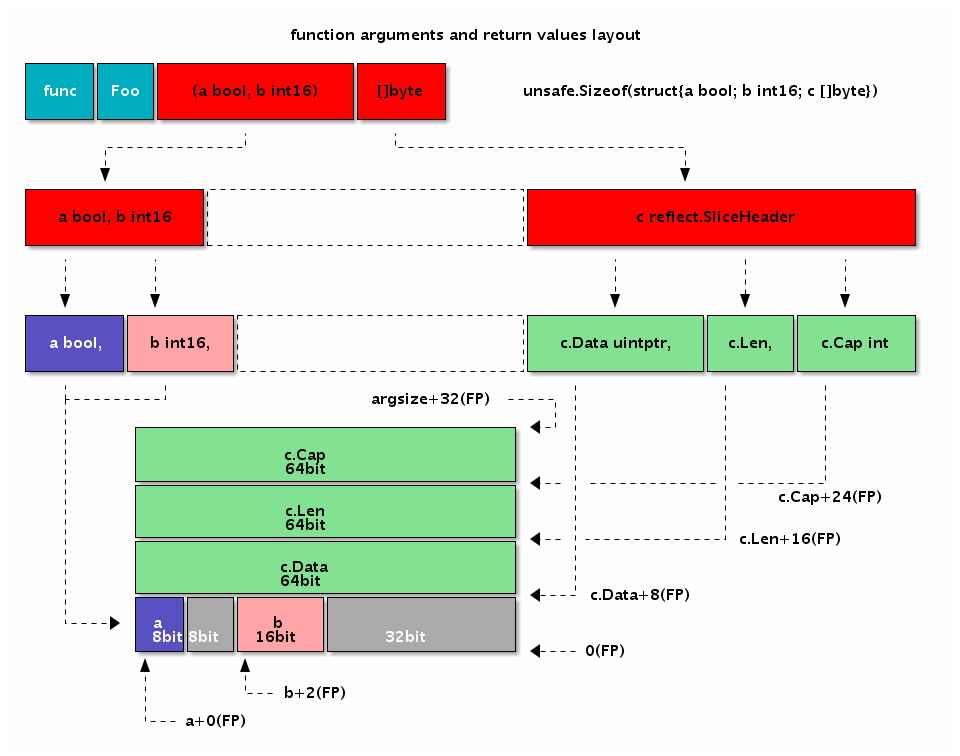
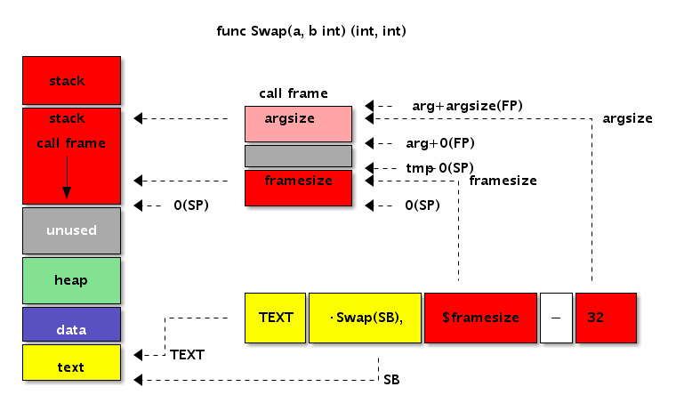

# 高级汇编语言--以stack操作为例

Go汇编语言其实是一种高级的汇编语言。在这里高级一词并没有任何褒义或贬义的色彩，而是要强调Go汇编代码和最终真实执行的代码并不完全等价。
Go汇编语言中一个指令在最终的目标代码中可能会被编译为其它等价的机器指令。Go汇编实现的函数或调用函数的指令在最终代码中也会被插入额外的指令。
要彻底理解Go汇编语言就需要彻底了解汇编器到底插入了哪些指令。


## 栈
由于 Go 程序中的 goroutine 数目是不可确定的，并且实际场景可能会有百万级别的 goroutine，runtime 必须使用保守的思路来给 goroutine 分配空间以避免吃掉所有的可用内存。

也由于此，每个新的 goroutine 会被 runtime 分配初始为 2KB 大小的栈空间(Go 的栈在底层实际上是分配在堆空间上的)。

随着一个 goroutine 进行自己的工作，可能会超出最初分配的栈空间限制(就是栈溢出的意思)。 为了防止这种情况发生，runtime 确保 goroutine 在超出栈范围时，会创建一个相当于原来两倍大小的新栈，并将原来栈的上下文拷贝到新栈上。 这个过程被称为 栈分裂(stack-split)，这样使得 goroutine 栈能够动态调整大小

## 栈分裂
为了使栈分裂正常工作，编译器会在每一个函数的开头和结束位置插入指令来防止 goroutine 爆栈。 像我们本章早些看到的一样，为了避免不必要的开销，一定不会爆栈的函数会被标记上 NOSPLIT 来提示编译器不要在这些函数的开头和结束部分插入这些检查指令

## 栈结构
典型的函数的栈结构图
```css
高地址
                       -----------------                                           
                       current func arg0                                           
                       ----------------- <----------- FP(pseudo FP)                
                        caller ret addr                                            
                       +---------------+                                           
                       | caller BP(*)  |                                           
                       ----------------- <----------- SP(pseudo SP，实际上是当前栈帧的 BP 位置)
                       |   Local Var0  |                                           
                       -----------------                                           
                       |   Local Var1  |                                           
                       -----------------                                           
                       |   Local Var2  |                                           
                       -----------------                -                          
                       |   ........    |                                           
                       -----------------                                           
                       |   Local VarN  |                                           
                       -----------------                                           
                       |               |                                           
                       |               |                                           
                       |  temporarily  |                                           
                       |  unused space |                                           
                       |               |                                           
                       |               |                                           
                       -----------------                                           
                       |  call retn    |                                           
                       -----------------                                           
                       |  call ret(n-1)|                                           
                       -----------------                                           
                       |  ..........   |                                           
                       -----------------                                           
                       |  call ret1    |                                           
                       -----------------                                           
                       |  call argn    |                                           
                       -----------------                                           
                       |   .....       |                                           
                       -----------------                                           
                       |  call arg3    |                                           
                       -----------------                                           
                       |  call arg2    |                                           
                       |---------------|                                           
                       |  call arg1    |                                           
                       -----------------   <------------  hardware SP 位置           
                         return addr                                               
                       +---------------+                                           
                                                                                   
低地址
```
从原理上来讲，如果当前函数调用了其它函数，那么 return addr 也是在 caller 的栈上的，不过往栈上插 return addr 的过程是由 CALL 指令完成的，在 RET 时，SP 又会恢复到图上位置。我们在计算 SP 和参数相对位置时，可以认为硬件 SP 指向的就是图上的位置。

图上的 caller BP，指的是 caller 的 BP 寄存器值，有些人把 caller BP 叫作 caller 的 frame pointer，实际上这个习惯是从 x86 架构沿袭来的。Go 的 asm 文档中把伪寄存器 FP 也称为 frame pointer，但是这两个 frame pointer 根本不是一回事。

此外需要注意的是，caller BP 是在编译期由编译器插入的，用户手写代码时，计算 frame size 时是不包括这个 caller BP 部分的。是否插入 caller BP 的主要判断依据是:

1. 函数的栈帧大小大于 0
2. 下述函数返回 true
```go
func Framepointer_enabled(goos, goarch string) bool {
    return framepointer_enabled != 0 && goarch == "amd64" && goos != "nacl"
}
```
如果编译器在最终的汇编结果中没有插入 caller BP(源代码中所称的 frame pointer)的情况下，伪 SP 和伪 FP 之间只有 8 个字节的 caller 的 return address，而插入了 BP 的话，就会多出额外的 8 字节。也就说伪 SP 和伪 FP 的相对位置是不固定的，有可能是间隔 8 个字节，也有可能间隔 16 个字节。并且判断依据会根据平台和 Go 的版本有所不同。

- FP 伪寄存器指向函数的传入参数的开始位置，因为栈是朝低地址方向增长，为了通过寄存器引用参数时方便，所以参数的摆放方向和栈的增长方向是相反的，即：
```css
                              FP
high ----------------------> low
argN, ... arg3, arg2, arg1, arg0
```

假设所有参数均为 8 字节，这样我们就可以用 symname+0(FP) 访问第一个 参数，symname+8(FP) 访问第二个参数，以此类推。

- 用伪 SP 来引用局部变量，原理上来讲差不多，不过因为伪 SP 指向的是局部变量的底部，所以 symname-8(SP) 表示的是第一个局部变量，symname-16(SP)表示第二个，以此类推。当然，这里假设局部变量都占用 8 个字节。

图的最上部的 caller return address 和 current func arg0 都是由 caller 来分配空间的。不算在当前的栈帧内。

## 参考图





## 栈的初始化
// src/runtime/stack.go
```go
// 全局的栈缓存，分配 32KB以下内存
var stackpool [_NumStackOrders]struct {
    item stackpoolItem
    _    [cpu.CacheLinePadSize - unsafe.Sizeof(stackpoolItem{})%cpu.CacheLinePadSize]byte
}

//go:notinheap
type stackpoolItem struct {
    mu   mutex
    span mSpanList
} 

// 全局的栈缓存，分配 32KB 以上内存
var stackLarge struct {
    lock mutex
    free [heapAddrBits - pageShift]mSpanList // free lists by log_2(s.npages)
}

// 初始化stackpool/stackLarge全局变量
func stackinit() {
    if _StackCacheSize&_PageMask != 0 {
        throw("cache size must be a multiple of page size")
    }
    for i := range stackpool {
        stackpool[i].item.span.init()
        lockInit(&stackpool[i].item.mu, lockRankStackpool)
    }
    for i := range stackLarge.free {
        stackLarge.free[i].init()
        lockInit(&stackLarge.lock, lockRankStackLarge)
    }
}
```

## 栈的分配
源码路径：src/runtime/stack.go

### 小栈内存分配
```go
func stackalloc(n uint32) stack { 
    // 这里的 G 是 G0
    thisg := getg()
    ...
    var v unsafe.Pointer
    // 在 Linux 上，_FixedStack = 2048、_NumStackOrders = 4、_StackCacheSize = 32768
    // 如果申请的栈空间小于 32KB
    if n < _FixedStack<<_NumStackOrders && n < _StackCacheSize {
        order := uint8(0)
        n2 := n
        // 大于 2048 ,那么 for 循环 将 n2 除 2,直到 n 小于等于 2048
        for n2 > _FixedStack {
            // order 表示除了多少次
            order++
            n2 >>= 1
        }
        var x gclinkptr
        //preemptoff != "", 在 GC 的时候会进行设置,表示如果在 GC 那么从 stackpool 分配
        // thisg.m.p = 0 会在系统调用和 改变 P 的个数的时候调用,如果发生,那么也从 stackpool 分配
        if stackNoCache != 0 || thisg.m.p == 0 || thisg.m.preemptoff != "" { 
            lock(&stackpool[order].item.mu)
            // 从 stackpool 分配
            x = stackpoolalloc(order)
            unlock(&stackpool[order].item.mu)
        } else {
            // 从 P 的 mcache 分配内存
            c := thisg.m.p.ptr().mcache
            x = c.stackcache[order].list
            if x.ptr() == nil {
                // 从堆上申请一片内存空间填充到stackcache中
                stackcacherefill(c, order)
                x = c.stackcache[order].list
            }
            // 移除链表的头节点
            c.stackcache[order].list = x.ptr().next
            c.stackcache[order].size -= uintptr(n)
        }
        // 获取到分配的span内存块
        v = unsafe.Pointer(x)
    } else {
        ...
    }
    ...
    return stack{uintptr(v), uintptr(v) + uintptr(n)}
}
```


### 大栈内存分配

```go
func stackalloc(n uint32) stack { 
    thisg := getg() 
    var v unsafe.Pointer

    if n < _FixedStack<<_NumStackOrders && n < _StackCacheSize {
        ...
    } else {
        // 申请的内存空间过大，从 runtime.stackLarge 中检查是否有剩余的空间
        var s *mspan
        // 计算需要分配多少个 span 页， 8KB 为一页
        npage := uintptr(n) >> _PageShift
        // 计算 npage 能够被2整除几次，用来作为不同大小内存的块的索引
        log2npage := stacklog2(npage)

        lock(&stackLarge.lock)
        // 如果 stackLarge 对应的链表不为空
        if !stackLarge.free[log2npage].isEmpty() {
            //获取链表的头节点，并将其从链表中移除
            s = stackLarge.free[log2npage].first
            stackLarge.free[log2npage].remove(s)
        }
        unlock(&stackLarge.lock)

        lockWithRankMayAcquire(&mheap_.lock, lockRankMheap)
        //这里是stackLarge为空的情况
        if s == nil {
            // 从堆上申请新的内存 span
            s = mheap_.allocManual(npage, &memstats.stacks_inuse)
            if s == nil {
                throw("out of memory")
            }
            // OpenBSD 6.4+ 系统需要做额外处理
            osStackAlloc(s)
            s.elemsize = uintptr(n)
        }
        v = unsafe.Pointer(s.base())
    }
    ...
    return stack{uintptr(v), uintptr(v) + uintptr(n)}
}
```


## 案例
为了便于分析，我们先构造一个禁止栈分裂的printnl函数。printnl函数内部都通过调用runtime.printnl函数输出换行：
```
TEXT ·printnl_nosplit(SB), NOSPLIT, $8
	CALL runtime·printnl(SB)
	RET
```

然后通过`go tool asm -S main_amd64.s`指令查看编译后的目标代码：

```shell
"".printnl_nosplit STEXT nosplit size=29 args=0xffffffff80000000 locals=0x10
0x0000 00000 (main_amd64.s:5) TEXT "".printnl_nosplit(SB), NOSPLIT	$16
0x0000 00000 (main_amd64.s:5) SUBQ $16, SP

0x0004 00004 (main_amd64.s:5) MOVQ BP, 8(SP)
0x0009 00009 (main_amd64.s:5) LEAQ 8(SP), BP

0x000e 00014 (main_amd64.s:6) CALL runtime.printnl(SB)

0x0013 00019 (main_amd64.s:7) MOVQ 8(SP), BP
0x0018 00024 (main_amd64.s:7) ADDQ $16, SP
0x001c 00028 (main_amd64.s:7) RET
```
输出代码中我们删除了非指令的部分。为了便于讲述，我们将上述代码重新排版，并根据缩进表示相关的功能：

```shell
TEXT "".printnl(SB), NOSPLIT, $16
	SUBQ $16, SP
		MOVQ BP, 8(SP)
		LEAQ 8(SP), BP
			CALL runtime.printnl(SB)
		MOVQ 8(SP), BP
	ADDQ $16, SP
RET
```

第一层是TEXT指令表示函数开始，到RET指令表示函数返回。第二层是`SUBQ $16, SP`指令为当前函数帧分配16字节的空间，在函数返回前通过`ADDQ $16, SP`指令回收16字节的栈空间。
我们谨慎猜测在第二层是为函数多分配了8个字节的空间。那么为何要多分配8个字节的空间呢？
再继续查看第三层的指令：开始部分有两个指令`MOVQ BP, 8(SP)`和`LEAQ 8(SP), BP`，首先是将BP寄存器保持到多分配的8字节栈空间，然后将`8(SP)`地址重新保持到了BP寄存器中；
结束部分是`MOVQ 8(SP), BP`指令则是从栈中恢复之前备份的前BP寄存器的值。最里面第四次层才是我们写的代码，调用runtime.printnl函数输出换行。

如果去掉NOSPILT标志，再重新查看生成的目标代码，会发现在函数的开头和结尾的地方又增加了新的指令。下面是经过缩进格式化的结果：

```
TEXT "".printnl_nosplit(SB), $16
L_BEGIN:
	MOVQ (TLS), CX
	CMPQ SP, 16(CX)
	JLS  L_MORE_STK

		SUBQ $16, SP
			MOVQ BP, 8(SP)
			LEAQ 8(SP), BP
				CALL runtime.printnl(SB)
			MOVQ 8(SP), BP
		ADDQ $16, SP

L_MORE_STK:
	CALL runtime.morestack_noctxt(SB)
	JMP  L_BEGIN
RET
```
其中开头有三个新指令，`MOVQ (TLS), CX`用于加载g结构体指针，然后第二个指令`CMPQ SP, 16(CX)`SP栈指针和g结构体中stackguard0成员比较，如果比较的结果小于0则跳转到结尾的L_MORE_STK部分。当获取到更多栈空间之后，通过`JMP L_BEGIN`指令跳转到函数的开始位置重新进行栈空间的检测。

g结构体在`$GOROOT/src/runtime/runtime2.go`文件定义，开头的结构成员如下：

```go
type g struct {
	// Stack parameters.
	stack       stack   // offset known to runtime/cgo
	stackguard0 uintptr // offset known to liblink
	stackguard1 uintptr // offset known to liblink

	...
}
```

第一个成员是stack类型，表示当前栈的开始和结束地址。stack的定义如下：
```go
// Stack describes a Go execution stack.
// The bounds of the stack are exactly [lo, hi),
// with no implicit data structures on either side.
type stack struct {
	lo uintptr  //栈空间的低地址；
	hi uintptr  // 栈空间的高地址；
}
```
在g结构体中的stackguard0成员是出现爆栈前的警戒线。

1. 扩容：在 Goroutine 中会通过 stackguard0 来判断是否要进行栈增长：
```go
func malg(stacksize int32) *g {
    // 创建 G 结构体
    newg := new(g)
    if stacksize >= 0 {
        // 这里会在 stacksize 的基础上为每个栈预留系统调用所需的内存大小 _StackSystem
        // 在 Linux/Darwin 上（ _StackSystem == 0 ）本行不改变 stacksize 的大小
        stacksize = round2(_StackSystem + stacksize)
        // 切换到 G0 为 newg 初始化栈内存
        systemstack(func() {
            newg.stack = stackalloc(uint32(stacksize))
        })
        // 设置 stackguard0 ，用来判断是否要进行栈扩容
        newg.stackguard0 = newg.stack.lo + _StackGuard
        newg.stackguard1 = ^uintptr(0) 
        *(*uintptr)(unsafe.Pointer(newg.stack.lo)) = 0
    }
    return newg
}
```

- stackguard0：stack.lo + StackGuard, 用于stack overlow的检测；
- StackGuard：保护区大小，常量Linux上为 928 字节；
- StackSmall：常量大小为 128 字节，用于小函数调用的优化；
- StackBig：常量大小为 4096 字节；

根据被调用函数栈帧的大小来判断是否需要扩容：
* 当栈帧大小（FramSzie）小于等于 StackSmall（128）时，如果 SP 小于 stackguard0 那么就执行栈扩容；
* 当栈帧大小（FramSzie）大于 StackSmall（128）时，就会根据公式 SP - FramSzie + StackSmall 和 stackguard0 比较，如果小于 stackguard0 则执行扩容；
* 当栈帧大小（FramSzie）大于StackBig（4096）时，首先会检查 stackguard0 是否已转变成 StackPreempt 状态了；然后根据公式 SP-stackguard0+StackGuard <= framesize + (StackGuard-StackSmall)判断，如果是 true 则执行扩容；


需要注意的是，由于栈是由高地址向低地址增长的，所以对比的时候，都是小于才执行扩容，这里需要大家品品.

stackguard0的偏移量是16个字节.因此上述代码中的`CMPQ SP, 16(AX)`表示将当前的真实SP和爆栈警戒线比较，
如果超出警戒线则表示需要进行栈扩容，也就是跳转到L_MORE_STK。在L_MORE_STK标号处，先调用runtime·morestack_noctxt进行栈扩容，然后又跳回到函数的开始位置，
此时此刻函数的栈已经调整了。然后再进行一次栈大小的检测，如果依然不足则继续扩容，直到栈足够大为止。

2. 收缩
   我们知道Go运行时会定期进行垃圾回收操作，这其中包含栈的回收工作。如果栈使用到比例小于一定到阈值，则分配一个较小到栈空间，然后将栈上面到数据移动到新的栈中，
   栈移动的过程和栈扩容的过程类似.


