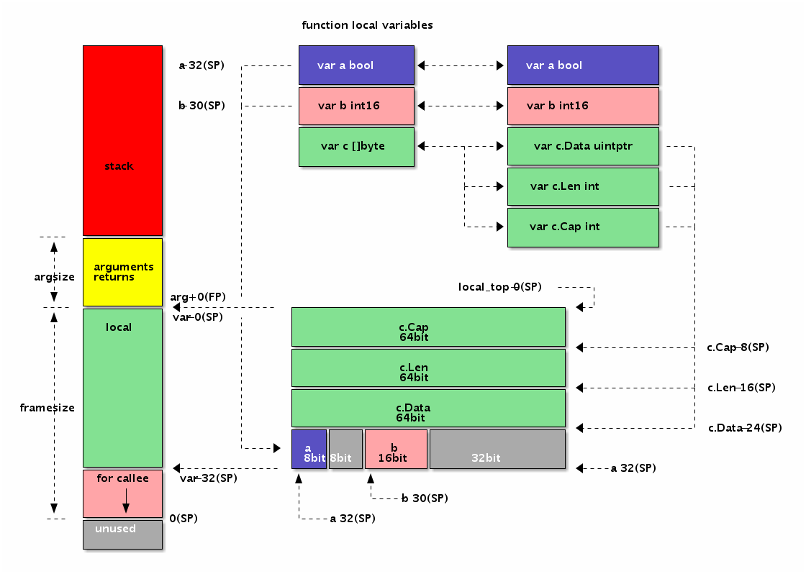

# 局部变量
   
便于访问局部变量，Go汇编语言引入了伪SP寄存器，对应当前栈帧的底部。因为在当前栈帧时栈的底部是固定不变的，因此局部变量的相对于伪SP的偏移量也就是固定的，
这可以简化局部变量的维护工作。SP真伪寄存器的区分只有一个原则：如果使用SP时有一个临时标识符前缀就是伪SP，否则就是真SP寄存器。
比如a(SP)和b+8(SP)有a和b临时前缀，这里都是伪SP，而前缀部分一般用于表示局部变量的名字。而(SP)和+8(SP)没有临时标识符作为前缀，它们都是真SP寄存器。

在X86平台，函数的调用栈是从高地址向低地址增长的，因此伪SP寄存器对应栈帧的底部其实是对应更大的地址。当前栈的顶部对应真实存在的SP寄存器，
对应当前函数栈帧的栈顶，对应更小的地址。如果整个内存用Memory数组表示，那么Memory[0(SP):end-0(SP)]就是对应当前栈帧的切片，
其中开始位置是真SP寄存器，结尾部分是伪SP寄存器。真SP寄存器一般用于表示调用其它函数时的参数和返回值，真SP寄存器对应内存较低的地址，
所以被访问变量的偏移量是正数；而伪SP寄存器对应高地址，对应的局部变量的偏移量都是负数。

## 代码
Go代码
```go
func Foo() {
	var c []byte
	var b int16
	var a bool
}

```

对应汇编
```assembly
TEXT ·Foo(SB), $32-0
MOVQ a-32(SP),      AX // a
MOVQ b-30(SP),      BX // b
MOVQ c_data-24(SP), CX // c.Data
MOVQ c_len-16(SP),  DX // c.Len
MOVQ c_cap-8(SP),   DI // c.Cap
RET
```
局部变量中先定义的变量c离伪SP寄存器对应的地址最近，最后定义的变量a离伪SP寄存器最远。有两个因素导致出现这种逆序的结果：
1. 一个从Go语言函数角度理解，先定义的c变量地址要比后定义的变量的地址更大；
2. 另一个是伪SP寄存器对应栈帧的底部，而X86中栈是从高向低生长的，所以最先定义有着更大地址的c变量离栈的底部伪SP更近