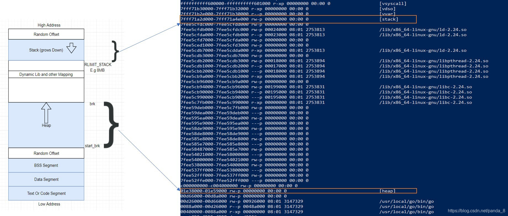

# Golang 的汇编是基于 Plan9 汇编的
## 汇编的简单知识
### 寄存器
    寄存器是CPU内部用来存放数据的一些小型存储区域，用来暂时存放参与运算的数据和运算结果。
   

1. 通用寄存器
下面是通用通用寄存器的名字在 IA64 和 plan9 中的对应关系：

	IA64	RAX	RBX	RCX	RDX	RDI	RSI	RBP	RSP	R8	R9	R10	R11	R12	R13	R14	RIP
	Plan9	AX	BX	CX	DX	DI	SI	BP	SP	R8	R9	R10	R11	R12	R13	R14	PC
<tr>助记符  名字    用途</tr>
<tr>AX  累加寄存器(AccumulatorRegister) 用于存放数据，包括算术、操作数、结果和临时存放地址</tr>
<tr>BX  基址寄存器(BaseRegister)        用于存放访问存储器时的地址</tr>
<tr>CX  计数寄存器(CountRegister)       用于保存计算值，用作计数器</tr>
<tr>DX  数据寄存器(DataRegister)        用于数据传递，在寄存器间接寻址中的I/O指令中存放I/O端口的地址</tr>
<tr>SP  堆栈顶指针(StackPointer)        如果是symbol+offset(SP)的形式表示go汇编的伪寄存器；如果是offset(SP)的形式表示硬件寄存器</tr>
<tr>BP  堆栈基指针(BasePointer)         保存在进入函数前的栈顶基址</tr>
<tr>SB  静态基指针(StaticBasePointer)   go汇编的伪寄存器。foo(SB)用于表示变量在内存中的地址，foo+4(SB)表示foo起始地址往后偏移四字节。一般用来声明函数或全局变量</tr>
<tr>FP  栈帧指针(FramePointer)          go汇编的伪寄存器。引用函数的输入参数，形式是symbol+offset(FP)，例如arg0+0(FP)</tr>
<tr>SI  源变址寄存器(SourceIndex)        用于存放源操作数的偏移地址</tr>
<tr>DI  目的寄存器(DestinationIndex)    用于存放目的操作数的偏移地址</tr>
	

Noted:Plan9 汇编的操作数方向和 Intel 汇编相反的，与 AT&T 类似。
```shell script
//plan9 汇编
MOVQ $123, AX
//intel汇编
mov rax, 123
```


2. 伪寄存器用来维护上下文、特殊标识等作用    
SB-> Static base pointer: global symbols.理解为原始内存
    是一个虚拟寄存器，保存了静态基地址(static-base) 指针，即我们程序地址空间的开始地址；
    foo(SB)可以用来定义全局的function和数据，foo<>(SB)表示foo只在当前文件可见，跟C中的static效果类似。
    此外可以在引用上加偏移量，如foo+4(SB)表示foo+4bytes的地址
    NOSPLIT：向编译器表明不应该插入 stack-split 的用来检查栈需要扩张的前导指令；
FP->Frame pointer: arguments and locals.    
    用来标识函数参数、返回值，编译器维护了基于FP偏移的栈上参数指针，
    0(FP)表示function的第一个参数，8(FP)表示第二个参数(64位系统上)后台加上偏移量就可以访问更多的参数。
    使用形如 symbol+offset(FP) 的方式，引用函数的输入参数；
    与伪SP寄存器的关系是:
        a.若本地变量或者栈调用存严格split关系(无NOSPLIT)，伪FP=伪SP+16
            否则 伪FP=伪SP+8
        b.FP是访问入参、出参的基址，一般用正向偏移来寻址，SP是访问本地变量的起始基址，一般用负向偏移来寻址
            修改硬件SP，会引起伪SP、FP同步变化
            eg: SUBQ $16, SP // 这里golang解引用时，伪SP/FP都会-16
SP->Stack pointer: top of stack. (栈指针)    
    plan9 的这个 SP 寄存器指向当前栈帧的局部变量的开始位置，使用形如 symbol+offset(SP) 的方式，
	引用函数的局部变量，注意：这个寄存器与上文的寄存器是不一样的，这里是伪寄存器，而我们展示出来的都是硬件寄存器.
	所以区分 SP 到底是指硬件 SP 还是指虚拟寄存器，需要以特定的格式来区分。
	eg：symbol+offset(SP) 则表示伪寄存器 SP。
	eg：offset(SP) 则表示硬件 SP
	伪SP：本地变量最高起始地址
    硬件SP：函数栈真实栈顶地址
PC-> Program counter: jumps and branches.    
    实际上就是在体系结构的知识中常见的PC寄存器，在x86平台下对应ip寄存器，amd64上则是rip。

Noted:所有用户空间的数据都可以通过FP/SP(局部数据、输入参数、返回值)和SB(全局数据)访问。通常情况下，不会对SB/FP寄存器进行运算操作，
通常情况会以SB/FP/SP作为基准地址，进行偏移、解引用等操作


 

1. 静态数据区：存放的是全局变量与常量。这些变量的地址编译的时候就确定了（这也是使用虚拟地址的好处，如果是物理地址，这些地址编译的时候是不可能确定的）。
	Data 与 BSS 都属于这一部分。这部分只有程序中止（kill 掉、crasg 掉等）才会被销毁。
	a. BSS段->BSS segment:通常是指用来存放程序中未初始化的全局变量的一块内存区域。BSS是英文BlockStarted by Symbol的简称。
		BSS段属于静态内存分配。

	b. 数据段-> DATA segment通常是指用来存放程序中已初始化的全局变量的一块内存区域。数据段属于静态内存分配。

2. 代码区Text ->code segment/text segment：存放的就是我们编译后的机器码，一般来说这个区域只能是只读。

3. 栈区->stack：主要是 Golang 里边的函数、方法以及其本地变量存储的地方。这部分伴随函数、方法开始执行而分配，运行完后就被释放，
	特别注意这里的释放并不会清空内存。还有一个点需要记住栈一般是从高地址向低地址方向分配，
	换句话说：高地址属于栈底，低地址属于栈顶，它分配方向与堆是相反的。

4. 堆区->heap：像 C/C++ 语言，堆完全是程序员自己控制的。但是 Golang 里边由于有 GC 机制，我们写代码的时候并不需要关心内存是在栈还是堆上分配。
	Golang 会自己判断如果变量的生命周期在函数退出后还不能销毁或者栈上资源不够分配等等情况，就会被放到堆上。堆的性能会比栈要差一些。


逃逸分析：
	如果变量被分配到栈上，会伴随函数调用结束自动回收，并且分配效率很高；其次分配到堆上，则需要 GC 进行标记回收。所谓逃逸就是指变量从栈上逃到了堆上。
	go 也提供了更方便的命令来进行逃逸分析：go build -gcflags="-m"，如果真的是做逃逸分析，建议使用该命令，别折腾用汇编


运行分析
	很多时候我们无法确定一块代码是如何执行的，需要通过生成汇编、反汇编来研究
		有三种方法可以输出go代码的汇编代码：
```go
// 编译   
	1. go build -gcflags="-S"  hello.go 生成最终二进制文件    
	2. go tool compile -S hello.go  生成obj文件    
	   go tool compile -N -S hello.go // -N 禁止优化 -S 输出汇编代码 -l 禁止内联   
// 反编译   
	3. 先go build然后在go tool objdump 对二进制文件进行反汇编   
	go tool objdump <binary>    
	go tool objdump -s <method name> <binary> //反汇编指定函数   
//方法一、二生成的过程中的汇编   
//方法三 生成的事最终机器码的汇编
```
		   
###内联    
	如果学过c/c++就知道，通过inline关键字修饰的函数叫做内联函数。内联函数的优势是在编译过程中直接展开函数中的代码，将其替换到源码的函数调用位置，
	这样可以节省函数调用的消耗，提高运行速度。适用于函数体短小且频繁调用的函数，如果函数体太大了，会增大目标代码。是一种空间换时间的做法。
	go编译器会智能判断对代码进行优化和使用汇编
	go build -gcflags="-N -l -S" file来获得汇编代码。    
常见指令    
MOVQ	传送	数据传送	MOVQ 48, AX表示把48传送AX中    
LEAQ	传送	地址传送	LEAQ AX, BX表示把AX有效地址传送到BX中    
PUSHQ	传送	栈压入	PUSHQ AX表示先修改栈顶指针，将AX内容送入新的栈顶位置(在go汇编中使用SUBQ代替)    
POPQ	传送	栈弹出	POPQ AX表示先弹出栈顶的数据，然后修改栈顶指针(在go汇编中使用ADDQ代替)   
ADDQ	运算	相加并赋值	ADDQ BX, AX表示BX和AX的值相加并赋值给AX    
SUBQ	运算	相减并赋值	略，同上   
IMULQ	运算	无符号乘法	略，同上   
IDIVQ	运算	无符号除法	IDIVQ CX除数是CX，被除数是AX，结果存储到AX中   
CMPQ	运算	对两数相减，比较大小	CMPQ SI CX表示比较SI和CX的大小。与SUBQ类似，只是不返回相减的结果   
CALL	转移	调用函数	CALL runtime.printnl(SB)表示通过<mark>printnl</mark>函数的内存地址发起调用   
JMP	转移	无条件转移指令	JMP 389无条件转至0x0185地址处(十进制389转换成十六进制0x0185)   
JLS	转移	条件转移指令	JLS 389上一行的比较结果，左边小于右边则执行跳到0x0185地址处(十进制389转换成十六进制0x0185)   

1。 栈扩大、缩小：plan9 中栈操作并没有使用push，pop，而是采用sub 跟add SP。   
	SUBQ $0x18, SP // 对 SP 做减法，为函数分配函数栈帧
	ADDQ $0x18, SP // 对 SP 做加法，清除函数栈帧
2。 数据copy    
	MOVB $1, DI      // 1 byte
	MOVW $0x10, BX   // 2 bytes
	MOVD $1, DX      // 4 bytes
	MOVQ $-10, AX     // 8 bytes
3。 计算指令   
	ADDQ  AX, BX   // BX += AX
	SUBQ  AX, BX   // BX -= AX
	IMULQ AX, BX   // BX *= AX
4。 跳转   
	// 无条件跳转
	JMP addr   // 跳转到地址，地址可为代码中的地址，不过实际上手写不会出现这种东西
	JMP label  // 跳转到标签，可以跳转到同一函数内的标签位置
	JMP 2(PC)  // 以当前指令为基础，向前/后跳转 x 行
	JMP -2(PC) // 同上
	// 有条件跳转
	JNZ target // 如果 zero flag 被 set 过，则跳转
5。 变量声明    
	在汇编里所谓的变量，一般是存储在 .rodata 或者 .data 段中的只读值。对应到应用层的话，就是已初始化过的全局的 const、var、static 变量/常量。
	格式：
		DATA    symbol+offset(SB)/width, value
		使用 DATA 结合 GLOBL 来定义一个变量
		GLOBL 必须跟在 DATA 指令之后:
		DATA age+0x00(SB)/4, $18  // forever 18
		GLOBL age(SB), RODATA, $4

		DATA pi+0(SB)/8, $3.1415926
		GLOBL pi(SB), RODATA, $8

		DATA birthYear+0(SB)/4, $1988
		GLOBL birthYear(SB), RODATA, $4


6. 函数声明    
	// 该声明一般写在任意一个 .go 文件中，例如：add.go
	func add(a, b int) int

// 函数实现   
// 该实现一般写在 与声明同名的 _{Arch}.s 文件中，例如：add_amd64.s
```shell
TEXT pkgname·add(SB), NOSPLIT, $0-16
    MOVQ a+0(FP), AX
    MOVQ a+8(FP), BX
    ADDQ AX, BX
    MOVQ BX, ret+16(FP)
    RET
```


pkgname 包名可以不写，一般都是不写的，可以参考 go 的源码， 另外 add 前的 · 不是 .

代码存储在TEXT段中
                           参数及返回值大小
                                 |
 TEXT pkgname·add(SB),NOSPLIT,$0-16
         |     |               |
        包名  函数名    栈帧大小(局部变量+可能需要的额外调用函数的参数空间的总大小，
                               但不包括调用其它函数时的 ret address 的大小)


以上使用的 RODATA，NOSPLIT flag，还有其他的值，可以参考：https://golang.org/doc/asm#directives  
```shell
	#include textflag.h

	NOPROF = 1
	(For TEXT items.) Don’t profile the marked function. This flag is deprecated.
	DUPOK = 2
	It is legal to have multiple instances of this symbol in a single binary. The linker will choose one of the duplicates to use.
	NOSPLIT = 4
	(For TEXT items.) Don’t insert the preamble to check if the stack must be split. The frame for the routine, plus anything it calls, must fit in the spare space at the top of the stack segment. Used to protect routines such as the stack splitting code itself.
	RODATA = 8
	(For DATA and GLOBL items.) Put this data in a read-only section.
	NOPTR = 16
	(For DATA and GLOBL items.) This data contains no pointers and therefore does not need to be scanned by the garbage collector.
	WRAPPER = 32
	(For TEXT items.) This is a wrapper function and should not count as disabling recover.
	NEEDCTXT = 64
	(For TEXT items.) This function is a closure so it uses its incoming context register.
```


标志位
    助记符	名字	用途    
    OF	溢出	0为无溢出 1为溢出    
    CF	进位	0为最高位无进位或错位 1为有       
    PF	奇偶	0表示数据最低8位中1的个数为奇数，1则表示1的个数为偶数   
    AF	辅助进位	   
    ZF	零	0表示结果不为0 1表示结果为0   
    SF	符号	0表示最高位为0 1表示最高位为1   

真假 SP/FP/BP关系    
```css


							   caller                                                                                 
						  +------------------+                                                                              
						  |                  |                                                                         
+---------------------->  --------------------                                                                             
|                         |                  |                                                                         
|                         | caller parent BP |                                                                         
|           BP(pseudo SP) --------------------                                                                         
|                         |                  |                                                                         
|                         |   Local Var0     |                                                                         
|                         --------------------                                                                         
|                         |                  |                                                                         
|                         |   .......        |                                                                         
|                         --------------------                                                                         
|                         |                  |                                                                         
|                         |   Local VarN     |                                                                         
						 --------------------                                                                         
caller stack frame        |                  |                                                                         
|   					  |  callee arg2     |                                                                         
|                         |------------------|                                                                         
|                         |                  |                                                                         
|                         |   callee arg1    |                                                                         
|                         |------------------|                                                                         
|                         |                  |                                                                         
|                         |   callee arg0    |                                                                         
|                         ----------------------------------------------+   FP(virtual register)                       
|                         |                  |                          |                                              
|                         |   return addr    |  parent return address   |                                              
+---------------------->  +------------------+---------------------------    <-------------------------------+         
											 |  caller BP               |                                    |         
											 |  (caller frame pointer)  |                                    |         
							  BP(pseudo SP)  ----------------------------                                    |         
											 |                          |                                    |         
											 |     Local Var0           |                                    |         
											 ----------------------------                                    |         
											 |                          |                                              
											 |     Local Var1           |                                              
											----------------------------                            callee stack frame
											 |                          |                                              
											 |       .....              |                                              
											----------------------------                                     |         
											 |                          |                                    |         
											 |     Local VarN           |                                    |         
							SP(Real Register) ----------------------------                                   |         
											 |                          |                                    |         
											 |                          |                                    |         
											 |                          |                                    |         
											 |                          |                                    |         
											 |                          |                                    |         
											 +--------------------------+    <-------------------------------+

                                                              callee

```
地址运算   
	lea( Load Effective Address),amd64 平台地址都是 8 个字节，所以直接就用 LEAQ   
```shell
	LEAQ (BX)(AX*8), CX   
	// 上面代码中的 8 代表 scale
	// scale 只能是 0、2、4、8
	// 如果写成其它值:
	// LEAQ (BX)(AX*3), CX
	// ./a.s:6: bad scale: 3
	
	// 用 LEAQ 的话，即使是两个寄存器值直接相加，也必须提供 scale
	// 下面这样是不行的
	// LEAQ (BX)(AX), CX
	// asm: asmidx: bad address 0/2064/2067
	// 正确的写法是
	LEAQ (BX)(AX*1), CX
	
	
	// 在寄存器运算的基础上，可以加上额外的 offset
	LEAQ 16(BX)(AX*1), CX
	
	// 三个寄存器做运算，还是别想了
	// LEAQ DX(BX)(AX*8), CX
	// ./a.s:13: expected end of operand, found (
```


