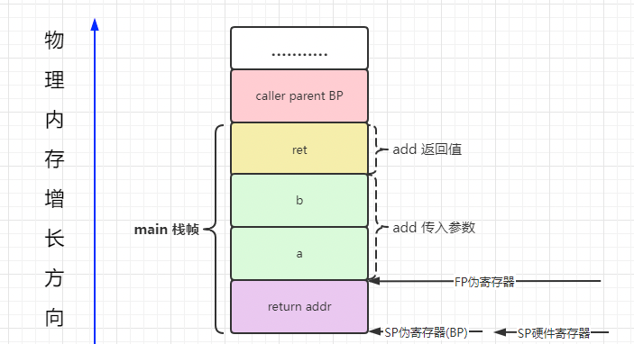
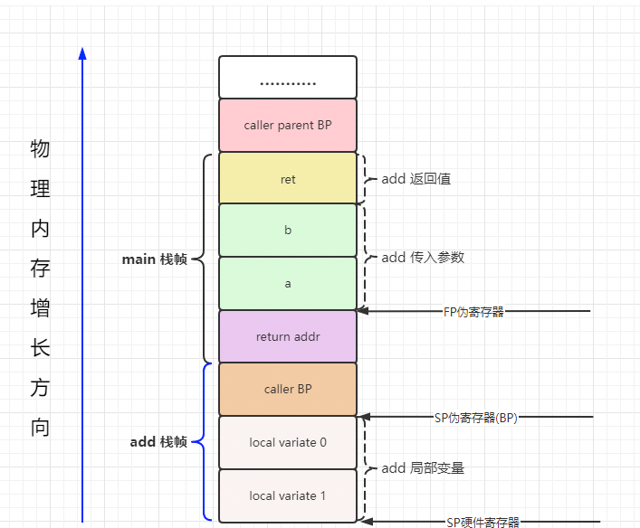

<!-- START doctoc generated TOC please keep comment here to allow auto update -->
<!-- DON'T EDIT THIS SECTION, INSTEAD RE-RUN doctoc TO UPDATE -->
**Table of Contents**  *generated with [DocToc](https://github.com/thlorenz/doctoc)*

- [Golang 汇编(基于 Plan9 汇编)](#golang-%E6%B1%87%E7%BC%96%E5%9F%BA%E4%BA%8E-plan9-%E6%B1%87%E7%BC%96)
  - [基本概念](#%E5%9F%BA%E6%9C%AC%E6%A6%82%E5%BF%B5)
  - [1. 通用寄存器](#1-%E9%80%9A%E7%94%A8%E5%AF%84%E5%AD%98%E5%99%A8)
  - [2. 伪寄存器](#2-%E4%BC%AA%E5%AF%84%E5%AD%98%E5%99%A8)
    - [1 SB-> Static base pointer: global symbols.](#1-sb--static-base-pointer-global-symbols)
    - [2 SP->Stack pointer(栈指针):](#2-sp-stack-pointer%E6%A0%88%E6%8C%87%E9%92%88)
      - [伪寄存器的内存模型：真假 SP/FP/BP关系](#%E4%BC%AA%E5%AF%84%E5%AD%98%E5%99%A8%E7%9A%84%E5%86%85%E5%AD%98%E6%A8%A1%E5%9E%8B%E7%9C%9F%E5%81%87-spfpbp%E5%85%B3%E7%B3%BB)
    - [3 FP->Frame pointer: arguments and locals.](#3-fp-frame-pointer-arguments-and-locals)
    - [4 PC-> Program counter: jumps and branches.](#4-pc--program-counter-jumps-and-branches)
  - [3. 内联](#3-%E5%86%85%E8%81%94)
  - [4. 常见指令](#4-%E5%B8%B8%E8%A7%81%E6%8C%87%E4%BB%A4)
  - [汇编操作](#%E6%B1%87%E7%BC%96%E6%93%8D%E4%BD%9C)
  - [参考资料](#%E5%8F%82%E8%80%83%E8%B5%84%E6%96%99)

<!-- END doctoc generated TOC please keep comment here to allow auto update -->

# Golang 汇编(基于 Plan9 汇编)

Go 编译器会输出一种抽象可移植的汇编代码，这种汇编并不对应某种真实的硬件架构。Go 的汇编器会使用这种伪汇编，再为目标硬件生成具体的机器指令。

伪汇编这一个额外层可以带来很多好处，最主要的一点是方便将 Go 移植到新的架构上。

Go 汇编使用的是caller-save模式，被调用函数的入参参数、返回值都由调用者维护、准备。
因此，当需要调用一个函数时，需要先将这些工作准备好，才调用下一个函数，另外这些都需要进行内存对齐，对齐的大小是 sizeof(uintptr)。

## 基本概念

- 栈：进程、线程、goroutine 都有自己的调用栈，先进后出（FILO）
- 栈帧：可以理解是函数调用时，在栈上为函数所分配的内存区域
- 调用者：caller，比如：A 函数调用了 B 函数，那么 A 就是调用者
- 被调者：callee，比如：A 函数调用了 B 函数，那么 B 就是被调者

## 1. 通用寄存器
下面是通用通用寄存器的名字在 IA64(英特尔安腾架构（Intel Itanium architecture）) 和 plan9 中的对应关系：
```css
IA64	RAX	RBX	RCX	RDX	RDI	RSI	RBP	RSP	R8	R9	R10	R11	R12	R13	R14	RIP
Plan9	AX	BX	CX	DX	DI	SI	BP	SP	R8	R9	R10	R11	R12	R13	R14	PC
```
应用代码层面会用到的通用寄存器主要是: rax, rbx, rcx, rdx, rdi, rsi, r8~r15 这 14 个寄存器，虽然 rbp 和 rsp 也可以用，不过 bp 和 sp 会被用来管理栈顶和栈底，最好不要拿来进行运算。

Note: plan9 中使用寄存器不需要带 r 或 e 的前缀，例如 rax，只要写 AX 即可
```assembly
MOVQ $101, AX = mov rax, 101
```

```html
<tr>助记符  名字    用途</tr>
<tr>AX  累加寄存器(AccumulatorRegister) 用于存放数据，包括算术、操作数、结果和临时存放地址</tr>
<tr>BX  基址寄存器(BaseRegister)        用于存放访问存储器时的地址</tr>
<tr>CX  计数寄存器(CountRegister)       用于保存计算值，用作计数器</tr>
<tr>DX  数据寄存器(DataRegister)        用于数据传递，在寄存器间接寻址中的I/O指令中存放I/O端口的地址</tr>
<tr>SP  堆栈顶指针(StackPointer)        如果是symbol+offset(SP)的形式表示go汇编的伪寄存器；如果是offset(SP)的形式表示硬件寄存器</tr>
<tr>BP  堆栈基指针(BasePointer)         保存在进入函数前的栈顶基址</tr>
<tr>SB  静态基指针(StaticBasePointer)   go汇编的伪寄存器。foo(SB)用于表示变量在内存中的地址，foo+4(SB)表示foo起始地址往后偏移四字节。一般用来声明函数或全局变量</tr>
<tr>FP  栈帧指针(FramePointer)          go汇编的伪寄存器。引用函数的输入参数，形式是symbol+offset(FP)，例如arg0+0(FP)</tr>
<tr>SI  源变址寄存器(SourceIndex)        用于存放源操作数的偏移地址</tr>
<tr>DI  目的寄存器(DestinationIndex)    用于存放目的操作数的偏移地址</tr>
```

Noted: Plan9 汇编的操作数方向和 Intel 汇编相反的，与 AT&T 类似。
```shell script
# plan9 汇编           # intel汇编
MOVQ $0x10, AX ===== mov rax, 0x10
       |    |------------|      |
       |------------------------|
       

```

## 2. 伪寄存器
Go 的汇编还引入了 4 个伪寄存器:用来维护上下文、特殊标识等作用

### 1 SB-> Static base pointer: global symbols. 
理解为原始内存,是一个虚拟寄存器，保存了静态基地址(static-base) 指针，即我们程序地址空间的开始地址；

    全局静态基指针，一般用来声明函数或全局变量，foo(SB)可以用来定义全局的function和数据，foo<>(SB)表示foo只在当前文件可见，跟C中的static效果类似。
    如果在另外文件中引用该变量的话，会报 relocation target not found 的错误。
    此外可以在引用上加偏移量，如foo+4(SB)表示foo+4bytes的地址.
    NOSPLIT：向编译器表明不应该插入 stack-split 的用来检查栈需要扩张的前导指令；


### 2 SP->Stack pointer(栈指针): 


SP寄存器 分为伪 SP 寄存器和硬件 SP 寄存器。

- 伪SP：指向当前栈帧第一个局部变量的结束位置；symbol+offset(SP) 形式，则表示伪寄存器 SP （这个也简称为 BP）。
- 硬件SP：函数栈真实栈顶地址,指向的是整个函数栈结束的位置。如果是 offset(SP) 则表示硬件寄存器 SP。

    plan9 的这个 SP 寄存器指向当前栈帧的局部变量的开始位置，使用形如 symbol+offset(SP) 的方式，offset 的合法取值是 [-framesize, 0)，注意是个左闭右开的区间。
    假如局部变量都是 8 字节，那么第一个局部变量就可以用 localvar0-8(SP) 来表示。


Note: 
- 有个比较坑的地方,对于编译输出(go tool compile -S / go tool objdump)的代码来讲，目前所有的 SP 都是硬件寄存器 SP，无论是否带 symbol。
- callee 的 return addr 也是在 caller 的栈上的
- 所有用户空间的数据都可以通过FP/SP(局部数据、输入参数、返回值)和SB(全局数据)访问。通常情况下，不会对SB/FP寄存器进行运算操作，通常情况会以SB/FP/SP作为基准地址，进行偏移、解引用等操作.
- 在栈帧 size 为 0 的情况下(没有局部变量)，伪寄存器 SP 和硬件寄存器 SP 指向同一位置。伪 SP 栈指针对应的是当前 callee 函数栈帧的底部（不包括参数和返回值部分），一般用于定位局部变量。伪 SP 是一个比较特殊的寄存器，因为还存在一个同名的 SP 硬件寄存器，硬件 SP 寄存器对应的是栈的顶部
- callee的栈空间大小是0的话， caller BP 是不会被压入栈中的，此时的SP硬件寄存器和伪FP寄存器指向的是同一个位置。


函数声明
```go
// main.go
package main

func add(int, int) int

func main() {
	print(add(10, 20))
}
```

1. 使用硬BP寄存器

```shell
// func_amd64.s
TEXT ·add(SB), $0-24
    MOVQ 8(SP), AX
    MOVQ 16(SP), BX
    ADDQ BX, AX
    MOVQ AX, 24(SP)
    RET

```

2. 使用伪SP寄存器

```shell
// func_amd64.s
TEXT ·add(SB), $16-24
    MOVQ a+16(SP), AX
    MOVQ b+24(SP), BX
    ADDQ BX, AX
    MOVQ AX, ret+32(SP)
    RET
```

3. 使用FP寄存器
```cgo
// 该声明一般写在任意一个 .go 文件中，例如：add.go
func add(a, b int) int
// 函数实现   
// 该实现一般写在 与声明同名的 _{Arch}.s 文件中，例如：add_amd64.s
TEXT pkgname·add(SB), NOSPLIT, $0-16
    MOVQ a+0(FP), AX
    MOVQ a+8(FP), BX
    ADDQ AX, BX
    MOVQ BX, ret+16(FP)
    RET
```


FP 与 伪SP寄存器的关系是:
- a. 若本地变量或者栈调用存严格split关系(无NOSPLIT)，伪FP=伪SP+16,否则 伪FP=伪SP+8
- b. FP是访问入参、出参的基址，一般用正向偏移来寻址，SP是访问本地变量的起始基址，一般用负向偏移来寻址,修改硬件SP，会引起伪SP、FP同步变化 
```shell
SUBQ $16, SP // 这里golang解引用时, 伪SP/FP都会-16
```


####  伪寄存器的内存模型：真假 SP/FP/BP关系
调用栈call stack，简称栈，是一种栈数据结构，用于存储有关计算机程序的活动 subroutines 信息。
在计算机编程中，subroutines 是执行特定任务的一系列程序指令，打包为一个单元

栈帧stack frame又常被称为帧frame是在调用栈中储存的函数之间的调用关系，每一帧对应了函数调用以及它的参数数据。


FP 和 Go 的官方源代码里的 framepointer 不是一回事，源代码里的 framepointer 指的是 caller BP 寄存器的值，在这里和 caller 的伪 SP 是值是相等的。

BP：基准指针寄存器，维护当前栈帧的基准地址，以便用来索引变量和参数，就像一个锚点一样，在其它架构中它等价于帧指针FP，只是在x86架构下，变量和参数都可以通过SP来索引；


 

1. 静态数据区：存放的是全局变量与常量。这些变量的地址编译的时候就确定了（这也是使用虚拟地址的好处，如果是物理地址，这些地址编译的时候是不可能确定的）。
	Data 与 BSS 都属于这一部分。这部分只有程序中止（kill 掉、crasg 掉等）才会被销毁。
	a. BSS段->BSS segment:通常是指用来存放程序中未初始化的全局变量的一块内存区域。BSS是英文BlockStarted by Symbol的简称。
		BSS段属于静态内存分配。

	b. 数据段-> DATA segment通常是指用来存放程序中已初始化的全局变量的一块内存区域。数据段属于静态内存分配。

2. 代码区Text ->code segment/text segment：存放的就是我们编译后的机器码，一般来说这个区域只能是只读。

3. 栈区 stack：主要是 Golang 里边的函数、方法以及其本地变量存储的地方。这部分伴随函数、方法开始执行而分配，运行完后就被释放，
	特别注意这里的释放并不会清空内存。还有一个点需要记住栈一般是从高地址向低地址方向分配，
	换句话说：高地址属于栈底，低地址属于栈顶，它分配方向与堆是相反的。

4. 堆区 heap：像 C/C++ 语言，堆完全是程序员自己控制的。但是 Golang 里边由于有 GC 机制，我们写代码的时候并不需要关心内存是在栈还是堆上分配。
	Golang 会自己判断如果变量的生命周期在函数退出后还不能销毁或者栈上资源不够分配等等情况，就会被放到堆上。堆的性能会比栈要差一些。

### 3 FP->Frame pointer: arguments and locals.

官方文档虽然将伪寄存器 FP 称之为 frame pointer，实际上它根本不是 frame pointer，按照传统的 x86 的习惯来讲，frame pointer 是指向整个 stack frame 底部的 BP 寄存器。
> 尽管官方文档说 "All user-defined symbols are written as offsets to the pseudo-register FP(arguments and locals)"

实际这个原则只是在手写的代码场景下才是有效的。
与大多数最近的编译器做法一样，Go 工具链总是在其生成的代码中，使用相对栈指针(stack-pointer)的偏移量来引用参数和局部变量。


作用：伪 FP 寄存器对应的是 caller 函数的帧指针，一般用来访问 callee 函数的入参参数和返回值.当前的 callee 函数是 add，在 add 的代码中引用 FP，该 FP 指向的位置不在 callee 的 stack frame 之内，而是在 caller 的 stack frame 上。

例如
```shell
arg0+0(FP)
arg1+8(FP)
```
解释：
- 使用 FP 不加 symbol 时，无法通过编译，在汇编层面来讲，symbol 并没有什么用，加 symbol 主要是为了提升代码可读性.
- 0(FP)表示function的第一个参数
- 8(FP)表示第二个参数(64位系统上)后台加上偏移量就可以访问更多的参数。


### 4 PC-> Program counter: jumps and branches.

实际上就是在体系结构的知识中常见的PC寄存器，在x86平台下对应ip寄存器，amd64上则是rip。


## 3. 内联    

如果学过c/c++就知道，通过inline关键字修饰的函数叫做内联函数。内联函数的优势是在编译过程中直接展开函数中的代码，将其替换到源码的函数调用位置，
这样可以节省函数调用的消耗，提高运行速度。适用于函数体短小且频繁调用的函数，如果函数体太大了，会增大目标代码。是一种空间换时间的做法。
go编译器会智能判断对代码进行优化和使用汇编
go build -gcflags="-N -l -S" file来获得汇编代码。

## 4. 常见指令
数据宽度-Bit、Byte、Word、Dword、Qword

1. 栈扩大、缩小：栈的增长和收缩是通过在栈指针寄存器 SP 上分别执行减法和加法指令来实现的,plan9 中，Go 编译器不会生成任何 PUSH/POP 族的指令，而是采用sub 跟add SP。  
```cgo
SUBQ $0x18, SP // 对 SP 做减法，为函数分配函数栈帧
ADDQ $0x18, SP // 对 SP 做加法，清除函数栈帧
```

2. 数据copy: 常数在 plan9 汇编用 $num 表示，可以为负数，默认情况下为十进制。搬运的长度是由 MOV 的后缀决定 
```cgo
MOVB $1, DI      // 1 byte
MOVW $0x10, BX   // 2 bytes
MOVD $1, DX      // 4 bytes
MOVQ $-10, AX     // 8 bytes
```
- byte，即8位
- word，即16位
- double word
- quadra word


搬运的长度是由 MOV 的后缀决定的，这一点与 intel 汇编稍有不同，看看类似的 X64 汇编:
```assem
mov rax, 0x1   // 8 bytes
mov eax, 0x100 // 4 bytes
mov ax, 0x22   // 2 bytes
mov ah, 0x33   // 1 byte
mov al, 0x44   // 1 byte
```


还有一点区别是在使用 MOVQ 的时候会有看到带括号和不带括号的区别。
```assembly
// 加括号代表是指针的引用
MOVQ (AX), BX   // => BX = *AX 将AX指向的内存区域8byte赋值给BX
MOVQ 16(AX), BX // => BX = *(AX + 16)

//不加括号是值的引用
MOVQ AX, BX     // => BX = AX 将AX中存储的内容赋值给BX，注意区别
```

3. 计算指令   
```cgo
ADDQ  AX, BX   // BX += AX
SUBQ  AX, BX   // BX -= AX
IMULQ AX, BX   // BX *= AX
```

4.  跳转   
```cgo
// 无条件跳转
JMP addr   // 跳转到地址，地址可为代码中的地址，不过实际上手写不会出现这种东西
JMP label  // 跳转到标签，可以跳转到同一函数内的标签位置
JMP 2(PC)  // 以当前指令为基础，向前跳转 x 行
JMP -2(PC) // 以当前指令为基础，向后跳转 x 行

// 有条件跳转
JNZ target // 如果 zero flag (ZF标志寄存器)被 set 过，则跳转
```


5. 地址运算LEA(Load Effective Address),amd64 平台地址都是 8 个字节，所以直接就用 LEAQ   

```assembly
LEAQ (BX)(AX*8), CX    // => CX = BX + (AX * 8) 

// 上面代码中的 8 代表 scale, scale 只能是 0、2、4、8 ,如果写成其它值:
// LEAQ (BX)(AX*3), CX
// ./a.s:6: bad scale: 3

// 用 LEAQ 的话，即使是两个寄存器值直接相加，也必须提供 scale
// 下面这样是不行的
// LEAQ (BX)(AX), CX
// asm: asmidx: bad address 0/2064/2067
// 正确的写法是
LEAQ (BX)(AX*1), CX


// 在寄存器运算的基础上，可以加上额外的 offset
LEAQ 16(BX)(AX*1), CX

// 三个寄存器做运算，还是别想了
// LEAQ DX(BX)(AX*8), CX
// ./a.s:13: expected end of operand, found 

```


## 汇编操作


1. go build -gcflags="-N -l -S"  hello.go 直接输出汇编    

2. go tool compile -S -N -l hello.go  // 生成obj文件,并输出到终端    
```shell
GOOS=linux GOARCH=amd64 go tool compile -S -N -l hello.go>hello.s  // 生成obj文件,并输出到文件   
```


 
3. 先go build然后在go tool objdump 对二进制文件进行反汇编   
```shell
go build -gcflags "-N -l" main.go
go tool objdump <binary>    
go tool objdump -s <method name> <binary> # 反汇编指定函数 go tool objdump -s "main." main
```

在使用这些命令时，加上对应的 flag，否则某些逻辑会被编译器优化掉，而看不到对应完整的汇编代码

- 方法一、二 生成的是过程中的汇编   
- 方法三 生成的是最终机器码的汇编


## 参考资料
1. [曹大汇编](https://go.xargin.com/docs/assembly/assembly/#%E5%9F%BA%E6%9C%AC%E6%8C%87%E4%BB%A4)

