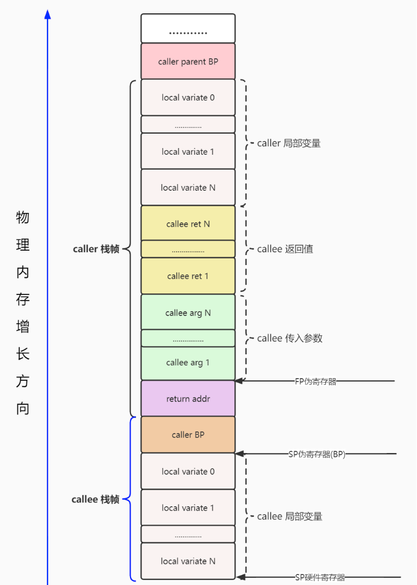

# Golang 汇编(基于 Plan9 汇编)

Go 编译器会输出一种抽象可移植的汇编代码，这种汇编并不对应某种真实的硬件架构。Go 的汇编器会使用这种伪汇编，再为目标硬件生成具体的机器指令。

伪汇编这一个额外层可以带来很多好处，最主要的一点是方便将 Go 移植到新的架构上。

## 1. 通用寄存器
下面是通用通用寄存器的名字在 IA64(英特尔安腾架构（Intel Itanium architecture）) 和 plan9 中的对应关系：
```css
IA64	RAX	RBX	RCX	RDX	RDI	RSI	RBP	RSP	R8	R9	R10	R11	R12	R13	R14	RIP
Plan9	AX	BX	CX	DX	DI	SI	BP	SP	R8	R9	R10	R11	R12	R13	R14	PC
```
应用代码层面会用到的通用寄存器主要是: rax, rbx, rcx, rdx, rdi, rsi, r8~r15 这 14 个寄存器，虽然 rbp 和 rsp 也可以用，不过 bp 和 sp 会被用来管理栈顶和栈底，最好不要拿来进行运算。

Note: plan9 中使用寄存器不需要带 r 或 e 的前缀，例如 rax，只要写 AX 即可
```assembly
MOVQ $101, AX = mov rax, 101
```

```html
<tr>助记符  名字    用途</tr>
<tr>AX  累加寄存器(AccumulatorRegister) 用于存放数据，包括算术、操作数、结果和临时存放地址</tr>
<tr>BX  基址寄存器(BaseRegister)        用于存放访问存储器时的地址</tr>
<tr>CX  计数寄存器(CountRegister)       用于保存计算值，用作计数器</tr>
<tr>DX  数据寄存器(DataRegister)        用于数据传递，在寄存器间接寻址中的I/O指令中存放I/O端口的地址</tr>
<tr>SP  堆栈顶指针(StackPointer)        如果是symbol+offset(SP)的形式表示go汇编的伪寄存器；如果是offset(SP)的形式表示硬件寄存器</tr>
<tr>BP  堆栈基指针(BasePointer)         保存在进入函数前的栈顶基址</tr>
<tr>SB  静态基指针(StaticBasePointer)   go汇编的伪寄存器。foo(SB)用于表示变量在内存中的地址，foo+4(SB)表示foo起始地址往后偏移四字节。一般用来声明函数或全局变量</tr>
<tr>FP  栈帧指针(FramePointer)          go汇编的伪寄存器。引用函数的输入参数，形式是symbol+offset(FP)，例如arg0+0(FP)</tr>
<tr>SI  源变址寄存器(SourceIndex)        用于存放源操作数的偏移地址</tr>
<tr>DI  目的寄存器(DestinationIndex)    用于存放目的操作数的偏移地址</tr>
```

Noted: Plan9 汇编的操作数方向和 Intel 汇编相反的，与 AT&T 类似。
```shell script
# plan9 汇编           # intel汇编
MOVQ $0x10, AX ===== mov rax, 0x10
       |    |------------|      |
       |------------------------|
       

```

## 2. 伪寄存器
Go 的汇编还引入了 4 个伪寄存器:用来维护上下文、特殊标识等作用

1. SB-> Static base pointer: global symbols. 理解为原始内存,是一个虚拟寄存器，保存了静态基地址(static-base) 指针，即我们程序地址空间的开始地址；

    全局静态基指针，一般用来声明函数或全局变量，foo(SB)可以用来定义全局的function和数据，foo<>(SB)表示foo只在当前文件可见，跟C中的static效果类似。
    如果在另外文件中引用该变量的话，会报 relocation target not found 的错误。
    此外可以在引用上加偏移量，如foo+4(SB)表示foo+4bytes的地址.
    NOSPLIT：向编译器表明不应该插入 stack-split 的用来检查栈需要扩张的前导指令；

2. FP->Frame pointer: arguments and locals.用来标识函数参数、返回值，编译器维护了基于FP偏移的栈上参数指针.

    例如 arg0+0(FP)，arg1+8(FP)，使用 FP 不加 symbol 时，无法通过编译，在汇编层面来讲，symbol 并没有什么用，加 symbol 主要是为了提升代码可读性.

    0(FP)表示function的第一个参数，8(FP)表示第二个参数(64位系统上)后台加上偏移量就可以访问更多的参数。

    另外，官方文档虽然将伪寄存器 FP 称之为 frame pointer，实际上它根本不是 frame pointer，按照传统的 x86 的习惯来讲，frame pointer 是指向整个 stack frame 底部的 BP 寄存器。
    假如当前的 callee 函数是 add，在 add 的代码中引用 FP，该 FP 指向的位置不在 callee 的 stack frame 之内，而是在 caller 的 stack frame 上。

    尽管官方文档说 "All user-defined symbols are written as offsets to the pseudo-register FP(arguments and locals)"，实际这个原则只是在手写的代码场景下才是有效的。 与大多数最近的编译器做法一样，Go 工具链总是在其生成的代码中，使用相对栈指针(stack-pointer)的偏移量来引用参数和局部变量。
    与伪SP寄存器的关系是:
    - a. 若本地变量或者栈调用存严格split关系(无NOSPLIT)，伪FP=伪SP+16,否则 伪FP=伪SP+8
    - b. FP是访问入参、出参的基址，一般用正向偏移来寻址，SP是访问本地变量的起始基址，一般用负向偏移来寻址,修改硬件SP，会引起伪SP、FP同步变化 ,eg: SUBQ $16, SP // 这里golang解引用时，伪SP/FP都会-16
  
4. SP->Stack pointer: top of stack. (栈指针)    
    plan9 的这个 SP 寄存器指向当前栈帧的局部变量的开始位置，使用形如 symbol+offset(SP) 的方式，offset 的合法取值是 [-framesize, 0)，注意是个左闭右开的区间。
    假如局部变量都是 8 字节，那么第一个局部变量就可以用 localvar0-8(SP) 来表示。在栈帧 size 为 0 的情况下，伪寄存器 SP 和硬件寄存器 SP 指向同一位置。
    引用函数的局部变量，注意：这个寄存器与上文的寄存器是不一样的，这里是伪寄存器，而我们展示出来的都是硬件寄存器.
    所以区分 SP 到底是指硬件 SP 还是指虚拟寄存器，需要以特定的格式来区分。对于编译输出(go tool compile -S / go tool objdump)的代码来讲，目前所有的 SP 都是硬件寄存器 SP，无论是否带 symbol。

    - eg：symbol+offset(SP) 则表示伪寄存器 SP。  
    - eg：offset(SP) 则表示硬件 SP   
    - 伪SP：本地变量最高起始地址
    - 硬件SP：函数栈真实栈顶地址
  
5. PC-> Program counter: jumps and branches.    
    实际上就是在体系结构的知识中常见的PC寄存器，在x86平台下对应ip寄存器，amd64上则是rip。

### 真假 SP/FP/BP关系
调用栈call stack，简称栈，是一种栈数据结构，用于存储有关计算机程序的活动 subroutines 信息。
在计算机编程中，subroutines 是执行特定任务的一系列程序指令，打包为一个单元

栈帧stack frame又常被称为帧frame是在调用栈中储存的函数之间的调用关系，每一帧对应了函数调用以及它的参数数据。

有了函数调用自然就要有调用者 caller 和被调用者 callee ，如在 函数 A 里 调用 函数 B，A 是 caller，B 是 callee。

FP 和 Go 的官方源代码里的 framepointer 不是一回事，源代码里的 framepointer 指的是 caller BP 寄存器的值，在这里和 caller 的伪 SP 是值是相等的。

```


							   caller                                                                                 
						  +------------------+                                                                              
						  |                  |                                                                         
+---------------------->  --------------------                                                                             
|                         |                  |                                                                         
|                         | caller parent BP |                                                                         
|           BP(pseudo SP) --------------------                                                                         
|                         |                  |                                                                         
|                         |   Local Var0     |                                                                         
|                         --------------------                                                                         
|                         |                  |                                                                         
|                         |   .......        |                                                                         
|                         --------------------                                                                         
|                         |                  |                                                                         
|                         |   Local VarN     |                                                                         
|                         --------------------                                                                         
caller stack frame        |                  |                                                                         
|   					  |  callee arg2     |                                                                         
|                         |------------------|                                                                         
|                         |                  |                                                                         
|                         |   callee arg1    |                                                                         
|                         |------------------|                                                                         
|                         |                  |                                                                         
|                         |   callee arg0    |                                                                         
|                         ----------------------------------------------+   FP(virtual register)                       
|                         |                  |                          |                                              
|                         |   return addr    |  parent return address   |                                              
+---------------------->  +------------------+---------------------------    <-------------------------------+         
											 |  caller BP               |                                    |         
											 |  (caller frame pointer)  |                                    |         
 BP(pseudo SP)  --------------------------   |                          |                                    |
											 |                          |                                    |         
											 |     Local Var0           |                                    |              
											 ----------------------------                                    |         
											 |                          |                                              
											 |     Local Var1           |                                              
											----------------------------                            callee stack frame
											 |                          |                                              
											 |       .....              |                                              
											----------------------------                                     |         
											 |                          |                                    |         
											 |     Local VarN           |                                    |         
 SP(Real Register) ------------------------- |                          |                                    |         
											 |                          |                                    |         
											 |                          |                                    |         
											 |                          |                                    |         
											 |                          |                                    |         
											 |                          |                                    |         
											 +--------------------------+    <-------------------------------+ 
													callee

```


BP：基准指针寄存器，维护当前栈帧的基准地址，以便用来索引变量和参数，就像一个锚点一样，在其它架构中它等价于帧指针FP，只是在x86架构下，变量和参数都可以通过SP来索引；

Noted:所有用户空间的数据都可以通过FP/SP(局部数据、输入参数、返回值)和SB(全局数据)访问。通常情况下，不会对SB/FP寄存器进行运算操作，
通常情况会以SB/FP/SP作为基准地址，进行偏移、解引用等操作.


 

1. 静态数据区：存放的是全局变量与常量。这些变量的地址编译的时候就确定了（这也是使用虚拟地址的好处，如果是物理地址，这些地址编译的时候是不可能确定的）。
	Data 与 BSS 都属于这一部分。这部分只有程序中止（kill 掉、crasg 掉等）才会被销毁。
	a. BSS段->BSS segment:通常是指用来存放程序中未初始化的全局变量的一块内存区域。BSS是英文BlockStarted by Symbol的简称。
		BSS段属于静态内存分配。

	b. 数据段-> DATA segment通常是指用来存放程序中已初始化的全局变量的一块内存区域。数据段属于静态内存分配。

2. 代码区Text ->code segment/text segment：存放的就是我们编译后的机器码，一般来说这个区域只能是只读。

3. 栈区->stack：主要是 Golang 里边的函数、方法以及其本地变量存储的地方。这部分伴随函数、方法开始执行而分配，运行完后就被释放，
	特别注意这里的释放并不会清空内存。还有一个点需要记住栈一般是从高地址向低地址方向分配，
	换句话说：高地址属于栈底，低地址属于栈顶，它分配方向与堆是相反的。

4. 堆区->heap：像 C/C++ 语言，堆完全是程序员自己控制的。但是 Golang 里边由于有 GC 机制，我们写代码的时候并不需要关心内存是在栈还是堆上分配。
	Golang 会自己判断如果变量的生命周期在函数退出后还不能销毁或者栈上资源不够分配等等情况，就会被放到堆上。堆的性能会比栈要差一些。


### 运行分析

很多时候我们无法确定一块代码是如何执行的，需要通过生成汇编、反汇编来研究,有三种方法可以输出go代码的汇编代码：
```go
// 编译   
	1. go build -gcflags="-S"  hello.go 生成最终二进制文件    
	2. GOOS=linux GOARCH=amd64 go tool compile -S hello.go  // 生成obj文件,并输出到终端    
	   GOOS=linux GOARCH=amd64 go tool compile -S hello.go>hello.s  // 生成obj文件,并输出到文件   
	   go tool compile -N -S hello.go // -N 禁止优化 -S 输出汇编代码 -l 禁止内联   
// 反编译   
	3. 先go build然后在go tool objdump 对二进制文件进行反汇编   
	go tool objdump <binary>    
	go tool objdump -s <method name> <binary> //反汇编指定函数   
//方法一、二生成的过程中的汇编   
//方法三 生成的事最终机器码的汇编
```

## 3. 内联    

如果学过c/c++就知道，通过inline关键字修饰的函数叫做内联函数。内联函数的优势是在编译过程中直接展开函数中的代码，将其替换到源码的函数调用位置，
这样可以节省函数调用的消耗，提高运行速度。适用于函数体短小且频繁调用的函数，如果函数体太大了，会增大目标代码。是一种空间换时间的做法。
go编译器会智能判断对代码进行优化和使用汇编
go build -gcflags="-N -l -S" file来获得汇编代码。

## 4. 常见指令
数据宽度-Bit、Byte、Word、Dword、Qword

1. 栈扩大、缩小：栈的增长和收缩是通过在栈指针寄存器 SP 上分别执行减法和加法指令来实现的,plan9 中，Go 编译器不会生成任何 PUSH/POP 族的指令，而是采用sub 跟add SP。  
```cgo
SUBQ $0x18, SP // 对 SP 做减法，为函数分配函数栈帧
ADDQ $0x18, SP // 对 SP 做加法，清除函数栈帧
```

2. 数据copy: 常数在 plan9 汇编用 $num 表示，可以为负数，默认情况下为十进制。搬运的长度是由 MOV 的后缀决定 
```cgo
MOVB $1, DI      // 1 byte
MOVW $0x10, BX   // 2 bytes
MOVD $1, DX      // 4 bytes
MOVQ $-10, AX     // 8 bytes
```
- byte，即8位
- word，即16位
- double word
- quadra word


搬运的长度是由 MOV 的后缀决定的，这一点与 intel 汇编稍有不同，看看类似的 X64 汇编:
```assem
mov rax, 0x1   // 8 bytes
mov eax, 0x100 // 4 bytes
mov ax, 0x22   // 2 bytes
mov ah, 0x33   // 1 byte
mov al, 0x44   // 1 byte
```


还有一点区别是在使用 MOVQ 的时候会有看到带括号和不带括号的区别。
```assembly
// 加括号代表是指针的引用
MOVQ (AX), BX   // => BX = *AX 将AX指向的内存区域8byte赋值给BX
MOVQ 16(AX), BX // => BX = *(AX + 16)

//不加括号是值的引用
MOVQ AX, BX     // => BX = AX 将AX中存储的内容赋值给BX，注意区别
```

3. 计算指令   
```cgo
ADDQ  AX, BX   // BX += AX
SUBQ  AX, BX   // BX -= AX
IMULQ AX, BX   // BX *= AX
```

4.  跳转   
```cgo
// 无条件跳转
JMP addr   // 跳转到地址，地址可为代码中的地址，不过实际上手写不会出现这种东西
JMP label  // 跳转到标签，可以跳转到同一函数内的标签位置
JMP 2(PC)  // 以当前指令为基础，向前跳转 x 行
JMP -2(PC) // 以当前指令为基础，向后跳转 x 行

// 有条件跳转
JNZ target // 如果 zero flag (ZF标志寄存器)被 set 过，则跳转
```

5. 变量声明    

在汇编里所谓的变量，一般是存储在 .rodata 或者 .data 段中的只读值。对应到应用层的话，就是已初始化过的全局的 const、var、static 变量/常量。
格式：
```cgo
DATA    symbol+offset(SB)/width, value
// 在Go汇编语言中，内存是通过SB伪寄存器定位。SB是Static base pointer的缩写，意为静态内存的开始地址。

// 其中当前包中Go语言定义的符号symbol，在汇编代码中对应·symbol，其中“·”中点符号为一个特殊的unicode符号
// 具体的含义是从symbol+offset偏移量开始，width宽度的内存，用value常量对应的值初始化。
```
其中symbol为变量在汇编语言中对应的标识符，offset是符号开始地址的偏移量，而不是相对于全局某个地址的偏移，width是要初始化内存的宽度大小，value是要初始化的值。

```cgo
GLOBL divtab(SB), RODATA, $64
```
使用 GLOBL 指令将变量声明为 global，额外接收两个参数，一个是 flag，另一个是变量的总大小。

综合使用
```cgo
// 使用 DATA 结合 GLOBL 来定义一个变量
// GLOBL 必须跟在 DATA 指令之后:
DATA age+0x00(SB)/4, $18  // forever 18
GLOBL age(SB), RODATA, $4

DATA pi+0(SB)/8, $3.1415926
GLOBL pi(SB), RODATA, $8

DATA birthYear+0(SB)/4, $1988
GLOBL birthYear(SB), RODATA, $4
```


DATA初始化内存时，width必须是1、2、4、8几个宽度之一，因为再大的内存无法一次性用一个uint64大小的值表示，
对于int32类型的count变量来说，我们既可以逐个字节初始化，也可以一次性初始化
```assembly

DATA ·count+0(SB)/1,$1
DATA ·count+1(SB)/1,$2
DATA ·count+2(SB)/1,$3
DATA ·count+3(SB)/1,$4

// or
DATA ·count+0(SB)/4,$0x04030201

```
正如之前所说，所有符号在声明时，其 offset 一般都是 0。有时也可能会想在全局变量中定义数组，或字符串，这时候就需要用上非 0 的 offset 了，例如:
```cgo
DATA bio<>+0(SB)/8, $"oh yes i"
DATA bio<>+8(SB)/8, $"am here "
GLOBL bio<>(SB), RODATA, $16
```


6. 函数声明


```css
pkgname 包名可以不写，一般都是不写的，可以参考 go 的源码， 另外 add 前的 · 不是 .

代码存储在TEXT段中
                           argsize参数及返回值大小,例如入参是 3 个 int64 类型，返回值是 1 个 int64 类型，那么返回值就是 sizeof(int64) * 4,不过真实世界永远没有我们假设的这么美好，函数参数往往混合了多种类型，还需要考虑内存对齐问题。
                                 |
 TEXT pkgname·add(SB),NOSPLIT,$0-16    -->$framesize-argsize   
         |     |               |
        包名  函数名    framesize栈帧大小(局部变量+如果有对其它函数调用时的话，调用时需要将 callee 的参数、返回值考虑在内。虽然 return address(rip)的值也是存储在 caller 的 stack frame 上的，但是这个过程是由 CALL 指令和 RET 指令完成 PC 寄存器的保存和恢复的，在手写汇编时，同样也是不需要考虑这个 PC 寄存器在栈上所需占用的 8 个字节的)
```
- 为什么要叫 TEXT ？如果对程序数据在文件中和内存中的分段稍有了解的同学应该知道，我们的代码在二进制文件中，是存储在 .text 段中的，这里也就是一种约定俗成的起名方式。实际上在 plan9 中 TEXT 是一个指令，用来定义一个函数。除了 TEXT 之外还有前面变量声明说到的 DATA/GLOBL

- 定义中的 pkgname 部分是可以省略的，非想写也可以写上。不过写上 pkgname 的话，在重命名 package 之后还需要改代码，所以推荐最好还是不要写

- 中点 · 比较特殊，是一个 unicode 的中点，该点在 mac 下的输入方法是 option+shift+9。在程序被链接之后，所有的中点· 都会被替换为句号.，比如你的方法是 runtime·main，在编译之后的程序里的符号则是 runtime.main。

- 以上使用的 RODATA，NOSPLIT flag，还有其他的值，可以参考：https://golang.org/doc/asm#directives  

```shell
#include textflag.h

NOPROF = 1
#(For TEXT items.) Don’t profile the marked function. This flag is deprecated.

DUPOK = 2 
# DUPOK表示该变量对应的标识符可能有多个，在链接时只选择其中一个即可（一般用于合并相同的常量字符串，减少重复数据占用的空间）。

NOSPLIT = 4
# 不会生成或包含栈分裂代码，这一般用于没有任何其它函数调用的叶子函数，这样可以适当提高性能。
#(代码段.) Don’t insert the preamble to check if the stack must be split. 
# The frame for the routine, plus anything it calls, must fit in the spare space at the top of the stack segment. 
# Used to protect routines such as the stack splitting code itself.

RODATA = 8
#RODATA标志表示将变量定义在只读内存段，因此后续任何对此变量的修改操作将导致异常（recover也无法捕获）。

NOPTR = 16
#NOPTR则表示此变量的内部不含指针数据，让垃圾回收器忽略对该变量的扫描。如果变量已经在Go代码中声明过的话，Go编译器会自动分析出该变量是否包含指针，这种时候可以不用手写NOPTR标志

WRAPPER = 32
#(代码段.) WRAPPER标志则表示这个是一个包装函数，在panic或runtime.caller等某些处理函数帧的地方不会增加函数帧计数。

NEEDCTXT = 64
#(代码段.) 表示需要一个上下文参数，一般用于闭包函数.
```
当使用这些 flag 的字面量时，需要在汇编文件中 #include "textflag.h"

- framesize:
  - 原则上来说，调用函数时只要不把局部变量覆盖掉就可以了。稍微多分配几个字节的 framesize 也不会死。
  - 在确保逻辑没有问题的前提下，你愿意覆盖局部变量也没有问题。只要保证进入和退出汇编函数时的 caller 和 callee 能正确拿到返回值就可以

```cgo
// 该声明一般写在任意一个 .go 文件中，例如：add.go
func add(a, b int) int
// 函数实现   
// 该实现一般写在 与声明同名的 _{Arch}.s 文件中，例如：add_amd64.s
TEXT pkgname·add(SB), NOSPLIT, $0-16
    MOVQ a+0(FP), AX
    MOVQ a+8(FP), BX
    ADDQ AX, BX
    MOVQ BX, ret+16(FP)
    RET
```


7. 地址运算LEA(Load Effective Address),amd64 平台地址都是 8 个字节，所以直接就用 LEAQ   

```assembly
LEAQ (BX)(AX*8), CX    // => CX = BX + (AX * 8) 

// 上面代码中的 8 代表 scale, scale 只能是 0、2、4、8 ,如果写成其它值:
// LEAQ (BX)(AX*3), CX
// ./a.s:6: bad scale: 3

// 用 LEAQ 的话，即使是两个寄存器值直接相加，也必须提供 scale
// 下面这样是不行的
// LEAQ (BX)(AX), CX
// asm: asmidx: bad address 0/2064/2067
// 正确的写法是
LEAQ (BX)(AX*1), CX


// 在寄存器运算的基础上，可以加上额外的 offset
LEAQ 16(BX)(AX*1), CX

// 三个寄存器做运算，还是别想了
// LEAQ DX(BX)(AX*8), CX
// ./a.s:13: expected end of operand, found 

```


## 参考资料
1. [曹大汇编](https://go.xargin.com/docs/assembly/assembly/#%E5%9F%BA%E6%9C%AC%E6%8C%87%E4%BB%A4)

