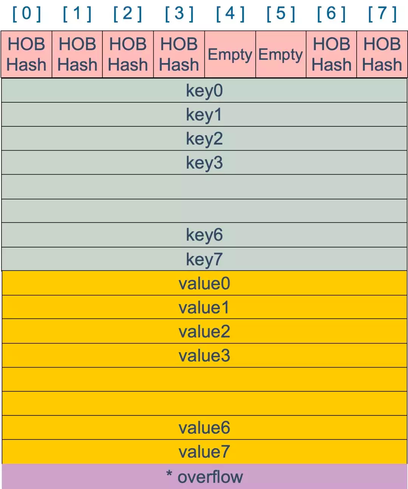
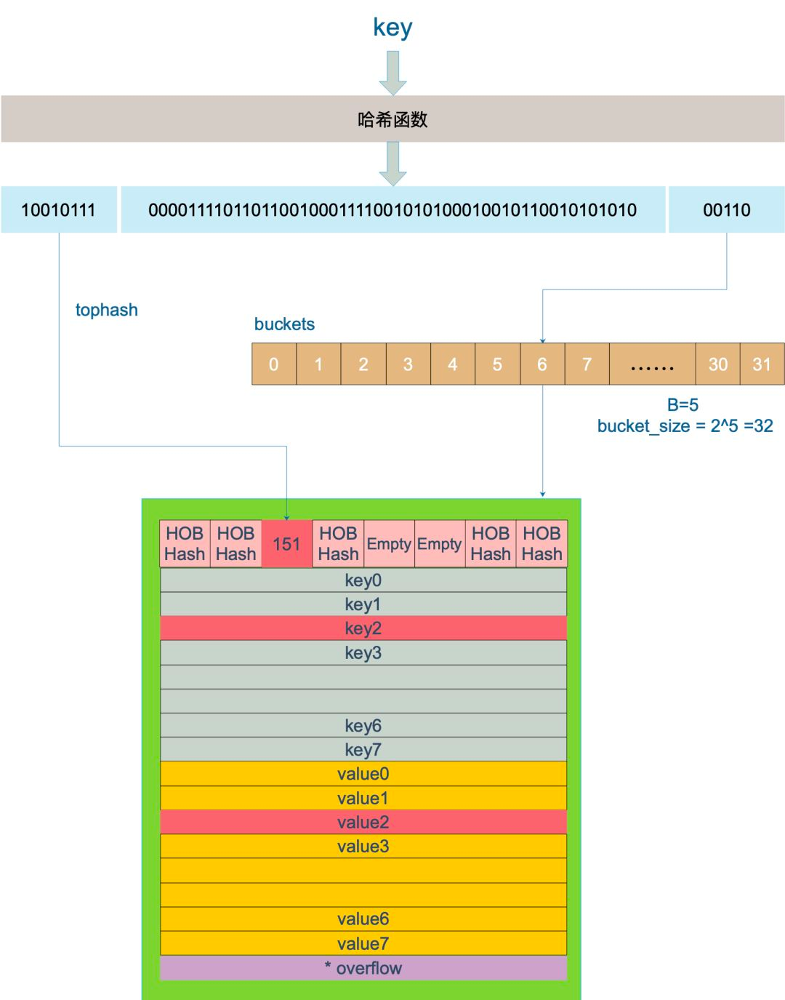

#Map介绍
map 的设计也被称为 “The dictionary problem”，它的任务是设计一种数据结构用来维护一个集合的数据，并且可以同时对集合进行增删查改的操作。

最主要的数据结构有两种：哈希查找表（Hashtable）、 搜索树（Searchtree）
##哈希查找表（Hashtable）
哈希查找表用一个哈希函数将 key 分配到不同的桶（bucket，也就是数组的不同 index）。这样，开销主要在哈希函数的计算以及数组的常数访问时间。
在很多场景下，哈希查找表的性能很高。

哈希查找表一般会存在“碰撞”的问题，就是说不同的 key 被哈希到了同一个 bucket。一般有两种应对方法：链表法和 开放定址法(实际开发中较少)。

链表法将一个 bucket 实现成一个链表，落在同一个 bucket 中的 key 都会插入这个链表。开放地址法则是碰撞发生后，通过一定的规律，在数组的后面挑选“空位”，用来放置新的 key

##搜索树法
一般采用自平衡搜索树，包括：AVL 树，红黑树。

##对比：
自平衡搜索树法的最差搜索效率是 O(logN)，而哈希查找表最差是 O(N)。当然，哈希查找表的平均查找效率是 O(1)，
如果哈希函数设计的很好，最坏的情况基本不会出现。
还有一点，遍历自平衡搜索树，返回的 key 序列，一般会按照从小到大的顺序；而哈希查找表则是乱序的。

#map哈希表源码解析
Go 语言采用的是哈希查找表，并且使用链表解决哈希冲突。  
1. 表示 map 的结构体是 hmap，它是 hashmap 的“缩写”：
```go

//src/runtime/map.go

type hmap struct {
  // 元素个数，调用 len(map) 时，直接返回此值
  count     int    // 表示当前哈希表中元素的数量
  
  flags     uint8  // 表示哈希表的标记 1表示buckets正在被使用 2表示oldbuckets正在被使用 4表示哈希正在被写入 8表示哈希是等量扩容

  // buckets 的对数 log_2
  B         uint8  // 可以最多容纳 6.5 * 2 ^ B 个元素，6.5为装载因子
  noverflow uint16 // 溢出的个数
  
  //  计算 key 的哈希的时候会传入哈希函数
  hash0     uint32 // 哈希种子

  // 指向 buckets 数组，大小为 2^B
  // 如果元素个数为0，就为 ni
  buckets    unsafe.Pointer // 桶的地址
  
  oldbuckets unsafe.Pointer // 旧桶的地址，用于扩容
  
  nevacuate  uintptr        // 搬迁进度，小于nevacuate的已经搬迁
  overflow *[2]*[]*bmap
}

 /*B 是 buckets 数组的长度的对数，也就是说 buckets 数组的长度就是 2^B。
     其中，overflow是一个指针，指向一个元素个数为2的数组，数组的类型是一个指针，指向一个slice，slice的元素是桶(bmap)的地址，这些桶都是溢出桶；
     为什么有两个？因为Go map在hash冲突过多时，会发生扩容操作，为了不全量搬迁数据，使用了增量搬迁，[0]表示当前使用的溢出桶集合，
     [1]是在发生扩容时，保存了旧的溢出桶集合；overflow存在的意义在于防止溢出桶被gc。
 
  */


// A bucket for a Go map.桶结构体
type bmap struct {
  // 每个元素hash值的高8位，如果tophash[0] < minTopHash，表示这个桶的搬迁状态
  tophash [bucketCnt]uint8
  // 接下来是8个key、8个value，但是我们不能直接看到；为了优化对齐，go采用了key放在一起，value放在一起的存储方式，
  // 再接下来是hash冲突发生时，下一个溢出桶的地址
}
//	tophash的存在是为了快速试错，毕竟只有8位，比较起来会快一点。
//  桶的结构到底是怎样的？
//	桶的结构体并不是上面提到的tophash [8]uint8,因为go是不支持泛型的，所以在编译过程中才会根据具体的类型确定,实际上桶的结构可以表示为
  type bmap struct {
      topbits  [8]uint8
      keys     [8]keytype
      values   [8]valuetype
      pad      uintptr
      overflow uintptr
  } 
// 从定义可以看出，不同于STL中map以红黑树实现的方式，Golang采用了HashTable的实现，解决冲突采用的是链地址法。也就是说，使用数组+链表来实现map
```

上图就是 bucket 的内存模型， HOBHash 指的就是 top hash。注意到 key 和 value 是各自放在一起的，并不是 key/value/key/value/... 这样的形式。
源码里说明这样的好处是在某些情况下可以省略掉 padding 字段，节省内存空间。

例如，有这样一个类型的 map：
```go
map[int64]int8
```
如果按照 key/value/key/value/... 这样的模式存储，那在每一个 key/value 对之后都要额外 padding 7 个字节；而将所有的 key，value 分别绑定到一起，
这种形式 key/key/.../value/value/...，则只需要在最后添加 padding。

每个 bucket 设计成最多只能放 8 个 key-value 对，如果有第 9 个 key-value 落入当前的 bucket，那就需要再构建一个 bucket ，通过 overflow 指针连接起来
2. 初始化 makemap
   从语法层面上来说，创建 map 很简单
```go
ageMap := make(map[string]int)
//指定长度
ageMap2 := make(map[string]int8)
//ageMap 为nil，不能向其添加元素，会直接panic
var ageMap3 map[string]int
```
通过汇编语言可以看到，实际上底层调用的是 makemap 函数，主要做的工作就是初始化 hmap 结构体的各种字段，例如计算 B 的大小，设置哈希种子 hash0 等等。
```go
func makemap(t *maptype, hint int, h *hmap) *hmap {
  //计算内存空间和判断是否内存溢出
  mem, overflow := math.MulUintptr(uintptr(hint), t.bucket.size)
  if overflow || mem > maxAlloc {
      hint = 0
  }

  // initialize Hmap
  if h == nil {
      h = new(hmap)
  }
  h.hash0 = fastrand()

  //计算出指数B,那么桶的数量表示2^B
  B := uint8(0)
  for overLoadFactor(hint, B) {
      B++
  }
  h.B = B

  if h.B != 0 {
      var nextOverflow *bmap
      //根据B去创建对应的桶和溢出桶
      h.buckets, nextOverflow = makeBucketArray(t, h.B, nil)
      if nextOverflow != nil {
          h.extra = new(mapextra)
          h.extra.nextOverflow = nextOverflow
      }
  }

  return h
}

//a. 计算出需要的内存空间并且判断内存是否溢出
//b.hmap没有的情况进行初始化，并设置hash0表示hash因子
//c.计算出指数B,桶的数量表示为2^B,通过makeBucketArray去创建对应的桶和溢出桶
```
3. 赋值mapassign
```go

func mapassign(t *maptype, h *hmap, key unsafe.Pointer) unsafe.Pointer {

    .....
    //计算出hash值
    hash :=t.hasher(key,uintptr(h.hash0))

    //更新状态为正在写入
    h.flags ^= hashWriting

again:
    //通过hash获取对应的桶
    bucket := hash & bucketMask(h.B)
    b :=(*bmap)(unsafe.Pointer(uintptr(h.buckets)+bucket*uintptr(t.bucketsize)))
    //计算出tophash
    top :=tophash(hash)

    var inserti *uint8//记录插入的tophash
    var insertk unsafe.Pointer//记录插入的key值地址
    var elem unsafe.Pointer//记录插入的value值地址

bucketloop:
    for{
        for i :=uintptr(0);i < bucketCnt;i++{
            //判断tophash是否相等
            if b.tophash[i] != top {
                //如果tophash不相等并且等于空,则可以插入该位置
                if isEmpty(b.tophash[i]) && inserti == nil {
                    inserti = &b.tophash[i]
                    //获取对应插入key和value的指针地址
                    insertk = add(unsafe.Pointer(b), dataOffset+i*uintptr(t.keysize))
                    elem = add(unsafe.Pointer(b), dataOffset+bucketCnt*uintptr(t.keysize)+i*uintptr(t.elemsize))
                }
                if b.tophash[i] == emptyRest {
                    break bucketloop
                }
                continue
            }

            //走到这里,说明已经存在,获得指定的key和value在桶得位置地址
            k := add(unsafe.Pointer(b), dataOffset+i*uintptr(t.keysize))
            //如果是指针，则要转化为指针
            if t.indirectkey() {
                k = *((*unsafe.Pointer)(k))
            }
            //判断key值是否相等
            if !t.key.equal(key, k) {
                continue
            }
            // already have a mapping for key. Update it.
            //如果key值需要修改，那么修改key值
            if t.needkeyupdate() {
                typedmemmove(t.key, k, key)
            }
            //获取value元素地址
            elem = add(unsafe.Pointer(b), dataOffset+bucketCnt*uintptr(t.keysize)+i*uintptr(t.elemsize))
            goto done

            //未找到可插入的位置,找一下有没溢出桶，如果有继续执行写入操作
            ovf := b.overflow(t)
            if ovf == nil{
                break
            }
            b = ovf
        }
    }

    if inserti == nil {
        //如果在正常桶和溢出桶中都未找到插入的位置，那么得到一个新的溢出桶执行插入
        newb := h.newoverflow(t, b)
        inserti = &newb.tophash[0]
        insertk = add(unsafe.Pointer(newb), dataOffset)
        elem = add(insertk, bucketCnt*uintptr(t.keysize))
    }

    .....
    //将key值信息插入桶中指定位置
    typedmemmove(t.key, insertk, key)
    *inserti = top//更新tophash值
    h.count++

done:
    h.flags &^= hashWriting
    if t.indirectelem() {
        elem = *((*unsafe.Pointer)(elem))
    }
    return elem //返回value的指针地址
}

```

	a. 计算key的hash值,通过hash的高八位和低B为分别确定tophash和桶的序号
		tophash是什么?
			tophash是用来快速定位key和value的位置的,在查找或删除过程如果高8位hash都不相等，那么就没必要再去比较key值是否相等了，效率相对会高一些。
		如何定位到哪个桶执行插入?
			例如哈希表对应2^4个桶,即B是4,某个key的hash二进制值是如下值，那么如图可知该key对应的tophash值为10001100,即140，
			桶的值为0111,即是桶的序号为7
			hash := 100011001101111001110010010110000001111010110000100101011010111
	b. 每个桶可以存储8个tophash、8个key、8个value,遍历桶中的tophash,如果tophash不相等且是空的,说明该位置可以插入，
		分别获取对应位置key和value的地址并更新tophash。
4. 扩容 hashGrow

    使用哈希表的目的就是要快速查找到目标 key，然而，随着向 map 中添加的 key 越来越多，key 发生碰撞的概率也越来越大。bucket 中的 8 个 cell 会被逐渐塞满，查找、插入、删除 key 的效率也会越来越低。   
    最理想的情况是一个 bucket 只装一个 key，这样，就能达到 O(1) 的效率，但这样空间消耗太大，用空间换时间的代价太高。
    
    Go 语言采用一个 bucket 里装载 8 个 key，定位到某个 bucket 后，还需要再定位到具体的 key，这实际上又用了时间换空间。
    
    当然，这样做，要有一个度，不然所有的 key 都落在了同一个 bucket 里，直接退化成了链表，各种操作的效率直接降为 O(n)，是不行的。
    
    因此，需要有一个指标来衡量前面描述的情况，这就是 装载因子。Go 源码里这样定义 装载因子
```go
loadFactor := count/(2^B)
//count 就是 map 的元素个数，2^B 表示 bucket 数量。
```
判断是否扩容的条件
  a.哈希表不是正在扩容的状态
  b.元素的数量 > 2^B次方(桶的数量) * 6.5,6.5表示为装载因子,很容易理解装载因子最大为8(一个桶能装载的元素数量)
  c.溢出桶过多,当前已经使用的溢出桶数量 >=2^B次方(桶的数量) ,B最大为15
```go
if !h.growing() && (overLoadFactor(h.count+1, h.B) || tooManyOverflowBuckets(h.noverflow, h.B)) {
  hashGrow(t, h)
  goto again // Growing the table invalidates everything, so try again
}
```

    hashGrow() 函数实际上并没有真正地“搬迁”，它只是分配好了新的 buckets，并将老的 buckets 挂到了 oldbuckets 字段上。真正搬迁 buckets 的动作在 growWork() 函数中，
    而调用 growWork() 函数的动作是在 mapassign 和 mapdelete 函数中
    扩容分为两种，一种是等量扩容和2倍扩容：
    
    a. 扩容时，会将原来的buckets搬到oldbuckets

5. 读取mapaccess

   例如，现在有一个 key 经过哈希函数计算后，得到的哈希结果是：
```shell
10010111|000011110110110010001111001010100010010110010101010│01010
```
用最后的 5 个 bit 位，也就是 01010，值为 10，也就是 10 号桶。这个操作实际上就是取余操作，但是取余开销太大，所以代码实现上用的位操作代替。

再用哈希值的高 8 位，找到此 key 在 bucket 中的位置，这是在寻找已有的 key。最开始桶内还没有 key，新加入的 key 会找到第一个空位，放入。

buckets 编号就是桶编号，当两个不同的 key 落在同一个桶中，也就是发生了哈希冲突。冲突的解决手段是用链表法：在 bucket 中，从前往后找到第一个空位。这样，在查找某个 key 时，先找到对应的桶，再去遍历 bucket 中的 key。

上图中，假定 B = 5，所以 bucket 总数就是 2^5 = 32。首先计算出待查找 key 的哈希，使用低 5 位 00110，找到对应的 6 号 bucket，使用高 8 位 10010111，对应十进制 151，
在 6 号 bucket 中寻找 tophash 值（HOB hash）为 151 的 key，找到了 2 号槽位，这样整个查找过程就结束了。
如果在 bucket 中没找到，并且 overflow 不为空，还要继续去 overflow bucket 中寻找，直到找到或是所有的 key 槽位都找遍了，包括所有的 overflow bucket。

    go的哈希查找有两种方式,一种是不返回ok的对应的源码方法为runtime.mapaccess1,另外返回ok的函数对应源码方法为runtime.mapaccess2
    a. mapaccess1_fat 返回一个值和 mapaccess2_fat返回两个值
    b. hash分为高位和地位，先通过低位快速找到bucket，再通过高位进一步查找，对比具体的key
    c. 访问到oldbuckets的数据时，会迁移到buckets

7. 删除mapdelete


    它首先会检查 h.flags 标志，如果发现写标位是 1，直接 panic，因为这表明有其他协程同时在进行写操作。
    
    计算 key 的哈希，找到落入的 bucket。检查此 map 如果正在扩容的过程中，直接触发一次搬迁操作。
    
    删除操作同样是两层循环，核心还是找到 key 的具体位置。寻找过程都是类似的，在 bucket 中挨个 cell 寻找。
    
    找到对应位置后，对 key 或者 value 进行“清零”操作

    最后，将 count 值减 1，将对应位置的 tophash 值置成 Empty
