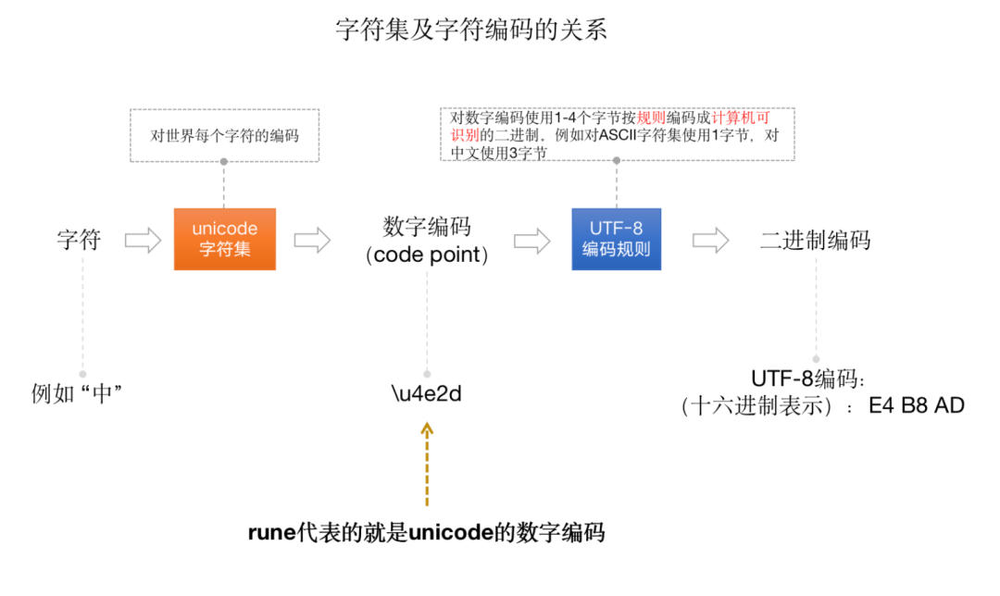

# string的底层存储结构

```go
// src/runtime/string.go
type stringStruct struct {
    str unsafe.Pointer //一个指针，指向存储实际字符串的内存地址。
    len int            // 字符串的字节长度，非字符个数
}
```


## 举例
```go
a := "中国"
```

因为 Go 语言对源代码默认使用 utf-8 编码方式，utf-8 对” 中 “使用 3 个字节，对应的编码是（我们这里每个字节编码用 10 进制表示）：228 184 173。
同样 “国” 的 utf-8 编码是：229 155 189.

## rune

### unicode 字符集和字符编码

unicode 字符集是对世界上多种语言字符的通用编码，也叫万国码。在 unicode 字符集中，每一个字符都有一个对应的编号，我们称这个编号为 code point，而 Go 中的rune 类型就代表一个字符的 code point。


字符集只是将每个字符给了一个唯一的编码而已。而要想在计算机中进行存储，则必须要通过特定的编码转换成对应的二进制才行。
所以就有了像 ASCII、UTF-8、UTF-16 等这样的编码方式。而在 Go 中默认是使用 UTF-8 字符编码进行编码的。

UTF-8 字符编码是一种变长字节的编码方式，用 1 到 4 个字节对字符进行编码，即最多 4 个字节，按位表示就是 32 位。
所以，在 Go 的源码中，我们会看到对 rune 的定义是 int32 的别名：
```go
// rune is an alias for int32 and is equivalent to int32 in all ways. It is
// used, by convention, to distinguish character values from integer values.
type rune = int32
```

## 字符串拼接性能问题

### 优化前
```go
func concat(ids []string) string {
    s := ""
    for _, id := range ids {
        s += id
    }
    return s
}
```

这段代码执行逻辑上不会有任何问题，但是在进行 s += id 进行拼接时，由于字符串是不可变的，所以每次都会分配新的内存空间，
并将两个字符串的内容拷贝到新的空间去，然后再让 s 指向新的空间字符串。由于分配的内存次数多，当然就会对性能造成影响

### 1.优化第一版本
```go
func concat(ids []string) string {
    sb := strings.Builder{} 
    for _, id := range ids {
        _, _ = sb.WriteString(id) 
    }
    return sb.String() 
}
type Builder struct {
    addr *Builder // of receiver, to detect copies by value
    buf  []byte
}
```

可以通过 strings.Builder 进行改进。strings.Builder 本质上是分配了一个字节切片，然后通过 append 的操作，将字符串的字节依次加入到该字节切片中。
因为切片预分配空间的特性，可参考切片扩容，以有效的减少内存分配的次数，以提高性能。

Builder 的结构体中有一个 buf [] byte，当执行 sb.WriteString(id) 方法时，实际上是调用了 append 的方法，将字符串的每个字节都存储到了字节切片 buf 中。

### 2. 优化第二版本
如果我们能提前知道要拼接的字符串的长度，我们还可以提前使用Builder 的 Grow 方法来预分配内存，这样在整个字符串拼接过程中只需要分配一次内存就好了，极大的提高了字符串拼接的性能
```go
func concat(ids []string) string {
    total := 0
    for i := 0; i < len(ids); i++ { 
        total += len(ids[i])
    }
 
    sb := strings.Builder{}
    sb.Grow(total) 
    for _, id := range ids {
        _, _ = sb.WriteString(id)
    }
    return sb.String()
}
```

Note:strings.Builder 的使用场景一般是在循环中对字符串进行拼接，如果只是拼接两个或少数几个字符串的话，推荐使用 "+"操作符，例如: s := s1 + s2 + s3，该操作并非每个 + 操作符都计算一次长度，而是会首先计算三个字符串的总长度，然后分配对应的内存，再将三个字符串都拷贝到新申请的内存中去

## 潜在的内存泄漏
### 问题

```go
func (s store) handleLog(log string) error {
    if len(log) < 4 {
        return errors.New("log is not correctly formatted")
    }
    message := log[:4]
    s.store(message)
    // Do something
}
```
字符串的切分也会跟切片的切分一样，可能会造成内存泄露。下面我们看一个例子：有一个 handleLog 的函数，接收一个 string 类型的参数 log，
假设 log 的前 4 个字节存储的是 log 的 message 类型值，我们需要从 log 中提取出 message 类型，并存储到内存中.

我们使用 log[:4] 的方式提取出了 message，那么该实现有什么问题吗？我们假设参数 log 是一个包含成千上万个字符的字符串。
当我们使用 log[:4] 操作时，实际上是返回了一个字节切片，该切片的长度是 4，而容量则是 log 字符串的整体长度。那么实际上我们存储的 message 不是包含 4 个字节的空间，而是整个 log 字符串长度的空间。
所以就有可能会造成内存泄露

### 解决方式
使用拷贝。将 uuid 提取后拷贝到一个字节切片中，这时该字节切片的长度和容量都是 36.
```go
func (s store) handleLog(log string) error {
    if len(log) < 36 {
        return errors.New("log is not correctly formatted")
     }
     uuid := string([]byte(log[:36])) 
     s.store(uuid)
 // Do something
}
```


