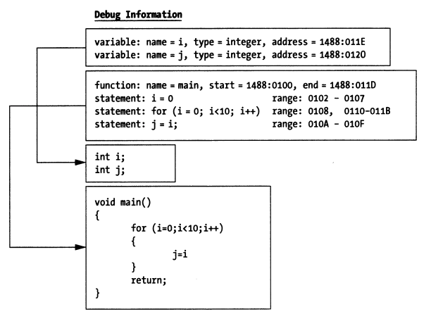

# 调试器

开发人员希望定位代码中的问题时，通常会借助 Print语句（如fmt.Println） 来打印变量的值，进而推断程序执行结果是否符合预期。在某些更复杂的场景下，打印语句可能难以胜任，调试器会更好地协助我们定位问题。

调试器可以帮助我们控制tracee（被调试进程、线程）的执行，也可以观察tracee的运行时内存、寄存器状态，借此我们可以实现代码的逐语句执行、控制代码执行流程、检查变量值是否符合预期，等等。

调试器要支持的重要操作，通常包括：

- 设置断点，在指定内存地址、函数、语句、文件行号处设置断点；
- 单步执行，单步执行一条指令，单步执行一条语句，或运行到下个断点处；
- 获取、设置寄存器信息；
- 获取、设置内存信息；
- 对表达式进行估值计算；
- 调用函数；
- 其他

## Debugger types 调试器分类
调试器可以分为两种类型：指令级调试器和符号级调试器

1. 指令级调试器: 其操作的对象是机器指令。通过处理器指令patch技术就可以实现指令级调试，不需要调试符号信息。它仅适用于指令或汇编语言级别的操作，不支持源代码级别的操作

2. 符号级调试器:其操作的对象不仅是机器指令，更重要的是支持源代码级的操作。它可以提取和解析调试符号信息，建立内存地址、指令地址和源代码之间的映射关系，支持在源代码语句上设置断点的时候，将其转换为精确的机器指令断点，也支持其他方便的操作

## 依赖

### 调试符号信息

调试信息有什么用呢？调试器利用调试信息能够将源码中的函数、变量映射为内存中的地址，也就意味着开发者可以直接对源码中函数、变量进行操作而不用关心具体的内存地址，这也是符号级调试器相比于指令级调试器的优势

不同的目标文件格式，调试符号信息可能会存储在不同的地方，一般可能有两种存储方式

- 存储在目标文件自身

例如，ELF 文件格式包含了DWARF调试信息对应的section，一般以".debug”或”.zdebug”开头。.debug前缀开头的section表示数据未压缩，.zdebug前缀开头的section表示数据经过了压缩。

- 存储在独立的文件中

例如，Microsoft Visual C++ 2.0生成的调试信息存储在独立的.PDB（Program Database）文件中，macOS平台上构建的调试符号信息一般存储在独立的.dSYM/Resources/DWARF/目录中。

### 调试支持

除了调试符号信息，调试器还需要其他的一些支持，即调试基础设施，包括：调试中断、系统调用、解释器、调试用户界面（GUI或者命令行

### 符号调试器扩展

#### 断点

程序断点（breakpoint），指的是程序中的一个位置，当程序执行到该位置时能够停下来，以便调试人员观察程序状态

- 动态断点: 程序在运行时调试人员按需动态创建的断点

- 静态断点：它是在程序中的某些位置通过硬编码的方式来创建的，如在程序中通过int 0x3汇编指令创建断点。静态断点的生命周期与进程的生命周期是相同的。我们可以在程序中插入一些分支判断逻辑，来决定是否创建特定的静态断点

#### 单步执行

对指令级调试器（也称机器级调试器）而言，单步执行很简单：处理器只需执行下一条机器指令，然后将程序控制权返回给调试器。 对于符号调试器，此过程并不那么简单，因为高级编程语言中的单个语句通常会转换为多个机器级指令。 
