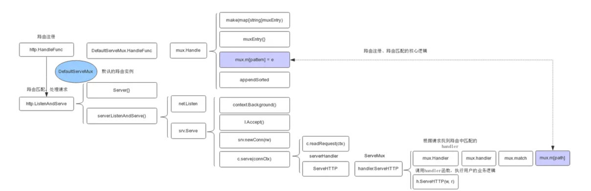
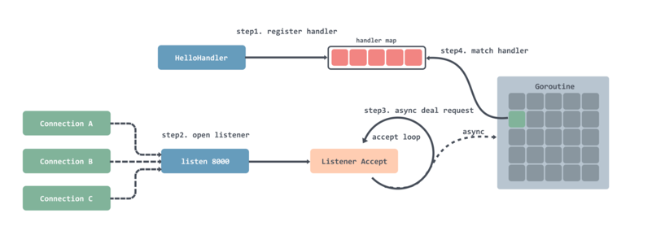
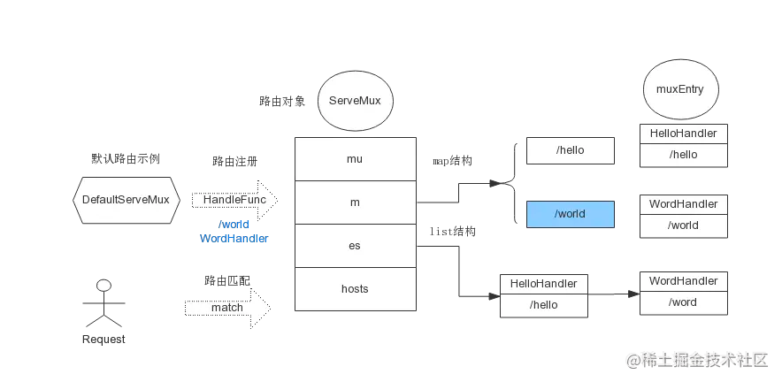

# http server 

## 搭建流程
搭建http server的大概步骤包括：

1. 编写handler处理函数
2. 注册路由
3. 创建服务并开启监听

## 具体监听处理服务流程


1. 注册处理器到一个 hash 表中，可以通过键值路由匹配；
2. 注册完之后就是开启循环监听，每监听到一个连接就会创建一个 Goroutine；
3. 在创建好的 Goroutine 里面会循环的等待接收请求数据，然后根据请求的地址去处理器路由表中匹配对应的处理器，然后将请求交给处理器处理；


## 路由处理对象ServeMux结构体 

```go
type ServeMux struct {
	mu    sync.RWMutex
	m     map[string]muxEntry // 存储路由和handler的对应关系
	es    []muxEntry // 将muxEntry排序存放，排序按照路由表达式由长到短排序
	hosts bool       // 路由表达式是否包含主机名
}

type muxEntry struct {
    h       Handler // 路由处理函数
    pattern string  // 路由表达式
}
```
- m : hash 表是用于路由精确匹配，
- es : []muxEntry用于部分匹配

## 路由注册接口
注册路由方法
```go
func (mux *ServeMux) Handle(pattern string, handler Handler) {
	mux.mu.Lock()
	defer mux.mu.Unlock()
	    
	
	if _, exist := mux.m[pattern]; exist {
		panic("http: multiple registrations for " + pattern)
	}

	// 创建ServeMux的m实例
	if mux.m == nil {
		mux.m = make(map[string]muxEntry)
	}
    // 根据路由表达式和路由处理函数，构造muxEntry对象
	e := muxEntry{h: handler, pattern: pattern}
    // muxEntry保存到map中
	mux.m[pattern] = e
	
	if pattern[len(pattern)-1] == '/' {
		// 如果表达式以 '/' 结尾，加入到排序列表中
		mux.es = appendSorted(mux.es, e)
	}

	if pattern[0] != '/' {
		mux.hosts = true
	}
}
```

## 开启服务
### 重要的server结构体
```go
type Server struct {
    // 地址
	Addr string

	Handler Handler // handler to invoke, http.DefaultServeMux if nil

    
	TLSConfig *tls.Config

	// ...
}
```

```go
func (srv *Server) Serve(l net.Listener) error { 
    ...
    baseCtx := context.Background()
	// 创建上下文对象
    ctx := context.WithValue(baseCtx, ServerContextKey, srv)
    for {
        // 接收 listener 过来的网络连接
        rw, err := l.Accept()
        // ... 
        tempDelay = 0
		// 连接建立时，创建连接对象
        c := srv.newConn(rw)
        c.setState(c.rwc, StateNew) 
        // 创建协程处理连接
        go c.serve(connCtx)
    }
}
```
Serve 这个方法里面会用一个循环去接收监听到的网络连接，然后创建协程处理连接。所以难免就会有一个问题，如果并发很高的话，可能会一次性创建太多协程，导致处理不过来的情况


## 处理请求
```go
func (c *conn) serve(ctx context.Context) {
    c.remoteAddr = c.rwc.RemoteAddr().String()
    ctx = context.WithValue(ctx, LocalAddrContextKey, c.rwc.LocalAddr()) 
    ... 
    ctx, cancelCtx := context.WithCancel(ctx)
    c.cancelCtx = cancelCtx
    defer cancelCtx() 
    c.r = &connReader{conn: c}
    c.bufr = newBufioReader(c.r)
    c.bufw = newBufioWriterSize(checkConnErrorWriter{c}, 4<<10)  
    for {
        // 读取请求
        w, err := c.readRequest(ctx) 
        ... 
        // 根据请求路由调用处理器处理请求
        serverHandler{c.server}.ServeHTTP(w, w.req)
        w.cancelCtx()
        if c.hijacked() {
            return
        }
        w.finishRequest() 
        ...
    }
}
```
```go
type serverHandler struct {
   srv *Server
}

func (sh serverHandler) ServeHTTP(rw ResponseWriter, req *Request) {
    handler := sh.srv.Handler
    if handler == nil {
        // 如果handler为空，就用默认的DefaultServeMux
        handler = DefaultServeMux
    }
    if req.RequestURI == "*" && req.Method == "OPTIONS" {
        handler = globalOptionsHandler{}
    }
    // 这里就是调用ServeMux的ServeHTTP
    handler.ServeHTTP(rw, req)
}
```

serverHandler 其实就是 Server 包装了一层。这里的 sh.srv.Handler参数实际上是传入的 ServeMux 实例，所以这里最后会调用到 ServeMux 的 ServeHTTP 方法。


```go
func (mux *ServeMux) ServeHTTP(w ResponseWriter, r *Request) {
	if r.RequestURI == "*" {
		if r.ProtoAtLeast(1, 1) {
			w.Header().Set("Connection", "close")
		}
		w.WriteHeader(StatusBadRequest)
		return
	}
	h, _ := mux.Handler(r)
	h.ServeHTTP(w, r)
}
```
```go
func (mux *ServeMux) handler(host, path string) (h Handler, pattern string) {
	mux.mu.RLock()
	defer mux.mu.RUnlock()

	// Host-specific pattern takes precedence over generic ones
	if mux.hosts {
		h, pattern = mux.match(host + path)
	}
	if h == nil {
		h, pattern = mux.match(path)
	}
	if h == nil {
		h, pattern = NotFoundHandler(), ""
	}
	return
}
```

匹配路由函数
```go
func (mux *ServeMux) match(path string) (h Handler, pattern string) {
	//  先从前面介绍的ServeMux的m中精确查找路由表达式
	v, ok := mux.m[path]
	if ok {
		// 如果找到，直接返回handler
		return v.h, v.pattern
	}

    // 如果不能精确匹配，就去列表中找到最接近的路由
    // mux.es中的路由是按照从长到短排序的
	for _, e := range mux.es {
		if strings.HasPrefix(path, e.pattern) {
			return e.h, e.pattern
		}
	}
	return nil, ""
}
```
这个方法里首先会利用进行精确匹配，如果匹配成功那么直接返回；
匹配不成功，那么会根据 []muxEntry中保存的和当前路由最接近的已注册的父节点路由进行匹配，否则继续匹配下一个父节点路由，直到根路由/。
最后会调用对应的处理器进行处理。