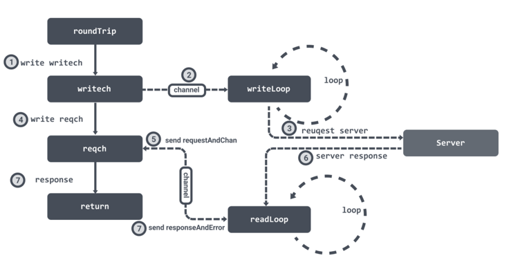

<!-- START doctoc generated TOC please keep comment here to allow auto update -->
<!-- DON'T EDIT THIS SECTION, INSTEAD RE-RUN doctoc TO UPDATE -->
**Table of Contents**  *generated with [DocToc](https://github.com/thlorenz/doctoc)*

- [http.Response源码解析](#httpresponse%E6%BA%90%E7%A0%81%E8%A7%A3%E6%9E%90)
  - [Response结构体](#response%E7%BB%93%E6%9E%84%E4%BD%93)
  - [流程](#%E6%B5%81%E7%A8%8B)

<!-- END doctoc generated TOC please keep comment here to allow auto update -->

# http.Response源码解析

关于response

> 在接收和解释请求消息后，服务器会返回一个 HTTP 响应消息,与 HTTP 请求类似，HTTP 响应也是由三个部分组成，分别是：状态行、消息报头和响应正文

## Response结构体
```go
type Response struct {
	Status     string // e.g. "200 OK"
	StatusCode int    // e.g. 200
	Proto      string // e.g. "HTTP/1.0"
	ProtoMajor int    // e.g. 1
	ProtoMinor int    // e.g. 0

	// Header将头键映射到值。
	//如果响应有多个具有相同密钥的头，则可以使用逗号限制将它们串联起来。
	//当此结构中的其他字段（如ContentLength、transferncode、Trailer）复制头值时，字段值是权威的。
	Header Header

	// Body代表响应体。
	//响应主体在读取主体字段时按需流式传输。
	//如果网络连接失败或服务器终止响应，Body.Read调用返回错误，http客户机和传输保证Body始终为非nil， 关闭响应体时调用者的责任
	// 如果响应体未读到完成并关闭，则默认HTTP客户端的传输可能不会重用HTTP/1.x“keep alive”TCP连接
	// 如果服务器用“chunked”传输编码答复，则响应体将自动取消dechunked
	Body io.ReadCloser

	// ContentLength记录关联内容的长度。值>=0表示可以从Body读取给定的字节数。
	ContentLength int64

	// 包含从最外层到最内层的传输编码。值为nil，表示使用“identity”编码。
	TransferEncoding []string

	//Close记录响应头是否指示在读取Body之后关闭连接(是为客户提供建议)
	Close bool

	// 报告响应是否已压缩发送，但已由http包解压缩
	// 如果为true，则从Body读取生成未压缩的内容，而不是从服务器实际设置的压缩内容，ContentLength设置为-1，并且从responseHeader中删除“content Length”和“content Encoding”字段
	// 一般是压缩方式，利用gzip压缩文档能够显著地减少HTML文档的下载时间。
	Uncompressed bool

	// 将Trailer 键映射到与标头相同格式的值,初始是nil，服务器的Trailer头值中，指定的每个键对应一个值
	Trailer Header

	// Request 请求是为获取此响应而发送的请求。请求的主体为零（已被消耗）这仅为客户端请求填充
	Request *Request

	// TLS包含有关接收响应的TLS连接的信息
	TLS *tls.ConnectionState
}

```
## 流程

在创建连接的时候会初始化两个 channel ：writech 负责写入请求数据，reqch负责读取响应数据。
我们在创建连接的时候，也提到了会为连接创建两个异步循环 readLoop 和 writeLoop 来负责处理读写数据.

在获取到连接之后，会调用连接的 roundTrip 方法，它首先会将请求数据写入到 writech 管道中，writeLoop 接收到数据之后就会处理请求。

然后 roundTrip 会将 requestAndChan 结构体写入到 reqch 管道中，然后 roundTrip 会循环等待。readLoop 读取到响应数据之后就会通过 requestAndChan 结构体中保存的管道将数据封装成 responseAndError 结构体回写，这样 roundTrip 就可以接受到响应数据结束循环等待并返回

```go
func (pc *persistConn) roundTrip(req *transportRequest) (resp *Response, err error) {
    ...
    writeErrCh := make(chan error, 1)
    // 将请求数据写入到 writech 管道中
    pc.writech <- writeRequest{req, writeErrCh, continueCh}

    // 用于接收响应的管道
    resc := make(chan responseAndError)
    // 将用于接收响应的管道封装成 requestAndChan 写入到 reqch 管道中
    pc.reqch <- requestAndChan{
        req:        req.Request,
        cancelKey:  req.cancelKey,
        ch:         resc,
        ...
    }
    ...
    for {
        testHookWaitResLoop()
        select { 
        // 接收到响应数据
        case re := <-resc:
            if (re.res == nil) == (re.err == nil) {
                panic(fmt.Sprintf("internal error: exactly one of res or err should be set; nil=%v", re.res == nil))
            }
            if debugRoundTrip {
                req.logf("resc recv: %p, %T/%#v", re.res, re.err, re.err)
            }
            if re.err != nil {
                return nil, pc.mapRoundTripError(req, startBytesWritten, re.err)
            }
            // 返回响应数据
            return re.res, nil
        ...
    }
}
```
这里会封装好 writeRequest 作为发送请求的数据，并将用于接收响应的管道封装成 requestAndChan 写入到 reqch 管道中，然后循环等待接受响应。