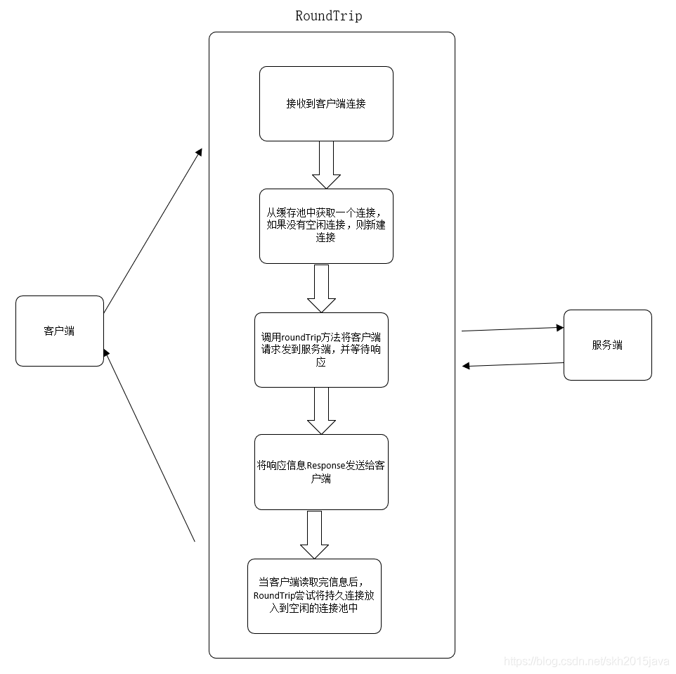
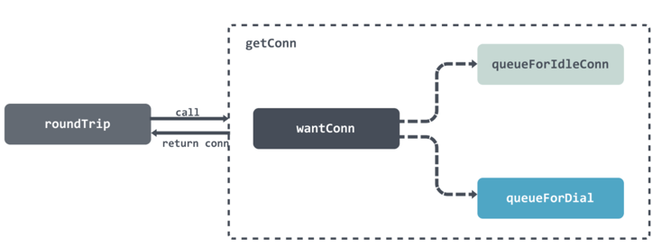
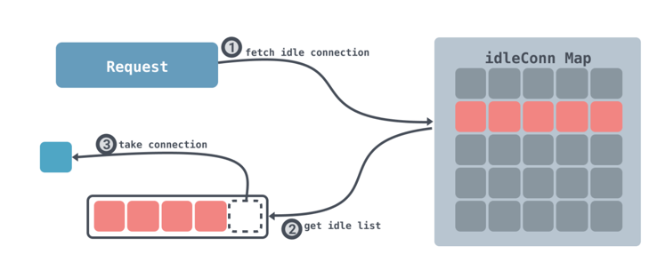
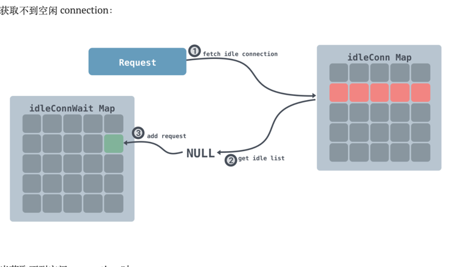
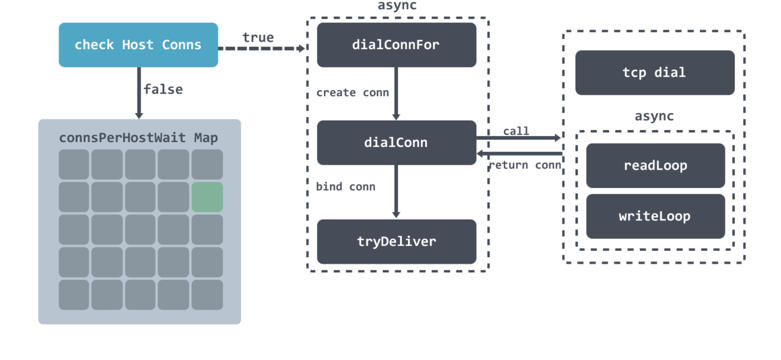

<!-- START doctoc generated TOC please keep comment here to allow auto update -->
<!-- DON'T EDIT THIS SECTION, INSTEAD RE-RUN doctoc TO UPDATE -->
**Table of Contents**  *generated with [DocToc](https://github.com/thlorenz/doctoc)*

- [http 之 transport 源码详解](#http-%E4%B9%8B-transport-%E6%BA%90%E7%A0%81%E8%AF%A6%E8%A7%A3)
  - [接口](#%E6%8E%A5%E5%8F%A3)
  - [实现](#%E5%AE%9E%E7%8E%B0)
  - [重要的结构体](#%E9%87%8D%E8%A6%81%E7%9A%84%E7%BB%93%E6%9E%84%E4%BD%93)
    - [transport 实现interface中的RoundTrip方法](#transport-%E5%AE%9E%E7%8E%B0interface%E4%B8%AD%E7%9A%84roundtrip%E6%96%B9%E6%B3%95)
      - [注册协议对应的transport](#%E6%B3%A8%E5%86%8C%E5%8D%8F%E8%AE%AE%E5%AF%B9%E5%BA%94%E7%9A%84transport)
      - [执行过程](#%E6%89%A7%E8%A1%8C%E8%BF%87%E7%A8%8B)
  - [连接管理：获取或则新建连接](#%E8%BF%9E%E6%8E%A5%E7%AE%A1%E7%90%86%E8%8E%B7%E5%8F%96%E6%88%96%E5%88%99%E6%96%B0%E5%BB%BA%E8%BF%9E%E6%8E%A5)
    - [1. 获取空闲连接 queueForIdleConn](#1-%E8%8E%B7%E5%8F%96%E7%A9%BA%E9%97%B2%E8%BF%9E%E6%8E%A5-queueforidleconn)
    - [2. 建立连接 queueForDial](#2-%E5%BB%BA%E7%AB%8B%E8%BF%9E%E6%8E%A5-queuefordial)
  - [参考](#%E5%8F%82%E8%80%83)

<!-- END doctoc generated TOC please keep comment here to allow auto update -->

# http 之 transport 源码详解
使用golang net/http 库发送http请求，最后都是调用 transport的 RoundTrip方法中


## 接口
```go
// go/go1.15.10/src/net/http/client.go

//接口
type RoundTripper interface {
    RoundTrip(*Request) (*Response, error)
}
//实际调用
func send(ireq *Request, rt RoundTripper, deadline time.Time) (resp *Response, didTimeout func() bool, err error) {
	//--------
    resp, err = rt.RoundTrip(req)
    //--------
}
```


RoundTrip 代表一个http事务，给一个请求返回一个响应。RoundTripper必须是并发安全的。


## 实现
HTTP 请求和响应在标准库中不止有一种实现，它们都包含了层级结构，标准库中的 net/http.RoundTripper 包含如下所示的层级结构


## 重要的结构体
1. Transport
> net/http.Transport 会处理 HTTP/HTTPS 协议的底层实现细节，其中会包含连接重用、构建请求以及发送请求等功能。
```go
// RoundTripper接口的实现Transport结构体在源码包 net/http/transport.go 中
type Transport struct {
	idleMu     sync.Mutex
	wantIdle   bool                                // 用户是否已关闭所有的空闲连接
	idleConn   map[connectMethodKey][]*persistConn // 保存从connectMethodKey(代表着不同的协议，不同的host，也就是不同的请求)到persistConn的映射
	/*
	idleConnCh 用来在并发http请求的时候在多个 goroutine 里面相互发送持久连接,也就是说，
	这些持久连接是可以重复利用的， 你的http请求用某个persistConn用完了，
	通过这个channel发送给其他http请求使用这个persistConn
	*/
	idleConnCh map[connectMethodKey]chan *persistConn
	idleLRU    connLRU
 
	reqMu       sync.Mutex
	reqCanceler map[*Request]func(error)   //请求取消器
 
	altMu    sync.Mutex   // guards changing altProto only
	altProto atomic.Value // of nil or map[string]RoundTripper, key is URI scheme  为空或者map[string]RoundTripper,key为URI  的scheme，用于自定义的协议及对应的处理请求的RoundTripper
 

	Proxy func(*Request) (*url.URL, error)   //根据给定的Request返回一个代理，如果返回一个不为空的error，请求会终止
 

	// DialContext用于指定创建未加密的TCP连接的dial功能，如果该函数为空，则使用net包下的dial函数
	DialContext func(ctx context.Context, network, addr string) (net.Conn, error)
	

	/*
	Dial获取一个tcp连接，也就是net.Conn结构，然后就可以写入request，从而获取到response
	DialContext比Dial函数的优先级高
	*/
	Dial func(network, addr string) (net.Conn, error)
 

	/*
	DialTLS  为创建非代理的HTTPS请求的TLS连接提供一个可选的dial功能
	如果DialTLS为空，则使用Dial和TLSClientConfig
	如果设置了DialTLS，则HTTPS的请求不使用Dial的钩子，并且TLSClientConfig 和 TLSHandshakeTimeout会被忽略
	返回的net.Conn假设已经通过了TLS握手
	*/
	DialTLS func(network, addr string) (net.Conn, error)
 

	/*
      TLSClientConfig指定tls.Client使用的TLS配置信息
	如果为空，则使用默认配置
	如果不为空，默认情况下未启动HTTP/2支持
	*/
	TLSClientConfig *tls.Config

	/*
	指定TLS握手的超时时间
	*/
	TLSHandshakeTimeout time.Duration
 
	// DisableKeepAlives, if true, prevents re-user of TCP connections
	// between different HTTP requests.
	DisableKeepAlives bool   //如果为true，则阻止在不同http请求之间重用TCP连接
 

	DisableCompression bool   //如果为true，则进制传输使用 Accept-Encoding: gzip
 

	MaxIdleConns int   //指定最大的空闲连接数
 

	MaxIdleConnsPerHost int  //用于控制某一个主机的连接的最大空闲数
 

	IdleConnTimeout time.Duration   //指定空闲连接保持的最长时间，如果为0，则不受限制
 
	// ResponseHeaderTimeout, if non-zero, specifies the amount of
	// time to wait for a server's response headers after fully
	// writing the request (including its body, if any). This
	// time does not include the time to read the response body.
	/*
	ResponseHeaderTimeout，如果非零，则指定在完全写入请求（包括其正文，如果有）之后等待服务器响应头的最长时间。
	此时间不包括读响应体的时间。
	*/
	ResponseHeaderTimeout time.Duration
 

	/*
   如果请求头是"Expect:100-continue",ExpectContinueTimeout  如果不为0，它表示等待服务器第一次响应头的最大时间
	零表示没有超时并导致正文立即发送，无需等待服务器批准。
	此时间不包括发送请求标头的时间。
	*/
	ExpectContinueTimeout time.Duration
 

	/*
TLSNextProto指定在TLS NPN / ALPN协议协商之后传输如何切换到备用协议（例如HTTP / 2）。
	如果传输使用非空协议名称拨打TLS连接并且TLSNextProto包含该密钥的映射条目（例如“h2”），则使用请求的权限调用func（例如“example.com”或“example” .com：1234“）和TLS连接。
	该函数必须返回一个RoundTripper，然后处理该请求。 如果TLSNextProto不是nil，则不会自动启用HTTP / 2支持。
	*/
	TLSNextProto map[string]func(authority string, c *tls.Conn) RoundTripper
 
	// ProxyConnectHeader optionally specifies headers to send to
	// proxies during CONNECT requests.
	/*
	ProxyConnectHeader可选地指定在CONNECT请求期间发送给代理的标头。
	*/
	ProxyConnectHeader Header
 

	/*
	指定服务器返回的响应头的最大字节数
	为0则使用默认的限制
	*/
	MaxResponseHeaderBytes int64
 

	//nextProtoOnce保护  TLSNextProto和 h2transport 的初始化
	nextProtoOnce sync.Once
	h2transport   *http2Transport // non-nil if http2 wired up，如果是http2连通，则不为nil
 
	// TODO: tunable on max per-host TCP dials in flight (Issue 13957)
}
```

如果不给http.Client显式指定RoundTripper则会创建一个默认的DefaultTransport。
```go
func (c *Client) transport() RoundTripper {
	if c.Transport != nil {
		return c.Transport
	}
	return DefaultTransport
}
```

Transport是用来保存多个请求过程中的一些状态，用来缓存tcp连接，客户可以重用这些连接，防止每次新建，transport需要同时支持http, https。


2. persistConn

```go
type persistConn struct {
	// alt optionally specifies the TLS NextProto RoundTripper.
	// 当下给 http2 使用
	alt RoundTripper

	t         *Transport
	cacheKey  connectMethodKey        // 当前连接对应的key， 也是idleConns map中的key
	conn      net.Conn                  // 被封装的conn对象
	tlsState  *tls.ConnectionState  
	br        *bufio.Reader       // from conn      // bufio.Reader 对象，封装conn
	bw        *bufio.Writer       // to conn        // bufio.Writer 对象，封装conn
	nwrite    int64               // bytes written  // 记录写入的长度
	reqch     chan requestAndChan // written by roundTrip; read by readLoop // rountTrip在创建一个请求的时候会讲请求通过该chenel发送给readLoop,  readLoop后面解释
	writech   chan writeRequest   // written by roundTrip; read by writeLoop    // writeTrop 从中读取写入请求并执行写入
	closech   chan struct{}       // closed when conn closed                    // 连接关闭的时候从该channle通信
	isProxy   bool
	sawEOF    bool  // whether we've seen EOF from conn; owned by readLoop
	readLimit int64 // bytes allowed to be read; owned by readLoop
	// writeErrCh passes the request write error (usually nil)
	// from the writeLoop goroutine to the readLoop which passes
	// it off to the res.Body reader, which then uses it to decide
	// whether or not a connection can be reused. Issue 7569.
	writeErrCh chan error                                       // 

	writeLoopDone chan struct{} // closed when write loop ends

	// Both guarded by Transport.idleMu:
	idleAt    time.Time   // time it last become idle
	idleTimer *time.Timer // holding an AfterFunc to close it

	mu                   sync.Mutex // guards following fields
	numExpectedResponses int            //表示当期期望的返回response数目
	closed               error // set non-nil when conn is closed, before closech is closed
	canceledErr          error // set non-nil if conn is canceled
	broken               bool  // an error has happened on this connection; marked broken so it's not reused.
	reused               bool  // whether conn has had successful request/response and is being reused.
	// mutateHeaderFunc is an optional func to modify extra
	// headers on each outbound request before it's written. (the
	// original Request given to RoundTrip is not modified)
	mutateHeaderFunc func(Header)
}

```

两者总结：transport用来建立一个连接，其中维护了一个空闲连接池idleConn map[connectMethodKey][]*persistConn，
其中的每个成员都是一个persistConn对象，persistConn是个具体的连接实例，包含了连接的上下文，会启动两个goroutine分别执行readLoop和writeLoop, 
每当transport调用roundTrip的时候，就会从连接池中选择一个空闲的persistConn，然后调用其roundTrip方法，将读写请求通过channel分别发送到readLoop和writeLoop中，
然后会进行select各个channel的信息，包括连接关闭，请求超时，writeLoop出错， readLoop返回读取结果等。
在writeLoop中发送请求，在readLoop中获取response并通过channel返回给roundTrip函数中，并再次将自己加入到idleConn中，等待下次请求到来。

### transport 实现interface中的RoundTrip方法
RoundTrip方法会做两件事情：
- 根据 URL 的协议查找并执行自定义的 net/http.RoundTripper 实现；
- 调用 Transport 的 getConn 方法获取连接；
- 在获取到连接后，调用 persistConn 的 roundTrip 方法等待请求响应结果；

#### 注册协议对应的transport
```go
func (t *Transport) RegisterProtocol(scheme string, rt RoundTripper) {
	t.altMu.Lock()
	defer t.altMu.Unlock()
	oldMap, _ := t.altProto.Load().(map[string]RoundTripper)
	if _, exists := oldMap[scheme]; exists {
		panic("protocol " + scheme + " already registered")
	}
	newMap := make(map[string]RoundTripper)
	for k, v := range oldMap {
		newMap[k] = v
	}
	newMap[scheme] = rt
	t.altProto.Store(newMap)
}
```

#### 执行过程
```go
// /Users/python/go/go1.18.1/src/net/http/roundtrip.go
func (t *Transport) RoundTrip(req *Request) (*Response, error) {
	return t.roundTrip(req)
}
```
```go
//RoundTrip实现了RoundTripper接口
// /Users/python/go/go1.18.1/src/net/http/transport.go
func (t *Transport) roundTrip(req *Request) (*Response, error) {
	//初始化TLSNextProto  http2使用
	t.nextProtoOnce.Do(t.onceSetNextProtoDefaults)
	//获取请求的上下文
	ctx := req.Context()
	trace := httptrace.ContextClientTrace(ctx)
    // ...
 
	// 如果该scheme有自定义注册的RoundTrip，则使用自定义的RoundTrip处理request，并返回response
	altProto, _ := t.altProto.Load().(map[string]RoundTripper)
	if altRT := altProto[scheme]; altRT != nil {
		if resp, err := altRT.RoundTrip(req); err != ErrSkipAltProtocol {
			return resp, err
		}
	}
    // ...
 
	for {
        select {
        case <-ctx.Done():
            req.closeBody()
            return nil, ctx.Err()
        default:
        }
		// treq gets modified by roundTrip, so we need to recreate for each retry.
		//  封装请求:初始化transportRequest,transportRequest是request的包装器
		treq := &transportRequest{Request: req, trace: trace}
		//根据用户的请求信息获取connectMethod  ,简称cm
		cm, err := t.connectMethodForRequest(treq)
		if err != nil {
			req.closeBody()
			return nil, err
		}
 

		//从缓存中获取一个连接，或者新建一个连接
		pconn, err := t.getConn(treq, cm)
		if err != nil {
			t.setReqCanceler(req, nil)
			req.closeBody()
			return nil, err
		}
 
		var resp *Response
		if pconn.alt != nil {
			// HTTP/2 path.
			t.setReqCanceler(req, nil) // not cancelable with CancelRequest
			resp, err = pconn.alt.RoundTrip(req)
		} else {
			resp, err = pconn.roundTrip(treq)
		}
		if err == nil {
			return resp, nil
		}
		// ...
	}
}
```


## 连接管理：获取或则新建连接
连接是一种相对比较昂贵的资源，如果在每次发出 HTTP 请求之前都建立新的连接，可能会消耗比较多的时间，带来较大的额外开销，通过连接池对资源进行分配和复用可以有效地提高 HTTP 请求的整体性能，多数的网络库客户端都会采取类似的策略来复用资源。

- 1. 调用 queueForIdleConn 获取空闲 connection；
- 2. 调用 queueForDial 等待创建新的 connection；



```go
func (t *Transport) getConn(treq *transportRequest, cm connectMethod) (pc *persistConn, err error) {
    req := treq.Request
    trace := treq.trace
    ctx := req.Context()
    if trace != nil && trace.GetConn != nil {
        trace.GetConn(cm.addr())
    }   
    // 将请求封装成 wantConn 结构体
    w := &wantConn{
        cm:         cm,
        key:        cm.key(),
        ctx:        ctx,
        ready:      make(chan struct{}, 1),
        beforeDial: testHookPrePendingDial,
        afterDial:  testHookPostPendingDial,
    }
    defer func() {
        if err != nil {
            w.cancel(t, err)
        }
    }()

    // 获取空闲连接
    if delivered := t.queueForIdleConn(w); delivered {
        pc := w.pc
        ...
        t.setReqCanceler(treq.cancelKey, func(error) {})
        return pc, nil
    }

    // 创建连接
    t.queueForDial(w)

    select {
    // 获取到连接后进入该分支
    case <-w.ready:
        ...
        return w.pc, w.err
    ...
}
```

### 1. 获取空闲连接 queueForIdleConn

成功获取 connection 分为如下几步：

1. 根据当前的请求的地址去空闲 connection 字典中查看存不存在空闲的 connection 列表；
2. 如果能获取到空闲的 connection 列表，那么获取到列表的最后一个 connection；
3. 返回


当获取不到空闲 connection 时：

1. 根据当前的请求的地址去空闲 connection 字典中查看存不存在空闲的 connection 列表；
2. 不存在该请求的 connection 列表，那么将该 wantConn 加入到 等待获取空闲 connection 字典中；
```go
func (t *Transport) queueForIdleConn(w *wantConn) (delivered bool) {
    if t.DisableKeepAlives {
        return false
    }

    t.idleMu.Lock()
    defer t.idleMu.Unlock() 
    t.closeIdle = false

    if w == nil { 
        return false
    }

    // 计算空闲连接超时时间
    var oldTime time.Time
    if t.IdleConnTimeout > 0 {
        oldTime = time.Now().Add(-t.IdleConnTimeout)
    }
    // Look for most recently-used idle connection.
    // 找到key相同的 connection 列表
    if list, ok := t.idleConn[w.key]; ok {
        stop := false
        delivered := false
        for len(list) > 0 && !stop {
            // 找到connection列表最后一个
            pconn := list[len(list)-1] 
            // 检查这个 connection 是不是等待太久了
            tooOld := !oldTime.IsZero() && pconn.idleAt.Round(0).Before(oldTime)
            if tooOld { 
                go pconn.closeConnIfStillIdle()
            }
            // 该 connection 被标记为 broken 或 闲置太久 continue
            if pconn.isBroken() || tooOld { 
                list = list[:len(list)-1]
                continue
            }
            // 尝试将该 connection 写入到 w 中
            delivered = w.tryDeliver(pconn, nil)
            if delivered {
                // 操作成功，需要将 connection 从空闲列表中移除
                if pconn.alt != nil { 
                } else { 
                    t.idleLRU.remove(pconn)
                    list = list[:len(list)-1]
                }
            }
            stop = true
        }
        if len(list) > 0 {
            t.idleConn[w.key] = list
        } else {
            // 如果该 key 对应的空闲列表不存在，那么将该key从字典中移除
            delete(t.idleConn, w.key)
        }
        if stop {
            return delivered
        }
    } 
    // 如果找不到空闲的 connection
    if t.idleConnWait == nil {
        t.idleConnWait = make(map[connectMethodKey]wantConnQueue)
    }
  // 将该 wantConn 加入到 等待获取空闲 connection 字典中
    q := t.idleConnWait[w.key] 
    q.cleanFront()
    q.pushBack(w)
    t.idleConnWait[w.key] = q
    return false
}
```

### 2. 建立连接 queueForDial

尝试去建立连接，总共分为以下几个步骤
1. 在调用 queueForDial 方法的时候会校验 MaxConnsPerHost 是否未设置或已达上限；
   * 检验不通过则将当前的请求放入到 connsPerHostWait 等待字典中；
2. 如果校验通过那么会异步的调用 dialConnFor 方法创建连接；
3. dialConnFor 方法首先会调用 dialConn 方法创建 TCP 连接，然后启动两个异步线程来处理读写数据，然后调用 tryDeliver 将连接绑定到 wantConn 上面。

```go
func (t *Transport) queueForDial(w *wantConn) {
    w.beforeDial()
    // 小于零说明无限制，异步建立连接
    if t.MaxConnsPerHost <= 0 {
        go t.dialConnFor(w)
        return
    }

    t.connsPerHostMu.Lock()
    defer t.connsPerHostMu.Unlock()
    // 每个 host 建立的连接数没达到上限，异步建立连接
    if n := t.connsPerHost[w.key]; n < t.MaxConnsPerHost {
        if t.connsPerHost == nil {
            t.connsPerHost = make(map[connectMethodKey]int)
        }
        t.connsPerHost[w.key] = n + 1
        go t.dialConnFor(w)
        return
    }
    //每个 host 建立的连接数已达到上限，需要进入等待队列
    if t.connsPerHostWait == nil {
        t.connsPerHostWait = make(map[connectMethodKey]wantConnQueue)
    }
    q := t.connsPerHostWait[w.key]
    q.cleanFront()
    q.pushBack(w)
    t.connsPerHostWait[w.key] = q
}

func (t *Transport) dialConnFor(w *wantConn) {
    defer w.afterDial()
    // 建立连接
    pc, err := t.dialConn(w.ctx, w.cm)
    // 连接绑定 wantConn
    delivered := w.tryDeliver(pc, err)
    // 建立连接成功，但是绑定 wantConn 失败
    // 那么将该连接放置到空闲连接字典或调用 等待获取空闲 connection 字典 中的元素执行
    if err == nil && (!delivered || pc.alt != nil) { 
        t.putOrCloseIdleConn(pc)
    }
    if err != nil {
        t.decConnsPerHost(w.key)
    }
}

func (t *Transport) dialConn(ctx context.Context, cm connectMethod) (pconn *persistConn, err error) {
    // 创建连接结构体
    pconn = &persistConn{
        t:             t,
        cacheKey:      cm.key(),
        reqch:         make(chan requestAndChan, 1), // 用于给readLoop发送request
        writech:       make(chan writeRequest, 1), // 用于给writeLoop发送request
        closech:       make(chan struct{}), // 当连接关闭是用于传递信息
        writeErrCh:    make(chan error, 1), // 由writeLoop返回给roundTrip错误信息
        writeLoopDone: make(chan struct{}), // 当writeLoop结束的时候会关闭该channel
    }
    ...
    if cm.scheme() == "https" && t.hasCustomTLSDialer() {
        //...
    } else {
        // 调用dial函数建立 tcp 连接
        conn, err := t.dial(ctx, "tcp", cm.addr())
        if err != nil {
            return nil, wrapErr(err)
        }
        pconn.conn = conn 
    } 
    //...

    if s := pconn.tlsState; s != nil && s.NegotiatedProtocolIsMutual && s.NegotiatedProtocol != "" {
        if next, ok := t.TLSNextProto[s.NegotiatedProtocol]; ok {
            alt := next(cm.targetAddr, pconn.conn.(*tls.Conn))
            if e, ok := alt.(http2erringRoundTripper); ok {
                // pconn.conn was closed by next (http2configureTransport.upgradeFn).
                return nil, e.err
            }
            return &persistConn{t: t, cacheKey: pconn.cacheKey, alt: alt}, nil
        }
    }

    pconn.br = bufio.NewReaderSize(pconn, t.readBufferSize())
    pconn.bw = bufio.NewWriterSize(persistConnWriter{pconn}, t.writeBufferSize())
    //为每个连接异步处理读写数据
    go pconn.readLoop()
    go pconn.writeLoop()
    return pconn, nil
}
```

可以看到首先调用dial函数，获取一个conn对象，然后封装为pconn的, 启动readLoop和writeLoop后将该pconn返回。


## 参考
