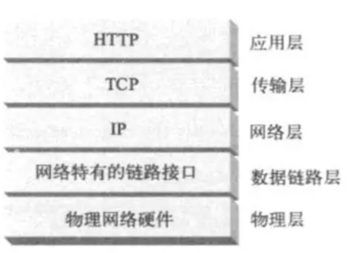
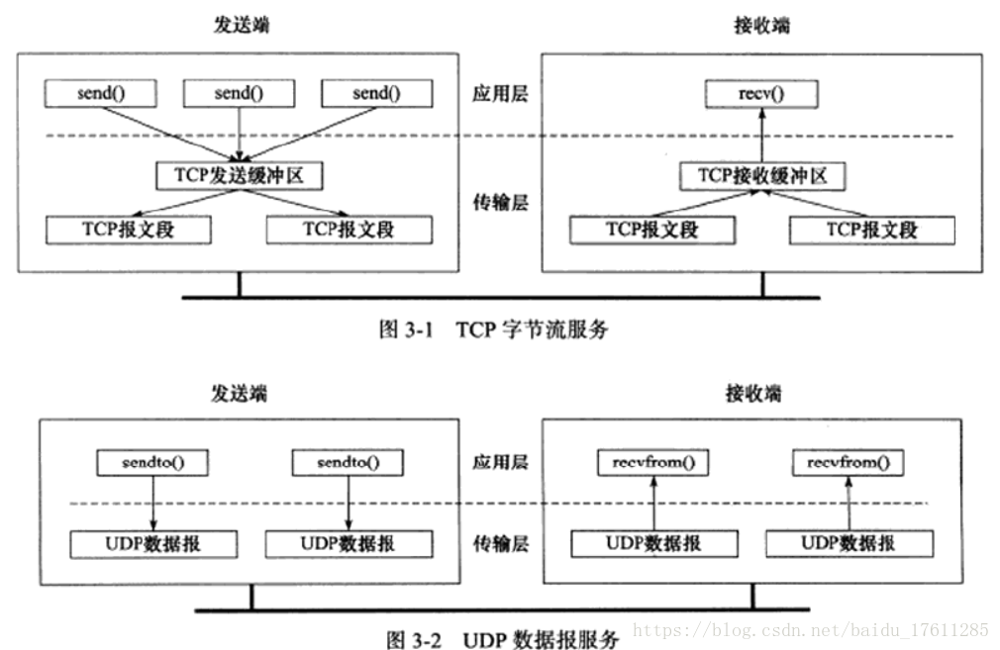
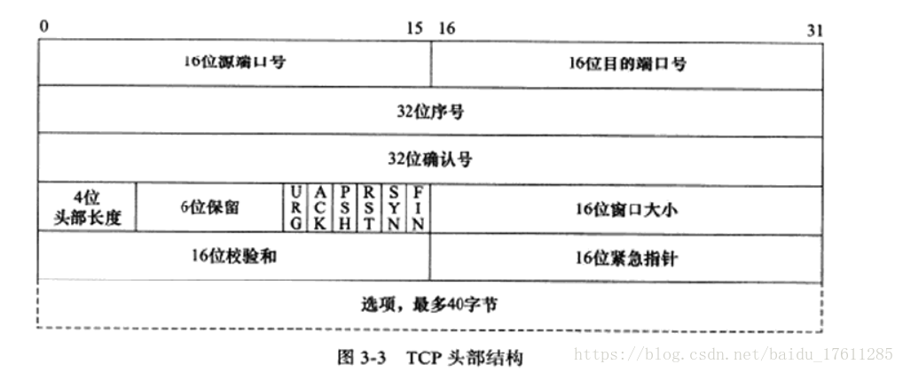
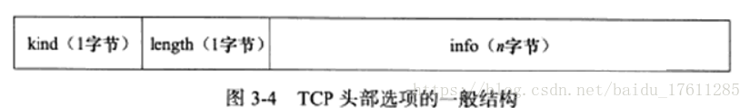
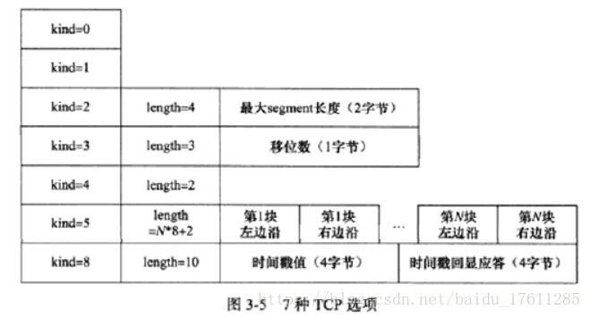
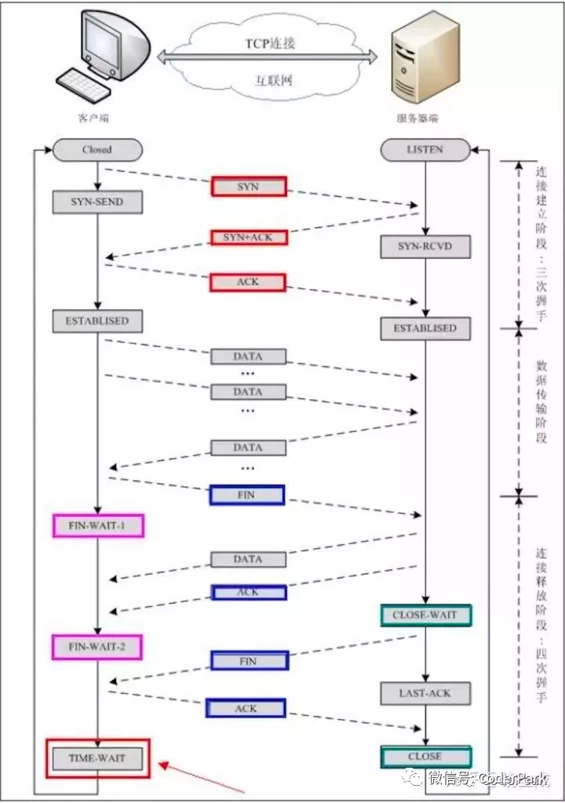

# **#TCP**

## 定义


    网络传输层中，TCP是面向连接、可靠的、字节流传输。
    
    TCP协议通信双方必须先建立连接，通信双方必须为该连接分配必要的内核资源，以管理连接的状态和连接上数据的传输。
    TCP是全双工的，即双方的数据读写可通过一个连接进行。完成数据交换之后，通信双方都必须断开连接以释放系统资源。
    
    TCP协议的这种连接是一对一的，所以基于广播和多播（目标是多个主机地址）的应用程序不能使用TCP服务。而无连接的UDP则十分适合这种广播和多播。
    
    TCP协议使用字节流streaming（UDP使用数据报diagram），实际编程中字节流和数据报的主要区别体现在通信双方是否必须执行相同次数的读、写操作（只是表现形式），
    发送端应用程序连续执行多次写操作时，TCP模块先将这些数据放入TCP发送缓冲区中。当TCP模块真正开始发送数据时，发送缓冲区中这些等待发送的数据可能被封装成一个或多个TCP报文段发出。
    因此，TCP模块发送出的TCP模块发送出的TCP报文段的个数和应用程序执行的写操作次数之间没有固定的数量关系。
    TCP发送端发送了1000个字节，TCP接收端就会接收到1000个字节。发送端可能通过一次发送操作就发送了这1000个字节，但接收端可能通过10次读取操作才读完这1000个字节，
    也就是说发送端的发送动作与接收端的接收动作并没有严格的一一对应关系
    
    当接收端收到一个或多个TCP报文段后，TCP模块将他们携带的应用程序数据按照TCP报文段的序号依次放入TCP接收缓冲区中，并通知应用程序读取数据。
    接收端应用程序可以一次性将TCP接收缓冲区中的数据全部都出，也可以分多次读取，这取决于用户制定的应用程序读缓冲区的大小。
    因此，应用程序执行的读操作次数和TCP模块接收到的TCP报文段个数之间也没有固定的数量关系。
    
    综上所述，发送端执行的写操作次数和接收端执行的读操作次数之间没有任何数量关系，这就是字节流的概念：应用程序对数据的发送和接收是没有边界限制的。
    UDP则然，发送端应用程序没执行一次写操作，UDP模块就将其封装成一个UDP数据包并发送之。接收端必须及时针对每一个UDP数据报执行读操作（通过recvfrom系统调用），
    否则就会丢包（这经常发生在较慢的服务器上）。并且，如果过用户没有指定足够的应用程序缓冲区来读取UDP数据，则UDP数据将被截断

##什么是“3次握手，4次挥手”
    TCP是一种面向连接的单播协议，在发送数据前，通信双方必须在彼此间建立一条连接。所谓的“连接”，其实是客户端和服务器的内存里保存的一份关于对方的信息，如ip地址、端口号等。
    
    TCP可以看成是一种字节流，它会处理IP层或以下的层的丢包、重复以及错误问题。在连接的建立过程中，双方需要交换一些连接的参数。这些参数可以放在TCP头部。
    
    TCP提供了一种可靠、面向连接、字节流、传输层的服务，采用三次握手建立一个连接。采用4次挥手来关闭一个连接
    
##TCP服务模型

    一个TCP连接由一个4元组构成，分别是两个IP地址和两个端口号。一个TCP连接通常分为三个阶段：启动、数据传输、退出（关闭）。

    当TCP接收到另一端的数据时，它会发送一个确认，但这个确认不会立即发送，一般会延迟一会儿。ACK是累积的，一个确认字节号N的ACK表示所有直到N的字节（不包括N）已经成功被接收了。
    这样的好处是如果一个ACK丢失，很可能后续的ACK就足以确认前面的报文段了。
    
    一个完整的TCP连接是双向和对称的，数据可以在两个方向上平等地流动。给上层应用程序提供一种双工服务。一旦建立了一个连接，这个连接的一个方向上的每个TCP报文段都包含了相反方向上的报文段的一个ACK。
    
    序列号的作用是使得一个TCP接收端可丢弃重复的报文段，记录以杂乱次序到达的报文段。因为TCP使用IP来传输报文段，而IP不提供重复消除或者保证次序正确的功能。
    另一方面，TCP是一个字节流协议，绝不会以杂乱的次序给上层程序发送数据。因此TCP接收端会被迫先保持大序列号的数据不交给应用程序，直到缺失的小序列号的报文段被填满。
    
##TCP头部


    16位端口号：告知主机该报文段是来自哪里（源端口Source Port）以及传给哪个上层协议或应用程序（目的端口Destination Port）的。
    进行TCP通信时，客户端通常使用系统自动选择的临时端口号，而服务器则使用知名服务端口号（比如DNS协议对应端口53，HTTP协议对应80，这些端口号可在/etc/services文件中找到）。
    
    32位序号：一次TCP通信（从TCP连接建立到断开）过程中某一个传输方向上的字节流的每个字节的编号。
    假设主机A和主机B进行TCP通信，A发送给B的第一个TCP报文段中，序号值被系统初始化为某个随机值ISN（Initial Sequence Number，初始序号值）。
    那么在该传输方向上（从A到B），后续的TCP报文段中序号值将被系统设置成ISN加上该报文段所携带数据的第一个字节在整个字节流中的偏移。
    例如，某个TCP报文段传送的数据是字节流中的第1025~2048字节，那么该报文段的序号值就是ISN+1025.
    另外一个传输方向（从B到A）的TCP报文段的序号值也具有相同的含义。
    
    32位确认号（acknowledgement number）：用作对另一方发送来的TCP报文段的响应。其值是收到的TCP报文段的序号值加1。假设主机A和主机B进行TCP通信，那么A发送出的TCP报文段不仅携带自己的序号，而且包含对B发送来的TCP报文段的确认号。反之，B发送出的TCP报文段也同时携带自己的序号和对A发送来的报文段的确认号。
    
    4位头部长度（header length）：标识该TCP头部有多少个32bit字（4字节）。因为4位最大能标识15，所以TCP头部最长是60字节。
    
    6位标志位包含如下几项：
    
        URG标志，表示紧急指针（urgent pointer）是否有效。
        
        ACK标志，表示确认号是否有效。我们称携带ACK标识的TCP报文段为确认报文段。
        
        PSH标志，提示接收端应用程序应该立即从TCP接收缓冲区中读走数据，为接收后续数据腾出空间（如果应用程序不将接收到的数据读走，它们就会一直停留在TCP接收缓冲区中）。
        
        RST标志(reset by peer)，表示要求对方重新建立连接。我们称携带RST标志的TCP报文段为复位报文段。
        
        SYN标志，表示请求建立一个连接。我们称携带SYN标志的TCP报文段为同步报文段。
        
        FIN标志，表示通知对方本端要关闭连接了。我们称携带FIN标志的TCP报文段为结束报文段。
    
    16位窗口大小（window size）：是TCP流量控制的一个手段。这里说的窗口，指的是接收通告窗口（Receiver Window，RWND）。它告诉对方本端的TCP接收缓冲区还能容纳多少字节的数据，这样对方就可以控制发送数据的速度。
    
    16位校验和（TCP check sum）：由发送端填充，接收端对TCP报文段执行CRC算法以检验TCP报文段在传输过程中是否损坏。注意，这个校验不仅包括TCP头部，也包括数据部分。这也是TCP可靠传输的一个重要保障。
    
    16位紧急指针（urgent pointer）：是一个正的偏移量。它和序号字段的值相加表示最后一个紧急数据的下一字节的序号。因此，确切地说，这个字段是紧急指针相对当前序号的偏移，不妨称之为紧急偏移。TCP的紧急指针是发送端向接收端发送紧急数据的方法。


    TCP头部选项：TCP头部的最后一个选项字段（options）是可变长的可选信息。这部分最多包含40字节，因为TCP头部最长是60字节（其中还包含前面讨论的20字节的固定部分）。典型的TCP头部选项结构如下图所示

    
    kind=0是选项表结束选项。
    
    kind=1是空操作（nop）选项，没有特殊含义，一般用于将TCP选项的总长度填充为4字节的整数倍。
    
    kind=2是最大报文段长度选项。TCP连接初始化时，通信双方使用该选项来协商最大报文段长度（Max Segement Size，MSS）。
    TCP模块通常将MSS设置为（MTU-40）字节（减掉的这40字节包括20字节的TCP头部和20字节的IP头部）。
    这样携带TCP报文段的IP数据报的长度就不会超过MTU（假设TCP头部和IP头部都不包含选项字段，并且这也是一般情况），从而避免本机发生IP分片。对以太网而言，MSS值是1460（1500-40）字节。
    
    kind=3是窗口扩大因子选项。TCP连接初始化时，通信双方使用该选项来协商接收通告窗口的扩大因子。
    在TCP的头部中，接收通告窗口大小时用16位表示的，故最大为65535字节，但实际上TCP模块允许的接收通告窗口大小远不止这个数（为了提高TCP通信的吞吐量）。
    窗口扩大因子解决了这个问题。假设TCP头部中的接收通告窗口大小是N乘2的M次方，或者说N左移M位。注意，M的取值范围是0~14。我们可以通过修改/proc/sys/net/ipv4/tcp_window_scaling内核变量来启用或关闭窗口扩大因子选项。
    
    kind=5是SACK实际工作的选项。该选项的参数告诉发送方本端已经收到并缓存的不连续的数据块，从而让发送端可以据此检查并重发丢失的数据块。每个块边沿（edge of block）参数包含一个4字节的序号。
    其中块左边沿表示不连续块的第一个数据的序号，而块右边沿则表示不连续块的最后一个数据的序号的下一个序号。这样一对参数（块左边沿和块右边沿）之间的数据是没有收到的。
    因为一个块信息占用8字节，所以TCP头部选项中实际上最多可以包含4个这样的不连续数据块（考虑选项类型和长度占用的2字节）。
    
    kind=8是时间戳选项。该选项提供了较为准确的计算通信双方之间的回路时间（Round Trip Time，RTT）的方法，从而为TCP流量控制提供重要信息。我们可以通过修改/proc/sys/net/ipv4/tcp_timestamps内核变量来启用或关闭时间戳选项。
    
##状态转换

###三次握手
“3次握手”的作用就是双方都能明确自己和对方的收、发能力是正常的。

    第一次握手：客户端发送网络包，服务端收到了。这样服务端就能得出结论：客户端的发送能力、服务端的接收能力是正常的。
    
    第二次握手：服务端发包，客户端收到了。这样客户端就能得出结论：服务端的接收、发送能力，客户端的接收、发送能力是正常的。 
    从客户端的视角来看，我接到了服务端发送过来的响应数据包，说明服务端接收到了我在第一次握手时发送的网络包，并且成功发送了响应数据包，
    这就说明，服务端的接收、发送能力正常。而另一方面，我收到了服务端的响应数据包，说明我第一次发送的网络包成功到达服务端，这样，我自己的发送和接收能力也是正常的。
    
    第三次握手：客户端发包，服务端收到了。这样服务端就能得出结论：客户端的接收、发送能力，服务端的发送、接收能力是正常的。
     第一、二次握手后，服务端并不知道客户端的接收能力以及自己的发送能力是否正常。而在第三次握手时，服务端收到了客户端对第二次握手作的回应。
     从服务端的角度，我在第二次握手时的响应数据发送出去了，客户端接收到了。所以，我的发送能力是正常的。而客户端的接收能力也是正常的。
     
###四次挥手

    TCP连接是双向传输的对等的模式，就是说双方都可以同时向对方发送或接收数据。当有一方要关闭连接时，会发送指令告知对方，我要关闭连接了。
    这时对方会回一个ACK，此时一个方向的连接关闭。但是另一个方向仍然可以继续传输数据，等到发送完了所有的数据后，会发送一个FIN段来关闭此方向上的连接。
    接收方发送ACK确认关闭连接。注意，接收到FIN报文的一方只能回复一个ACK, 它是无法马上返回对方一个FIN报文段的，因为结束数据传输的“指令”是上层应用层给出的，
    我只是一个“搬运工”，我无法了解“上层的意志”
    
    
为什么建立连接是三次握手，而关闭连接却是四次挥手呢？

    这是因为服务端在LISTEN状态下，收到建立连接请求的SYN报文后，把ACK和SYN放在一个报文里发送给客户端。而关闭连接时，当收到对方的FIN报文时，
    仅仅表示对方不再发送数据了但是还能接收数据，己方是否现在关闭发送数据通道，需要上层应用来决定，因此，己方ACK和FIN一般都会分开发送。
    
##ISN

    三次握手的一个重要功能是客户端和服务端交换ISN(Initial Sequence Number), 以便让对方知道接下来接收数据的时候如何按序列号组装数据。
    
    如果ISN是固定的，攻击者很容易猜出后续的确认号
```shell script
ISN = M + F(localhost, localport, remotehost, remoteport)
#M是一个计时器，每隔4微秒加1。 F是一个Hash算法，根据源IP、目的IP、源端口、目的端口生成一个随机数值。要保证hash算法不能被外部轻易推算得出
```

##序列号回绕
因为ISN是随机的，所以序列号容易就会超过2^31-1. 而tcp对于丢包和乱序等问题的判断都是依赖于序列号大小比较的。此时就出现了所谓的tcp序列号回绕（sequence wraparound）问题
```shell script
/** The next routines deal with comparing 32 bit unsigned ints
 * and worry about wraparound (automatic with unsigned arithmetic).*/

static inline int before(__u32 seq1, __u32 seq2){
    return (__s32)(seq1-seq2) < 0;}

#define after(seq2, seq1) before(seq1, seq2)
```
上述代码是内核中的解决回绕问题代码。s32是有符号整型的意思，而u32则是无符号整型。序列号发生回绕后，序列号变小，相减之后，把结果变成有符号数了，因此结果成了负数

    假设seq1=255， seq2=1（发生了回绕）。
    seq1 = 1111 1111 seq2 = 0000 0001
    我们希望比较结果是
     seq1 - seq2=
     1111 1111
    -0000 0001
    -----------
     1111 1110
    
    由于我们将结果转化成了有符号数，由于最高位是1，因此结果是一个负数，负数的绝对值为
     0000 0001 + 1 = 0000 0010 = 2
    
    因此seq1 - seq2 < 0
    
    
##syn flood攻击
最基本的DoS攻击就是利用合理的服务请求来占用过多的服务资源，从而使合法用户无法得到服务的响应。syn flood属于Dos攻击的一种。

    如果恶意的向某个服务器端口发送大量的SYN包，则可以使服务器打开大量的半开连接，分配TCB（Transmission Control Block）,
    从而消耗大量的服务器资源，同时也使得正常的连接请求无法被相应。当开放了一个TCP端口后，该端口就处于Listening状态，不停地监视发到该端口的Syn报文，
    一旦接收到Client发来的Syn报文，就需要为该请求分配一个TCB，通常一个TCB至少需要280个字节，在某些操作系统中TCB甚至需要1300个字节，并返回一个SYN ACK命令，
    立即转为SYN-RECEIVED即半开连接状态。系统会为此耗尽资源。
