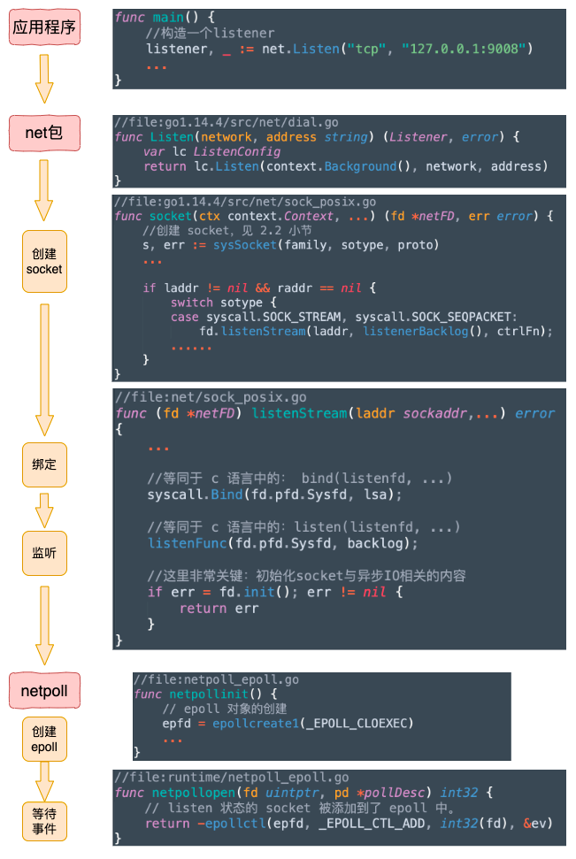
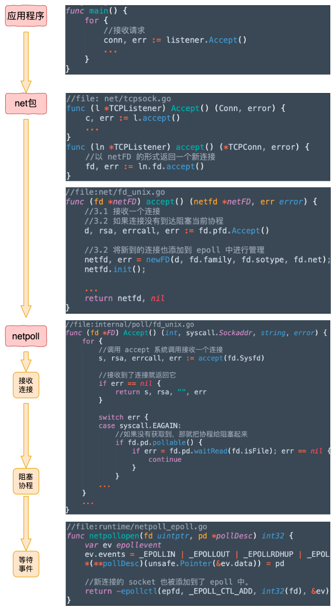
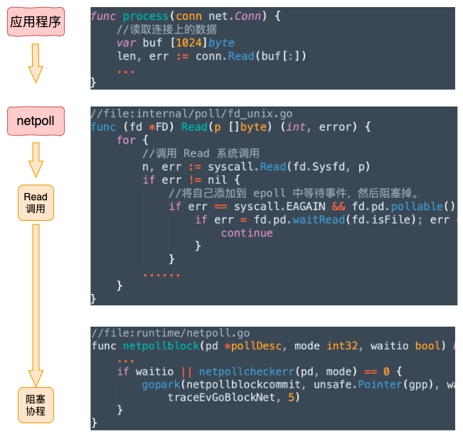

# TCP 服务端

## listen过程

在 golang net 的 listen 中，会完成如下几件事：

1. 创建 socket 并设置非阻塞，
2. bind 绑定并监听本地的一个端口
3. 调用 listen 开始监听
4. epoll_create 创建一个 epoll 对象
5. epoll_etl 将 listen 的 socket 添加到 epoll 中等待连接到来
一次 Golang 的 Listen 调用，相当于在 C 语言中的 socket、bind、listen、epoll_create、epoll_etl 等多次函数调用的效果。封装度非常的高，更大程度地对程序员屏蔽了底层的实现细节


### 1. 创建socket
```go
//file:net/sys_cloexec.go
func sysSocket(family, sotype, proto int) (int, error) {
    //创建 socket
    s, err := socketFunc(family, sotype, proto)
    
    //设置为非阻塞模式
    syscall.SetNonblock(s, true)
}
```
在这个一个函数内就完成了三件事，创建 socket、bind 和 listen 监听


```go
//file:net/hook_unix.go
var (
 // Placeholders for socket system calls.
 socketFunc        func(int, int, int) (int, error)  = syscall.Socket
 connectFunc       func(int, syscall.Sockaddr) error = syscall.Connect
 listenFunc        func(int, int) error              = syscall.Listen
 getsockoptIntFunc func(int, int, int) (int, error)  = syscall.GetsockoptInt
)
```

###  2. 绑定和监听
listenStream这个函数一进来就调用了系统调用 bind 和 listen 来完成了绑定和监听。
```go
//file:net/sock_posix.go
func (fd *netFD) listenStream(laddr sockaddr,...) error 
{
 ...

 //等同于 c 语言中的：bind(listenfd, ...)
 syscall.Bind(fd.pfd.Sysfd, lsa);

 //等同于 c 语言中的：listen(listenfd, ...)
 listenFunc(fd.pfd.Sysfd, backlog);

 //这里非常关键：初始化socket与异步IO相关的内容
 if err = fd.init(); err != nil {
  return err
 }
}
```

### 3. epoll创建和初始化
fd.init 这一行，经过多次的函数调用展开以后会执行到 epoll 对象的创建，并还把在 listen 状态的 socket 句柄添加到了 epoll 对象中来管理其网络事件。

```go
//file:go1.14.4/src/internal/poll/fd_poll_runtime.go
func (pd *pollDesc) init(fd *FD) error {

 serverInit.Do(runtime_pollServerInit)
 ctx, errno := runtime_pollOpen(uintptr(fd.Sysfd))
 ...
 return nil
}
```
runtime_pollServerInit 是对 runtime 包的函数 poll_runtime_pollServerInit 的调用，其源码位于 runtime/netpoll.go 下。

```go
//file:runtime/netpoll.go
//go:linkname poll_runtime_pollServerInit internal/poll.runtime_pollServerInit
func poll_runtime_pollServerInit() {
 netpollGenericInit()
}
```
该函数会执行到 netpollGenericInit， epoll 就是在它的内部创建的。
```go
//file:netpoll_epoll.go
func netpollinit() {
 // epoll 对象的创建
 epfd = epollcreate1(_EPOLL_CLOEXEC)
 ...
}
```

再来看 runtime_pollOpen。它的参数就是前面 listen 好了的 socket 的文件描述符。在这个函数里，它将被放到 epoll 对象中
```go
//file:runtime/netpoll_epoll.go
//go:linkname poll_runtime_pollOpen internal/poll.runtime_pollOpen
func poll_runtime_pollOpen(fd uintptr) (*pollDesc, int) {
 ...
 errno = netpollopen(fd, pd)
 return pd, int(errno)
}

//file:runtime/netpoll_epoll.go
func netpollopen(fd uintptr, pd *pollDesc) int32 {
 var ev epollevent
 ev.events = _EPOLLIN | _EPOLLOUT | _EPOLLRDHUP | _EPOLLET
 *(**pollDesc)(unsafe.Pointer(&ev.data)) = pd

 // listen 状态的 socket 被添加到了 epoll 中。
 return -epollctl(epfd, _EPOLL_CTL_ADD, int32(fd), &ev)
}
```

## Accept 过程


服务端在 Listen 完了之后，就是对 Accept 的调用了。该函数主要做了三件事

1. 调用 accept 系统调用接收一个连接
2. 如果没有连接到达，把当前协程阻塞掉
3. 新连接到来的话，将其添加到 epoll 中管理，然后返回

```go
//file: net/tcpsock.go
func (l *TCPListener) Accept() (Conn, error) {
 c, err := l.accept()
 ...
}
func (ln *TCPListener) accept() (*TCPConn, error) {
 //以 netFD 的形式返回一个新连接
 fd, err := ln.fd.accept()
}
```

```go
//file:net/fd_unix.go
func (fd *netFD) accept() (netfd *netFD, err error) {
 //3.1 接收一个连接
 //3.2 如果连接没有到达阻塞当前协程
 d, rsa, errcall, err := fd.pfd.Accept()

 //3.2 将新到的连接也添加到 epoll 中进行管理
 netfd, err = newFD(d, fd.family, fd.sotype, fd.net);
 netfd.init();

 ...
 return netfd, nil
}
```

### 1. 接收一个连接
```go
//file:internal/poll/fd_unix.go
// Accept wraps the accept network call.
func (fd *FD) Accept() (int, syscall.Sockaddr, string, error) {

 for {
  //调用 accept 系统调用接收一个连接
  s, rsa, errcall, err := accept(fd.Sysfd)

  //接收到了连接就返回它
  if err == nil {
   return s, rsa, "", err
  }

  switch err {
  case syscall.EAGAIN:
   //如果没有获取到，那就把协程给阻塞起来
   if fd.pd.pollable() {
    if err = fd.pd.waitRead(fd.isFile); err == nil {
     continue
    }
   }
  ... 
 }
 ...
}
```

### 2. 阻塞当前协程
accept 系统调用会返回 syscall.EAGAIN。Golang 在对这个状态的处理中，会把当前协程给阻塞起来。
```go

//file: internal/poll/fd_poll_runtime.go
func (pd *pollDesc) waitRead(isFile bool) error {
 return pd.wait('r', isFile)
}
func (pd *pollDesc) wait(mode int, isFile bool) error {
 if pd.runtimeCtx == 0 {
  return errors.New("waiting for unsupported file type")
 }
 res := runtime_pollWait(pd.runtimeCtx, mode)
 return convertErr(res, isFile)
}
```

runtime_pollWait 的源码在 runtime/netpoll.go 下。gopark（协程的阻塞）就是在这里完成的。
```go
//file:runtime/netpoll.go
//go:linkname poll_runtime_pollWait internal/poll.runtime_pollWait
func poll_runtime_pollWait(pd *pollDesc, mode int) int {
    ...
    for !netpollblock(pd, int32(mode), false) {
    }
}

func netpollblock(pd *pollDesc, mode int32, waitio bool) bool {
    ...
    if waitio || netpollcheckerr(pd, mode) == 0 {
        gopark(netpollblockcommit, unsafe.Pointer(gpp), waitReasonIOWait, traceEvGoBlockNet, 5)
    }
}
```

### 3. 将新连接添加到 epoll 中
假如客户端连接已经到来了的情况。这时 fd.pfd.Accept 会返回新建的连接。然后会将该新连接也一并加入到 epoll 中进行高效的事件管理。
```go
//file:net/fd_unix.go
func (fd *netFD) accept() (netfd *netFD, err error) {
 //3.1 接收一个连接
 //3.2 如果连接没有到达阻塞当前协程
 d, rsa, errcall, err := fd.pfd.Accept()

 //3.2 将新到的连接也添加到 epoll 中进行管理
 netfd, err = newFD(d, fd.family, fd.sotype, fd.net);
 netfd.init();

 ...
 return netfd, nil
}
```

```go
//file:internal/poll/fd_poll_runtime.go
func (pd *pollDesc) init(fd *FD) error {
 ...
 ctx, errno := runtime_pollOpen(uintptr(fd.Sysfd))
 ...
}
```

## Read 和 Write 内部过程

### Read流程

```go
//file:/Users/zhangyanfei/sdk/go1.14.4/src/net/net.go
func (c *conn) Read(b []byte) (int, error) {
 ...
 n, err := c.fd.Read(b)
}
```
Read 函数会进入到 FD 的 Read 中。在这个函数内部调用 Read 系统调用来读取数据。如果数据还尚未到达则也是把自己阻塞起来。
```go
//file:internal/poll/fd_unix.go
func (fd *FD) Read(p []byte) (int, error) {
 for {
  //调用 Read 系统调用
  n, err := syscall.Read(fd.Sysfd, p)
  if err != nil {
   n = 0

   //将自己添加到 epoll 中等待事件，然后阻塞掉。
   if err == syscall.EAGAIN && fd.pd.pollable() {
    if err = fd.pd.waitRead(fd.isFile); err == nil {
     continue
    }
   }
  ...... 
 }  
}
```

### Write 内部过程
Write 的大体过程和 Read 是类似的。先是调用 Write 系统调用发送数据，如果内核发送缓存区不足的时候，就把自己先阻塞起来，然后等可写时间发生的时候再继续发送

```go
//file:net/net.go
func (c *conn) Write(b []byte) (int, error) {
 ...
 n, err := c.fd.Write(b)
}
```

```go
//file:internal/poll/fd_unix.go
func (fd *FD) Write(p []byte) (int, error) {
 for {
  n, err := syscall.Write(fd.Sysfd, p[nn:max])
  if err == syscall.EAGAIN && fd.pd.pollable() {
   if err = fd.pd.waitWrite(fd.isFile); err == nil {
    continue
   }
  }
 }
}
```

```go
//file:internal/poll/fd_poll_runtime.go
func (pd *pollDesc) waitWrite(isFile bool) error {
 return pd.wait('w', isFile)
}
```


## Golang 唤醒
例如 Accept 时如果新连接还尚未到达。再比如像 Read 数据的时候对方还没有发送，当前协程都不会占着 cpu 不放，而是会阻塞起来。

Go 语言的运行时会在调度或者系统监控中调用 sysmon，它会调用 netpoll，来不断地调用 epoll_wait 来查看 epoll 对象所管理的文件描述符中哪一个有事件就绪需要被处理了。如果有，就唤醒对应的协程来进行执行

```go
//file:src/runtime/proc.go
func sysmon() {
 ...
 list := netpoll(0) 
}
```
它会不断触发对 netpoll 的调用，在 netpoll 会调用 epollwait 看查看是否有网络事件发生
```go
//file:runtime/netpoll_epoll.go
func netpoll(delay int64) gList {
 ...
retry:
 n := epollwait(epfd, &events[0], int32(len(events)), waitms)
 if n < 0 {
  //没有网络事件
  goto retry
 }

 for i := int32(0); i < n; i++ {

  //查看是读事件还是写事件发生
  var mode int32
  if ev.events&(_EPOLLIN|_EPOLLRDHUP|_EPOLLHUP|_EPOLLERR) != 0 {
   mode += 'r'
  }
  if ev.events&(_EPOLLOUT|_EPOLLHUP|_EPOLLERR) != 0 {
   mode += 'w'
  }

  if mode != 0 {

   pd := *(**pollDesc)(unsafe.Pointer(&ev.data))
   pd.everr = false
   if ev.events == _EPOLLERR {
    pd.everr = true
   }
   netpollready(&toRun, pd, mode)
  }
 }
}
```
在 epoll 返回的时候，ev.data 中是就绪的网络 socket 的文件描述符。根据网络就绪 fd 拿到 pollDesc。在 netpollready 中，将对应的协程推入可运行队列等待调度执行。

```go
//file:runtime/netpoll.go
func netpollready(toRun *gList, pd *pollDesc, mode int32) {
 var rg, wg *g
 if mode == 'r' || mode == 'r'+'w' {
  rg = netpollunblock(pd, 'r', true)
 }
 if mode == 'w' || mode == 'r'+'w' {
  wg = netpollunblock(pd, 'w', true)
 }
 if rg != nil {
  toRun.push(rg)
 }
 if wg != nil {
  toRun.push(wg)
 }
}
```