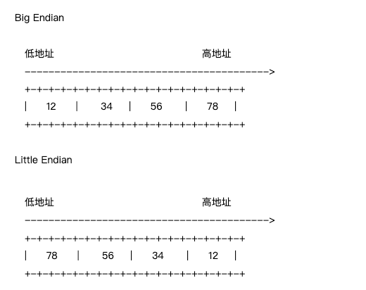

<!-- START doctoc generated TOC please keep comment here to allow auto update -->
<!-- DON'T EDIT THIS SECTION, INSTEAD RE-RUN doctoc TO UPDATE -->
**Table of Contents**  *generated with [DocToc](https://github.com/thlorenz/doctoc)*

- [粘包](#%E7%B2%98%E5%8C%85)
  - [原因](#%E5%8E%9F%E5%9B%A0)
  - [解决方法](#%E8%A7%A3%E5%86%B3%E6%96%B9%E6%B3%95)
  - [UDP会不会产生粘包问题呢？](#udp%E4%BC%9A%E4%B8%8D%E4%BC%9A%E4%BA%A7%E7%94%9F%E7%B2%98%E5%8C%85%E9%97%AE%E9%A2%98%E5%91%A2)
  - [大小端](#%E5%A4%A7%E5%B0%8F%E7%AB%AF)
    - [大小端应用场景](#%E5%A4%A7%E5%B0%8F%E7%AB%AF%E5%BA%94%E7%94%A8%E5%9C%BA%E6%99%AF)
      - [大字端](#%E5%A4%A7%E5%AD%97%E7%AB%AF)
      - [小字端](#%E5%B0%8F%E5%AD%97%E7%AB%AF)
    - [固定长度编码 Fixed-length encoding](#%E5%9B%BA%E5%AE%9A%E9%95%BF%E5%BA%A6%E7%BC%96%E7%A0%81-fixed-length-encoding)
    - [可变长度编码 Variable-length encoding](#%E5%8F%AF%E5%8F%98%E9%95%BF%E5%BA%A6%E7%BC%96%E7%A0%81-variable-length-encoding)
    - [binary 源码分析](#binary-%E6%BA%90%E7%A0%81%E5%88%86%E6%9E%90)
  - [参考](#%E5%8F%82%E8%80%83)

<!-- END doctoc generated TOC please keep comment here to allow auto update -->

# 粘包
TCP粘包就是指发送方发送的若干包数据到达接收方时粘成了一包，从接收缓冲区来看，后一包数据的头紧接着前一包数据的尾。


## 原因
主要原因就是tcp数据传递模式是流模式，在保持长连接的时候可以进行多次的收和发。

“粘包”可发生在发送端也可发生在接收端:
造成TCP粘包的原因
（1）发送方原因

TCP默认使用Nagle算法（主要作用：减少网络中报文段的数量），而Nagle算法主要做两件事：

只有上一个分组得到确认，才会发送下一个分组
收集多个小分组，在一个确认到来时一起发送
Nagle算法造成了发送方可能会出现粘包问题

（2）接收方原因

TCP接收到数据包时，并不会马上交到应用层进行处理，或者说应用层并不会立即处理。实际上，TCP将接收到的数据包保存在接收缓存里，然后应用程序主动从缓存读取收到的分组。这样一来，如果TCP接收数据包到缓存的速度大于应用程序从缓存中读取数据包的速度，多个包就会被缓存，应用程序就有可能读取到多个首尾相接粘到一起的包

## 解决方法
（1）发送方

对于发送方造成的粘包问题，可以通过关闭Nagle算法来解决，使用TCP_NODELAY选项来关闭算法。

（2）接收方

接收方没有办法来处理粘包现象，只能将问题交给应用层来处理。

（2）应用层

应用层的解决办法简单可行，不仅能解决接收方的粘包问题，还可以解决发送方的粘包问题。

解决办法：循环处理，应用程序从接收缓存中读取分组时，读完一条数据，就应该循环读取下一条数据，直到所有数据都被处理完成，但是如何判断每条数据的长度呢？

- 格式化数据：每条数据有固定的格式（开始符，结束符），这种方法简单易行，但是选择开始符和结束符时一定要确保每条数据的内部不包含开始符和结束符。
- 发送长度：发送每条数据时，将数据的长度一并发送，例如规定数据的前4位是数据的长度，应用层在处理时可以根据长度来判断每个分组的开始和结束位置。

## UDP会不会产生粘包问题呢？
TCP为了保证可靠传输并减少额外的开销（每次发包都要验证），采用了基于流的传输，基于流的传输不认为消息是一条一条的，是无保护消息边界的（保护消息边界：指传输协议把数据当做一条独立的消息在网上传输，接收端一次只能接受一条独立的消息）。

UDP则是面向消息传输的，是有保护消息边界的，接收方一次只接受一条独立的信息，所以不存在粘包问题。

举个例子：有三个数据包，大小分别为2k、4k、6k，如果采用UDP发送的话，不管接受方的接收缓存有多大，我们必须要进行至少三次以上的发送才能把数据包发送完，但是使用TCP协议发送的话，我们只需要接受方的接收缓存有12k的大小，就可以一次把这3个数据包全部发送完毕。

## 大小端

- 大端模式：高位字节排放在内存的低地址端，低位字节排放在内存的高地址端;

- 小端模式：低位字节排放在内存的低地址端，高位字节排放在内存的高地址端；

在计算机存储数据时，是以字节为单位去存储，因此把 0x12345678 拆分：

- 大字端：0x12 0x34 0x56 0x78
- 小字端：0x78 0x56 0x34 0x12

从上面两图可以看出，采用big endian方式存储数据是符合我们人类的思维习惯的.

为什么要注意字节序的问题呢？你可能这么问。当然，如果你写的程序只在单机环境下面运行，并且不和别人的程序打交道，那么你完全可以忽略字节序的存在。但是，如果你的程序要跟别人的程序产生交互呢？尤其是当你把你在微机上运算的结果运用到计算机群上去的话。在这里我想说说两种语言。C/C++语言编写的程序里数据存储顺序是跟编译平台所在的CPU相关的，而JAVA编写的程序则唯一采用big endian方式来存储数据。试想，如果你用C/C++语言在x86平台下编写的程序跟别人的JAVA程序互通时会产生什么结果？就拿上面的0x12345678来说，你的程序传递给别人的一个数据，将指向0x12345678的指针传给了JAVA程序，由于JAVA采取big endian方式存储数据，很自然的它会将你的数据翻译为0x78563412。


### 大小端应用场景


#### 大字端

例如，对于网络传输，使用的就是大字端。为什么?

因为，早年设备的缓存很小，先接收高字节能快速的判断报文信息：包长度(需要准备多大缓存)、地址范围(IP地址是从前到后匹配的)。

在性能不是很好的设备上，高字节在先确实是会更快一些。所以有时我们也会把big endian方式称之为网络字节序.

#### 小字端

例如，对于一个加法器，选择的是小字端。为什么?

因为，加法是从低位到高位开始加，一旦有进位，就直接送到下一位，设计就很简单。


### 固定长度编码 Fixed-length encoding
```go
// user encoding/binary
// bigEndian littleEndian
func BigEndianAndLittleEndianByLibrary()  {
    var value uint32 = 10
    by := make([]byte,4)
	// 写入数据：需要注意的是使用 put 写时要保证足够的切片长度
    binary.BigEndian.PutUint32(by,value)
    fmt.Println("转换成大端后 ",by)
    fmt.Println("使用大端字节序输出结果：",binary.BigEndian.Uint32(by))
	
	// 读取数据
    little := binary.LittleEndian.Uint32(by)
    fmt.Println("大端字节序使用小端输出结果：",little)
}
// 结果：
//转换成大端后  [0 0 0 10]
//使用大端字节序输出结果： 10
//大端字节序使用小端输出结果： 167772160
```


grpc中对大端的应用

gRPC封装message时，在封装header时，特意指定了使用大端字节序，

```go
// msgHeader returns a 5-byte header for the message being transmitted and the
// payload, which is compData if non-nil or data otherwise.
func msgHeader(data, compData []byte) (hdr []byte, payload []byte) {
    hdr = make([]byte, headerLen)
    if compData != nil {
    hdr[0] = byte(compressionMade)
        data = compData
    } else {
        hdr[0] = byte(compressionNone)
    }
    
    // Write length of payload into buf
    binary.BigEndian.PutUint32(hdr[payloadLen:], uint32(len(data)))
    return hdr, data
}
```

### 可变长度编码 Variable-length encoding
固定长度编码对存储空间的占用不灵活，比如一个 int64 类型范围内的值，当值较小时就会产生比较多的 0 字节无效位，直至达到 64 位。使用可变长度编码可限制这种空间浪费

每个字节的首位存放一个标识位，用以表明是否还有跟多字节要读取及剩下的七位是否真正存储数据。标识位分别为 0 和 1

* 1 表示还要继续读取该字节后面的字节
* 0 表示停止读取该字节后面的字节


```go
// PutUvarint encodes a uint64 into buf and returns the number of bytes written.
// If the buffer is too small, PutUvarint will panic.
func PutUvarint(buf []byte, x uint64) int {
	i := 0
	for x >= 0x80 {
		buf[i] = byte(x) | 0x80
		x >>= 7
		i++
	}
	buf[i] = byte(x)
	return i + 1
}

```

### binary 源码分析

接口 ByteOrder 说明
```api
// A ByteOrder specifies how to convert byte slices into
// 16-, 32-, or 64-bit unsigned integers.
type ByteOrder interface {
    // 前三个方法用于读取数据
	Uint16([]byte) uint16
	Uint32([]byte) uint32
	Uint64([]byte) uint64
    // 后三个方法用于写入数据
	PutUint16([]byte, uint16)
	PutUint32([]byte, uint32)
	PutUint64([]byte, uint64)
	String() string
}
```
参考实现 
```go
// BigEndian is the big-endian implementation of ByteOrder and AppendByteOrder.
var BigEndian bigEndian


func (bigEndian) Uint64(b []byte) uint64 {
	_ = b[7] // bounds check hint to compiler; see golang.org/issue/14808
	return uint64(b[7]) | uint64(b[6])<<8 | uint64(b[5])<<16 | uint64(b[4])<<24 |
		uint64(b[3])<<32 | uint64(b[2])<<40 | uint64(b[1])<<48 | uint64(b[0])<<56
}

func (bigEndian) PutUint64(b []byte, v uint64) {
	_ = b[7] // early bounds check to guarantee safety of writes below
	b[0] = byte(v >> 56)
	b[1] = byte(v >> 48)
	b[2] = byte(v >> 40)
	b[3] = byte(v >> 32)
	b[4] = byte(v >> 24)
	b[5] = byte(v >> 16)
	b[6] = byte(v >> 8)
	b[7] = byte(v)
}
```


Go 处理固定长度流 (stream processing)

读取读写固定长度值的流 (stream)
```go
func Read(r io.Reader, order ByteOrder, data any) error {
	// Fast path for basic types and slices.
	// 获取大小
	if n := intDataSize(data); n != 0 {
		bs := make([]byte, n)
		if _, err := io.ReadFull(r, bs); err != nil {
			return err
		}
		switch data := data.(type) {
		case *bool:
			*data = bs[0] != 0
		case *int8:
			*data = int8(bs[0])
		case *uint8:
			*data = bs[0]
		case *int16:
			*data = int16(order.Uint16(bs))
		case *uint16:
			*data = order.Uint16(bs)
		case *int32:
			*data = int32(order.Uint32(bs))
		case *uint32:
			*data = order.Uint32(bs)
		case *int64:
			*data = int64(order.Uint64(bs))
		case *uint64:
			*data = order.Uint64(bs)
		case *float32:
			*data = math.Float32frombits(order.Uint32(bs))
		case *float64:
			*data = math.Float64frombits(order.Uint64(bs))
		case []bool:
			for i, x := range bs { // Easier to loop over the input for 8-bit values.
				data[i] = x != 0
			}
		case []int8:
			for i, x := range bs {
				data[i] = int8(x)
			}
		case []uint8:
			copy(data, bs)
		case []int16:
			for i := range data {
				data[i] = int16(order.Uint16(bs[2*i:]))
			}
		case []uint16:
			for i := range data {
				data[i] = order.Uint16(bs[2*i:])
			}
		case []int32:
			for i := range data {
				data[i] = int32(order.Uint32(bs[4*i:]))
			}
		case []uint32:
			for i := range data {
				data[i] = order.Uint32(bs[4*i:])
			}
		case []int64:
			for i := range data {
				data[i] = int64(order.Uint64(bs[8*i:]))
			}
		case []uint64:
			for i := range data {
				data[i] = order.Uint64(bs[8*i:])
			}
		case []float32:
			for i := range data {
				data[i] = math.Float32frombits(order.Uint32(bs[4*i:]))
			}
		case []float64:
			for i := range data {
				data[i] = math.Float64frombits(order.Uint64(bs[8*i:]))
			}
		default:
			n = 0 // fast path doesn't apply
		}
		if n != 0 {
			return nil
		}
	}

	// Fallback to reflect-based decoding.
	v := reflect.ValueOf(data)
	size := -1
	switch v.Kind() {
	case reflect.Pointer:
		v = v.Elem()
		size = dataSize(v)
	case reflect.Slice:
		size = dataSize(v)
	}
	if size < 0 {
		return errors.New("binary.Read: invalid type " + reflect.TypeOf(data).String())
	}
	d := &decoder{order: order, buf: make([]byte, size)}
	if _, err := io.ReadFull(r, d.buf); err != nil {
		return err
	}
	d.value(v)
	return nil
}

func intDataSize(data any) int {
	switch data := data.(type) {
	case bool, int8, uint8, *bool, *int8, *uint8:
		return 1
	case []bool:
		return len(data)
	case []int8:
		return len(data)
	case []uint8:
		return len(data)
	case int16, uint16, *int16, *uint16:
		return 2
	case []int16:
		return 2 * len(data)
	case []uint16:
		return 2 * len(data)
	case int32, uint32, *int32, *uint32:
		return 4
	case []int32:
		return 4 * len(data)
	case []uint32:
		return 4 * len(data)
	case int64, uint64, *int64, *uint64:
		return 8
	case []int64:
		return 8 * len(data)
	case []uint64:
		return 8 * len(data)
	case float32, *float32:
		return 4
	case float64, *float64:
		return 8
	case []float32:
		return 4 * len(data)
	case []float64:
		return 8 * len(data)
	}
	return 0
}
```

## 参考

- [go语言字节序 encoding/binary](https://www.cnblogs.com/-wenli/p/12323809.html)
- [一分钟看懂TCP粘包拆包](https://www.51cto.com/article/707652.html)