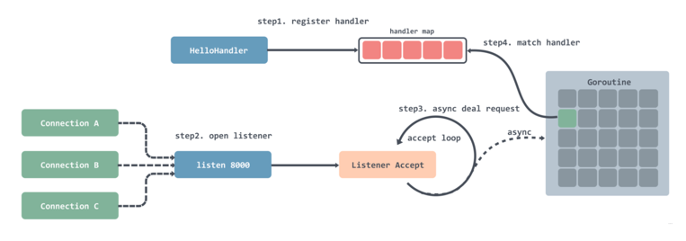
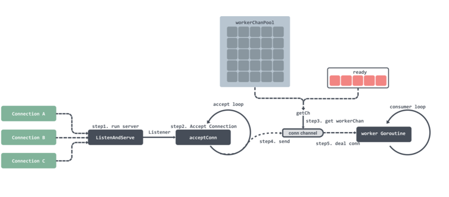

<!-- START doctoc generated TOC please keep comment here to allow auto update -->
<!-- DON'T EDIT THIS SECTION, INSTEAD RE-RUN doctoc TO UPDATE -->
**Table of Contents**  *generated with [DocToc](https://github.com/thlorenz/doctoc)*

- [fasthttp](#fasthttp)
  - [对比net/http](#%E5%AF%B9%E6%AF%94nethttp)
  - [源码分析](#%E6%BA%90%E7%A0%81%E5%88%86%E6%9E%90)
    - [初始化](#%E5%88%9D%E5%A7%8B%E5%8C%96)
    - [具体获取过程: 工作协程的复用](#%E5%85%B7%E4%BD%93%E8%8E%B7%E5%8F%96%E8%BF%87%E7%A8%8B-%E5%B7%A5%E4%BD%9C%E5%8D%8F%E7%A8%8B%E7%9A%84%E5%A4%8D%E7%94%A8)
      - [工作池结构池 workerPool](#%E5%B7%A5%E4%BD%9C%E6%B1%A0%E7%BB%93%E6%9E%84%E6%B1%A0-workerpool)
    - [获取连接](#%E8%8E%B7%E5%8F%96%E8%BF%9E%E6%8E%A5)
    - [内存变量复用](#%E5%86%85%E5%AD%98%E5%8F%98%E9%87%8F%E5%A4%8D%E7%94%A8)

<!-- END doctoc generated TOC please keep comment here to allow auto update -->

# fasthttp
高性能主要源自于“复用”，通过服务协程和内存变量的复用，节省了大量资源分配的成本。

## 对比net/http
net/http流程

1. 注册处理器到一个 hash 表中，可以通过键值路由匹配；
2. 注册完之后就是开启循环监听，每监听到一个连接就会创建一个 Goroutine；
3. 在创建好的 Goroutine 里面会循环的等待接收请求数据，然后根据请求的地址去处理器路由表中匹配对应的处理器，然后将请求交给处理器处理

fasthttp流程

1. 启动监听；
2. 循环监听端口获取连接；
3. 获取到连接之后首先会去 ready 队列里获取 workerChan，获取不到就会去对象池获取；
4. 将监听的连接传入到 workerChan 的 channel 中；
5. workerChan 有一个 Goroutine 一直循环获取 channel 中的数据，获取到之后就会对请求进行处理然后返回

workerChan 其实就是一个连接处理对象，这个对象里面有一个 channel 用来传递连接；
每个 workerChan 在后台都会有一个 Goroutine 循环获取 channel 中的连接，然后进行处理。如果没有设置最大同时连接处理数的话，默认是 256 * 1024个。
这样可以在并发很高的时候还可以同时保证对外提供服务。

## 源码分析
优点
- 工作协程复用
- 内存变量复用： 内部大量使用了sync.Pool,可以看server的结构
- fasthttp 还会切片，通过 s = s[:0]和 s = append(s[:0], b…)来减少切片的再次创建.

Server结构体
```go
type Server struct {
	noCopy noCopy //nolint:unused,structcheck

	// Handler for processing incoming requests.
	//
	// Take into account that no `panic` recovery is done by `fasthttp` (thus any `panic` will take down the entire server).
	// Instead the user should use `recover` to handle these situations.
	Handler RequestHandler

	// ErrorHandler for returning a response in case of an error while receiving or parsing the request.
	//
	// The following is a non-exhaustive list of errors that can be expected as argument:
	//   * io.EOF
	//   * io.ErrUnexpectedEOF
	//   * ErrGetOnly
	//   * ErrSmallBuffer
	//   * ErrBodyTooLarge
	//   * ErrBrokenChunks
	ErrorHandler func(ctx *RequestCtx, err error)

	// HeaderReceived is called after receiving the header
	//
	// non zero RequestConfig field values will overwrite the default configs
	HeaderReceived func(header *RequestHeader) RequestConfig


	ContinueHandler func(header *RequestHeader) bool


	Name string

	// The maximum number of concurrent connections the server may serve.
	//
	// DefaultConcurrency is used if not set.
	//
	// Concurrency only works if you either call Serve once, or only ServeConn multiple times.
	// It works with ListenAndServe as well.
	Concurrency int

	// Whether to disable keep-alive connections.
	//
	// The server will close all the incoming connections after sending
	// the first response to client if this option is set to true.
	//
	// By default keep-alive connections are enabled.
	DisableKeepalive bool

	// Per-connection buffer size for requests' reading.
	// This also limits the maximum header size.
	//
	// Increase this buffer if your clients send multi-KB RequestURIs
	// and/or multi-KB headers (for example, BIG cookies).
	//
	// Default buffer size is used if not set.
	ReadBufferSize int

	// Per-connection buffer size for responses' writing.
	//
	// Default buffer size is used if not set.
	WriteBufferSize int

	// ReadTimeout is the amount of time allowed to read
	// the full request including body. The connection's read
	// deadline is reset when the connection opens, or for
	// keep-alive connections after the first byte has been read.
	//
	// By default request read timeout is unlimited.
	ReadTimeout time.Duration

	// WriteTimeout is the maximum duration before timing out
	// writes of the response. It is reset after the request handler
	// has returned.
	//
	// By default response write timeout is unlimited.
	WriteTimeout time.Duration

	// IdleTimeout is the maximum amount of time to wait for the
	// next request when keep-alive is enabled. If IdleTimeout
	// is zero, the value of ReadTimeout is used.
	IdleTimeout time.Duration

	// Maximum number of concurrent client connections allowed per IP.
	//
	// By default unlimited number of concurrent connections
	// may be established to the server from a single IP address.
	MaxConnsPerIP int

	// Maximum number of requests served per connection.
	//
	// The server closes connection after the last request.
	// 'Connection: close' header is added to the last response.
	//
	// By default unlimited number of requests may be served per connection.
	MaxRequestsPerConn int

	// MaxKeepaliveDuration is a no-op and only left here for backwards compatibility.
	// Deprecated: Use IdleTimeout instead.
	MaxKeepaliveDuration time.Duration

	// Whether to enable tcp keep-alive connections.
	//
	// Whether the operating system should send tcp keep-alive messages on the tcp connection.
	//
	// By default tcp keep-alive connections are disabled.
	TCPKeepalive bool

	// Period between tcp keep-alive messages.
	//
	// TCP keep-alive period is determined by operation system by default.
	TCPKeepalivePeriod time.Duration

	// Maximum request body size.
	//
	// The server rejects requests with bodies exceeding this limit.
	//
	// Request body size is limited by DefaultMaxRequestBodySize by default.
	MaxRequestBodySize int

	// Aggressively reduces memory usage at the cost of higher CPU usage
	// if set to true.
	//
	// Try enabling this option only if the server consumes too much memory
	// serving mostly idle keep-alive connections. This may reduce memory
	// usage by more than 50%.
	//
	// Aggressive memory usage reduction is disabled by default.
	ReduceMemoryUsage bool

	// Rejects all non-GET requests if set to true.
	//
	// This option is useful as anti-DoS protection for servers
	// accepting only GET requests. The request size is limited
	// by ReadBufferSize if GetOnly is set.
	//
	// Server accepts all the requests by default.
	GetOnly bool

	// Will not pre parse Multipart Form data if set to true.
	//
	// This option is useful for servers that desire to treat
	// multipart form data as a binary blob, or choose when to parse the data.
	//
	// Server pre parses multipart form data by default.
	DisablePreParseMultipartForm bool

	// Logs all errors, including the most frequent
	// 'connection reset by peer', 'broken pipe' and 'connection timeout'
	// errors. Such errors are common in production serving real-world
	// clients.
	//
	// By default the most frequent errors such as
	// 'connection reset by peer', 'broken pipe' and 'connection timeout'
	// are suppressed in order to limit output log traffic.
	LogAllErrors bool

	// Will not log potentially sensitive content in error logs
	//
	// This option is useful for servers that handle sensitive data
	// in the request/response.
	//
	// Server logs all full errors by default.
	SecureErrorLogMessage bool

	// Header names are passed as-is without normalization
	// if this option is set.
	//
	// Disabled header names' normalization may be useful only for proxying
	// incoming requests to other servers expecting case-sensitive
	// header names. See https://github.com/valyala/fasthttp/issues/57
	// for details.
	//
	// By default request and response header names are normalized, i.e.
	// The first letter and the first letters following dashes
	// are uppercased, while all the other letters are lowercased.
	// Examples:
	//
	//     * HOST -> Host
	//     * content-type -> Content-Type
	//     * cONTENT-lenGTH -> Content-Length
	DisableHeaderNamesNormalizing bool

	// SleepWhenConcurrencyLimitsExceeded is a duration to be slept of if
	// the concurrency limit in exceeded (default [when is 0]: don't sleep
	// and accept new connections immidiatelly).
	SleepWhenConcurrencyLimitsExceeded time.Duration

	// NoDefaultServerHeader, when set to true, causes the default Server header
	// to be excluded from the Response.
	//
	// The default Server header value is the value of the Name field or an
	// internal default value in its absence. With this option set to true,
	// the only time a Server header will be sent is if a non-zero length
	// value is explicitly provided during a request.
	NoDefaultServerHeader bool

	// NoDefaultDate, when set to true, causes the default Date
	// header to be excluded from the Response.
	//
	// The default Date header value is the current date value. When
	// set to true, the Date will not be present.
	NoDefaultDate bool

	// NoDefaultContentType, when set to true, causes the default Content-Type
	// header to be excluded from the Response.
	//
	// The default Content-Type header value is the internal default value. When
	// set to true, the Content-Type will not be present.
	NoDefaultContentType bool

	// ConnState specifies an optional callback function that is
	// called when a client connection changes state. See the
	// ConnState type and associated constants for details.
	ConnState func(net.Conn, ConnState)

	// Logger, which is used by RequestCtx.Logger().
	//
	// By default standard logger from log package is used.
	Logger Logger

	// KeepHijackedConns is an opt-in disable of connection
	// close by fasthttp after connections' HijackHandler returns.
	// This allows to save goroutines, e.g. when fasthttp used to upgrade
	// http connections to WS and connection goes to another handler,
	// which will close it when needed.
	KeepHijackedConns bool

	// CloseOnShutdown when true adds a `Connection: close` header when when the server is shutting down.
	CloseOnShutdown bool

	// StreamRequestBody enables request body streaming,
	// and calls the handler sooner when given body is
	// larger then the current limit.
	StreamRequestBody bool

	tlsConfig  *tls.Config
	nextProtos map[string]ServeHandler

	concurrency      uint32
	concurrencyCh    chan struct{}
	perIPConnCounter perIPConnCounter
	serverName       atomic.Value

	// 大量sync.Pool
	ctxPool        sync.Pool
	readerPool     sync.Pool
	writerPool     sync.Pool
	hijackConnPool sync.Pool

	// We need to know our listeners so we can close them in Shutdown().
	ln []net.Listener

	mu   sync.Mutex
	open int32
	stop int32
	done chan struct{}
}
```
在实现上还通过 sync.Pool 来大量的复用对象，减少内存分配，如：

workerChanPool 、ctxPool 、readerPool、writerPool 等等多大30多个 sync.Pool 。


### 初始化
```go
func (s *Server) Serve(ln net.Listener) error {
    // ....

	wp := &workerPool{
		WorkerFunc:      s.serveConn,  // 具体的工作逻辑
		MaxWorkersCount: maxWorkersCount,
		LogAllErrors:    s.LogAllErrors,
		Logger:          s.logger(),
		connState:       s.setState,
	}
	wp.Start()

	// Count our waiting to accept a connection as an open connection.
	// This way we can't get into any weird state where just after accepting
	// a connection Shutdown is called which reads open as 0 because it isn't
	// incremented yet.
	atomic.AddInt32(&s.open, 1)
	defer atomic.AddInt32(&s.open, -1)

	for {
		if c, err = acceptConn(s, ln, &lastPerIPErrorTime); err != nil {
			wp.Stop()
			if err == io.EOF {
				return nil
			}
			return err
		}
		s.setState(c, StateNew)
		atomic.AddInt32(&s.open, 1)
		// 开始服务
		if !wp.Serve(c) {
			atomic.AddInt32(&s.open, -1)
			s.writeFastError(c, StatusServiceUnavailable,
				"The connection cannot be served because Server.Concurrency limit exceeded")
			c.Close()
			s.setState(c, StateClosed)
            // ...
		}
		c = nil
	}
}

func (wp *workerPool) Serve(c net.Conn) bool {
	// 获取工作的channel
    ch := wp.getCh()
    if ch == nil {
        return false
    }
    ch.ch <- c
    return true
}
```


### 具体获取过程: 工作协程的复用

处理连接部分首先会获取 workerChan ，workerChan 结构体里面包含了两个字段：lastUseTime、channel：
```go
type workerChan struct {
    lastUseTime time.Time  //标识最后一次被使用的时间 
    ch          chan net.Conn  //ch 是用来传递 Connection 用的 
}
```

获取 workerChan
```go
func (wp *workerPool) Serve(c net.Conn) bool {
    // 获取 workerChan 
    ch := wp.getCh()
    if ch == nil {
        return false
    }
    // 将 Connection 放入到 channel 中
    ch.ch <- c
    return true
}


func (wp *workerPool) getCh() *workerChan {
	var ch *workerChan
	createWorker := false

	wp.lock.Lock()
    // 尝试从空闲队列里获取 workerChan
	ready := wp.ready
	n := len(ready) - 1
	if n < 0 {
		if wp.workersCount < wp.MaxWorkersCount {
			createWorker = true
			wp.workersCount++
		}
	} else {
		// 从准备好的worker池中获取
		ch = ready[n]
		ready[n] = nil
		wp.ready = ready[:n]
	}
	wp.lock.Unlock()

	// 获取不到则从对象池中获取
	if ch == nil {
		if !createWorker {
			return nil
		}
		vch := wp.workerChanPool.Get()
		ch = vch.(*workerChan)
        // 为新的 workerChan 开启 goroutine
		go func() {
            // 处理 channel 中的数据
			wp.workerFunc(ch)
			
			// 处理完之后重新放回到对象池中
			wp.workerChanPool.Put(vch)
		}()
	}
	return ch
}
```


#### 工作池结构池 workerPool
```go
// /Users/python/go/pkg/mod/github.com/valyala/fasthttp@v1.29.0/workerpool.go
type workerPool struct {
	// Function for serving server connections.
	// It must leave c unclosed.
	WorkerFunc ServeHandler // 用来匹配请求对应的 handler 并执行；

	MaxWorkersCount int //最大同时处理的请求数

	LogAllErrors bool

	MaxIdleWorkerDuration time.Duration

	Logger Logger

	lock         sync.Mutex
	workersCount int  // 目前正在处理的请求数
	mustStop     bool

	ready []*workerChan  //空闲的 workerChan

	stopCh chan struct{}

	workerChanPool sync.Pool // workerChan 的对象池，是一个 sync.Pool 类型的；

	connState func(net.Conn, ConnState) 
}
```


workerPool 的 Start 方法
```go
func (wp *workerPool) Start() {
    if wp.stopCh != nil {
        panic("BUG: workerPool already started")
    }
    wp.stopCh = make(chan struct{})
    stopCh := wp.stopCh
    // 设置 worker Pool 的创建函数
    wp.workerChanPool.New = func() interface{} {
        return &workerChan{
            ch: make(chan net.Conn, workerChanCap),
        }
    }
    go func() {
        var scratch []*workerChan
        for {
            // 没隔一段时间会清理空闲超时的 workerChan
            wp.clean(&scratch)
            select {
            case <-stopCh:
                return
            default:
                // 默认是 10 s
                time.Sleep(wp.getMaxIdleWorkerDuration())
            }
        }
    }()
}
```


处理连接: 每个工作协程
```go
func (wp *workerPool) workerFunc(ch *workerChan) {
	var c net.Conn

	var err error
    // 消费 channel 中的数据
	for c = range ch.ch {
		if c == nil {
			break
		}
        // 业务执行流程
		if err = wp.WorkerFunc(c); err != nil && err != errHijacked {
			errStr := err.Error()
			// ... 
		}
		if err == errHijacked {
			wp.connState(c, StateHijacked)
		} else {
			_ = c.Close()
			wp.connState(c, StateClosed)
		}
		c = nil
		// 将当前的 workerChan 放入的 ready 队列中
		if !wp.release(ch) {
			break
		}
	}

	wp.lock.Lock()
	wp.workersCount--
	wp.lock.Unlock()
}
```
这里会遍历获取 workerChan 的 channel 中的 Connection 然后执行 WorkerFunc 函数处理请求，处理完毕之后会将当前的 workerChan 重新放入到 ready 队列中复用。

这个循环会在获取 Connection 为 nil 的时候跳出循环，这个 nil 是 workerPool 在异步调用 clean 方法检查该 workerChan 空闲时间超长了就会往 channel 中传入一个 nil。

### 获取连接
```go
func acceptConn(s *Server, ln net.Listener, lastPerIPErrorTime *time.Time) (net.Conn, error) {
    for {
        c, err := ln.Accept() 
        if err != nil {
            if c != nil {
                panic("BUG: net.Listener returned non-nil conn and non-nil error")
            }
            ...
            return nil, io.EOF
        }
        if c == nil {
            panic("BUG: net.Listener returned (nil, nil)")
        }
        // 校验每个ip对应的连接数
        if s.MaxConnsPerIP > 0 {
            pic := wrapPerIPConn(s, c)
            if pic == nil {
                if time.Since(*lastPerIPErrorTime) > time.Minute {
                    s.logger().Printf("The number of connections from %s exceeds MaxConnsPerIP=%d",
                        getConnIP4(c), s.MaxConnsPerIP)
                    *lastPerIPErrorTime = time.Now()
                }
                continue
            }
            c = pic
        }
        return c, nil
    }
}
```


### 内存变量复用
具体工作时
```go
func (s *Server) serveConn(c net.Conn) (err error) {
    // ....
    // 获取上下文
	ctx := s.acquireCtx(c)
	// ....
	if ctx != nil {
		// 释放上下文
        s.releaseCtx(ctx)
    }
	return
}
```

获取及释放上下文
```go
func (s *Server) acquireCtx(c net.Conn) (ctx *RequestCtx) {
	v := s.ctxPool.Get()
	if v == nil {
		ctx = &RequestCtx{
			s: s,
		}
		keepBodyBuffer := !s.ReduceMemoryUsage
		ctx.Request.keepBodyBuffer = keepBodyBuffer
		ctx.Response.keepBodyBuffer = keepBodyBuffer
	} else {
		ctx = v.(*RequestCtx)
	}
	ctx.c = c
	return
}
func (s *Server) releaseCtx(ctx *RequestCtx) {
    if ctx.timeoutResponse != nil {
        panic("BUG: cannot release timed out RequestCtx")
    }
    ctx.c = nil
    ctx.remoteAddr = nil
    ctx.fbr.c = nil
    ctx.userValues.Reset()
    s.ctxPool.Put(ctx)
}

```
