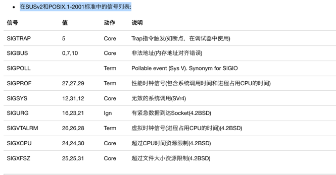
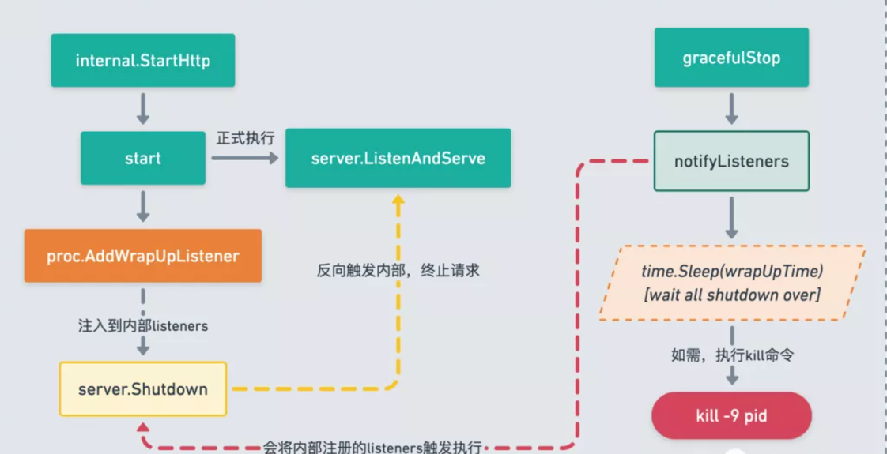

# 优雅退出
在服务端程序更新或重启时，如果我们直接 kill -9 杀掉旧进程并启动新进程，会有以下几个问题：

* 旧的请求未处理完，如果服务端进程直接退出，会造成客户端链接中断（收到 RST）
* 新请求打过来，服务还没重启完毕，造成 connection refused
* 即使是要退出程序，直接 kill -9 仍然会让正在处理的请求中断

很直接的感受就是：在重启过程中，会有一段时间不能给用户提供正常服务；同时粗鲁关闭服务，也可能会对业务依赖的数据库等状态服务造成污染。

所以我们服务重启或者是重新发布过程中，要做到新旧服务无缝切换，同时可以保障变更服务 零宕机时间

## 信号

信号是事件发生时对进程的通知机制。有时也称之为软件中断。信号与硬件中断的相似之处在于打断了程序执行的正常流程，大多数情况下，无法预测信号到达的精确时间。

因为一个具有合适权限的进程可以向另一个进程发送信号，这可以称为进程间的一种同步技术。当然，进程也可以向自身发送信号。然而，发往进程的诸多信号，通常都是源于内核。引发内核为进程产生信号的各类事件如下。

硬件发生异常，即硬件检测到一个错误条件并通知内核，随即再由内核发送相应信号给相关进程。比如执行一条异常的机器语言指令（除 0，引用无法访问的内存区域）。
用户键入了能够产生信号的终端特殊字符。如中断字符（通常是 Control-C）、暂停字符（通常是 Control-Z）。
发生了软件事件。如调整了终端窗口大小，定时器到期等。
针对每个信号，都定义了一个唯一的（小）整数，从 1 开始顺序展开。系统会用相应常量表示。Linux 中，1-31 为标准信号；32-64 为实时信号（通过 kill -l 可以查看）。

信号达到后，进程视具体信号执行如下默认操作之一。

- 忽略信号，也就是内核将信号丢弃，信号对进程不产生任何影响。
- 终止（杀死）进程。
- 产生 coredump 文件，同时进程终止。
- 暂停（Stop）进程的执行。
- 恢复进程执行。

当然，对于有些信号，程序是可以改变默认行为的，这也就是 os/signal 包的用途。

兼容性问题：信号的概念来自于 Unix-like 系统。Windows 下只支持 os.SIGINT 信号

### 信号类型

列出了POSIX中定义的信号。 Linux 使用34-64信号用作实时系统中。 命令 man signal 提供了官方的信号介绍。
在POSIX.1-1990标准中定义的信号列表:


在SUSv2和POSIX.1-2001标准中的信号列表:


解析:
- 第1列为信号名；
- 第2列为对应的信号值，需要注意的是，有些信号名对应着3个信号值，这是因为这些信号值与平台相关，将man手册中对3个信号值的说明摘出如下，the first one is usually valid for alpha and sparc, the middle one for i386, ppc and sh, and the last one for mips.
- 第3列为操作系统收到信号后的动作，Term表明默认动作为终止进程，Ign表明默认动作为忽略该信号，Core表明默认动作为终止进程同时输出core dump，Stop表明默认动作为停止进程。
- 第4列为对信号作用的注释性说明，浅显易懂，这里不再赘述。

需要特别说明的是，SIGKILL和SIGSTOP这两个信号既不能被应用程序捕获，也不能被操作系统阻塞或忽略。

### kill pid与kill -9 pid的区别
- kill pid的作用是向进程号为pid的进程发送SIGTERM（这是kill默认发送的信号），该信号是一个结束进程的信号且可以被应用程序捕获。
  若应用程序没有捕获并响应该信号的逻辑代码，则该信号的默认动作是kill掉进程。这是终止指定进程的推荐做法。

- kill -9 pid则是向进程号为pid的进程发送SIGKILL（该信号的编号为9），从本文上面的说明可知，SIGKILL既不能被应用程序捕获，也不能被阻塞或忽略，
  其动作是立即结束指定进程。通俗地说，应用程序根本无法“感知”SIGKILL信号，它在完全无准备的情况下，就被收到SIGKILL信号的操作系统给干掉了，
  显然，在这种“暴力”情况下，应用程序完全没有释放当前占用资源的机会。事实上，SIGKILL信号是直接发给init进程的，它收到该信号后，负责终止pid指定的进程。
  在某些情况下（如进程已经hang死，无法响应正常信号），就可以使用kill -9来结束进程。

- 若通过kill结束的进程是一个创建过子进程的父进程，则其子进程就会成为孤儿进程（Orphan Process），
  这种情况下，子进程的退出状态就不能再被应用进程捕获（因为作为父进程的应用程序已经不存在了），不过应该不会对整个linux系统产生什么不利影响

## 思路
对 http 服务来说，一般的思路就是关闭对 fd 的 listen , 确保不会有新的请求进来的情况下处理完已经进入的请求, 然后退出。


## Go os/signal包

os/signal中涉及的function主要有: 
- Notify 改变信号处理，可以改变信号的默认行为；
- Ignore 可以忽略信号；Reset 重置信号为默认行为；
- Stop 则停止接收信号，但并没有重置为默认行为。

### 信号是如何存储的，os/signal中信号的是存储在handlers

```go
var handlers struct {
    sync.Mutex
    // Map a channel to the signals that should be sent to it.
    m map[chan<- os.Signal]*handler
    // Map a signal to the number of channels receiving it.
    ref [numSig]int64
    // Map channels to signals while the channel is being stopped.
    // Not a map because entries live here only very briefly.
    // We need a separate container because we need m to correspond to ref
    // at all times, and we also need to keep track of the *handler
    // value for a channel being stopped. See the Stop function.
    stopping []stopping
}

type stopping struct {
    c chan<- os.Signal
    h *handler
}

type handler struct {
    mask [(numSig + 31) / 32]uint32 // mask是一个长度为3的uint32数组，意味着1个handler可以包含96个信号
}

func (h *handler) want(sig int) bool {
    return (h.mask[sig/32]>>uint(sig&31))&1 != 0 // 和存储相反，右移获取指定位是否为1
}

func (h *handler) set(sig int) {
    h.mask[sig/32] |= 1 << uint(sig&31) // 存储时，通过sig/32获取大致存储位置，同时左移sig&31作为具体存储位置。
}

func (h *handler) clear(sig int) { // 通过异或清零指定位
    h.mask[sig/32] &^= 1 << uint(sig&31)
}
```
- Mutex锁用于handlers内的数据竞争管理。

- m中保存了信号需要发送的handler

- ref记录了每个信号的接收量

- stopping: 当信号被stop时映射channel到信号，不采用map是因为入口保留的只是很简洁的数据。需要1个独立的存储是因为需要m在任何时刻来对应ref，而且也需要保持对要被stop的channel的*handler值的追踪。

#### 关于handler的设计
当前所有系统的信号总数为65个，需要记录每个信号需要的状况，直接使用二进制可以极大的减少内存占用空间，
因此可以选用2个64位或3个32的数用于存储信号需要情况，多余的空间还可以用于以后的扩展。3个32位数字相对于2个64位占用空间更小，因此采用3个32位数字用于存储信号需要状况。


##### 信号的存储
（1）根据sig/32确定uint32在数组中的位置

（2）通过sig&31可以获取在uint32中的位置，左移相应位并设置对应位为1（或操作）

##### 信号持有状态的获取：
（1）根据sig/32确定uint32在数组中的位置

（2）通过sig&31可以获取在uint32中的位置，右移相应位，判断对应位是否为1（与操作）

##### 信号持有状态的清空：
（1）根据sig/32确定uint32在数组中的位置

（2）通过sig&31可以获取在uint32中的位置，右移相应位，通过异或清零（异或操作）

### 1. Ignore 函数
```go
func Ignore(sig ...os.Signal) {
  cancel(sig, ignoreSignal)
}
```

忽略一个、多个或全部（不提供任何信号）信号。如果程序接收到了被忽略的信号，则什么也不做。
对一个信号，如果先调用 Notify，再调用 Ignore，Notify 的效果会被取消；如果先调用 Ignore，在调用 Notify，接着调用 Reset/Stop 的话，会回到 Ingore 的效果。
注意，如果 Notify 作用于多个 chan，则 Stop 需要对每个 chan 都调用才能起到该作用。

### 2. Notify 函数
```go
func Notify(c chan<- os.Signal, sig ...os.Signal)

```

类似于绑定信号处理程序。将输入信号转发到 chan c。如果没有列出要传递的信号，会将所有输入信号传递到 c；否则只传递列出的输入信号。
```go
// Notify causes package signal to relay incoming signals to c.
// If no signals are provided, all incoming signals will be relayed to c.
// Otherwise, just the provided signals will.
//
// Package signal will not block sending to c: the caller must ensure
// that c has sufficient buffer space to keep up with the expected
// signal rate. For a channel used for notification of just one signal value,
// a buffer of size 1 is sufficient.
//
// It is allowed to call Notify multiple times with the same channel:
// each call expands the set of signals sent to that channel.
// The only way to remove signals from the set is to call Stop.
//
// It is allowed to call Notify multiple times with different channels
// and the same signals: each channel receives copies of incoming
// signals independently.
// Notify使包信号将输入信号转发至channel c.
// 如果未指定信号，则所有输入信号都会被转发至c；否则仅转发指定的信号。
// 包信号发送至c时不会被阻塞：调用者必须确认c拥有足够的缓存空间来跟上预期的信号速率。
// 对于用于一个信号通知的channel，缓存大小为1是足够的。
// 对于同一channel允许多次调用Notify：
// 每次调用都会扩展发送到channel的信号集
// 调用Stop将信号移除信号集的唯一方式。
// 允许多次调用Notify，即使是不同的channel和同样的信号
// 每个channel独立接收输入信号的副本
func Notify(c chan<- os.Signal, sig ...os.Signal) {
    if c == nil {
        panic("os/signal: Notify using nil channel")
    }

    handlers.Lock()
    defer handlers.Unlock()

    h := handlers.m[c] // 获取当前channel是否已有handler
    if h == nil {// 没有
        if handlers.m == nil { // 初始化m
            handlers.m = make(map[chan<- os.Signal]*handler)
        }
        h = new(handler)
        handlers.m[c] = h // 存入
    }

    add := func(n int) {
        if n < 0 {
            return
        }
        if !h.want(n) {// 判断是否已有此信号，没有则添加
            h.set(n) // 添加信号
            if handlers.ref[n] == 0 { // 如果信号的接收为0，开启信号接收
                enableSignal(n)// 开启信号以供获取

                // The runtime requires that we enable a
                // signal before starting the watcher.
                watchSignalLoopOnce.Do(func() { // 仅启动一次
                    if watchSignalLoop != nil {
                        go watchSignalLoop()// 启动信号循环检查
                    }
                })
            }
            handlers.ref[n]++
        }
    }

    if len(sig) == 0 {// 如果未指定信号，则监听所有信号
        for n := 0; n < numSig; n++ { 
            add(n)
        }
    } else { // 指定信号则只监听指定信号
        for _, s := range sig {
            add(signum(s))
        }
    }
}

```

#### watchSignalLoop
监听信号的循环，将获取的信号发送至对应channel。
```go
func init() {
    watchSignalLoop = loop
}

// loop是一个process的无限循环，系统接收的信号会交由process处理
func loop() {
    for {
        process(syscall.Signal(signal_recv()))
    }
}

func process(sig os.Signal) {
    n := signum(sig)
    if n < 0 {
        return
    }

    handlers.Lock()
    defer handlers.Unlock()

    for c, h := range handlers.m {// 遍历所有channel及对于的handler
        if h.want(n) { // 若信号是channel监听，则发送给channel
            // send but do not block for it  // 注意此处非阻塞，因此channel必须有足够的缓存，否则因channel阻塞会导致信号发送失败，即channel无法接收到信号
            select {
            case c <- sig:
            default:
            }
        }
    }

    // Avoid the race mentioned in Stop.
    for _, d := range handlers.stopping { // 避免Stop时的数据竞争，stop时未发送完的信号，stop前发送完毕
        if d.h.want(n) {
            select {
            case d.c <- sig:
            default:
            }
        }
    }
}
```


channel c 缓存如何决定？因为 signal 包不会为了向 c 发送信息而阻塞（就是说如果发送时 c 阻塞了，signal 包会直接放弃）：
调用者应该保证 c 有足够的缓存空间可以跟上期望的信号频率。对使用单一信号用于通知的 channel，缓存为 1 就足够了。


可以使用同一 channel 多次调用 Notify：每一次都会扩展该 channel 接收的信号集。唯一从信号集去除信号的方法是调用 Stop。
可以使用同一信号和不同 channel 多次调用 Notify：每一个 channel 都会独立接收到该信号的一个拷贝。


### 3. Stop 函数
func Stop(c chan<- os.Signal)

让 signal 包停止向 c 转发信号。它会取消之前使用 c 调用的所有 Notify 的效果。当 Stop 返回后，会保证 c 不再接收到任何信号。
```go
// Stop causes package signal to stop relaying incoming signals to c.
// It undoes the effect of all prior calls to Notify using c.
// When Stop returns, it is guaranteed that c will receive no more signals.
// Stop使包信号停止将输入信号转发至c。
// 将会取消所有使用c调用Notify的效果。
// 当Stop返回时，保证c不会收到任何信号
func Stop(c chan<- os.Signal) {
    handlers.Lock()

    h := handlers.m[c]// 当前channel无信号通知
    if h == nil {
        handlers.Unlock()
        return
    }
    delete(handlers.m, c) // 从m中移除c

    for n := 0; n < numSig; n++ {
        if h.want(n) {// 遍历所有需要通知的信号，将接收数减1
            handlers.ref[n]--
            if handlers.ref[n] == 0 { // 接收数为0时，说明当前信号已没有channel需要通知，则关闭信号
                disableSignal(n)
            }
        }
    }

    // Signals will no longer be delivered to the channel.
    // We want to avoid a race for a signal such as SIGINT:
    // it should be either delivered to the channel,
    // or the program should take the default action (that is, exit).
    // To avoid the possibility that the signal is delivered,
    // and the signal handler invoked, and then Stop deregisters
    // the channel before the process function below has a chance
    // to send it on the channel, put the channel on a list of
    // channels being stopped and wait for signal delivery to
    // quiesce before fully removing it.
    // 信号将不再被发送至channel
    // 我们想避免信号的竞争，如SIGINT:
    // 它应该会被发送至channel，或者程序应该采取默认措施（即退出）。
    // 为了避免信号被传递，信号处理程序被调用，然后在下面的处理函数有机会在channel上发送之前Stop取消注册通道，
    // 将channel放在要被停止的通道channel列表中，等待信号传递停止，然后再完全删除它。
    handlers.stopping = append(handlers.stopping, stopping{c, h}) // 加入stopping

    handlers.Unlock()

    signalWaitUntilIdle() // 等待stoping状态的发送完毕等

    handlers.Lock()

    for i, s := range handlers.stopping {
        if s.c == c {// stop完成移出stopping
            handlers.stopping = append(handlers.stopping[:i], handlers.stopping[i+1:]...)
            break
        }
    }

    handlers.Unlock()
}
```

```go
// signalWaitUntilIdle waits until the signal delivery mechanism is idle.
// This is used to ensure that we do not drop a signal notification due
// to a race between disabling a signal and receiving a signal.
// This assumes that signal delivery has already been disabled for
// the signal(s) in question, and here we are just waiting to make sure
// that all the signals have been delivered to the user channels
// by the os/signal package.
//go:linkname signalWaitUntilIdle os/signal.signalWaitUntilIdle
// 等到信号发送机制空闲。
// 用于确保我们在关和收信号之间竞争时没有丢掉信号通知，
// 这假设已经禁用了相关信号的信号传输，这里我们等待只是确保所有信号都已通过s/signal package传输到用户通道。
func signalWaitUntilIdle() {
    // Although the signals we care about have been removed from
    // sig.wanted, it is possible that another thread has received
    // a signal, has read from sig.wanted, is now updating sig.mask,
    // and has not yet woken up the processor thread. We need to wait
    // until all current signal deliveries have completed.
    for atomic.Load(&sig.delivering) != 0 {
        Gosched() // 让出协程
    }

    // Although WaitUntilIdle seems like the right name for this
    // function, the state we are looking for is sigReceiving, not
    // sigIdle.  The sigIdle state is really more like sigProcessing.
    for atomic.Load(&sig.state) != sigReceiving {
        Gosched()
    }
}
```

Stop时，会将channel对应的数据从m中删除，为了避免数据竞争，对于即将stopping的数据会存储在[]stopping中，然后等待信号发送完毕，最后才移除stop的信号。

### 4. Reset 函数
```go
func Reset(sig ...os.Signal) {
    cancel(sig, disableSignal)
}
```

```go
func cancel(sigs []os.Signal, action func(int)) {
    handlers.Lock()
    defer handlers.Unlock()

    remove := func(n int) {
        var zerohandler handler

        for c, h := range handlers.m {
            if h.want(n) { // h中有此信号
                handlers.ref[n]-- // 减接收数
                h.clear(n) // 清除信号位
                if h.mask == zerohandler.mask { // handler为空时，则删除
                    delete(handlers.m, c)
                }
            }
        }

        action(n) // ignore/disable
    }

    if len(sigs) == 0 {// 不指定信号则移除全部信号
        for n := 0; n < numSig; n++ {
            remove(n)
        }
    } else {
        for _, s := range sigs {
            remove(signum(s))
        }
    }
}
```


取消之前使用 Notify 对信号产生的效果；如果没有参数，则所有信号处理都被重置。


### SIGPIPE
文档中对这个信号单独进行了说明。如果 Go 程序往一个 broken pipe 写数据，内核会产生一个 SIGPIPE 信号。

如果 Go 程序没有为 SIGPIPE 信号调用 Notify，对于标准输出或标准错误（文件描述符 1 或 2），该信号会使得程序退出；但其他文件描述符对该信号是啥也不做，当然 write 会返回错误 EPIPE。

如果 Go 程序为 SIGPIPE 调用了 Notify，不论什么文件描述符，SIGPIPE 信号都会传递给 Notify channel，当然 write 依然会返回 EPIPE。

也就是说，默认情况下，Go 的命令行程序跟传统的 Unix 命令行程序行为一致；但当往一个关闭的网络连接写数据时，传统 Unix 程序会 crash，但 Go 程序不会。

### 连接的状态
```go
type ConnState int

const (
	// 新的连接，并且马上准备发送请求了. Connections begin at this
	// state and then transition to either StateActive or
	// StateClosed.
	StateNew ConnState = iota

	// 表明一个connection已经接收到一个或者多个字节的请求数据. The Server.ConnState hook for
	// StateActive fires before the request has entered a handler
	// and doesn't fire again until the request has been
	// handled. After the request is handled, the state
	// transitions to StateClosed, StateHijacked, or StateIdle.
	// For HTTP/2, StateActive fires on the transition from zero
	// to one active request, and only transitions away once all
	// active requests are complete. That means that ConnState
	// cannot be used to do per-request work; ConnState only notes
	// the overall state of the connection.
	StateActive

	// 表明一个connection已经处理完成一次请求，但因为是keepalived的，所以不会close，继续等待下一次请求.
	// Connections transition from StateIdle
	// to either StateActive or StateClosed.
	StateIdle

	// 表明外部调用了hijack，最终状态.
	// This is a terminal state. It does not transition to StateClosed.
	StateHijacked

	// 表明connection已经结束掉了.
	// This is a terminal state. Hijacked connections do not
	// transition to StateClosed.
	StateClosed
)

var stateName = map[ConnState]string{
	StateNew:      "new",
	StateActive:   "active",
	StateIdle:     "idle",
	StateHijacked: "hijacked",
	StateClosed:   "closed",
}
```


### 源码分析:http 中提供了 server.ShutDown()

启动
```go
// go1.16: net/http/server.go
func (srv *Server) ListenAndServe() error {
    // 判断 Server 是否被关闭了
	if srv.shuttingDown() {
		return ErrServerClosed
	}
	addr := srv.Addr
	if addr == "" {
		addr = ":http"
	}
	ln, err := net.Listen("tcp", addr)
	if err != nil {
		return err
	}
	return srv.Serve(ln)
}
func (s *Server) shuttingDown() bool {
    // 非0表示被关闭
	return s.inShutdown.isSet()
}
```

监听
```go
func (srv *Server) Serve(l net.Listener) error {
    ...
    // 将注入的 listener 加入内部的 map 中
    // 方便后续控制从该 listener 链接到的请求
    if !srv.trackListener(&l, true) {
        return ErrServerClosed
    }
    defer srv.trackListener(&l, false)
   ...
}

// Serve 中注册到内部 listeners map 中 listener，在 ShutDown 中就可以直接从 listeners 中获取到，然后执行 listener.Close()，TCP四次挥手后，新的请求就不会进入了。
func (s *Server) trackListener(ln *net.Listener, add bool) bool {
	s.mu.Lock()
	defer s.mu.Unlock()
	if s.listeners == nil {
		s.listeners = make(map[*net.Listener]struct{})
	}
	if add {
		if s.shuttingDown() {
			return false
		}
		s.listeners[ln] = struct{}{}
	} else {
		delete(s.listeners, ln)
	}
	return true
}
```

closeIdleConns：将目前 Server 中记录的活跃链接变成变成空闲状态
```go
func (srv *Server) Serve(l net.Listener) error {
  ...
  for {
    rw, err := l.Accept()
    // 此时 accept 会发生错误，因为前面已经将 listener close了
    if err != nil {
      select {
      // 又是一个标志：doneChan
      case <-srv.getDoneChan():
        return ErrServerClosed
      default:
      }
    }
  }
}
```
## 第三方应用：go-zero流程
gracefulStop 的流程如下

* 取消监听信号，毕竟要退出了，不需要重复监听了
* wrap up，关闭目前服务请求，以及资源
* time.Sleep() ，等待资源处理完成，以后关闭完成
* shutdown ，通知退出
* 如果主goroutine还没有退出，则主动发送 SIGKILL 退出进程

源码分析:go-zero/core/proc/signals.go
```go
//go:build linux || darwin
// +build linux darwin

package proc

import (
	"os"
	"os/signal"
	"syscall"
	"time"

	"github.com/tal-tech/go-zero/core/logx"
)

const timeFormat = "0102150405"

var done = make(chan struct{})

func init() {
	go func() {
		var profiler Stopper

		// https://golang.org/pkg/os/signal/#Notify
		signals := make(chan os.Signal, 1)
		signal.Notify(signals, syscall.SIGUSR1, syscall.SIGUSR2, syscall.SIGTERM)

		for {
			v := <-signals
			switch v {
			case syscall.SIGUSR1:
				dumpGoroutines()
			case syscall.SIGUSR2:
				if profiler == nil {
					profiler = StartProfile()
				} else {
					profiler.Stop()
					profiler = nil
				}
			case syscall.SIGTERM:
				select {
				case <-done:
					// already closed
				default:
					close(done)
				}

				gracefulStop(signals)
			default:
				logx.Error("Got unregistered signal:", v)
			}
		}
	}()
}

// Done returns the channel that notifies the process quitting.
func Done() <-chan struct{} {
	return done
}

var noopStopper nilStopper

type (
	// Stopper interface wraps the method Stop.
	Stopper interface {
		Stop()
	}

	nilStopper struct{}
)

func (ns nilStopper) Stop() {
}


var (
	wrapUpListeners          = new(listenerManager)
	shutdownListeners        = new(listenerManager)
	delayTimeBeforeForceQuit = waitTime
)

func gracefulStop(signals chan os.Signal) {
	signal.Stop(signals)

	logx.Info("Got signal SIGTERM, shutting down...")
	wrapUpListeners.notifyListeners()

	time.Sleep(wrapUpTime)
	shutdownListeners.notifyListeners()

	time.Sleep(delayTimeBeforeForceQuit - wrapUpTime)
	logx.Infof("Still alive after %v, going to force kill the process...", delayTimeBeforeForceQuit)
	syscall.Kill(syscall.Getpid(), syscall.SIGTERM)
}


```

## 流程


### docker中流程
```shell
docker stop
```
默认情况下 docker stop 命令会向容器发送 SIGTERM 信号，然后等待 10s，如果容器没停止再发送 SIGKILL 信号。

在 Dockerfile 中，可以通过 STOPSIGNAL 指令来设置默认的退出信号，比如 STOPSIGNAL SIGKILL 将退出信号设置为 SIGKILL。或者在 docker run 是通过 --stop-signal 参数来覆盖镜像中的 STOPSIGNAL 设置。

```shell
docker kill
```

默认情况下 docker kill 会直接杀死容器，不给容器任何机会进行优雅停止，这里发出的就是 SIGKILL 信号。

当然 docker kill 可以通过 --signal 来指定要发送的信号，类似 Linux 的 kill 命令：
```shell
docker kill --signal=SIGTERM foo
```

### k8s中流程
在 Kubernetes 中，Pod 停止时 kubelet 会先给容器中的主进程发 SIGTERM 信号来通知进程进行 shutdown 以实现优雅停止，如果超时进程还未完全停止则会使用 SIGKILL 来强行终止。

基本流程如下：
- Pod 被删除，状态置为 Terminating。
- kube-proxy 更新转发规则，将 Pod 从 service 的 endpoint 列表中摘除掉，新的流量不再转发到该 Pod。
- 如果 Pod 配置了 preStop Hook ，将会执行。
- kubelet 对 Pod 中各个 container 发送 SIGTERM 信号以通知容器进程开始优雅停止。
- 等待容器进程完全停止，如果在 terminationGracePeriodSeconds 内 (默认 30s) 还未完全停止，就发送 SIGKILL 信号强制杀死进程。
- 所有容器进程终止，清理 Pod 资源。

我们需要的流程
* old pod 未退出之前，先启动 new pod
* old pod 继续处理完已经接受的请求，并且不再接受新请求
* new pod接受并处理新请求的方式
* old pod 退出

这样整个服务重启就算成功了，如果 new pod 没有启动成功，old pod 也可以提供服务，不会对目前线上的服务造成影响。


注意事项：

要实现优雅退出，还需要注意的是如果业务容器的进程，是使用shell脚本启动的，需要进行特殊处理，业务容器才能接收到SIGTERM信号。建议尽量不使用shell脚本启动，如果确实需要，则需要特殊处理。

#### shell启动为什么接收不到SIGTERM信号呢？
1、容器主进程是 shell，业务进程是在 shell 中启动的，成为了 shell 进程的子进程。
2、shell 进程默认不会处理 SIGTERM 信号，自己不会退出，也不会将信号传递给子进程，导致业务进程不会触发停止逻辑。
3、当等到 K8S 优雅停止超时时间 (terminationGracePeriodSeconds，默认 30s)，发送 SIGKILL 强制杀死 shell 及其子进程。


