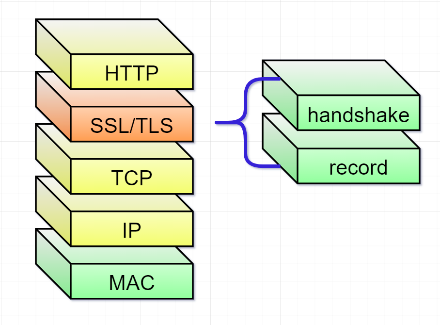
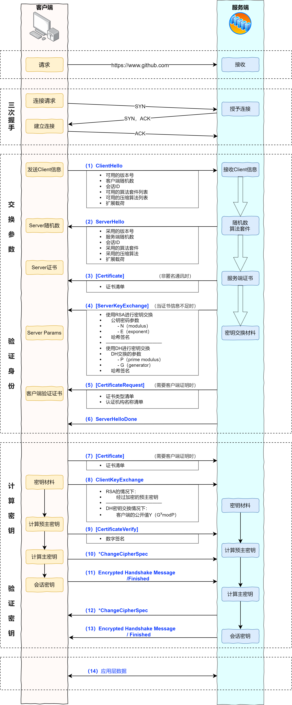
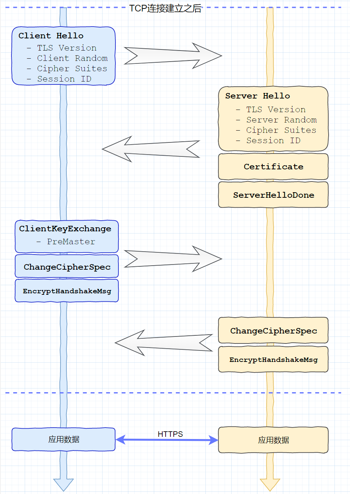
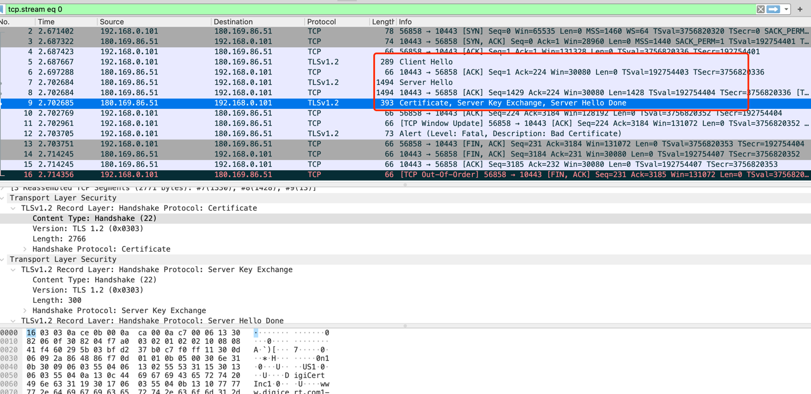
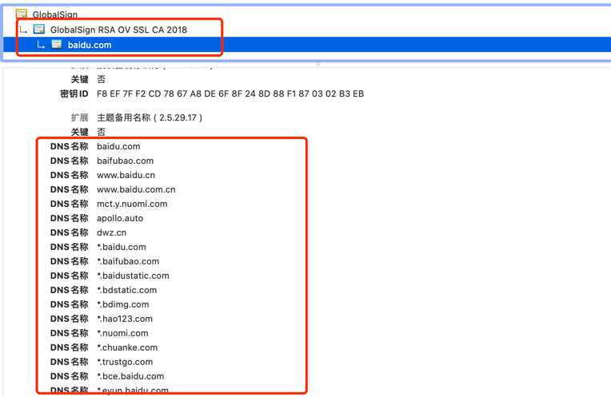
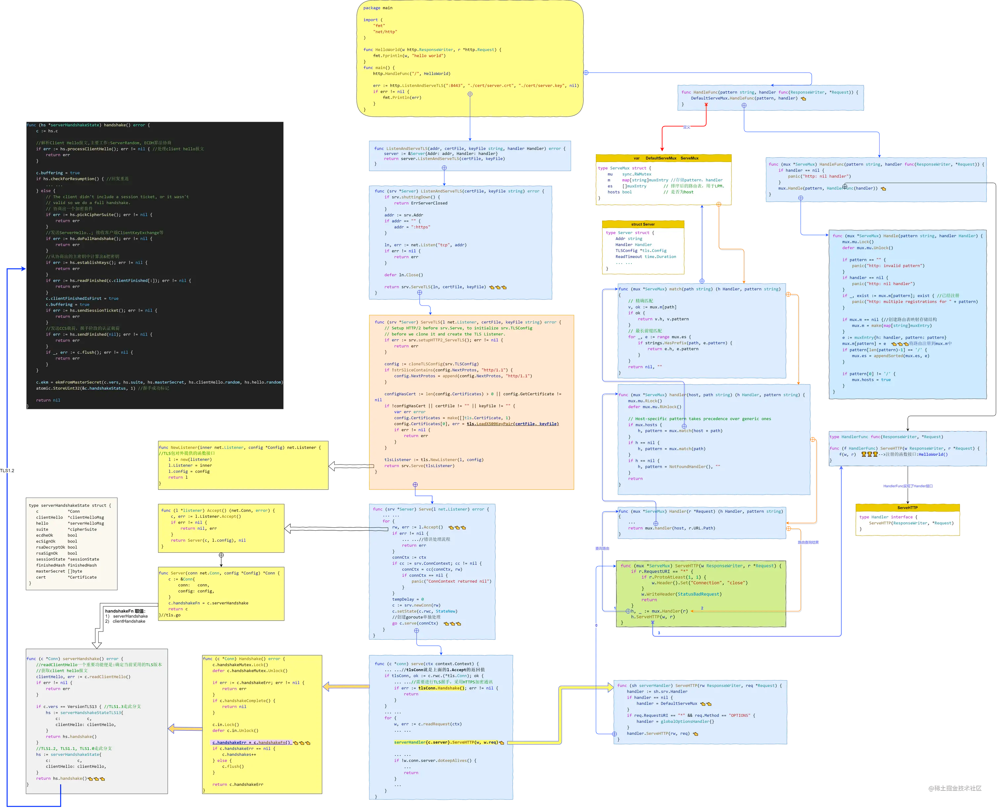
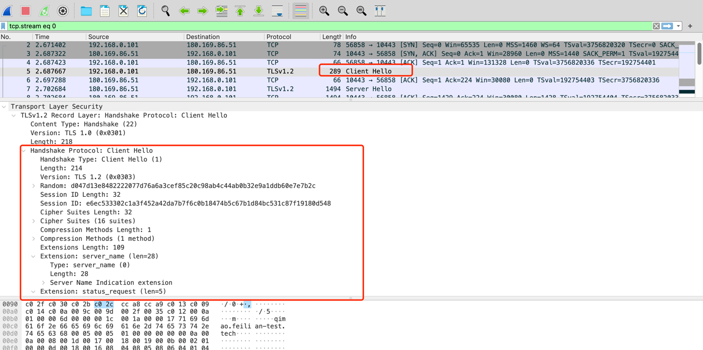
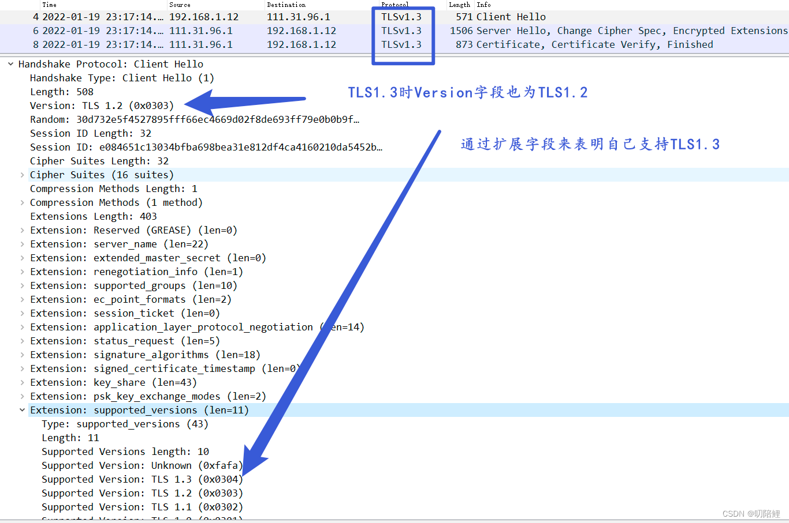
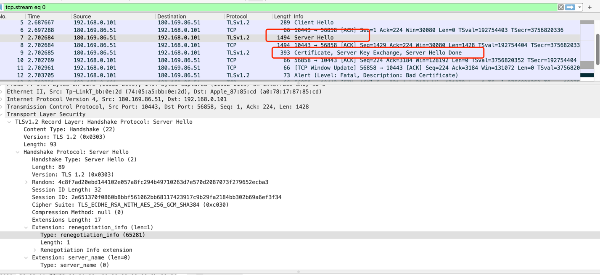
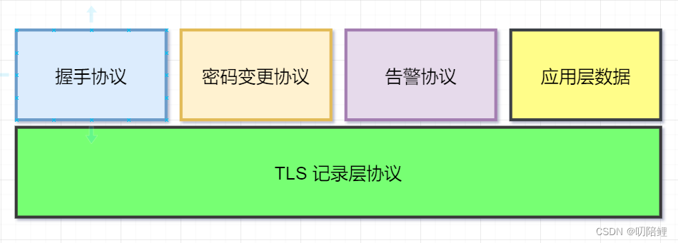

# HTTPS (Secure Hypertext Transfer Protocol)安全超文本传输协议

## 基本概念


- 下层为TLS记录层协议（record layer protocol)
- 上层为TLS握手层协议（handshake layer protocol)

在RFC4346中也这样分类，不过上层协议不只是握手协议, 也包括应用层数据、告警协议、密码变更协议，以上四种统称之为TLS Handshake Protocol

### SSL
SSL： Secure Socket Layer（安全套接层协议）的缩写，可以在Internet上提供秘密性传输。它是在上世纪90年代中期，由Netscape公司设计，目前已有3.0版本。
为啥要发明 SSL 这个协议呢？因为原先互联网上使用的 HTTP 协议是明文的，内容是不加密的，这样就很可能在内容传播的时候被别人监听到，对于安全性要求较高的场合，必须要加密，https就是带加密的http协议。
SSL协议的发明，就解决这些问题。目前SSL有1.0，2.0，3.0。

### TLS

TLS： Transport Layer Security（传输层安全协议）。是 SSL的标准化，相当于SSL的升级，可以把SSL看作是windows7，而TLS看作是windows10。
很多时候我们把这两者并列称呼 SSL/TLS，因为这两者可以视作同一个东西的不同阶段。HTTPS 协议，说白了就是“HTTP 协议”和“SSL/TLS 协议”的组合。
可以把 HTTPS 大致理解为—“HTTP over SSL”或“HTTP over TLS”。目前TLS有1.0，1.1，1.2，1.3,
由于TLS1.2版本的协商流程符合最初的TLS握手流程，它与TLS1.1/1.0，SSL3.0相比握手流程上变化比较小，但是TLS1.3握手流程上变化比较大

tls 1.2 完整流程



### TLS 四次握手




加密套件(CipherSuite)的格式：

```
TLS——密钥交换算法——签名算法——WITH——加密算法——摘要算法

Cipher Suite: TLS_ECDHE_RSA_WITH_AES_128_GCM_SHA256 (0xc02f)
```
其中密钥交换算法和签名算法可以合二为一,TLS_RSA_WITH_AES_256_GCM_SHA384 (0xc030), 它的意思是：

- 密钥交换算法采用：RSA
- 签名算法采用：RSA
- 加密算法采用：AES对称算法，密钥长度为256bit, 模式为：GCM。
- 摘要算法采用：SHA284

### SSL证书
SSL证书： SSL安全协议主要用来提供对用户和服务器的认证；对传送的数据进行加密和隐藏；确保数据在传送中不被改变，即数据的完整性。
SSL证书通过在客户端浏览器和Web服务器之间建立一条SSL安全通道，由于SSL技术已建立到所有主要的浏览器和WEB服务器程序中，因此，仅需安装服务器证书就可以激活该功能了。
通过它可以激活SSL协议，实现数据信息在客户端和服务器之间的加密传输，可以防止数据信息的泄露。保证了双方传递信息的安全性，而且用户可以通过服务器证书验证他所访问的网站是否是真实可靠

### SAN(Subject Alternative Name)

SAN 是 SSL 标准 x509 中定义的一个扩展。使用了 SAN 字段的 SSL 证书，可以扩展此证书支持的域名，使得一个证书可以支持多个不同域名的解析.

SAN 应用


百度证书的扩展域名有这么多，其中还有了*.hao123.com


## 代码注意点

1. 问题：
> x509: certificate relies on legacy Common Name field, use SANs or temporarily enable Common Name matching with GODEBUG=x509ignoreCN=0 
 
原因：
> Since Go version 1.15, the deprecated, legacy behavior of treating the CommonName field on X.509 certificates as a hostname when no Subject Alternative Names (SAN) are present is now disabled by default.


解决方式


> You may need the -addext flag.
```shell
openssl req -new -key certs/foo-bar.pem \
    -subj "/CN=foobar.mydomain.svc" \
    -addext "subjectAltName = DNS:foobar.mydomain.svc" \
    -out certs/foo-bar.csr \
    -config certs/foo-bar_config.txt
```


## 源码分析

### TLS

```go
// /Users/python/go/go1.18/src/crypto/tls/common.go
const (
	VersionTLS10 = 0x0301
	VersionTLS11 = 0x0302
	VersionTLS12 = 0x0303
	VersionTLS13 = 0x0304

	// Deprecated: SSLv3 is cryptographically broken, and is no longer
	// supported by this package. See golang.org/issue/32716.
	VersionSSL30 = 0x0300
)
```
go中的TLS实现了TLS1.0, TLS1.1, TLS1.2, TLS1.3 四个版本，还有SSL3.0版本, 不过代码中已经明确说明不再支持SSL3.0版本。

TLS 握手过程中，优先采用TLS1.3版本，然后依次是：TLS1.2, TLS1.1, TLS1.0。 
当前网络上的TLS版本正处于从TLS1.1及以下版本往TLS1.2版本上升级，大多数已经开始使用TLS1.2版本。
不过已经有很多应用支持TLS1.3版本，比如说浏览器(包括Chrome，IE，FireFox等主流浏览器)，Postman工具、Eolinker工具等都已经支持TLS1.3。


### https 启动流程



一张图来了解go中Https服务实现的基本框架。左半侧是TLS相关的逻辑；右半侧是原生Http服务相关的逻辑。

1.  TLS第一次握手


Server端的tls握手流程中，第一项工作便是读取ClientHello报文，然后通过ClientHello确定当前TLS版本(目前有TLS1.0， TLS1.1， TLS1.2，TLS1.3)，当下主流浏览器(Chrome, FireFox, IE等)都已经支持TLS1.3，不过网络上的大多数TLS服务还是TLS1.2, 以及少量的TLS1.1和TLS1.3。
```go
func (c *Conn) serverHandshake(ctx context.Context) error {
	// 1. 读取Client Hello报文
	clientHello, err := c.readClientHello(ctx)
	if err != nil {
		return err
	}
	
	if c.vers == VersionTLS13 {//tls 1.3 
		hs := serverHandshakeStateTLS13{
			c:           c,
			ctx:         ctx,
			clientHello: clientHello,
		}
		return hs.handshake()
	}
    // tls 其他低版本
	hs := serverHandshakeState{
		c:           c,
		ctx:         ctx,
		clientHello: clientHello,
	}
	return hs.handshake()
}
```

读取Client Hello报文
```go
func (c *Conn) readClientHello(ctx context.Context) (*clientHelloMsg, error) {
	// 获取握手消息
	msg, err := c.readHandshake()
	if err != nil {
		return nil, err
	}
	// 确认是 clientHelloMsg
	clientHello, ok := msg.(*clientHelloMsg)
	if !ok {
		c.sendAlert(alertUnexpectedMessage)
		return nil, unexpectedMessageError(clientHello, msg)
	}

    // ...

	// 获取扩展载荷中的Supported Version
	clientVersions := clientHello.supportedVersions
	if len(clientHello.supportedVersions) == 0 {
		clientVersions = supportedVersionsFromMax(clientHello.vers)
	}
	// 从配置和对端支持的版本中选择一个最优的版本
	c.vers, ok = c.config.mutualVersion(roleServer, clientVersions)
	if !ok {
		c.sendAlert(alertProtocolVersion)
		return nil, fmt.Errorf("tls: client offered only unsupported versions: %x", clientVersions)
	}
	c.haveVers = true
	c.in.version = c.vers
	c.out.version = c.vers

	return clientHello, nil
}
```
关于TLS的版本选择，需要做个重点说明： 在 ClientHello报文中，有两个与版本有关的字段：记录层的version, 扩展字段supported_version。
记录层的version用来标明当前客户端tls握手时采用的版本；supported_version来用标明客户端支持的所有版本。由于TLS版本需要握手双方进行协商确定，clientHello报文时，version字段只不过是临时采用的一个版本而已



TLS1.3有点特殊：TLS1.2与TLS1.3 的握手报文中version字段都是0x0303,也就是TLS1.2版本。TLS1.3则是通过扩展字段supported_version来特别说明


解析ClientHello报文
```go
func (hs *serverHandshakeState) handshake() error {
	c := hs.c

	// 解析Client Hello报文，主要工作：ServerRandom,ECDH算法协商
	if err := hs.processClientHello(); err != nil {
		return err
	}

	// For an overview of TLS handshaking, see RFC 5246, Section 7.3.
	c.buffering = true
	if hs.checkForResumption() {
		// 恢复重连
        // ...
	} else {
		// 协商出加密套件
		if err := hs.pickCipherSuite(); err != nil {
			return err
		}
		// 发送serverHello,接收客户端 clientKeyExchange等
		if err := hs.doFullHandshake(); err != nil {
			return err
		}
		// 从协商的主密钥中计算出6把密钥
		if err := hs.establishKeys(); err != nil {
			return err
		}
		if err := hs.readFinished(c.clientFinished[:]); err != nil {
			return err
		}
		c.clientFinishedIsFirst = true
		c.buffering = true
		if err := hs.sendSessionTicket(); err != nil {
			return err
		}
		//发送ChangeCipherSpec载荷+握手阶段的认证载荷
		if err := hs.sendFinished(nil); err != nil {
			return err
		}
		if _, err := c.flush(); err != nil {
			return err
		}
	}

	c.ekm = ekmFromMasterSecret(c.vers, hs.suite, hs.masterSecret, hs.clientHello.random, hs.hello.random)
	atomic.StoreUint32(&c.handshakeStatus, 1)

	return nil
}
```

2. TLS第二次握手 


TLS第二次握手一般包括如下几个关键载荷：应该是ServerHello载荷、Certificate载荷、ServerKeyExchange载荷、ServerHelloDone载荷。这几个载荷根据实现的不同，有的分在多个报文中，有的在一个报文中传递。


TLS报文分为上下两层。上层包括握手协议、密码变更协议、告警协议、应用层数据协议；而下层统一为记录层协议。




在go中对应的接口为：func (hs *serverHandshakeState) doFullHandshake() error。听听这函数的名字，就知道它没那么简单。该接口中不仅仅实现了TLS握手的第二个交互，还包括第三次TLS握手

```go
func (hs *serverHandshakeState) doFullHandshake() error {
	c := hs.c

    // ...

	// 存储所有握手报文，最后进行校验
	hs.finishedHash = newFinishedHash(hs.c.vers, hs.suite)
	if c.config.ClientAuth == NoClientCert {
		// No need to keep a full record of the handshake if client
		// certificates won't be used.
		hs.finishedHash.discardHandshakeBuffer()
	}
	hs.finishedHash.Write(hs.clientHello.marshal())
	hs.finishedHash.Write(hs.hello.marshal())
	// 1。 构造server hello 报文
	if _, err := c.writeRecord(recordTypeHandshake, hs.hello.marshal()); err != nil {
		return err
	}

	// 2. 构造Certificate报文
	certMsg := new(certificateMsg)
	certMsg.certificates = hs.cert.Certificate
	hs.finishedHash.Write(certMsg.marshal())
	if _, err := c.writeRecord(recordTypeHandshake, certMsg.marshal()); err != nil {
		return err
	}

    // 。。。

	// 3. 构造 Server key Exchange 载荷
	keyAgreement := hs.suite.ka(c.vers)
	skx, err := keyAgreement.generateServerKeyExchange(c.config, hs.cert, hs.clientHello, hs.hello)
	if err != nil {
		c.sendAlert(alertHandshakeFailure)
		return err
	}
	if skx != nil {
		hs.finishedHash.Write(skx.marshal())
		if _, err := c.writeRecord(recordTypeHandshake, skx.marshal()); err != nil {
			return err
		}
	}

	// 4。 互相认证 certificateRequest
	var certReq *certificateRequestMsg
	if c.config.ClientAuth >= RequestClientCert {
		// Request a client certificate
		// ...
	}

	// 5. Server Hello Donw 载荷
	helloDone := new(serverHelloDoneMsg)
	hs.finishedHash.Write(helloDone.marshal())
	if _, err := c.writeRecord(recordTypeHandshake, helloDone.marshal()); err != nil {
		return err
	}

	// 报文发送
	if _, err := c.flush(); err != nil {
		return err
	}

	// Note :下面第三阶段
	var pub crypto.PublicKey // public key for client auth, if any
    // 处理客户端响应报文
	msg, err := c.readHandshake()
	if err != nil {
		return err
	}
    // 。。。

	// Get client key exchange
	ckx, ok := msg.(*clientKeyExchangeMsg)
	if !ok {
		c.sendAlert(alertUnexpectedMessage)
		return unexpectedMessageError(ckx, msg)
	}
	hs.finishedHash.Write(ckx.marshal())

	// 预主密钥：可能为RsaKeyAgreement 或则ecdheKeyAgreement
	preMasterSecret, err := keyAgreement.processClientKeyExchange(c.config, hs.cert, ckx, c.vers)
	if err != nil {
		c.sendAlert(alertHandshakeFailure)
		return err
	}
	hs.masterSecret = masterFromPreMasterSecret(c.vers, hs.suite, preMasterSecret, hs.clientHello.random, hs.hello.random)
	if err := c.config.writeKeyLog(keyLogLabelTLS12, hs.clientHello.random, hs.masterSecret); err != nil {
		c.sendAlert(alertInternalError)
		return err
	}

	// If we received a client cert in response to our certificate request message,
	// the client will send us a certificateVerifyMsg immediately after the
	// clientKeyExchangeMsg. This message is a digest of all preceding
	// handshake-layer messages that is signed using the private key corresponding
	// to the client's certificate. This allows us to verify that the client is in
	// possession of the private key of the certificate.
	if len(c.peerCertificates) > 0 {
		msg, err = c.readHandshake()
		if err != nil {
			return err
		}
		certVerify, ok := msg.(*certificateVerifyMsg)
		if !ok {
			c.sendAlert(alertUnexpectedMessage)
			return unexpectedMessageError(certVerify, msg)
		}

		var sigType uint8
		var sigHash crypto.Hash
		if c.vers >= VersionTLS12 {
			if !isSupportedSignatureAlgorithm(certVerify.signatureAlgorithm, certReq.supportedSignatureAlgorithms) {
				c.sendAlert(alertIllegalParameter)
				return errors.New("tls: client certificate used with invalid signature algorithm")
			}
			sigType, sigHash, err = typeAndHashFromSignatureScheme(certVerify.signatureAlgorithm)
			if err != nil {
				return c.sendAlert(alertInternalError)
			}
		} else {
			sigType, sigHash, err = legacyTypeAndHashFromPublicKey(pub)
			if err != nil {
				c.sendAlert(alertIllegalParameter)
				return err
			}
		}

		signed := hs.finishedHash.hashForClientCertificate(sigType, sigHash, hs.masterSecret)
		if err := verifyHandshakeSignature(sigType, pub, sigHash, signed, certVerify.signature); err != nil {
			c.sendAlert(alertDecryptError)
			return errors.New("tls: invalid signature by the client certificate: " + err.Error())
		}

		hs.finishedHash.Write(certVerify.marshal())
	}

	hs.finishedHash.discardHandshakeBuffer()

	return nil
}
```

3. 第三次握手报文的载荷包括：
- 可选的Certificate载荷
- ClientKeyExchange载荷
- 可选的CertificateVerify载荷
- ChangeCipherSpec载荷
- Finished载荷


预主密钥的计算有两种方式：

-  当采用RSA算法进行密钥交换时，则在客户端通过随机产生；然后通过服务端证书的公钥进行加密，最后通过ClientKeyExchange载荷发送到服务端；- 
-  当采用ECDHE算法进行密钥交换时，则需要使用对端的公钥、本端的私钥、以及采用的椭圆曲线函数分别计算生成预主密钥。


## 参考
1. [使用开启扩展SAN的证书](https://blog.csdn.net/m0_37322399/article/details/117308604?spm=1001.2101.3001.6650.2&utm_medium=distribute.pc_relevant.none-task-blog-2%7Edefault%7ECTRLIST%7Edefault-2-117308604-blog-109230584.pc_relevant_default&depth_1-utm_source=distribute.pc_relevant.none-task-blog-2%7Edefault%7ECTRLIST%7Edefault-2-117308604-blog-109230584.pc_relevant_default&utm_relevant_index=5)
2. [ssl/tls 专栏导航](https://blog.csdn.net/s2603898260/article/details/120276446)

