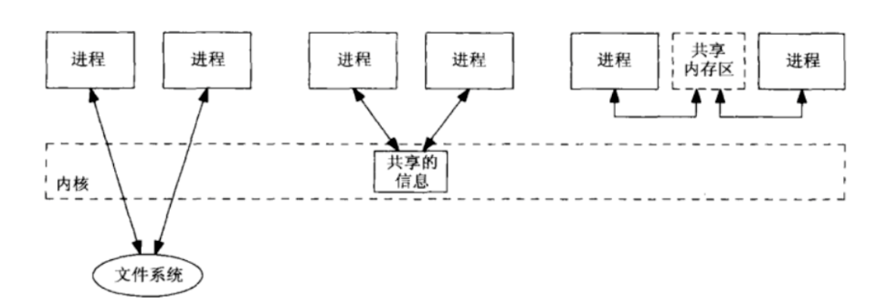

# Unix domain socket

Unix domain socket 必须是同主机间进程才能使用，而且 API 完全兼容 TCP socket，使用简单，
但是不同于 TCP socket 它没有 TCP 网络协议栈的约束，不需要打包拆包、计算校验和、维护序号和应答等，只是将应用层数据从一个进程拷贝到另一个进程。
这是因为，IPC机制本质上是可靠的通讯，而网络协议是为不可靠的通讯设计的。Unix Domain Socket也提供面向流和面向数据包两种API接口，类似于TCP和UDP，但是面向消息的UNIX Domain Socket也是可靠的，消息既不会丢失也不会顺序错乱

##  IPC 进程间通信（interprocess communication）
传统上该术语描述的是运行在某个操作系统之上的不同进程间的消息传递（message passing）的方式。

Unix进程间的信息共享  

