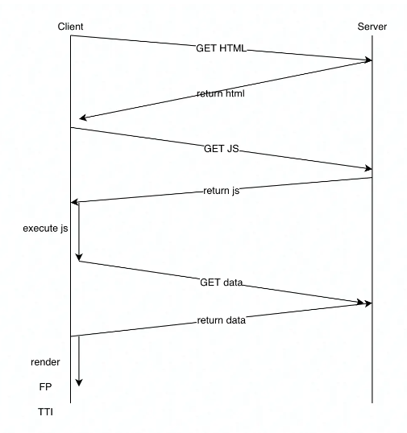
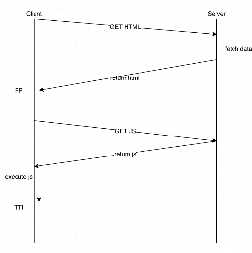
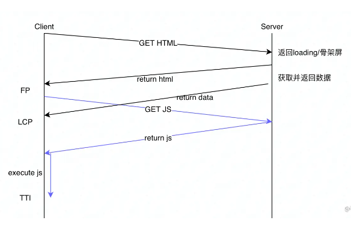

<!-- START doctoc generated TOC please keep comment here to allow auto update -->
<!-- DON'T EDIT THIS SECTION, INSTEAD RE-RUN doctoc TO UPDATE -->
**Table of Contents**  *generated with [DocToc](https://github.com/thlorenz/doctoc)*

- [flusher 实现流式输出](#flusher-%E5%AE%9E%E7%8E%B0%E6%B5%81%E5%BC%8F%E8%BE%93%E5%87%BA)
  - [流式渲染](#%E6%B5%81%E5%BC%8F%E6%B8%B2%E6%9F%93)
  - [分块传输的基础：http的 transfer-encoding:chunked 协议](#%E5%88%86%E5%9D%97%E4%BC%A0%E8%BE%93%E7%9A%84%E5%9F%BA%E7%A1%80http%E7%9A%84-transfer-encodingchunked-%E5%8D%8F%E8%AE%AE)
  - [对比 sse,websocket](#%E5%AF%B9%E6%AF%94-ssewebsocket)
  - [源码分析](#%E6%BA%90%E7%A0%81%E5%88%86%E6%9E%90)
  - [参考](#%E5%8F%82%E8%80%83)

<!-- END doctoc generated TOC please keep comment here to allow auto update -->

# flusher 实现流式输出
流式（Stream）亦称响应式，是一种基于异步数据流研发框架，是一种概念和编程模型，并非一种技术架构，

流式输出就比较神奇，源自于团队内部在一次性能大赛结束后的总结中产生，是基于流式的理论基础在页面渲染以及渲染的HTML在网络传输中的具体应用而诞生，也有人也简单的称之为流式渲染。
即：将页面拆分成独立的几部分模块，每个模块有单独的数据源和单独的页面模板，在server端流式的操作每个模块进行业务逻辑处理和页面模板的渲染，然后流式的将渲染出来的HTML输出到网络中，接着分块的HTML数据在网络中传输，接着流式的分块的HTML在浏览器逐个渲染展示。


## 流式渲染
流式渲染是利用 http1.1 的分块传输编码的特性, 让服务端分块返回 html , 浏览器可以在接收时逐步渲染页面, 这样有助于页面的首屏展现, 提升用户体验.




传统客户端渲染（Client Side Render） 的流程图，CSR 的链路非常长，需要经过：

- 请求 html
- 请求 js
- 请求 数据
- 执行 js




SSR 虽然降低了 FP 时间，但是在 FP 与 可交互（Time To Interactive） 中有大量的不可交互时间，在极端情况下，用户会一脸懵逼：“咦，页面上不是已经有内容了吗，怎么点不了滚不动？”


CSR与SSR的共同点是，先返回了 HTML，因为 HTML 是一切的基础。
之后 CSR 先返回了 js，后返回了 data，在首次渲染之前页面就已经可交互了。
而 SSR 先返回了 data，后返回 js，页面在可交互前就完成了首次渲染，使用户可以更快的看到数据

理想中的流式服务端渲染流程 


同时为了最大程度提高加载速度，所以需要降低首字节时间（Time To First Byte），最好的方法就是复用请求，因此，仅需发送两个请求：

请求 html，server 会先返回骨架屏的 html，之后再返回所需数据，或者带有数据的 html，最后关闭请求。
请求 js，js 返回并执行后就可以交互了

为什么要叫“流式服务端渲染”？是因为返回html的那个请求的相应体是流（stream），流中会先返回如骨架屏/fallback的同步HTML代码，再等待数据请求成功，返回对应的异步HTML代码，都返回后，才会关闭此HTTP连接


## 分块传输的基础：http的 transfer-encoding:chunked 协议

分块传输编码（chunked transfer encoding）是一种HTTP传输编码方式，它可以在传输数据时将数据分成一个一个的小块，然后逐个发送，以达到流式传输的效果。
分块传输编码可以适用于需要传输的数据大小未知或较大的情况，同时也可以避免浏览器等客户端在请求过程中一直等待数据返回而导致的超时等问题


分块传输编码的处理过程如下：

1. 服务器先发送一个十六进制数，表示本次发送的数据块大小；

2. 然后发送实际的数据，数据大小为上一步中指定的大小；

3. 循环以上两个步骤，直到传输完整个数据；

4. 最后发送一个大小为0的块，表示本次数据传输结束。

分块传输编码的作用主要有：

- 可以避免传输数据时等待时间过长而导致浏览器等客户端出现超时；

- 可以在数据传输过程中提供数据的即时性，特别是对于在线视频或音频等实时应用场景非常有用；

- 可以对数据进行压缩或解压缩，以减小传输数据的大小。

## 对比 sse,websocket
WebSocket:
优点：
1. 可以实现实时通信，无需轮询。
2. 支持双向通信，服务端可以主动向客户端发送消息。
3. 类似于TCP协议，可保证消息的可靠性。
4. 可支持更高的并发量。

缺点：
1. 需要浏览器和服务端都支持WebSocket协议。
2. 建立连接时需要耗费更多的时间和带宽。

SSE (Server-Sent Events):
优点：
1. 可以实现服务器向浏览器主动发送事件，从而实现实时通信。
2. SSE可以支持多个事件的串行传输。
3. 在服务器端使用Push API，可以更容易地推送事件。

缺点：
1. SSE仅支持单向通信，只能服务器向客户端发送消息。
2. 对于非常频繁的传输，服务器压力可能会比WebSocket大。

HTTP Chunked:
优点：
1. HTTP Chunked可以支持向客户端实时发送数据。
2. 在HTTP协议下，Chunked不需要客户端和服务端均支持某个独立的协议。

缺点：
1. Chunked不是一个用于实时通信目的的协议。
2. 与持久连接不同，每个消息都需要创建新连接，这将导致连接过多的问题。
3. 即使你销毁了连接，服务端和客户端之间的请求和响应仍然会花费多于完全打开的长连接的时间


## 源码分析
```go
// go1.20/src/net/http/server.go
// A response represents the server side of an HTTP response.
type response struct {
	conn             *conn
	req              *Request // request for this response
	// ...
	w  *bufio.Writer // buffers output in chunks to chunkWriter
	cw chunkWriter
}
```

```go
// /go1.20/src/net/http/server.go
func (w *response) FlushError() error {
	if !w.wroteHeader {
		w.WriteHeader(StatusOK) 
	}
	err := w.w.Flush()
	e2 := w.cw.flush()
	if err == nil {
		err = e2
	}
	return err
}

func (cw *chunkWriter) flush() error {
    if !cw.wroteHeader {
        cw.writeHeader(nil) // 里面会设置header Transfer-Encoding
    }
    return cw.res.conn.bufw.Flush()
}
```

## 参考

- [gin实现http的分块传输及原理分析](https://cloud.tencent.com/developer/article/2318440)
- [五分钟接入流式渲染](https://zhuanlan.zhihu.com/p/362893963)