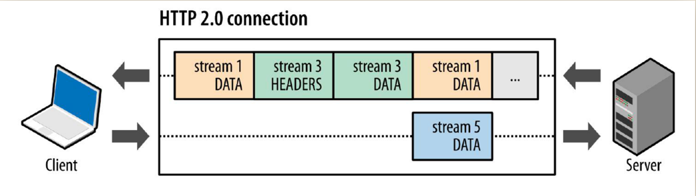

<!-- START doctoc generated TOC please keep comment here to allow auto update -->
<!-- DON'T EDIT THIS SECTION, INSTEAD RE-RUN doctoc TO UPDATE -->
**Table of Contents**  *generated with [DocToc](https://github.com/thlorenz/doctoc)*

- [HTTP 协议 Hyper Text Transfer Protocol（超文本传输协议）](#http-%E5%8D%8F%E8%AE%AE-hyper-text-transfer-protocol%E8%B6%85%E6%96%87%E6%9C%AC%E4%BC%A0%E8%BE%93%E5%8D%8F%E8%AE%AE)
  - [http的三个版本介绍](#http%E7%9A%84%E4%B8%89%E4%B8%AA%E7%89%88%E6%9C%AC%E4%BB%8B%E7%BB%8D)
    - [http1.0](#http10)
    - [http1.1](#http11)
    - [SPDY](#spdy)
    - [http2.0](#http20)
      - [优点](#%E4%BC%98%E7%82%B9)
        - [1 multiplexing 多路复用(实现无序传输)，基于stream模型](#1-multiplexing-%E5%A4%9A%E8%B7%AF%E5%A4%8D%E7%94%A8%E5%AE%9E%E7%8E%B0%E6%97%A0%E5%BA%8F%E4%BC%A0%E8%BE%93%E5%9F%BA%E4%BA%8Estream%E6%A8%A1%E5%9E%8B)
        - [2 header 头部压缩](#2-header-%E5%A4%B4%E9%83%A8%E5%8E%8B%E7%BC%A9)
        - [3 服务端推送(server push)](#3-%E6%9C%8D%E5%8A%A1%E7%AB%AF%E6%8E%A8%E9%80%81server-push)
      - [二进制分帧层 binary frame](#%E4%BA%8C%E8%BF%9B%E5%88%B6%E5%88%86%E5%B8%A7%E5%B1%82-binary-frame)
      - [frame types类型](#frame-types%E7%B1%BB%E5%9E%8B)
    - [http3.0](#http30)
  - [参考资料](#%E5%8F%82%E8%80%83%E8%B5%84%E6%96%99)

<!-- END doctoc generated TOC please keep comment here to allow auto update -->

# HTTP 协议 Hyper Text Transfer Protocol（超文本传输协议）
超文本传输协议可以进行文字分割：超文本（Hypertext）、传输（Transfer）、协议（Protocol）.


## http的三个版本介绍

### http1.0


* 队头阻塞(head of blocking) (No Pipelining): 假如有五个请求被同时发出，如果第一个请求没有处理完成，就会导致后续的请求也无法得到处理
* 一个连接同一时间只能处理一个请求，是串行，因为是无状态，不像tcp有序列号，http2会建立映射关系.
* 如果当前请求阻塞，那么该连接就无法复用

HTTP 1.0 有一个被抱怨最多的是连接无法复用，当每次有新的请求时都会重新经历一次三次握手和四次挥手过程，并且连接的建立和释放需要耗费大量的服务器资源，在请求少的页面还尚能应对，不过随着请求的不断增多，HTTP 1.0 越来越难顶.
HTTP 1.0 议头里可以设置 Connection:Keep-Alive。在 header 里设置 Keep-Alive 可以在一定时间内复用连接，具体复用时间的长短可以由服务器控制，一般在 15s 左右。到 HTTP 1.1 之后 Connection 的默认值就是Keep-Alive，如果要关闭连接复用需要显式的设置 Connection:Close。

### http1.1


pipelining 并不是救世主，它也存在不少缺陷：

- 因为只有幂等的请求比如 GET、HEAD 才能使用 pipelining ，非幂等请求比如 POST 则不能使用，因为请求之间可能存在先后依赖关系。
- 其实队头阻塞问题并没有完全解决，因为服务器返回的响应还是要依次返回，也就是返回的请求时 FIFO - 先发先回。对应的response按照request的顺序严格排列，因为不按顺序排列就分不清楚response是属于哪个request的。
- 绝大多数 HTTP 代理服务器不支持 pipelining。
- 和不支持 pipelining 的老服务器协商有问题,多数浏览器默认关闭 http1.1 pipeline.

当今的Web页面有玲琅满目的图片、js、css，如果让请求一个个串行执行，那页面的渲染会变得极慢。于是只能同时创建多个TCP连接，实现并发下载数据，快速渲染出页面。这会给浏览器造成较大的资源消耗，电脑会变卡。很多浏览器为了兼顾下载速度和资源消耗，会对同一个域名限制并发的TCP连接数量，如Chrome是6个左右，剩下的请求则需要排队，Network下的Waterfall就可以观察排队情况。

狡猾的人类为了避开这个数量限制，将图片、css、js等资源放在不同域名下(或二级域名)，避开排队导致的渲染延迟。快速下载的目标实现了，但这和更低的资源消耗目标相违背，背后都是高昂的带宽、CDN成本。


### SPDY
SPDY 的目标在于解决 HTTP 的缺陷，即延迟和安全性。PDY 位于 HTTP 之下，SSL 之上，这样可以轻松的兼容老版本的 HTTP 协议，SPDY 的功能分为基础功能和高级功能两部分，基础功能是默认启用的，高级功能需要手动启用。

SPDY 基础功能
- 多路复用(multiplexing)，多路复用通过多个请求共用一个连接的方式，降低了 TCP 连接建立和释放的开销，同时提高了带宽的利用率。
- 请求优先级(request prioritization)，多路复用带来的一个问题是，在共享连接的基础上会存在一些关键请求被阻塞，SPDY 允许给每个请求设置优先级，这样重要的请求就会优先得到响应。
- header 压缩，前面提到的 HTTP 1.x 的 header 很多时候都是重复而且多余的。选择合适的压缩算法可以减小包的大小和数量。SPDY 对 header 的压缩素可以达到 80% 以上。
SPDY 高级功能
- 服务端推送，HTTP 只能由客户端发送，服务器只能被动发送响应。不过在开启服务端推送后，服务端通过 **X-Associated-Content ** header 会告知服务器会有新的内容被推送过来，
- 服务端暗示，和服务端推送所不同的是，服务端暗示不会推送内容，只是告诉客户端有新的内容产生，，内容的下载还是需要客户端主动发起请求。服务端暗示通过 X-Subresources header 来通知，一般应用场景是客户端需要先查询服务端状态，然后再下载资源，可以节约一次查询请求。

### http2.0
HTTP2.0 在设计之初就与 SPDY 的设计目的和出发点不同，SPDY 更像是 Google 自家的一个产品，相当于自家的一个玩具，你怎么玩儿都行，而 HTTP 2.0 在设计之初就是为了普适性的这个目的.


HTTP 1.x 的诞生使用的是明文协议，它的格式主要由三部分构成：请求行(request line) 、请求头(header) 和报文体(body)，要识别这三部分必须要做协议解析，而协议解析是基于文本的，基于文本的解析存在多样性的缺陷，
而二进制格式只能识别 0 和 1 ，比较固定，基于这种考量，HTTP 2.0 决定采用二进制格式，实现方便而且健壮性强


#### 优点
##### 1 multiplexing 多路复用(实现无序传输)，基于stream模型

HTTP2为了解决在同一个TCP连接中，没办法区分response是属于哪个请求,提出了流的概念，每一次请求对应一个流，有一个唯一ID，用来区分不同的请求。



一个tcp上面多个stream，stream 是连接中的一个虚拟信道，可以承载双向消息传输。
- 并行交错地发送多个请求，请求之间互不影响。
- 并行交错地发送多个响应，响应之间互不干扰。
- 使用一个连接并行发送多个请求和响应。
- 每个stream都有唯一的id标识和一些优先级信息，客户端发起的stream的id为单数，服务端发起的stream id为偶数

HTTP 1.x 没有真正解决连接共享还有一个主要的因素就是无法对不同的请求设置优先级，这样会导致关键请求被阻塞。
而 HTTP 2.0 你可以对不同的 stream 设置不同的优先级，stream 之间也可以设置依赖，依赖和优先级都可以动态调整，这样就会解决关键请求被阻塞的问题. 优先级在flag标志位上.

##### 2 header 头部压缩
HTTP1.x 中的 header 由于 cookie 和 user agent 不存在记忆性，这样导致每次都要带着这些头重新发送请求，
HTTP 2.0 使用 encoder 来减少传输的 header 大小，通信双方会各自缓存一份 header 字段表，这样能够避免重复传输 header ，也能够减小传输的大小。
HTTP 2.0 采用的是 HPACK 压缩算法。


- 动态表：第二个请求只会发送与第一个请求不一样的内容

- 静态表：高频使用的Header编成一个静态表，每个header对应一个数组索引，每次只用传这个索引，而不是冗长的文本。


##### 3 服务端推送(server push)
Server Push指的是服务端主动向客户端推送数据，相当于对客户端的一次请求，服务端可以主动返回多次结果。
这个功能打破了严格的请求---响应的语义，对客户端和服务端双方通信的互动上，开启了一个崭新的可能性。
但是这个推送跟websocket中的推送功能不是一回事，Server Push的存在不是为了解决websocket推送的这种需求。

当服务端需要主动推送某个资源时，便会发送一个 Frame Type 为 PUSH_PROMISE 的 frame ，里面带了 PUSH 需要新建的 stream id。
意思是告诉客户端：接下来我要用这个 id 向你发送东西，客户端准备好接着。客户端解析 frame 时，发现它是一个 PUSH_PROMISE 类型，便会准备接收服务端要推送的流。


在HTTP/1.x里，为了展示这个页面，客户端会先发起一次 GET /index.html 的请求，拿到返回结果进行分析后，再发起两个资源的请求，一共是三次请求, 并且有串行的请求存在。

在HTTP/2里，当客户端发起 GET /index.html的请求后，如果服务端进行了Server Push的支持，那么会直接把客户端需要的/index.html和另外两份文件资源一起返回，避免了串行和多次请求的发送


- 流控


  

#### 二进制分帧层 binary frame
基于流的概念，进一步提出了帧，一个请求的数据会被分成多个帧，方便进行数据分割传输，每个帧都唯一属于某一个流ID，将帧按照流ID进行分组，即可分离出不同的请求

虽然 HTTP 2.0 报文格式看上去和 HTTP 1.x 的完全不同，但是实际上 HTTP 2.0 并没有改变 HTTP 1.x 的语义，它只是在 HTTP 1.x 的基础上封装了一层.


binary frame 在应用层和TCP层中间
- 优先级控制 
- 流量控制
- 服务端推送


message消息: 具有业务含义，类似Request/Response消息，每个消息包含一个或多个帧.


frame 帧 是HTTP/2协议里通信的最小单位，每个帧有自己的格式，不同类型的帧负责传输不同的消息
- Length: 表示Frame Payload的大小，是一个24-bit的整型，表明Frame Payload的大小不应该超过2^24-1字节，但其实payload默认的大小是不超过2^14字节，可以通过SETTING Frame来设置SETTINGS_MAX_FRAME_SIZE修改允许的Payload大小。

- Type: 表示Frame的类型,目前定义了0-9共10种类型。

  

- Flags: 为一些特定类型的Frame预留的标志位，比如Header, Data, Setting, Ping等，都会用到。


- R: 1-bit的保留位，目前没用，值必须为0

- Stream Identifier: Steam的id标识，表明id的范围只能为0到2^31-1之间，其中0用来传输控制信息，比如Setting, Ping；客户端发起的Stream id 必须为奇数，服务端发起的Stream id必须为偶数；
并且每次建立新Stream的时候，id必须比上一次的建立的Stream的id大；当在一个连接里，如果无限建立Stream，最后id大于2^31时，必须从新建立TCP连接，来发送请求。
如果是服务端的Stream id超过上限，需要对客户端发送一个GOWAY的Frame来强制客户端重新发起连接。

总结，前三行：标准头部，9个字节；第四行：payload


#### frame types类型

* HEADERS：帧仅包含 HTTP header信息。
* DATA：帧包含消息的所有或部分请求数据。
* PRIORITY：指定分配给流的优先级。服务方可先处理高优先请求
* RST_STREAM：错误通知：一个推送承诺遭到拒绝。终止某个流。
* SETTINGS：指定连接配置。(用于配置，流ID为0) [会ACK确认收到]
* PUSH_PROMISE：通知一个将资源推送到客户端的意图。
* PING：检测信号和往返时间。（流ID为0）[会ACK]
* GOAWAY：停止为当前连接生成流的停止通知。
* WINDOW_UPDATE：用于流控制，约定发送窗口大小。
* CONTINUATION：用于继续传送header片段序列。

1. Magic:
Magic 帧的主要作用是建立 HTTP/2 请求的前言。在 HTTP/2 中，要求两端都要发送一个连接前言，作为对所使用协议的最终确认，并确定 HTTP/2 连接的初始设置，客户端和服务端各自发送不同的连接前言。

Magic 帧是客户端的前言之一，内容为 PRI * HTTP/2.0\r\n\r\nSM\r\n\r\n，以确定启用 HTTP/2 连接。
2. Settings连接级参数


SETTINGS 帧的主要作用是设置这一个连接的参数，作用域是整个连接而并非单一的流,比如最大并发量。
ETTINGS帧必须在连接开始时由通信双方发送，并且可以在任何其他时间由任一端点在连接的生命周期内发送。SETTINGS帧必须在id为0的stream上进行发送，不能通过其他stream发送；SETTINGS影响的是整个TCP链接，而不是某个stream；在SETTINGS设置出现错误时，必须当做connection error重置整个链接。

3. Headers frame

HEADERS 帧的主要作用是存储和传播 HTTP 的标头信息。我们关注到 HEADERS 里有一些眼熟的信息，分别如下：


```html
method：POST
scheme：http
path：/proto.SearchService/Search
authority：:10001
content-type：application/grpc
user-agent：grpc-go/1.20.0-dev
```


4. Data frame(数据帧)
DATA 帧的主要作用是装填主体信息


5. PING/PONG

主要作用是判断当前连接是否仍然可用，也常用于计算往返时间。

6. WINDOW_UPDATE流量控制
   主要作用是管理和流的窗口控制。

7. GOAWAY停止

    用于关闭连接，GOAWAY允许端点优雅地停止接受新流，同时仍然完成先前建立的流的处理。
    这个就厉害了，当服务端需要维护时，发送一个GOAWAY的Frame给客户端，那么发送之前的Stream都正常处理了，发送GOAWAY后，客户端会新启用一个链接，继续刚才未完成的Stream发送。

### http3.0


QUIC本身就是一个名字，不是缩略词，它的发音和英语单词“quick”一样

QUIC是基于UDP之上实现的传输协议.

## 参考资料
1. [http 理解](https://mp.weixin.qq.com/s?__biz=MzkwMDE1MzkwNQ==&mid=2247496030&idx=1&sn=82f56874f82f372af71e23a8e385f8cd&chksm=c04ae600f73d6f16d707c1d32b00e3f0d47e893c9cf59a2eb60ace418943aeb5c5c679cb27ea&token=1094112620&lang=zh_CN#rd)
2. [http/3 详解](https://hungryturbo.com/HTTP3-explained/quic/%E5%8D%8F%E8%AE%AE%E7%89%B9%E7%82%B9.html)
