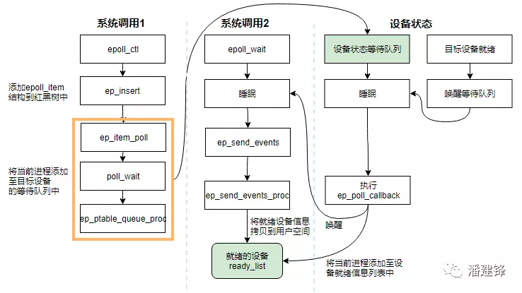

# I/O 多路复用(I/O multiplexing)

在神作《UNIX 网络编程》里，总结归纳了 5 种 I/O 模型，包括同步和异步 I/O：

- 阻塞 I/O (Blocking I/O)
- 非阻塞 I/O (Nonblocking I/O)
- I/O 多路复用 (I/O multiplexing)
- 信号驱动 I/O (Signal driven I/O)
- 异步 I/O (Asynchronous I/O)

操作系统上的 I/O 是用户空间和内核空间的数据交互，因此 I/O 操作通常包含以下两个步骤：

- 等待网络数据到达网卡(读就绪)/等待网卡可写(写就绪) –> 读取/写入到内核缓冲区
- 从内核缓冲区复制数据 –> 用户空间(读)/从用户空间复制数据 -> 内核缓冲区(写)

而判定一个 I/O 模型是同步还是异步，主要看第二步：数据在用户和内核空间之间复制的时候是不是会阻塞当前进程，如果会，则是同步 I/O，否则，就是异步 I/O。
基于这个原则，这 5 种 I/O 模型中只有一种异步 I/O 模型：Asynchronous I/O，其余都是同步 I/O 模型。

所谓 I/O 多路复用指的就是 select/poll/epoll 这一系列的多路选择器：支持单一线程同时监听多个文件描述符（I/O 事件），阻塞等待，并在其中某个文件描述符可读写时收到通知。
I/O 复用其实复用的不是 I/O 连接，而是复用线程，让一个 thread of control 能够处理多个连接（I/O 事件）。

## select & poll
### select
```cgo
#include <sys/select.h>

/* According to earlier standards */
#include <sys/time.h>
#include <sys/types.h>
#include <unistd.h>

int select(int nfds, fd_set *readfds, fd_set *writefds, fd_set *exceptfds, struct timeval *timeout);

// 和 select 紧密结合的四个宏：
void FD_CLR(int fd, fd_set *set);
int FD_ISSET(int fd, fd_set *set);
void FD_SET(int fd, fd_set *set);
void FD_ZERO(fd_set *set);
```
fd_set:取 fd_set 长度为 1 字节，fd_set 中的每一 bit 可以对应一个文件描述符 fd，则 1 字节长的 fd_set 最大可以对应 8 个 fd。
select的执行流程：

1. 执行 FD_ZERO(&set), 则 set 用位表示是0000,0000
2. 若 fd ＝ 5, 执行 FD_SET(fd, &set); 后 set 变为 0001,0000(第 5 位置为 1)
3. 再加入 fd ＝ 2, fd = 1，则 set 变为0001,0011
4. 执行 select(6, &set, 0, 0, 0) 阻塞等待
5. 若 fd=1, fd=2 上都发生可读事件，则 select 返回，此时 set 变为0000,0011(注意：没有事件发生的 fd=5 被清空)

select 的特点
* 可监控的文件描述符个数取决于 sizeof(fd_set) 的值。假设服务器上 sizeof(fd_set)＝ 512，每 bit 表示一个文件描述符，则服务器上支持的最大文件描述符是 512*8=4096。
fd_set 的大小调整可参考【原创】技术系列之 网络模型（二）中的模型 2，可以有效突破 select 可监控的文件描述符上限

* 将 fd 加入 select 监控集的同时，还要再使用一个数据结构 array 保存放到 select 监控集中的 fd，
一是用于在 select 返回后，array 作为源数据和 fd_set 进行 FD_ISSET 判断。
二是 select 返回后会把以前加入的但并无事件发生的 fd 清空，则每次开始 select 前都要重新从 array 取得 fd 逐一加入（FD_ZERO 最先），扫描 array 的同时取得 fd 最大值 maxfd，用于 select 的第一个参数

* 可见 select 模型必须在 select 前循环 array（加 fd，取 maxfd），select 返回后循环 array（FD_ISSET 判断是否有事件发生）


select缺点
* 最大并发数限制：使用 32 个整数的 32 位，即 32*32=1024 来标识 fd，虽然可修改，但是有以下第 2, 3 点的瓶颈
* 每次调用 select，都需要把 fd 集合从用户态拷贝到内核态，这个开销在 fd 很多时会很大
* 性能衰减严重：每次 kernel 都需要线性扫描整个 fd_set，所以随着监控的描述符 fd 数量增长，其 I/O 性能会线性下降

###poll
poll 的实现和 select 非常相似，只是描述 fd 集合的方式不同，poll 使用 pollfd 结构而不是 select 的 fd_set 结构，poll 解决了最大文件描述符数量限制的问题，
但是同样需要从用户态拷贝所有的 fd 到内核态，也需要线性遍历所有的 fd 集合，

###epoll


epoll 是 linux kernel 2.6 之后引入的新 I/O 事件驱动技术，I/O 多路复用的核心设计是 1 个线程处理所有连接的等待消息准备好I/O 事件，
这一点上 epoll 和 select&poll 是大同小异的。但 select&poll 预估错误了一件事，当数十万并发连接存在时，可能每一毫秒只有数百个活跃的连接，同时其余数十万连接在这一毫秒是非活跃的。
select&poll 的使用方法是这样的：返回的活跃连接 == select（全部待监控的连接）


什么时候会调用 select&poll 呢？在你认为需要找出有报文到达的活跃连接时，就应该调用。
所以，select&poll 在高并发时是会被频繁调用的。这样，这个频繁调用的方法就很有必要看看它是否有效率，因为，它的轻微效率损失都会被高频二字所放大。它有效率损失吗？
显而易见，全部待监控连接是数以十万计的，返回的只是数百个活跃连接，这本身就是无效率的表现。
被放大后就会发现，处理并发上万个连接时，select&poll 就完全力不从心了。这个时候就该 epoll 上场了，epoll 通过一些新的设计和优化，基本上解决了 select&poll 的问题

源码epoll
```
#include <sys/epoll.h>
int epoll_create(int size); // int epoll_create1(int flags);
int epoll_ctl(int epfd, int op, int fd, struct epoll_event *event);
int epoll_wait(int epfd, struct epoll_event *events, int maxevents, int timeout);
```
* epoll_create 创建一个 epoll 实例并返回 epollfd；
* epoll_ctl 注册 file descriptor 等待的 I/O 事件(比如 EPOLLIN、EPOLLOUT 等) 到 epoll 实例上；
* epoll_wait 则是阻塞监听 epoll 实例上所有的 file descriptor 的 I/O 事件，它接收一个用户空间上的一块内存地址 (events 数组)，
kernel 会在有 I/O 事件发生的时候把文件描述符列表复制到这块内存地址上，然后 epoll_wait 解除阻塞并返回，最后用户空间上的程序就可以对相应的 fd 进行读写了

源码读写
```
#include <unistd.h>
ssize_t read(int fd, void *buf, size_t count);
ssize_t write(int fd, constvoid *buf, size_t count);
```

与 select&poll 相比，epoll 分清了高频调用和低频调用。例如，epoll_ctl 相对来说就是不太频繁被调用的，而 epoll_wait 则是非常频繁被调用的。
所以 epoll 利用 epoll_ctl 来插入或者删除一个 fd，实现用户态到内核态的数据拷贝，这确保了每一个 fd 在其生命周期只需要被拷贝一次，
而不是每次调用 epoll_wait 的时候都拷贝一次。epoll_wait 则被设计成几乎没有入参的调用，相比 select&poll 需要把全部监听的 fd 集合从用户态拷贝至内核态的做法，epoll 的效率就高出了一大截。

在实现上 epoll 采用红黑树来存储所有监听的 fd，而红黑树本身插入和删除性能比较稳定，时间复杂度 O(logN)。
通过 epoll_ctl 函数添加进来的 fd 都会被放在红黑树的某个节点内，所以，重复添加是没有用的。
当把 fd 添加进来的时候时候会完成关键的一步：该 fd 都会与相应的设备（网卡）驱动程序建立回调关系，也就是在内核中断处理程序为它注册一个回调函数，
在 fd 相应的事件触发（中断）之后（设备就绪了），内核就会调用这个回调函数，该回调函数在内核中被称为：ep_poll_callback，这个回调函数其实就是把这个 fd 添加到 rdllist 这个双向链表（就绪链表）中。
epoll_wait 实际上就是去检查 rdlist 双向链表中是否有就绪的 fd，当 rdlist 为空（无就绪 fd）时挂起当前进程，直到 rdlist 非空时进程才被唤醒并返回。

相比于 select&poll 调用时会将全部监听的 fd 从用户态空间拷贝至内核态空间并线性扫描一遍找出就绪的 fd 再返回到用户态，
epoll_wait 则是直接返回已就绪 fd，因此 epoll 的 I/O 性能不会像 select&poll 那样随着监听的 fd 数量增加而出现线性衰减，是一个非常高效的 I/O 事件驱动技术


由于使用 epoll 的 I/O 多路复用需要用户进程自己负责 I/O 读写，从用户进程的角度看，读写过程是阻塞的，所以 select&poll&epoll 本质上都是同步 I/O 模型，
而像 Windows 的 IOCP 这一类的异步 I/O，只需要在调用 WSARecv 或 WSASend 方法读写数据的时候把用户空间的内存 buffer 提交给 kernel，
kernel 负责数据在用户空间和内核空间拷贝，完成之后就会通知用户进程，整个过程不需要用户进程参与，所以是真正的异步 I/O

linux kernel 源码（版本5.3.9）
```cgo
/*
 * Implement the event wait interface for the eventpoll file. It is the kernel
 * part of the user space epoll_wait(2).
 */
static int do_epoll_wait(int epfd, struct epoll_event __user *events,int maxevents, int timeout)
{
    // ...
    
    /* Time to fish for events ... */
    error = ep_poll(ep, events, maxevents, timeout);
}

// 如果 epoll_wait 入参时设定 timeout == 0, 那么直接通过 ep_events_available 判断当前是否有用户感兴趣的事件发生，如果有则通过 ep_send_events 进行处理
// 如果设置 timeout > 0，并且当前没有用户关注的事件发生，则进行休眠，并添加到 ep->wq 等待队列的头部；对等待事件描述符设置 WQ_FLAG_EXCLUSIVE 标志
// ep_poll 被事件唤醒后会重新检查是否有关注事件，如果对应的事件已经被抢走，那么 ep_poll 会继续休眠等待
static int ep_poll(struct eventpoll *ep, struct epoll_event __user *events, int maxevents, long timeout)
{
// ...

send_events:
/*
 * Try to transfer events to user space. In case we get 0 events and
 * there's still timeout left over, we go trying again in search of
 * more luck.
 */

    // 如果一切正常, 有 event 发生, 就开始准备数据 copy 给用户空间了
    // 如果有就绪的事件发生，那么就调用 ep_send_events 将就绪的事件 copy 到用户态内存中，
    // 然后返回到用户态，否则判断是否超时，如果没有超时就继续等待就绪事件发生，如果超时就返回用户态。
    // 从 ep_poll 函数的实现可以看到，如果有就绪事件发生，则调用 ep_send_events 函数做进一步处理
    if (!res && eavail && !(res = ep_send_events(ep, events, maxevents)) && !timed_out)
        goto fetch_events;

// ...
}

// ep_send_events 函数是用来向用户空间拷贝就绪 fd 列表的，它将用户传入的就绪 fd 列表内存简单封装到
// ep_send_events_data 结构中，然后调用 ep_scan_ready_list 将就绪队列中的事件写入用户空间的内存；
// 用户进程就可以访问到这些数据进行处理
static int ep_send_events(struct eventpoll *ep,struct epoll_event__user *events, int maxevents)
{
    struct ep_send_events_data esed;
    
    esed.maxevents = maxevents;
    esed.events = events;
    // 调用 ep_scan_ready_list 函数检查 epoll 实例 eventpoll 中的 rdllist 就绪链表，
    // 并注册一个回调函数 ep_send_events_proc，如果有就绪 fd，则调用 ep_send_events_proc 进行处理
    ep_scan_ready_list(ep, ep_send_events_proc, &esed, 0, false);
    return esed.res;
}

// 调用 ep_scan_ready_list 的时候会传递指向 ep_send_events_proc 函数的函数指针作为回调函数，
// 一旦有就绪 fd，就会调用 ep_send_events_proc 函数
static__poll_t ep_send_events_proc(struct eventpoll *ep, struct list_head *head, void *priv)
{
    // ...
    
    /*
     * If the event mask intersect the caller-requested one,
     * deliver the event to userspace. Again, ep_scan_ready_list()
     * is holding ep->mtx, so no operations coming from userspace
     * can change the item.
     */
    revents = ep_item_poll(epi, &pt, 1);
    // 如果 revents 为 0，说明没有就绪的事件，跳过，否则就将就绪事件拷贝到用户态内存中
    if (!revents)
        continue;
    // 将当前就绪的事件和用户进程传入的数据都通过 __put_user 拷贝回用户空间,
      // 也就是调用 epoll_wait 之时用户进程传入的 fd 列表的内存
    if (__put_user(revents, &uevent->events) || __put_user(epi->event.data, &uevent->data)) {
        list_add(&epi->rdllink, head);
        ep_pm_stay_awake(epi);
    if (!esed->res)
        esed->res = -EFAULT;
        return0;
    }
    
    // ...
}

```
从do_epoll_wait开始层层跳转，我们可以很清楚地看到最后内核是通过__put_user函数把就绪 fd 列表和事件返回到用户空间，而__put_user正是内核用来拷贝数据到用户空间的标准函数

###Non-block io

当用户进程发出 read 操作时，如果 kernel 中的数据还没有准备好，那么它并不会 block 用户进程，而是立刻返回一个 EAGAIN error。
从用户进程角度讲 ，它发起一个 read 操作后，并不需要等待，而是马上就得到了一个结果。用户进程判断结果是一个 error 时，它就知道数据还没有准备好，于是它可以再次发送 read 操作。
一旦 kernel 中的数据准备好了，并且又再次收到了用户进程的 system call，那么它马上就将数据拷贝到了用户内存，然后返回。

所以，non-blocking I/O 的特点是用户进程需要不断的主动询问 kernel 数据好了没有。
##Go源码分析

Go netpoll 通过在底层对 epoll/kqueue/iocp 的封装，从而实现了使用同步编程模式达到异步执行的效果。总结来说，所有的网络操作都以网络描述符 netFD 为中心实现。
netFD 与底层 PollDesc 结构绑定，当在一个 netFD 上读写遇到 EAGAIN 错误时，就将当前 goroutine 存储到这个 netFD 对应的 PollDesc 中，
同时调用 gopark 把当前 goroutine 给 park 住，直到这个 netFD 上再次发生读写事件，才将此 goroutine 给 ready 激活重新运行。
显然，在底层通知 goroutine 再次发生读写等事件的方式就是 epoll/kqueue/iocp 等事件驱动机制

网络底层概念：

    netFD // 网络描述符
    pollDesc  // 底层数据结构

怎么实现同步编程：

    网络描述netFD与pollDesc进行绑定。当在一个netFD上遇到EAGAIN,就将当前goroutine存储在netFD对应的pollDesc中，同时将goroutine给park住，
    直到这个netFD上再次发生读写事件时，才将次goroutine给ready激活.显然，在底层通知goroutine再次发生读写等事件的方式就是epoll等事件驱动机制.

###接口
```go

type Listener interface {
    // Accept waits for and returns the next connection to the listener.
    Accept() (Conn, error)

    // Close closes the listener.
    // Any blocked Accept operations will be unblocked and return errors.
    Close() error

    // Addr returns the listener's network address.
    Addr() Addr
}

```
具体实现：Tcp为例子
```go
type TCPListener struct {
	fd *netFD
	lc ListenConfig
}
// Accept implements the Accept method in the Listener interface; it
// waits for the next call and returns a generic Conn.
func (l *TCPListener) Accept() (Conn, error) {
	if !l.ok() {
		return nil, syscall.EINVAL
	}
	c, err := l.accept()
	if err != nil {
		return nil, &OpError{Op: "accept", Net: l.fd.net, Source: nil, Addr: l.fd.laddr, Err: err}
	}
	return c, nil
}
func (ln *TCPListener) accept() (*TCPConn, error) {
    // 调用poll.FD.Accept
	fd, err := ln.fd.accept()
	if err != nil {
		return nil, err
	}
	tc := newTCPConn(fd)
	if ln.lc.KeepAlive >= 0 {
		setKeepAlive(fd, true)
		ka := ln.lc.KeepAlive
		if ln.lc.KeepAlive == 0 {
			ka = defaultTCPKeepAlive
		}
		setKeepAlivePeriod(fd, ka)
	}
	return tc, nil
}

// Accept wraps the accept network call.
func (fd *FD) Accept() (int, syscall.Sockaddr, string, error) {
	if err := fd.readLock(); err != nil {
		return -1, nil, "", err
	}
	defer fd.readUnlock()

	if err := fd.pd.prepareRead(fd.isFile); err != nil {
		return -1, nil, "", err
	}
	for {
        // 使用 linux 系统调用 accept 接收新连接，创建对应的 socket
		s, rsa, errcall, err := accept(fd.Sysfd)

        // 因为 listener fd 在创建的时候已经设置成非阻塞的了，
        // 所以 accept 方法会直接返回，不管有没有新连接到来；如果 err == nil 则表示正常建立新连接，直接返回
		if err == nil {
			return s, rsa, "", err
		}
		switch err {
		case syscall.EINTR:
			continue
		case syscall.EAGAIN:
        // syscall.EAGAIN符合条件则进入 pollDesc.waitRead 方法
			if fd.pd.pollable() {
                // 如果当前没有发生期待的 I/O 事件，那么 waitRead 会通过 park goroutine 让逻辑 block 在这里
				if err = fd.pd.waitRead(fd.isFile); err == nil {
					continue
				}
			}
		case syscall.ECONNABORTED:
			// This means that a socket on the listen
			// queue was closed before we Accept()ed it;
			// it's a silly error, so try again.
			continue
		}
		return -1, nil, errcall, err
	}
}

```
FD对应的accept函数
```go

// Wrapper around the accept system call that marks the returned file
// descriptor as nonblocking and close-on-exec.
func accept(s int) (int, syscall.Sockaddr, string, error) {
	ns, sa, err := Accept4Func(s, syscall.SOCK_NONBLOCK|syscall.SOCK_CLOEXEC)
	// On Linux the accept4 system call was introduced in 2.6.28
	// kernel and on FreeBSD it was introduced in 10 kernel. If we
	// get an ENOSYS error on both Linux and FreeBSD, or EINVAL
	// error on Linux, fall back to using accept.
	switch err {
	case nil:
		return ns, sa, "", nil
	default: // errors other than the ones listed
		return -1, sa, "accept4", err
	case syscall.ENOSYS: // syscall missing
	case syscall.EINVAL: // some Linux use this instead of ENOSYS
	case syscall.EACCES: // some Linux use this instead of ENOSYS
	case syscall.EFAULT: // some Linux use this instead of ENOSYS
	}

	// See ../syscall/exec_unix.go for description of ForkLock.
	// It is probably okay to hold the lock across syscall.Accept
	// because we have put fd.sysfd into non-blocking mode.
	// However, a call to the File method will put it back into
	// blocking mode. We can't take that risk, so no use of ForkLock here.
	ns, sa, err = AcceptFunc(s)
	if err == nil {
		syscall.CloseOnExec(ns)
	}
	if err != nil {
		return -1, nil, "accept", err
	}
	if err = syscall.SetNonblock(ns, true); err != nil {
		CloseFunc(ns)
		return -1, nil, "setnonblock", err
	}
	return ns, sa, "", nil
}

```
而netFD.accept方法里再调用poll.FD.Accept，最后会使用 linux 的系统调用accept来完成新连接的接收，并且会把 accept 的 socket 设置成非阻塞 I/O 模式

Conn连接的具体实现
```go
// TCPConn is an implementation of the Conn interface for TCP network
// connections.
type TCPConn struct {
	conn
}


type conn struct {
	fd *netFD
}
// Implementation of the Conn interface.

// Read implements the Conn Read method.
func (c *conn) Read(b []byte) (int, error) {
	if !c.ok() {
		return 0, syscall.EINVAL
	}
	n, err := c.fd.Read(b)
	if err != nil && err != io.EOF {
		err = &OpError{Op: "read", Net: c.fd.net, Source: c.fd.laddr, Addr: c.fd.raddr, Err: err}
	}
	return n, err
}

// Write implements the Conn Write method.
func (c *conn) Write(b []byte) (int, error) {
	if !c.ok() {
		return 0, syscall.EINVAL
	}
	n, err := c.fd.Write(b)
	if err != nil {
		err = &OpError{Op: "write", Net: c.fd.net, Source: c.fd.laddr, Addr: c.fd.raddr, Err: err}
	}
	return n, err
}

// Close closes the connection.
func (c *conn) Close() error {
	if !c.ok() {
		return syscall.EINVAL
	}
	err := c.fd.Close()
	if err != nil {
		err = &OpError{Op: "close", Net: c.fd.net, Source: c.fd.laddr, Addr: c.fd.raddr, Err: err}
	}
	return err
}
```

#### netFD网络描述符
```go
// Network file descriptor.
type netFD struct {
	pfd poll.FD

	// immutable until Close
	family      int
	sotype      int
	isConnected bool // handshake completed or use of association with peer
	net         string
	laddr       Addr
	raddr       Addr
}

// FD is a file descriptor. The net and os packages use this type as a
// field of a larger type representing a network connection or OS file.
type FD struct {
	// Lock sysfd and serialize access to Read and Write methods.
	fdmu fdMutex

	// System file descriptor. Immutable until Close.
    // 真正的系统文件描述符
	Sysfd int

	// I/O poller.
    // 是底层事件驱动的封装,所有的读写超时等操作都是通过调用这结构对应方法实现的
	pd pollDesc

	// Writev cache.
	iovecs *[]syscall.Iovec

	// Semaphore signaled when file is closed.
	csema uint32

	// Non-zero if this file has been set to blocking mode.
	isBlocking uint32

	// Whether this is a streaming descriptor, as opposed to a
	// packet-based descriptor like a UDP socket. Immutable.
	IsStream bool

	// Whether a zero byte read indicates EOF. This is false for a
	// message based socket connection.
	ZeroReadIsEOF bool

	// Whether this is a file rather than a network socket.
	isFile bool
}
```

ln, err := net.Listen("tcp", addr)，方法返回了一个 *TCPListener，它是一个实现了net.Listener接口的 struct，
而通过listen.Accept()接收的新连接 *TCPConn 则是一个实现了net.Conn接口的 struct，它内嵌了net.conn struct

不管是 Listener 的 Accept 还是 Conn 的 Read/Write 方法，都是基于一个netFD的数据结构的操作，

#### pollDesc底层事件驱动的封装
```go
type pollDesc struct {
	runtimeCtx uintptr
}

// Network poller descriptor.
//
// No heap pointers.
//
//go:notinheap
type pollDesc struct {
    // 用来保存下一个runtime.pollDesc的地址，以此来实现链表，可以减少数据结构的大小，所有的runtime.pollDesc保存在runtime.pollCache结构中
	link *pollDesc // in pollcache, protected by pollcache.lock

	// The lock protects pollOpen, pollSetDeadline, pollUnblock and deadlineimpl operations.
	// This fully covers seq, rt and wt variables. fd is constant throughout the PollDesc lifetime.
	// pollReset, pollWait, pollWaitCanceled and runtime·netpollready (IO readiness notification)
	// proceed w/o taking the lock. So closing, everr, rg, rd, wg and wd are manipulated
	// in a lock-free way by all operations.
	// NOTE(dvyukov): the following code uses uintptr to store *g (rg/wg),
	// that will blow up when GC starts moving objects.
	lock    mutex // protects the following fields
	fd      uintptr
	closing bool
	everr   bool      // marks event scanning error happened
	user    uint32    // user settable cookie
	rseq    uintptr   // protects from stale read timers
	rg      uintptr   // pdReady, pdWait, G waiting for read or nil
	rt      timer     // read deadline timer (set if rt.f != nil)
	rd      int64     // read deadline
	wseq    uintptr   // protects from stale write timers
	wg      uintptr   // pdReady, pdWait, G waiting for write or nil
	wt      timer     // write deadline timer
	wd      int64     // write deadline
	self    *pollDesc // storage for indirect interface. See (*pollDesc).makeArg.
}

type pollCache struct {
   lock  mutex
   first *pollDesc
   // PollDesc objects must be type-stable,
   // because we can get ready notification from epoll/kqueue
   // after the descriptor is closed/reused.
   // Stale notifications are detected using seq variable,
   // seq is incremented when deadlines are changed or descriptor is reused.
}
```
初始化方法
```go
var serverInit sync.Once

func (pd *pollDesc) init(fd *FD) error {
    // runtime_pollServerInit 内部调用了 netpollinit 来创建 epoll 实例
	serverInit.Do(runtime_pollServerInit)

    // 内部调用了 netpollopen 注册 fd 到 epoll 实例
    // 另外，它会初始化一个 pollDesc 并返回
	ctx, errno := runtime_pollOpen(uintptr(fd.Sysfd))
	if errno != 0 {
		if ctx != 0 {
			runtime_pollUnblock(ctx)
			runtime_pollClose(ctx)
		}
		return errnoErr(syscall.Errno(errno))
	}
    // 把真正初始化完成的 pollDesc 实例赋值给当前的 pollDesc 代表自身的指针
	pd.runtimeCtx = ctx
	return nil
}

// linux系统内部
func netpollopen(fd uintptr, pd *pollDesc) int32 {
	var ev epollevent
	ev.events = _EPOLLIN | _EPOLLOUT | _EPOLLRDHUP | _EPOLLET
	*(**pollDesc)(unsafe.Pointer(&ev.data)) = pd
	return -epollctl(epfd, _EPOLL_CTL_ADD, int32(fd), &ev)
}
```

poll 的三个基本调用，Go 在源码里实现了对那三个调用的封装
```cgo
#include <sys/epoll.h>
int epoll_create(int size);
int epoll_ctl(int epfd, int op, int fd, struct epoll_event *event);
int epoll_wait(int epfd, struct epoll_event * events, int maxevents, int timeout);

// Go 对上面三个调用的封装
func netpollinit()
func netpollopen(fd uintptr, pd *pollDesc) int32
func netpoll(block bool) gList
```

####net.Listen
netpoll中 accept socket 的工作流程如下：

1. 服务端的 netFD 在listen时会创建 epoll 的实例，并将 listenerFD 加入 epoll 的事件队列
2. netFD 在accept时将返回的 connFD 也加入 epoll 的事件队列
3. netFD 在读写时出现syscall.EAGAIN错误，通过 pollDesc 的 waitRead 方法将当前的 goroutine park 住，直到 ready，从 pollDesc 的waitRead中返回

调用net.Listen之后，底层会通过 Linux 的系统调用socket方法创建一个 fd 分配给 listener，并用以来初始化 listener 的netFD，
接着调用 netFD 的listenStream方法完成对 socket 的 bind&listen 操作以及对netFD的初始化（主要是对 netFD 里的 pollDesc 的初始化）
```go
func (sl *sysListener) listenTCP(ctx context.Context, laddr *TCPAddr) (*TCPListener, error) {
	fd, err := internetSocket(ctx, sl.network, laddr, nil, syscall.SOCK_STREAM, 0, "listen", sl.ListenConfig.Control)
	if err != nil {
		return nil, err
	}
	return &TCPListener{fd: fd, lc: sl.ListenConfig}, nil
}
// 创建fd
func internetSocket(ctx context.Context, net string, laddr, raddr sockaddr, sotype, proto int, mode string, ctrlFn func(string, string, syscall.RawConn) error) (fd *netFD, err error) {
	if (runtime.GOOS == "aix" || runtime.GOOS == "windows" || runtime.GOOS == "openbsd") && mode == "dial" && raddr.isWildcard() {
		raddr = raddr.toLocal(net)
	}
	family, ipv6only := favoriteAddrFamily(net, laddr, raddr, mode)
	return socket(ctx, net, family, sotype, proto, ipv6only, laddr, raddr, ctrlFn)
}
```
创建socket
```go
// socket returns a network file descriptor that is ready for
// asynchronous I/O using the network poller.
func socket(ctx context.Context, net string, family, sotype, proto int, ipv6only bool, laddr, raddr sockaddr, ctrlFn func(string, string, syscall.RawConn) error) (fd *netFD, err error) {
	s, err := sysSocket(family, sotype, proto)
	if err != nil {
		return nil, err
	}
	if err = setDefaultSockopts(s, family, sotype, ipv6only); err != nil {
		poll.CloseFunc(s)
		return nil, err
	}
	if fd, err = newFD(s, family, sotype, net); err != nil {
		poll.CloseFunc(s)
		return nil, err
	}

	// This function makes a network file descriptor for the
	// following applications:
	//
	// - An endpoint holder that opens a passive stream
	//   connection, known as a stream listener
	//
	// - An endpoint holder that opens a destination-unspecific
	//   datagram connection, known as a datagram listener
	//
	// - An endpoint holder that opens an active stream or a
	//   destination-specific datagram connection, known as a
	//   dialer
	//
	// - An endpoint holder that opens the other connection, such
	//   as talking to the protocol stack inside the kernel
	//
	// For stream and datagram listeners, they will only require
	// named sockets, so we can assume that it's just a request
	// from stream or datagram listeners when laddr is not nil but
	// raddr is nil. Otherwise we assume it's just for dialers or
	// the other connection holders.

	if laddr != nil && raddr == nil {
		switch sotype {
		case syscall.SOCK_STREAM, syscall.SOCK_SEQPACKET:
			if err := fd.listenStream(laddr, listenerBacklog(), ctrlFn); err != nil {
				fd.Close()
				return nil, err
			}
			return fd, nil
		case syscall.SOCK_DGRAM:
			if err := fd.listenDatagram(laddr, ctrlFn); err != nil {
				fd.Close()
				return nil, err
			}
			return fd, nil
		}
	}
	if err := fd.dial(ctx, laddr, raddr, ctrlFn); err != nil {
		fd.Close()
		return nil, err
	}
	return fd, nil
}

```

####Conn.Read/Conn.Write

read()为例
```go
// Read implements the Conn Read method.
func (c *conn) Read(b []byte) (int, error) {
	if !c.ok() {
		return 0, syscall.EINVAL
	}
	n, err := c.fd.Read(b)
	if err != nil && err != io.EOF {
		err = &OpError{Op: "read", Net: c.fd.net, Source: c.fd.laddr, Addr: c.fd.raddr, Err: err}
	}
	return n, err
}

func (fd *netFD) Read(p []byte) (n int, err error) {
	n, err = fd.pfd.Read(p)
	runtime.KeepAlive(fd)
	return n, wrapSyscallError(readSyscallName, err)
}

// Read implements io.Reader.
func (fd *FD) Read(p []byte) (int, error) {
	if err := fd.readLock(); err != nil {
		return 0, err
	}
	defer fd.readUnlock()
	if len(p) == 0 {
		// If the caller wanted a zero byte read, return immediately
		// without trying (but after acquiring the readLock).
		// Otherwise syscall.Read returns 0, nil which looks like
		// io.EOF.
		// TODO(bradfitz): make it wait for readability? (Issue 15735)
		return 0, nil
	}
	if err := fd.pd.prepareRead(fd.isFile); err != nil {
		return 0, err
	}
	if fd.IsStream && len(p) > maxRW {
		p = p[:maxRW]
	}
	for {
		n, err := ignoringEINTRIO(syscall.Read, fd.Sysfd, p)
		if err != nil {
			n = 0
            // err == syscall.EAGAIN 表示当前没有期待的 I/O 事件发生，也就是 socket 不可读
			if err == syscall.EAGAIN && fd.pd.pollable() {
                // 如果当前没有发生期待的 I/O 事件，那么 waitRead
                // 会通过 park goroutine 让逻辑 block 在这里
				if err = fd.pd.waitRead(fd.isFile); err == nil {
					continue
				}
			}
		}
		err = fd.eofError(n, err)
		return n, err
	}
}
```

conn.Write和conn.Read的原理是一致的，它也是通过类似pollDesc.waitRead的pollDesc.waitWrite来 park 住 goroutine 直至期待的 I/O 事件发生才返回，
而pollDesc.waitWrite的内部实现原理和pollDesc.waitRead是一样的，都是基于runtime_pollWait

pollDesc.waitRead
```go
func runtime_pollWait(ctx uintptr, mode int) int


// linux的实际调用
// poll_runtime_pollWait, which is internal/poll.runtime_pollWait,
// waits for a descriptor to be ready for reading or writing,
// according to mode, which is 'r' or 'w'.
// This returns an error code; the codes are defined above.
//go:linkname poll_runtime_pollWait internal/poll.runtime_pollWait
func poll_runtime_pollWait(pd *pollDesc, mode int) int {
	errcode := netpollcheckerr(pd, int32(mode))
	if errcode != pollNoError {
		return errcode
	}
	// As for now only Solaris, illumos, and AIX use level-triggered IO.
	if GOOS == "solaris" || GOOS == "illumos" || GOOS == "aix" {
		netpollarm(pd, mode)
	}
    // 进入 netpollblock 并且判断是否有期待的 I/O 事件发生，
    // 这里的 for 循环是为了一直等到 io ready
	for !netpollblock(pd, int32(mode), false) {
		errcode = netpollcheckerr(pd, int32(mode))
		if errcode != pollNoError {
			return errcode
		}
		// Can happen if timeout has fired and unblocked us,
		// but before we had a chance to run, timeout has been reset.
		// Pretend it has not happened and retry.
	}
	return pollNoError
}


// returns true if IO is ready, or false if timedout or closed
// waitio - wait only for completed IO, ignore errors
func netpollblock(pd *pollDesc, mode int32, waitio bool) bool {

    // gpp 保存的是 goroutine 的数据结构 g，这里会根据 mode 的值决定是 rg 还是 wg
    // 后面调用 gopark 之后，会把当前的 goroutine 的抽象数据结构 g 存入 gpp 这个指针
	gpp := &pd.rg
	if mode == 'w' {
		gpp = &pd.wg
	}

	// set the gpp semaphore to pdWait
    // 这个 for 循环是为了等待 io ready 或者 io wait
	for {
		old := *gpp
		if old == pdReady {
        // gpp == pdReady 表示此时已有期待的 I/O 事件发生，
        // 可以直接返回 unblock 当前 goroutine 并执行响应的 I/O 操作
			*gpp = 0
			return true
		}
		if old != 0 {
			throw("runtime: double wait")
		}

        // 如果没有期待的 I/O 事件发生，则通过原子操作把 gpp 的值置为 pdWait 并退出 for 循环
		if atomic.Casuintptr(gpp, 0, pdWait) {
			break
		}
	}

	// need to recheck error states after setting gpp to pdWait
	// this is necessary because runtime_pollUnblock/runtime_pollSetDeadline/deadlineimpl
	// do the opposite: store to closing/rd/wd, membarrier, load of rg/wg
    // waitio 此时是 false，netpollcheckerr 方法会检查当前 pollDesc 对应的 fd 是否是正常的，
    // 通常来说  netpollcheckerr(pd, mode) == 0 是成立的，所以这里会执行 gopark
    // 把当前 goroutine 给 park 住，直至对应的 fd 上发生可读/可写或者其他『期待的』I/O 事件为止，
    // 然后 unpark 返回，在 gopark 内部会把当前 goroutine 的抽象数据结构 g 存入
    // gpp(pollDesc.rg/pollDesc.wg) 指针里，以便在后面的 netpoll 函数取出 pollDesc 之后，
    // 把 g 添加到链表里返回，然后重新调度运行该 goroutine
	if waitio || netpollcheckerr(pd, mode) == 0 {
		gopark(netpollblockcommit, unsafe.Pointer(gpp), waitReasonIOWait, traceEvGoBlockNet, 5)
	}
	// be careful to not lose concurrent pdReady notification
	old := atomic.Xchguintptr(gpp, 0)
	if old > pdWait {
		throw("runtime: corrupted polldesc")
	}
	return old == pdReady
}

// netpollblockcommit 在 gopark 函数里被调用
func netpollblockcommit(gp *g, gpp unsafe.Pointer) bool {

    // 通过原子操作把当前 goroutine 抽象的数据结构 g，也就是这里的参数 gp 存入 gpp 指针，
    // 此时 gpp 的值是 pollDesc 的 rg 或者 wg 指针
	r := atomic.Casuintptr((*uintptr)(gpp), pdWait, uintptr(unsafe.Pointer(gp)))
	if r {
		// Bump the count of goroutines waiting for the poller.
		// The scheduler uses this to decide whether to block
		// waiting for the poller if there is nothing else to do.
		atomic.Xadd(&netpollWaiters, 1)
	}
	return r
}
```
暂停Goroutine: gopark 会停住当前的 goroutine 并且调用传递进来的回调函数 unlockf，上面表示将调用 netpollblockcommit
```go
func gopark(unlockf func(*g, unsafe.Pointer) bool, lock unsafe.Pointer, reason waitReason, traceEv byte, traceskip int) {
	if reason != waitReasonSleep {
		checkTimeouts() // timeouts may expire while two goroutines keep the scheduler busy
	}
	mp := acquirem()
	gp := mp.curg
	status := readgstatus(gp)
	if status != _Grunning && status != _Gscanrunning {
		throw("gopark: bad g status")
	}
	mp.waitlock = lock
	mp.waitunlockf = unlockf
	gp.waitreason = reason
	mp.waittraceev = traceEv
	mp.waittraceskip = traceskip
	releasem(mp)
	// can't do anything that might move the G between Ms here.
	// gopark 最终会调用 park_m，在这个函数内部会调用 unlockf，也就是 netpollblockcommit，
    // 然后会把当前的 goroutine，也就是 g 数据结构保存到 pollDesc 的 rg 或者 wg 指针里
	mcall(park_m)
}

// park continuation on g0.
func park_m(gp *g) {
	_g_ := getg()

	if trace.enabled {
		traceGoPark(_g_.m.waittraceev, _g_.m.waittraceskip)
	}

	casgstatus(gp, _Grunning, _Gwaiting)
	dropg()
    
    // 调用 netpollblockcommit，把当前的 goroutine，
    // 也就是 g 数据结构保存到 pollDesc 的 rg 或者 wg 指针里
	if fn := _g_.m.waitunlockf; fn != nil {
		ok := fn(gp, _g_.m.waitlock)
		_g_.m.waitunlockf = nil
		_g_.m.waitlock = nil
		if !ok {
			if trace.enabled {
				traceGoUnpark(gp, 2)
			}
			casgstatus(gp, _Gwaiting, _Grunnable)
			execute(gp, true) // Schedule it back, never returns.
		}
	}
	schedule()
}
```


