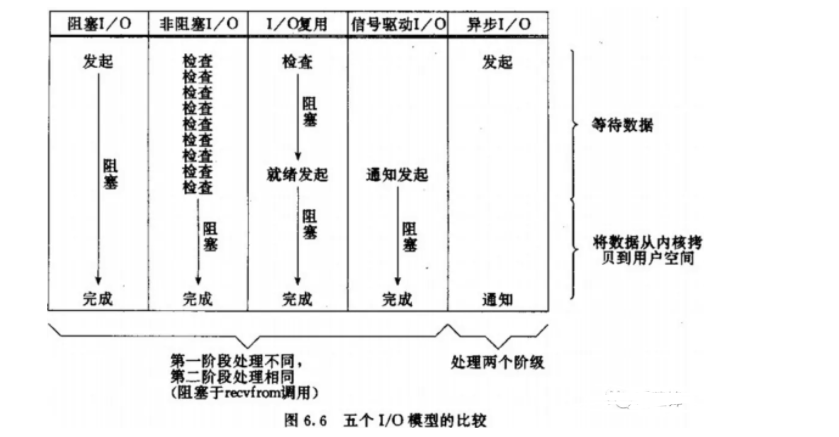

#I/O 多路复用


在神作《UNIX 网络编程》里，总结归纳了 5 种 I/O 模型，包括同步和异步 I/O：

- 阻塞 I/O (Blocking I/O)
- 非阻塞 I/O (Nonblocking I/O)
- I/O 多路复用 (I/O multiplexing)
- 信号驱动 I/O (Signal driven I/O)
- 异步 I/O (Asynchronous I/O)

操作系统上的 I/O 是用户空间和内核空间的数据交互，因此 I/O 操作通常包含以下两个步骤：

- 等待网络数据到达网卡(读就绪)/等待网卡可写(写就绪) –> 读取/写入到内核缓冲区
- 从内核缓冲区复制数据 –> 用户空间(读)/从用户空间复制数据 -> 内核缓冲区(写)

而判定一个 I/O 模型是同步还是异步，主要看第二步：数据在用户和内核空间之间复制的时候是不是会阻塞当前进程，如果会，则是同步 I/O，否则，就是异步 I/O。
基于这个原则，这 5 种 I/O 模型中只有一种异步 I/O 模型：Asynchronous I/O，其余都是同步 I/O 模型。

所谓 I/O 多路复用指的就是 select/poll/epoll 这一系列的多路选择器：支持单一线程同时监听多个文件描述符（I/O 事件），阻塞等待，并在其中某个文件描述符可读写时收到通知。
I/O 复用其实复用的不是 I/O 连接，而是复用线程，让一个 thread of control 能够处理多个连接（I/O 事件）。


##Go源码分析

网络底层概念：

    netFD // 网络描述符
    pollDesc  // 底层数据结构

怎么实现同步编程：

    网络描述netFD与pollDesc进行绑定。当在一个netFD上遇到EAGAIN,就将当前goroutine存储在netFD对应的pollDesc中，同时将goroutine给park住，
    直到这个netFD上再次发生读写事件时，才将次goroutine给ready激活.显然，在底层通知goroutine再次发生读写等事件的方式就是epoll等事件驱动机制.

###epoll为例源码分析
```go

type Listener interface {
    // Accept waits for and returns the next connection to the listener.
    Accept() (Conn, error)

    // Close closes the listener.
    // Any blocked Accept operations will be unblocked and return errors.
    Close() error

    // Addr returns the listener's network address.
    Addr() Addr
}
type TCPConn struct {
    conn
}
type conn struct {
    fd *netFD  // // 网络描述符
}

```