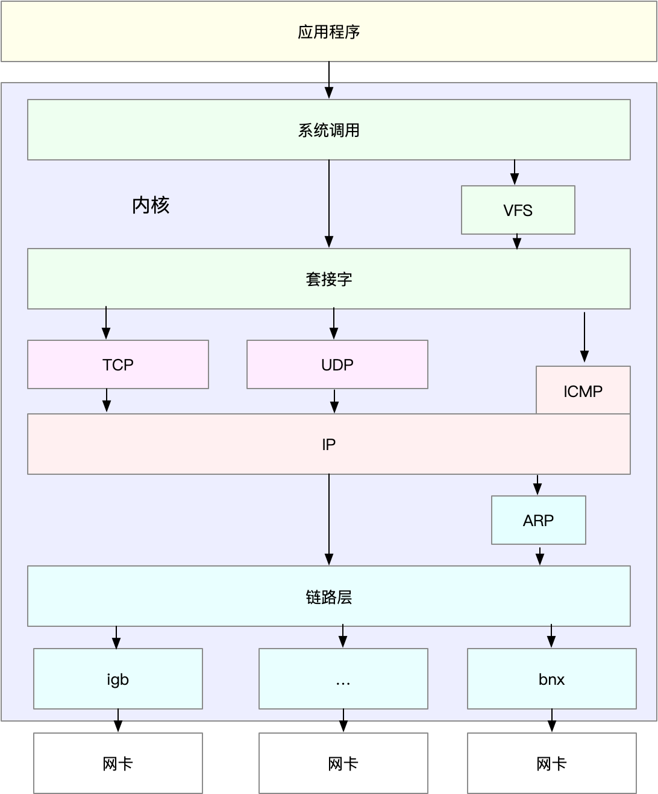
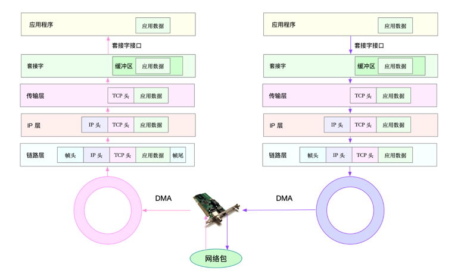
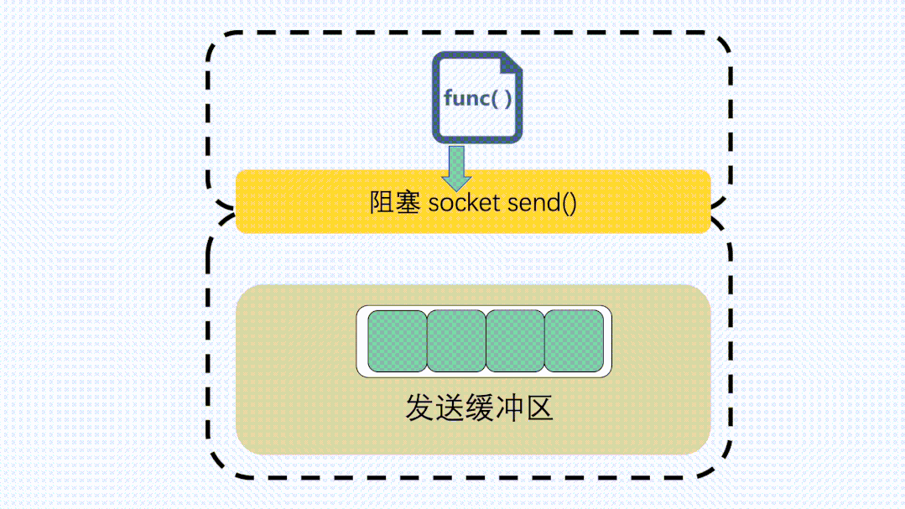
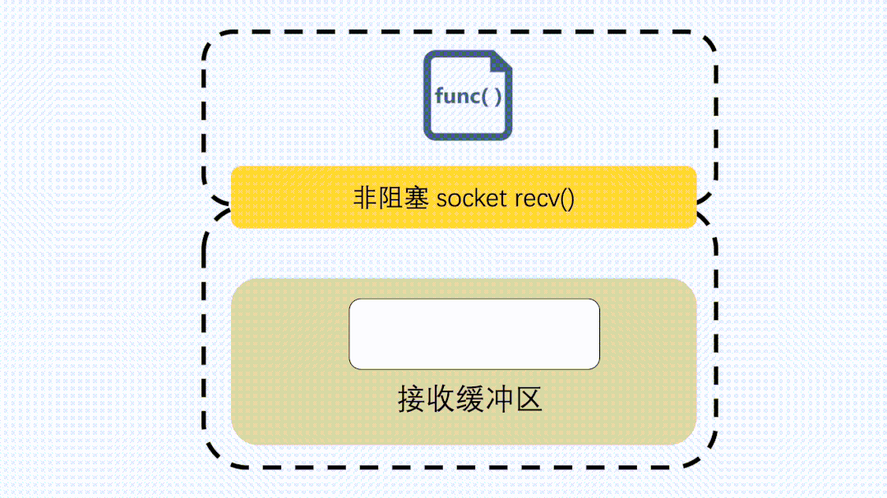

<!-- START doctoc generated TOC please keep comment here to allow auto update -->
<!-- DON'T EDIT THIS SECTION, INSTEAD RE-RUN doctoc TO UPDATE -->
**Table of Contents**  *generated with [DocToc](https://github.com/thlorenz/doctoc)*

- [socket](#socket)
  - [socket缓冲区](#socket%E7%BC%93%E5%86%B2%E5%8C%BA)
  - [观察 socket 缓冲区](#%E8%A7%82%E5%AF%9F-socket-%E7%BC%93%E5%86%B2%E5%8C%BA)
  - [执行 send 发送的字节，会立马发送吗](#%E6%89%A7%E8%A1%8C-send-%E5%8F%91%E9%80%81%E7%9A%84%E5%AD%97%E8%8A%82%E4%BC%9A%E7%AB%8B%E9%A9%AC%E5%8F%91%E9%80%81%E5%90%97)
  - [如果缓冲区满了会怎么办](#%E5%A6%82%E6%9E%9C%E7%BC%93%E5%86%B2%E5%8C%BA%E6%BB%A1%E4%BA%86%E4%BC%9A%E6%80%8E%E4%B9%88%E5%8A%9E)
  - [如果接收缓冲区为空，执行 recv 会怎么样？](#%E5%A6%82%E6%9E%9C%E6%8E%A5%E6%94%B6%E7%BC%93%E5%86%B2%E5%8C%BA%E4%B8%BA%E7%A9%BA%E6%89%A7%E8%A1%8C-recv-%E4%BC%9A%E6%80%8E%E4%B9%88%E6%A0%B7)
  - [如果接收缓冲区有数据时，执行close了，会怎么样？](#%E5%A6%82%E6%9E%9C%E6%8E%A5%E6%94%B6%E7%BC%93%E5%86%B2%E5%8C%BA%E6%9C%89%E6%95%B0%E6%8D%AE%E6%97%B6%E6%89%A7%E8%A1%8Cclose%E4%BA%86%E4%BC%9A%E6%80%8E%E4%B9%88%E6%A0%B7)
  - [如果发送缓冲区有数据时，执行close了，会怎么样？](#%E5%A6%82%E6%9E%9C%E5%8F%91%E9%80%81%E7%BC%93%E5%86%B2%E5%8C%BA%E6%9C%89%E6%95%B0%E6%8D%AE%E6%97%B6%E6%89%A7%E8%A1%8Cclose%E4%BA%86%E4%BC%9A%E6%80%8E%E4%B9%88%E6%A0%B7)
  - [UDP也有缓冲区吗](#udp%E4%B9%9F%E6%9C%89%E7%BC%93%E5%86%B2%E5%8C%BA%E5%90%97)

<!-- END doctoc generated TOC please keep comment here to allow auto update -->

# socket


- 最上层的应用程序，需要通过系统调用，来跟套接字接口进行交互；

- 套接字的下面，就是我们前面提到的传输层、网络层和网络接口层；

- 最底层，则是网卡驱动程序以及物理网卡设备。



socket 在操作系统层面，可以理解为一个文件。 我们可以对这个文件进行一些方法操作。

- 用listen方法，可以让程序作为服务器监听其他客户端的连接。

- 用connect，可以作为客户端连接服务器。

- 用 send 或write 可以发送数据，recv 或 read 可以接收数据


socket 监听的地址(socket_service_address): 必填项，监听的 url 地址。协议和形式也可以多样化，包括：
- tcp 监听所有 tcp 协议的数据，如 tcp://127.0.0.1:http
- tcp4 仅监听 ipv4 地址传输的 tcp 协议数据，如tcp4://:3110
- tcp6 仅监听 ipv6 地址传输的 tcp 协议数据，如tcp6://:3110 或者 tcp6://[2001:db8::1]:3110
- udp 监听所有 udp 协议传输的数据，如udp://:3110
- udp4 仅监听 ipv4 地址传输的 udp 协议数据，如udp4://:3110
- udp6 仅监听 ipv6 地址传输的 udp 协议数据，如udp6://:3110
- unix 监听面向字节流的unix套接字的数据传输协议，如unix:///tmp/sys.sock
- unixgram 监听面向报文的unix套接字的数据传输协议，如unixgram:///tmp/sys.sock
- unixpacket 监听面向数据包的unix套接字的数据传输协议，如unixpacket:///tmp/sys.sock


## socket缓冲区

在建立好连接之后，这个 socket 文件就像是远端机器的 "代理人" 一样。比如，如果我们想给远端服务发点什么东西，那就只需要对这个文件执行写操作就行了。
那写到了这个文件之后，剩下的发送工作自然就是由操作系统内核来完成了。

既然是写给操作系统，那操作系统就需要提供一个地方给用户写。同理，接收消息也是一样。 这个地方就是 socket 缓冲区。
    
- 用户发送消息的时候写给 send buffer（发送缓冲区）
    
- 用户接收消息的时候写给 recv buffer（接收缓冲区）
    
也就是说一个socket ，会带有两个缓冲区，一个用于发送，一个用于接收。因为这是个先进先出的结构，有时候也叫它们发送、接收队列

## 观察 socket 缓冲区

在linux环境下执行 netstat -nt 
```shell
# netstat -nt
Active Internet connections (w/o servers)
Proto Recv-Q Send-Q Local Address           Foreign Address         State      
tcp        0     60 172.22.66.69:22         122.14.220.252:59889    ESTABLISHED

```
这上面表明了，这里有一个协议（Proto）类型为 TCP 的连接，同时还有本地（Local Address）和远端（Foreign Address）的IP信息，状态（State）是已连接。

还有Send-Q 是发送缓冲区，下面的数字60是指，当前还有60 Byte在发送缓冲区中未发送。
而 Recv-Q 代表接收缓冲区，此时是空的，数据都被应用进程接收干净了


## 执行 send 发送的字节，会立马发送吗


答案是不确定！执行 send 之后，数据只是拷贝到了socket 缓冲区。至 于什么时候会发数据，发多少数据，全听操作系统安排

## 如果缓冲区满了会怎么办
首先，socket在创建的时候，是可以设置是阻塞的还是非阻塞的。



## 如果接收缓冲区为空，执行 recv 会怎么样？
如果此时 socket 是阻塞的，那么程序会在那干等，直到接收缓冲区有数据，就会把数据从接收缓冲区拷贝到用户缓冲区，然后返回



## 如果接收缓冲区有数据时，执行close了，会怎么样？

socket close 时，主要的逻辑在 tcp_close() 里实现。

先说结论，关闭过程主要有两种情况：

- 如果接收缓冲区还有数据未读，会先把接收缓冲区的数据清空，然后给对端发一个RST。
    
- 如果接收缓冲区是空的，那么就调用 tcp_send_fin() 开始进行四次挥手过程的第一次挥手

```C
void tcp_close(struct sock *sk, long timeout)
{
  // 如果接收缓冲区有数据，那么清空数据
    while ((skb = __skb_dequeue(&sk->sk_receive_queue)) != NULL) {
        u32 len = TCP_SKB_CB(skb)->end_seq - TCP_SKB_CB(skb)->seq -
              tcp_hdr(skb)->fin;
        data_was_unread += len;
        __kfree_skb(skb);
    }

   if (data_was_unread) {
    // 如果接收缓冲区的数据被清空了，发 RST
        tcp_send_active_reset(sk, sk->sk_allocation);
     } else if (tcp_close_state(sk)) {
    // 正常四次挥手, 发 FIN
        tcp_send_fin(sk);
    }
    // 等待关闭
    sk_stream_wait_close(sk, timeout);
}
```
## 如果发送缓冲区有数据时，执行close了，会怎么样？

```c
void tcp_send_fin(struct sock *sk)
{
  // 获得发送缓冲区的最后一块数据
    struct sk_buff *skb, *tskb = tcp_write_queue_tail(sk);
    struct tcp_sock *tp = tcp_sk(sk);

  // 如果发送缓冲区还有数据
    if (tskb && (tcp_send_head(sk) || sk_under_memory_pressure(sk))) {
        TCP_SKB_CB(tskb)->tcp_flags |= TCPHDR_FIN; // 把最后一块数据值为 FIN 
        TCP_SKB_CB(tskb)->end_seq++;
        tp->write_seq++;
    }  else {
    // 发送缓冲区没有数据，就造一个FIN包
  }
  // 发送数据
    __tcp_push_pending_frames(sk, tcp_current_mss(sk), TCP_NAGLE_OFF);
}
```
此时，还有些数据没发出去，内核会把发送缓冲区最后一个数据块拿出来。然后置为 FIN

    socket 缓冲区是个先进先出的队列，这种情况是指内核会等待TCP层安静把发送缓冲区数据都发完，最后再执行四次挥手的第一次挥手（FIN包）。
    
    有一点需要注意的是，只有在接收缓冲区为空的前提下，我们才有可能走到 tcp_send_fin() 。而只有在进入了这个方法之后，我们才有可能考虑发送缓冲区是否为空的场景。

## UDP也有缓冲区吗
UDP socket 也是 socket，一个socket 就是会有收和发两个缓冲区，跟用什么协议关系不大
```shell
int udp_sendmsg()
{
    // corkreq 为 true 表示是 MSG_MORE 的方式，仅仅组织报文，不发送；
    int corkreq = up->corkflag || msg->msg_flags&MSG_MORE；

    //  将要发送的数据，按照MTU大小分割，每个片段一个skb；并且这些
    //  skb会放入到套接字的发送缓冲区中；该函数只是组织数据包，并不执行发送动作。
    err = ip_append_data(sk, fl4, getfrag, msg->msg_iov, ulen,
                 sizeof(struct udphdr), &ipc, &rt,
                 corkreq ? msg->msg_flags|MSG_MORE : msg->msg_flags);

    // 没有启用 MSG_MORE 特性，那么直接将发送队列中的数据发送给IP。 
    if (!corkreq)
        err = udp_push_pending_frames(sk);

}
```

而我们大部分情况下，都不会用  MSG_MORE，也就是来一个数据包就直接发一个数据包。从这个行为上来说，虽然UDP用上了发送缓冲区，但实际上并没有起到"缓冲"的作用