# CGO站在前人(C语言库)的肩膀
## 背景

    部门产品业务功能采用Golang开发，但是有些功能是用c写的，比如说net-snmp，bfd协议等等，
	像这些如果使用GO语言重编的话，既有实现的复杂度也需要相当长的时间，好在GO语言提供了CGO机制，使得能够在go代码中直接调用C的库函数，
	大大提高了效率，减少了重复开发工作,此外还支持在C语言中调用GO函数，这一点还是蛮强大的

## go 命令使用 cgo  
为了使用 cgo，你需要在普通的 Go 代码中导入一个伪包 "C"。这样 Go 代码就可以引用一些 C 的类型 (如 C.size_t)、变量 (如 C.stdout)、或函数 (如 C.putchar)
如果对 "C" 的导入语句之前紧贴着是一段注释，那么这段注释被称为前言，它被用作编译 C 部分的头文件。如下面例子所示：
```shell script
// #include <stdio.h>
// #include <errno.h>
import "C"
```
前言中可以包含任意 C 代码，包括函数和变量的声明和定义。虽然他们是在 "C" 包里定义的，但是在 Go 代码里面依然可以访问它们。
所有在前言中声明的名字都可以被 Go 代码使用，即使名字的首字母是小写的。static 变量是个例外：它不能在 Go 代码中被访问。但是 static 函数可以在 Go 代码中访问

## 标准库案例
$GOROOT/misc/cgo/stdio 和 $GOROOT/misc/cgo/gmp
多个指令定义的值会被串联到一起。这些指令可以包括一系列构建约束，用以限制对满足其中一个约束的系统的影响

## #cgo语句

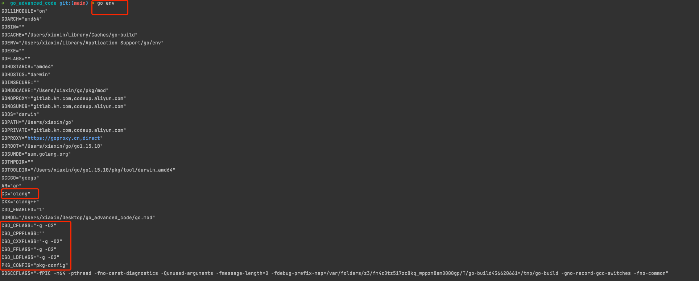
- CGO_ENABLED	指明cgo工具是否可用的标识。
- GOARCH	程序构建环境的目标计算架构。
- GOBIN	存放可执行文件的目录的绝对路径。
- GOPATH	工作区目录的绝对路径。
- GOROOT	Go语言的安装目录的绝对路径。
- GOOS	程序构建环境的目标操作系统。
- GOHOSTOS	程序运行环境的目标操作系统。

```go
man clang
```
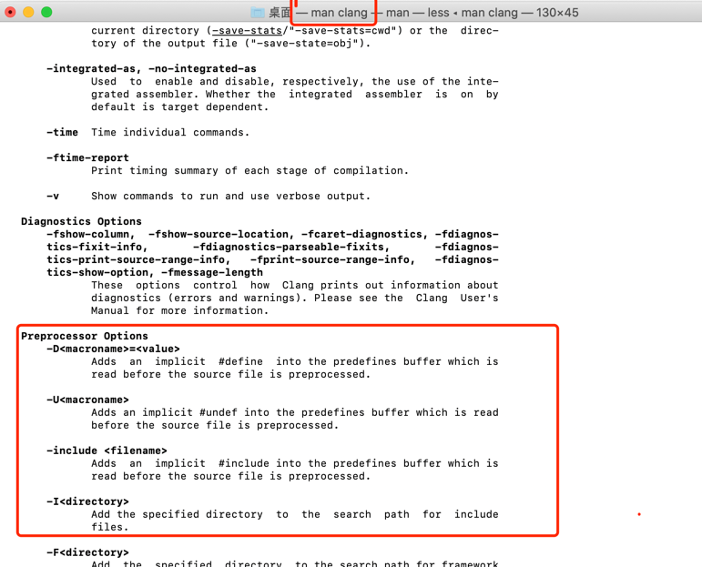

在import "C"语句前的注释中可以通过#cgo语句设置编译阶段和链接阶段的相关参数。
语句主要影响CFLAGS、CPPFLAGS、CXXFLAGS、FFLAGS和LDFLAGS几个编译器环境变量。

- LDFLAGS用于设置链接时的参数.gcc 等编译器会用到的一些优化参数，也可以在里面指定库文件的位置。用法：LDFLAGS=-L/usr/lib -L/path/to/your/lib.每安装一个包都几乎一定的会在安装目录里建立一个lib目录。如果明明安装了某个包，而安装另一个包时，它愣是说找不到，可以抒那个包的lib路径加入的LDFALGS中试一下。

- CFLAGS用于针对C语言代码设置编译参数,指定头文件（.h文件）的路径，如：CFLAGS=-I/usr/include -I/path/include。同样地，安装一个包时会在安装路径下建立一个include目录，当安装过程中出现问题时，试着把以前安装的包的include目录加入到该变量中来。


编译阶段的参数主要用于定义相关宏和指定头文件检索路径。链接阶段的参数主要是指定库文件检索路径和要链接的库文件.
```shell script
// #cgo CFLAGS: -DPNG_DEBUG=1 -I./include
// #cgo amd64 386 CFLAGS: -DX86=1
// #cgo LDFLAGS: -L/usr/local/lib -lpng
// #include <png.h>
import "C"
```
CFLAGS部分，-D部分定义了宏PNG_DEBUG，值为1；-I定义了头文件包含的检索目录。LDFLAGS部分，-L指定了链接时库文件检索目录，-l指定了链接时需要链接png库。

因为C/C++遗留的问题，C头文件检索目录可以是相对目录，但是库文件检索目录则需要绝对路径。在库文件的检索目录中可以通过${SRCDIR}变量表示当前包目录的绝对路径：

```go
// #cgo LDFLAGS: -L${SRCDIR}/libs -lfoo
```
上面的代码在链接时将被展开为：
```go
// #cgo LDFLAGS: -L/go/src/foo/libs -lfoo
```
    
CPPFLAGS 和 LDFLAGS 也可以通过 #cgo pkg-config 命令来通过 pkg-config 来获取。随后的指令指定获取的包名
```go
// #cgo: pkg-config: png cairo
// #include <png.h>
import "C"
```
    默认的 pkg-config 工具配置可以通过设置 PKG_CONFIG 环境变量来修改
    处于安全原因，只有一部分标志 (flag) 允许设置，特别是 -D，-I，以及 -l。如果想允许设置额外的 flag，可以设置 CGO_CFLAGS_ALLOW，按正则条件匹配新的 flag。
    如果想禁止当前允许的 flag，设置 CGO_CFLAGS_DISALLOW，按正则匹配被禁止的指令。
    在这两种情况下，正则匹配都必须是完全匹配：如果想允许 -mfoo=bar 指令，设置 CGO_CFLAGS_ALLOW='-mfoo.*'，而不能仅仅设置 CGO_CFLAGS_ALLOW='-mfoo'。
    类似名称的变量控制 CPPFLAGS, CXXFLAGS, FFLAGS, 以及 LDFLAGS。

    当构建的时候，CGO_CFLAGS, CGO_CPPFLAGS, CGO_CXXFLAGS, CGO_FFLAGS 和 CGO_LDFLAGS 环境变量会被赋值为由上述指令派生的值。
    跟包有关的 flag 应该使用指令来设置，而不是通过环境变量来设置，这样构建工作可以处于未修改的环境中。从环境变量中获取的值不属于上述描述的安全限制。
编译事项： 

1. 在一个 Go 包中的所有 CPPFLAGS 和 CFLAGS 指令都会被串联到一起，然后被用来编译这个包中的 C 文件。
2. 包中所有的 CPPFLAGS 和 CXXFLAGS 指令都会被串联到一起，用于编译包中的 C++ 文件。
3. 包中所有的 CPPFLAGS 和 FFLAGS 指令都会被串联到一起，用来编译包中的 Fortran 文件。


    一个程序中所有包中的 LDFLAGS 指令都会被串联到一起，并在连接 (link) 的时候使用。
    所有的 pkg-config 指令都会被串联到一起，并同时发给 pkg-config，来添加每个合适的 flag 命令行的集合.

在解析 cgo 指令时，所有字符串中的 ${SRCDIR} 都会被替换成当前源文件所在的绝对路径。
${SRCDIR} -->source directory 源代码目录
这样允许提前编译的静态库被包含在包路径中且被正确地链接。比如，如果包 foo 在 /go/src/foo 路径下：
```go
// #cgo LDFLAGS: -L${SRCDIR}/libs -lfoo
//会被扩展成：
// #cgo LDFLAGS: -L/go/src/foo/libs -lfoo

```

当 Go tools 发现一个或多个 Go 文件使用特殊的引用 "C" 时，它会寻找当前路径中的非 Go 文件，并把这些文件编译为 Go 包的一部分。

* 任意 .c, .s, 或 .S 文件都会被 C 编译器编译。
* 任意 .cc, .cpp, 或 .cxx 文件都会被 C++ 编译器编译。
* 任意 .f, .F, .for 或 .f90 文件都会被 fortran 编译器编译。
* 任意 .h, .hh, .hpp 或 .hxx 文件都不会被分别编译，但是如果这些头文件被修改了，那么 C 和 C++ 文件会被重新编译。
* 默认的 C 和 C++ 编译器都可以分别通过设置 CC 和 CXX 环境变量来修改。这些环境变量可能包括命令行选项。

当在被期望的系统上构建 Go 时，cgo tool 默认是开启的。在交叉编译时，它默认是关闭的。
你可以通过设置 CGO_ENABLED 环境变量来控制开启和关闭：设置为 1 表示启用 cgo，设置为 0 表示不启用 cgo。如果 cgo 被启用，则 go tool 会设置构建约束“cgo”。

在交叉编译时，你必须为 cgo 指定一个 C 交叉编译器。
你可以在使用 make 构建工具链 (toolchain) 时设置通用的 CC_FOR_TARGET 或更明确的 CC_FOR_${GOOS}_${GOARCH} (比如 CC_FOR_linux_arm) 环境变量，或者在任意运行 go 工具时设置 CC 环境变量。

CXX_FOR_TARGET, CXX_FOR_${GOOS}_${GOARCH} 以及 CXX 环境变量使用方式类似

## Go与C类型转换
最初CGO是为了达到方便从Go语言函数调用C语言函数（用C语言实现Go语言声明的函数）以复用C语言资源这一目的而出现的（因为C语言还会涉及回调函数，
自然也会涉及到从C语言函数调用Go语言函数（用Go语言实现C语言声明的函数））。现在，它已经演变为C语言和Go语言双向通讯的桥梁.
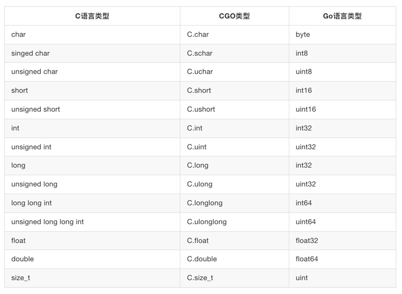


在Go语言中访问C语言的符号时，一般是通过虚拟的“C”包访问，比如C.int对应C语言的int类型。
有些C语言的类型是由多个关键字组成，但通过虚拟的“C”包访问C语言类型时名称部分不能有空格字符，比如unsigned int不能直接通过C.unsigned int访问。
因此CGO为C语言的基础数值类型都提供了相应转换规则，比如C.uint对应C语言的unsigned int。

需要注意的是，虽然在C语言中int、short等类型没有明确定义内存大小，但是在CGO中它们的内存大小是确定的。
在CGO中，C语言的int和long类型都是对应4个字节的内存大小，size_t类型可以当作Go语言uint无符号整数类型对待。


为了提高C语言的可移植性，在<stdint.h>文件中，不但每个数值类型都提供了明确内存大小，而且和Go语言的类型命名更加一致。
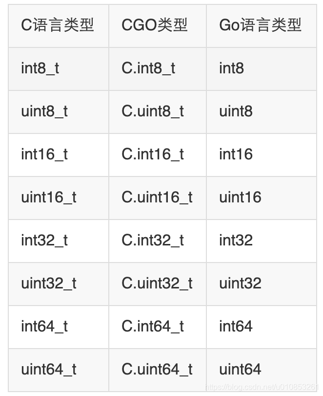

CGO的C虚拟包提供了以下一组函数，用于Go语言和C语言之间数组和字符串的双向转换：
```cgo
// Go string to C string
// The C string is allocated in the C heap using malloc.
// It is the caller's responsibility to arrange for it to be
// freed, such as by calling C.free (be sure to include stdlib.h
// if C.free is needed).
func C.CString(string) *C.char
// Go []byte slice to C array
// The C array is allocated in the C heap using malloc.
// It is the caller's responsibility to arrange for it to be
// freed, such as by calling C.free (be sure to include stdlib.h
// if C.free is needed).
func C.CBytes([]byte) unsafe.Pointer
// C string to Go string
func C.GoString(*C.char) string
// C data with explicit length to Go string
func C.GoStringN(*C.char, C.int) string
// C data with explicit length to Go []byte
func C.GoBytes(unsafe.Pointer, C.int) []byte

```
解析
    
* 其中C.CString针对输入的Go字符串，克隆一个C语言格式的字符串；返回的字符串由C语言的malloc函数分配，不使用时需要通过C语言的free函数释放。
* C.CBytes函数的功能和C.CString类似，用于从输入的Go语言字节切片克隆一个C语言版本的字节数组，同样返回的数组需要在合适的时候释放。
* C.GoString用于将从NULL结尾的C语言字符串克隆一个Go语言字符串。C.GoStringN是另一个字符数组克隆函数。
* C.GoBytes用于从C语言数组，克隆一个Go语言字节切片


一些通常在 Go 中被表示为指针类型的特殊 C 类型会被表示成 uintptr。下面的特殊场景会对此进行介绍。

    当直接访问 C 中的结构体、联合、或枚举类型时，在名字前面加上 struct_、union_、或 enum_，就像 C.struct_stat 这样。
    
    C 的任意类型 T 的大小，在 Go 中用 C.sizeof_T 表示，比如 C.sizeof_struct_stat。
    
    可以在 Go 文件中声明一个带有特殊类型 _GoString_ 类型的 C 函数。可以使用普通的 Go 字符串调用这个函数。可以通过调用这些 C 函数来获取字符串长度，或指向字符串的指针
```go

size_t _GoStringLen(_GoString_ s);
const char *_GoStringPtr(_GoString_ s);
```
    这些函数只能被写在 Go 文件的前言里，而不能写在其他的 C 文件中。C 代码必须不能修改 _GoStringPtr 返回的指针内容。注意字符串内容可能不是 NULL结尾。
    
    由于通常情况下 Go 不支持 C 的联合类型，C 的联合类型在 Go 中被表示为相同长度的比特数组。
    
    Go 的结构体不能嵌入 C 的类型。
    
    对于一个非空的 C 结构体，如果它结尾的字段大小为 0，那么 Go 代码无法引用这个字段。为了获取到这样字段的地址，你只能先获取结构体的地址，然后将地址加上这个结构体的大小。这也是能获取到这个字段的唯一方式。
    
    Cgo 把 C 类型转换成等价的不可输出的 Go 类型。因此 Go 包不应该在它的输出接口中暴露 C 类型：同一个 C 类型，在不同包里是不一样的。


### 类型转换
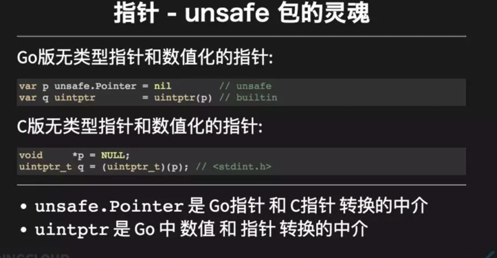
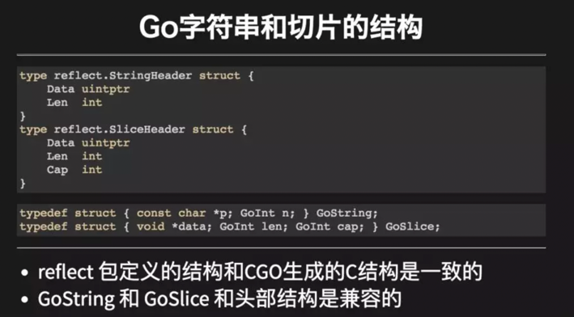

实践：int32 和 C.char 指针相互转换
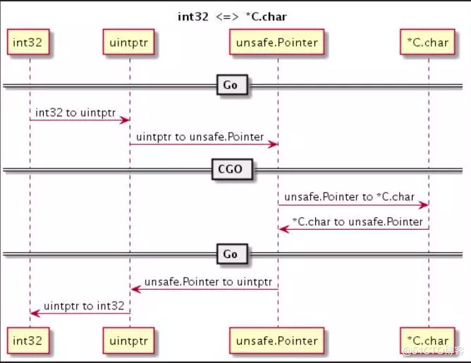
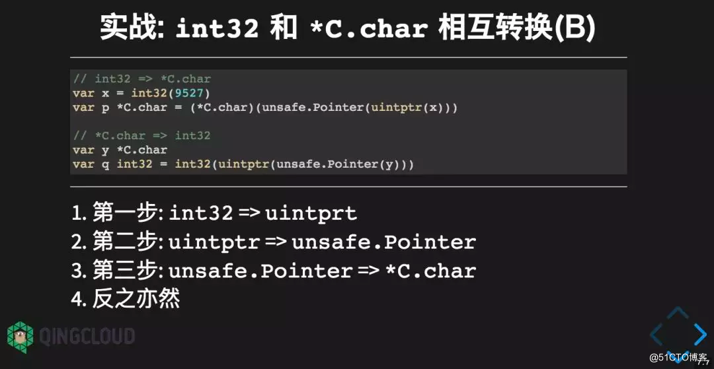

## cgo 内部机制
### CGO生成的中间文件
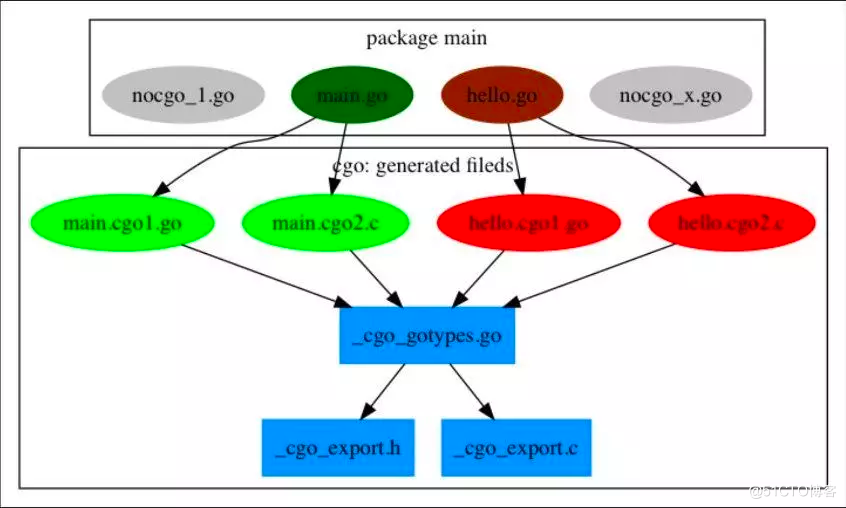
包中有4个Go文件，其中nocgo开头的文件中没有import "C"指令，其它的2个文件则包含了cgo代码。

每个 CGO文 件会展开为一个 Go 文件和 C 文件，分别以 .cgo1.go和.cgo2.c 为后缀名。

然后会为整个包创建一个 _cgo_gotypes.go Go文件，其中包含Go语言部分辅助代码。

 _cgo_gotypes.go 对应 C 导入到 Go 语言中相关函数或变量的桥接代码。
 
而_cgo_export.h 对应Go 导出到C的 函数和类型，_cgo_export.c 对应相关包装代码的实现
     
### 内部调用流程 Go->C
```cgo
package main

//int sum(int a, int b ) {return a +b;}
import "C"

func main(){
    C.sum(2,3)
}
 
```
1. C.sum -->_Cfunc_sum
2. runtime.cgocall
3. newthread:sum
.png)

    白色的部分，是我们自己写的代码，黄色部分是 CGO 生成的代码，左边两列浅黄色是 Go 语言的空间，右边就是 C 语言运行空间。
    在中间位置出现了两个黑的横杠隔开了，黑的横杠中间为 C 语言运行空间。

### 内部调用流程：C->Go
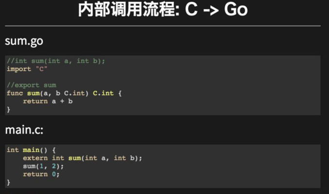

内存调用流程

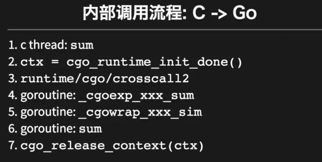
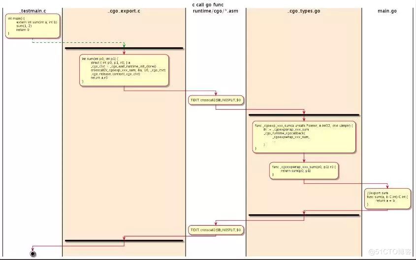