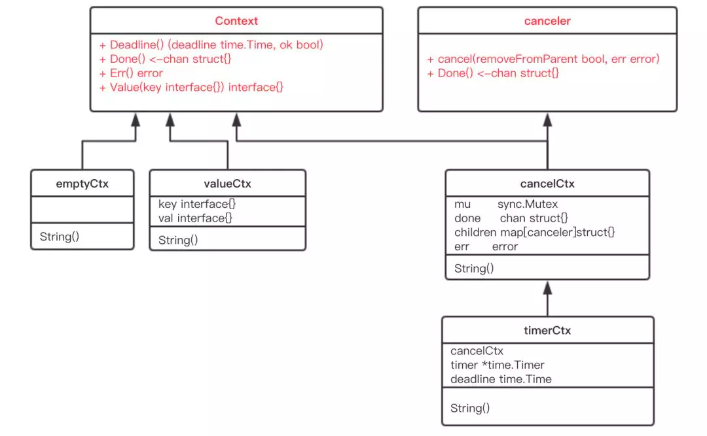

# Context源码分析

## 接口
```go
type Context interface {
	
    Deadline() (deadline time.Time, ok bool)   // 当 context 被取消或者到了 deadline，返回一个被关闭的 channel
    
    Done() <-chan struct{}    // 当 context 被取消或者到了 deadline，返回一个被关闭的 channel
    
    Err() error  // 在 channel Done 关闭后，返回 context 取消原因
    
    Value(key interface{}) interface{}   // 当 context 被取消或者到了 deadline，返回一个被关闭的 channel
}
// Context 是一个接口，定义了 4 个方法，它们都是 幂等的。也就是说连续多次调用同一个方法，得到的结果都是相同的


type canceler interface {
    cancel(removeFromParent bool, err error)
    
    Done() <-chan struct{}
}


```
源码中有两个类型实现了 canceler 接口：*cancelCtx 和 *timerCtx。注意是加了 * 号的，是这两个结构体的指针实现了 canceler 接口。

Context 接口设计成这个样子的原因：

    1.“取消”操作应该是建议性，而非强制性
    
    caller 不应该去关心、干涉 callee 的情况，决定如何以及何时 return 是 callee 的责任。caller 只需发送“取消”信息，callee 根据收到的信息来做进一步的决策，因此接口并没有定义 cancel 方法。
    
    2.“取消”操作应该可传递
    
    “取消”某个函数时，和它相关联的其他函数也应该“取消”。因此， Done() 方法返回一个只读的 channel，所有相关函数监听此 channel。
    一旦 channel 关闭，通过 channel 的“广播机制”，所有监听者都能收到。


## emptyCtx：即空context，也是所有子context的祖先
```go
type emptyCtx int

func (*emptyCtx) Deadline() (deadline time.Time, ok bool) {
	return
}

func (*emptyCtx) Done() <-chan struct{} {
	return nil
}

func (*emptyCtx) Err() error {
	return nil
}

func (*emptyCtx) Value(key interface{}) interface{} {
	return nil
}

func (e *emptyCtx) String() string {
	switch e {
	case background:
		return "context.Background"
	case todo:
		return "context.TODO"
	}
	return "unknown empty Context"
}
//这个实现只用于在包内定义两个内部实例，并提供对外访问函数。
var (
	background = new(emptyCtx)
	todo       = new(emptyCtx)
)

func Background() Context {
	return background
}
func TODO() Context {
	return todo
}
```

background 通常用在 main 函数中，作为所有 context 的根节点。

todo 通常用在并不知道传递什么 context的情形。例如，调用一个需要传递 context 参数的函数，你手头并没有其他 context 可以传递，这时就可以传递 todo。这常常发生在重构进行中，给一些函数添加了一个 Context 参数，但不知道要传什么，就用 todo “占个位子”，最终要换成其他 context

##设计思想：

	1、不需要再对父Context是否为空作为额外的判断，优化了代码结构，在调用时逻辑也更通顺。

	2、Go语言不支持继承，而内嵌一个匿名成员，实际上达到了继承的效果，在后面可以看到，因为以一个完全实现了context接口的emptyCtx实例为起点，
		cancelCtx等实现已经继承了默认的函数，只需要再实现需要用到的函数即可，缺失的其他函数一定会被最底层的emptyCtx实例提供


