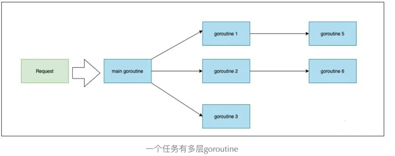
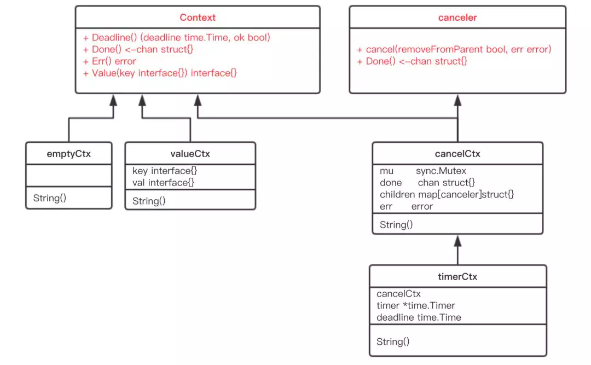
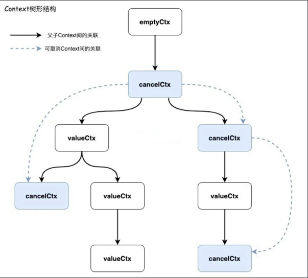
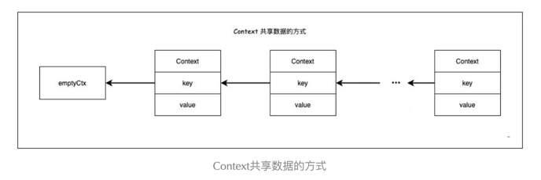

<!-- START doctoc generated TOC please keep comment here to allow auto update -->
<!-- DON'T EDIT THIS SECTION, INSTEAD RE-RUN doctoc TO UPDATE -->
**Table of Contents**  *generated with [DocToc](https://github.com/thlorenz/doctoc)*

- [context](#context)
  - [应用场景](#%E5%BA%94%E7%94%A8%E5%9C%BA%E6%99%AF)
  - [Context 的调用](#context-%E7%9A%84%E8%B0%83%E7%94%A8)
  - [遵循规则](#%E9%81%B5%E5%BE%AA%E8%A7%84%E5%88%99)
  - [接口及实现](#%E6%8E%A5%E5%8F%A3%E5%8F%8A%E5%AE%9E%E7%8E%B0)
    - [1. Context 接口](#1-context-%E6%8E%A5%E5%8F%A3)
    - [2. canceler 接口](#2-canceler-%E6%8E%A5%E5%8F%A3)
    - [实现的类型](#%E5%AE%9E%E7%8E%B0%E7%9A%84%E7%B1%BB%E5%9E%8B)
      - [1. emptyCtx：即空context，也是所有子context的祖先](#1-emptyctx%E5%8D%B3%E7%A9%BAcontext%E4%B9%9F%E6%98%AF%E6%89%80%E6%9C%89%E5%AD%90context%E7%9A%84%E7%A5%96%E5%85%88)
      - [2. cancelCtx](#2-cancelctx)
      - [3. timerCtx：继承自 cancelCtx 带取消功能的 Context](#3-timerctx%E7%BB%A7%E6%89%BF%E8%87%AA-cancelctx-%E5%B8%A6%E5%8F%96%E6%B6%88%E5%8A%9F%E8%83%BD%E7%9A%84-context)
      - [4. valueCtx：只能携带一个键值对，且自身要依附在上一级 Context 上](#4-valuectx%E5%8F%AA%E8%83%BD%E6%90%BA%E5%B8%A6%E4%B8%80%E4%B8%AA%E9%94%AE%E5%80%BC%E5%AF%B9%E4%B8%94%E8%87%AA%E8%BA%AB%E8%A6%81%E4%BE%9D%E9%99%84%E5%9C%A8%E4%B8%8A%E4%B8%80%E7%BA%A7-context-%E4%B8%8A)
        - [使用场景](#%E4%BD%BF%E7%94%A8%E5%9C%BA%E6%99%AF)
        - [设置值](#%E8%AE%BE%E7%BD%AE%E5%80%BC)
        - [读取值](#%E8%AF%BB%E5%8F%96%E5%80%BC)
  - [Go1.21 新版本特性](#go121-%E6%96%B0%E7%89%88%E6%9C%AC%E7%89%B9%E6%80%A7)
    - [增加 WithXXXCause](#%E5%A2%9E%E5%8A%A0-withxxxcause)
    - [增加 AfterFunc](#%E5%A2%9E%E5%8A%A0-afterfunc)
  - [参考](#%E5%8F%82%E8%80%83)

<!-- END doctoc generated TOC please keep comment here to allow auto update -->

# context

Context 上下文，在多个函数、方法、协程、跨 API、进程之间传递信息。
Context 为同一任务的多个 goroutine 之间提供了 *退出信号通知* 和 *元数据传递* 的功能。

## 应用场景


如果不用 Context，就不能在 Go 语言里实现多个 goroutine  间的信号通知和元数据传递了吗？答案是：简单场景下可以，在多层级 goroutine 的控制中就行不通了。

假如主协程中有多个任务，主协程对这些任务有超时控制；而其中任务1又有多个子任务，任务1对这些子任务也有自己的超时控制，那么这些子任务既要感知主协程的取消信号，也需要感知任务1的取消信号。

任务的 goroutine 层级越深，想要自己做退出信号感知和元数据共享就越难。

在 Go http 包的 Server 中，每一个请求在都有一个对应的goroutine去处理。请求处理函数通常会启动额外的goroutine用来访问后端服务，比如数据库和 RPC 服务。
用来处理一个请求的goroutine通常需要访问一些与请求特定的数据， 比如终端用户的身份认证信息、验证相关的 token、请求的截止时间。
当一个请求被取消或超时时，所有用来处理该请求的goroutine都应该迅速退出， 然后系统才能释放这些goroutine占用的资源.

所以我们需要一种优雅的方案来实现这样一种机制：

* 上层任务取消后，所有的下层任务都会被取消；
* 中间某一层的任务取消后，只会将当前任务的下层任务取消，而不会影响上层的任务以及同级任务；
* 可以线程安全地在 goroutine 之间共享元数据

## Context 的调用

应该是链式的，通过WithCancel，WithDeadline，WithTimeout或WithValue派生出新的 Context。当父 Context 被取消时，其派生的所有 Context 都将取消。
通过context.WithXXX都将返回新的 Context 和 CancelFunc。调用 CancelFunc 将取消子代，移除父代对子代的引用，并且停止所有定时器。
未能调用 CancelFunc 将泄漏子代，直到父代被取消或定时器触发。go vet工具检查所有流程控制路径上使用 CancelFuncs

## 遵循规则

遵循以下规则，以保持包之间的接口一致，并启用静态分析工具以检查上下文传播。

不要将 Contexts 放入结构体，相反context应该作为第一个参数传入，命名为ctx。
```go
func DoSomething(ctx context.Context，arg Arg)error { // ... user ctx ... }
```

**即使函数允许，也不要传入nil的 Context。如果不知道用哪种 Context，可以使用context.TODO()。**

使用context的Value相关方法只应该用于在程序和接口中传递的和请求相关的元数据，不要用它来传递一些可选的参数
相同的 Context 可以传递给在不同的goroutine；Context 是并发安全的。


## 接口及实现



### 1. Context 接口
```go
// go1.24.3/src/context/context.go
type Context interface {
	// /返回截止时间和ok,截止时间没有设置，ok为false. 连续调用的结果相同.
	Deadline() (deadline time.Time, ok bool)

	// 返回一个Channel，这个Channel会在当前工作完成或者上下文被取消之后关闭，多次调用Done方法会返回同一个Channel；
    // 如果从来不关闭,为 nil 
	Done() <-chan struct{}

	// 返回当前Context结束的原因，它只会在Done返回的Channel被关闭时才会返回非空的值；
    // - 如果当前Context被取消就会返回Canceled错误；
    // - 如果当前Context超时就会返回DeadlineExceeded错误；
	Err() error
    
	//  会从Context中返回键对应的值，对于同一个上下文来说，多次调用Value 并传入相同的Key会返回相同的结果，该方法仅用于传递跨API和进程间跟请求域的数据
	Value(key any) any
}
```


错误说明
```go
var Canceled = errors.New("context canceled")
var DeadlineExceeded error = deadlineExceededError{}

type deadlineExceededError struct{}

func (deadlineExceededError) Error() string   { return "context deadline exceeded" }
func (deadlineExceededError) Timeout() bool   { return true }
func (deadlineExceededError) Temporary() bool { return true }
```


### 2. canceler 接口
```go

type canceler interface {
    cancel(removeFromParent bool, err error)
    
    Done() <-chan struct{}
}
```

源码中有两个类型实现了 canceler 接口：*cancelCtx 和 *timerCtx。注意是加了 * 号的，是这两个结构体的指针实现了 canceler 接口。

Context 接口设计成这个样子的原因：

1. “取消”操作应该是建议性，而非强制性

caller 不应该去关心、干涉 callee 的情况，决定如何以及何时 return 是 callee 的责任。caller 只需发送“取消”信息，callee 根据收到的信息来做进一步的决策，因此接口并没有定义 cancel 方法。

2. “取消”操作应该可传递

“取消”某个函数时，和它相关联的其他函数也应该“取消”。因此， Done() 方法返回一个只读的 channel，所有相关函数监听此 channel。
一旦 channel 关闭，通过 channel 的“广播机制”，所有监听者都能收到。


### 实现的类型

- emptyCtx：默认初始的context使用的类型，仅实现Context接口，不做任何处理，返回默认空值。
- cancelCtx：实现了canceler接口，为context提供了可取消自身和子孙的功能。
- timerCtx：在cancelCtx的基础上，对带有定时功能的Context进行了实现。
- valueCtx：对应携带K-V值的context接口实现，携带k-v数据成员，实现了value函数的具体操作。


#### 1. emptyCtx：即空context，也是所有子context的祖先

在context包内部已经为我们实现好了两个空的Context，可以通过调用Background()和TODO()方法获取。
```go
type emptyCtx int

func (*emptyCtx) Deadline() (deadline time.Time, ok bool) {
	return
}

func (*emptyCtx) Done() <-chan struct{} {
	return nil
}

func (*emptyCtx) Err() error {
	return nil
}

func (*emptyCtx) Value(key interface{}) interface{} {
	return nil
}

func (e *emptyCtx) String() string {
	switch e {
	case background:
		return "context.Background"
	case todo:
		return "context.TODO"
	}
	return "unknown empty Context"
}
//这个实现只用于在包内定义两个内部实例，并提供对外访问函数。
var (
	background = new(emptyCtx)
	todo       = new(emptyCtx)
)

func Background() Context {
	return background
}
func TODO() Context {
	return todo
}
```

- background 通常用在 main 函数中，作为所有 context 的根节点。

- todo 通常用在并不知道传递什么 context的情形。例如，调用一个需要传递 context 参数的函数，你手头并没有其他 context 可以传递，这时就可以传递 todo。这常常发生在重构进行中，给一些函数添加了一个 Context 参数，但不知道要传什么，就用 todo “占个位子”，最终要换成其他 context.

c设计思想：

1. 不需要再对父Context是否为空作为额外的判断，优化了代码结构，在调用时逻辑也更通顺。

2. Go语言不支持继承，而内嵌一个匿名成员，实际上达到了继承的效果，在后面可以看到，因为以一个完全实现了context接口的emptyCtx实例为起点，
    cancelCtx等实现已经继承了默认的函数，只需要再实现需要用到的函数即可，缺失的其他函数一定会被最底层的emptyCtx实例提供


#### 2. cancelCtx



```go
type cancelCtx struct {
	Context

	mu       sync.Mutex            // 用于保证下面字段线程安全
	done     atomic.Value          // of chan struct{}, created lazily, closed by first cancel call
	children map[canceler]struct{} // children字典则存储了本context派生的所有context，key值为canceler类型.
	err      error                 // err 字段用于标记该context是否已经被取消，一经取消则将是非空值
	cause    error                 // go 1.21 新增原因
}
```


```go
// 使用 
func WithCancel(parent Context) (ctx Context, cancel CancelFunc) {
	c := withCancel(parent)
	return c, func() { c.cancel(true, Canceled, nil) }
}

```

```go
// go1.24.3/src/context/context.go
func withCancel(parent Context) *cancelCtx {
	if parent == nil {
		panic("cannot create context from nil parent")
	}
	c := &cancelCtx{} // 初始化
	c.propagateCancel(parent, c)
	return c
}

func (c *cancelCtx) propagateCancel(parent Context, child canceler) {
	c.Context = parent // 设置 父亲 context 

	done := parent.Done()
	if done == nil { //  祖先为不可取消类型，则自己就是取消链的根，直接返回,如 emptyCtx的Done() 为Nil
		return 
	}

	select {
	case <-done:
		// parent is already canceled
		child.cancel(false, parent.Err(), Cause(parent))
		return
	default:
	}

    // 通过辅助函数parentCancelCtx向上回溯，尝试找到最近的*cancelCtx类型祖先。
	if p, ok := parentCancelCtx(parent); ok {
		// parent is a *cancelCtx, or derives from one.
		p.mu.Lock()
		if p.err != nil {          // parent 已经被取消
			child.cancel(false, p.err, p.cause)
		} else {
			if p.children == nil {
				p.children = make(map[canceler]struct{})
			}
			p.children[child] = struct{}{}         	// 则将自身加入其children列表中
		}
		p.mu.Unlock()
		return
	}

	if a, ok := parent.(afterFuncer); ok {
		// parent implements an AfterFunc method.
		c.mu.Lock()
		stop := a.AfterFunc(func() {
			child.cancel(false, parent.Err(), Cause(parent))
		})
		c.Context = stopCtx{
			Context: parent,
			stop:    stop,
		}
		c.mu.Unlock()
		return
	}

	goroutines.Add(1)
	go func() {
		select {
		case <-parent.Done():
			child.cancel(false, parent.Err(), Cause(parent))
		case <-child.Done():
		}
	}()
}

func parentCancelCtx(parent Context) (*cancelCtx, bool) {
	done := parent.Done()
	if done == closedchan || done == nil {
		return nil, false
	}
	p, ok := parent.Value(&cancelCtxKey).(*cancelCtx)
	if !ok {
		return nil, false
	}
	// 拿到了 cancelCtx
	pdone, _ := p.done.Load().(chan struct{})
	if pdone != done { // 对比 channel
		return nil, false
	}
	return p, true
}
```


取消时调用
```go
var closedchan = make(chan struct{})

func (c *cancelCtx) cancel(removeFromParent bool, err, cause error) {
	// 校验: 调用时需要传入错误
	if err == nil {
		panic("context: internal error: missing cancel error")
	}
	// 默认用 err
	if cause == nil {
		cause = err
	}
	c.mu.Lock()
	if c.err != nil { // 代表已经取消
		c.mu.Unlock()
		return 
	}
	c.err = err
	c.cause = cause
	d, _ := c.done.Load().(chan struct{})
	if d == nil {
		c.done.Store(closedchan) // 初始化
	} else {
		close(d) 
	}
	for child := range c.children {
		// NOTE: acquiring the child's lock while holding parent's lock.
		child.cancel(false, err, cause)
	}
	c.children = nil // 设置 child 为空
	c.mu.Unlock()

	if removeFromParent { // 解除自身在 父取消链中的绑定
		removeChild(c.Context, c)
	}
}

func removeChild(parent Context, child canceler) {
	p, ok := parentCancelCtx(parent)
	if !ok {
		return
	}
	p.mu.Lock()
	if p.children != nil {
		delete(p.children, child)
	}
	p.mu.Unlock()
}
```


#### 3. timerCtx：继承自 cancelCtx 带取消功能的 Context
```go
type timerCtx struct {
    cancelCtx
    timer *time.Timer // Under cancelCtx.mu.
    deadline time.Time
}
```
```go
func WithDeadline(parent Context, d time.Time) (Context, CancelFunc) {
	if parent == nil {
		panic("cannot create context from nil parent")
	}
	if cur, ok := parent.Deadline(); ok && cur.Before(d) {
		// 时间还在范围之内
		// The current deadline is already sooner than the new one.
		return WithCancel(parent)
	}
	c := &timerCtx{
		cancelCtx: newCancelCtx(parent),
		deadline:  d,
	}
	propagateCancel(parent, c)
	dur := time.Until(d)
	if dur <= 0 {
		// 已经超时
		c.cancel(true, DeadlineExceeded) // deadline has already passed
		return c, func() { c.cancel(false, Canceled) }
	}
	c.mu.Lock()
	defer c.mu.Unlock()
	if c.err == nil {
		// 建立定时任务
		c.timer = time.AfterFunc(dur, func() {
			c.cancel(true, DeadlineExceeded)
		})
	}
	return c, func() { c.cancel(true, Canceled) }
}
```
本质上说，无论是WithDeadline还是WithTimeout生成的子context，都是对于time.AfterFunc函数和cancelCtx的一个封装。

#### 4. valueCtx：只能携带一个键值对，且自身要依附在上一级 Context 上


```go

type valueCtx struct {
    Context
    key, val interface{} // valueCtx:在原状态基础上添加一个键值对
}


```


##### 使用场景
WithValue函数能够将请求作用域的数据与 Context 对象建立关系。

，
读取 Context 上的键值又是一个幂等的操作，所以 Context 就这样实现了线程安全的数据共享机制，且全程无锁，不会影响性能

##### 设置值

```go
func WithValue(parent Context, key, val interface{}) Context {
    // 校验 ... ,提供的键必须是可比性和应该不是字符串类型或任何其他内置的类型以避免包使用的上下文之间的碰撞。
	
    return &valueCtx{parent, key, val}
}

```
每次要在Context链路上增加要携带的键值对时，都要在上级Context的基础上新建一个 valueCtx 存储键值对，且只能增加不能修改


valueCtx类型真正实现了value函数，该函数是一个向上递归的查询过程，如果key不存在，将递归调用emptyCtx定义好的默认函数，返回一个nil值


##### 读取值

```go
// go1.24.3/src/context/context.go

func (c *valueCtx) Value(key any) any {
	if c.key == key {
		return c.val
	}
	// valueCtx类型真正实现了value函数，该函数是一个向上递归的查询过程，如果key不存在，将递归调用emptyCtx定义好的默认函数，返回一个nil值
	return value(c.Context, key)
}

func value(c Context, key any) any {
	for {
        // 递归遍历获取父节点值
		switch ctx := c.(type) {
		case *valueCtx:
			if key == ctx.key {
				return ctx.val
			}
			// 上一级递归
			c = ctx.Context
		case *cancelCtx:
			if key == &cancelCtxKey {
				return c
			}
			c = ctx.Context
		case withoutCancelCtx:
			if key == &cancelCtxKey {
				// This implements Cause(ctx) == nil
				// when ctx is created using WithoutCancel.
				return nil
			}
			c = ctx.c
		case *timerCtx:
			if key == &cancelCtxKey {
				return &ctx.cancelCtx
			}
			c = ctx.Context
		case backgroundCtx, todoCtx: //  遇到 emptyCtx 后退出
			return nil
		default:
			return c.Value(key)
		}
	}
}

```

## Go1.21 新版本特性
性能优化
- 减少了内存分配次数
- 优化了取消操作的性能
- 改进了context树的遍历效率

### 增加 WithXXXCause
针对 Context 的错误处理终于有了一点点的增强，来填补这个地方的信息，允许添加自定义的错误类型和信息。
```go
// WithDeadlineCause behaves like WithDeadline but also sets the cause of the
// returned Context when the deadline is exceeded. The returned CancelFunc does
// not set the cause.
func WithDeadlineCause(parent Context, d time.Time, cause error) (Context, CancelFunc)

// WithTimeoutCause behaves like WithTimeout but also sets the cause of the
// returned Context when the timout expires. The returned CancelFunc does
// not set the cause.
func WithTimeoutCause(parent Context, timeout time.Duration, cause error) (Context, CancelFunc)

```

### 增加 AfterFunc


## 参考

- [深入 GO Context「源码分析+详细案例」](https://zhuanlan.zhihu.com/p/682397085)

