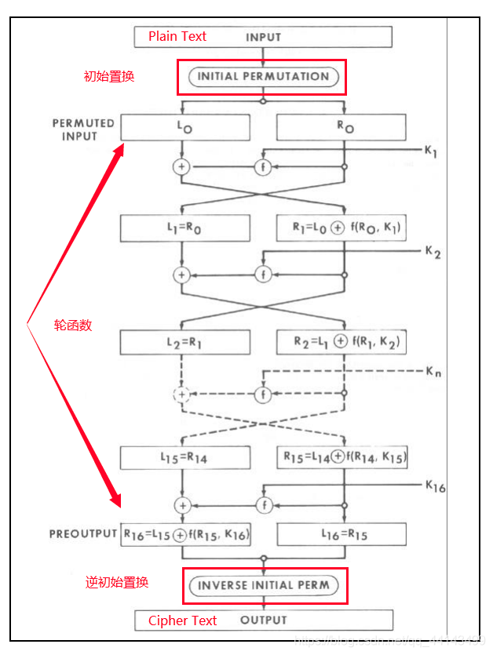
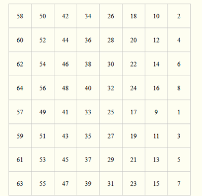
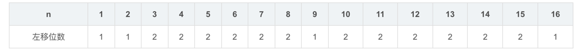
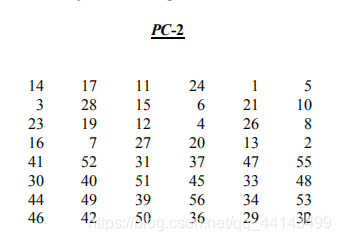

# DES美国数据加密标准(Data Encryption Standard)
参考链接: https://blog.csdn.net/qq_44143499/article/details/105821846?spm=1001.2101.3001.6650.2&utm_medium=distribute.pc_relevant.none-task-blog-2%7Edefault%7ECTRLIST%7Edefault-2.no_search_link&depth_1-utm_source=distribute.pc_relevant.none-task-blog-2%7Edefault%7ECTRLIST%7Edefault-2.no_search_link&utm_relevant_index=5

是一种使用密钥加密的块算,DES算法明文分组长度为64 bit，密钥长度也为64 bit，但是实际密钥长度只有56位，其中第8、16、24、32、40、48、56、64位是奇偶校验位，用于检查密钥在产生、分配及存储过程中可能发生的错误。

DES有ECB（电子密码本）和CBC（加密块）等加密模式。

DES算法的安全性很高，目前除了穷举搜索破解外，尚无更好的的办法来破解。其密钥长度越长，破解难度就越大。不过已经发现DES容易受到非常强大的攻击，因此DES的普及程度略有下降。

## 规则

把输入的64位数据块按位重新组合，并把输出分为L0、R0两部分，每部分各长32位，其置换规则为将输入的第58位换到第一位,第50位换到第2位……依此类推,最后一位是原来的第7位。L0、R0则是换位输出后的两部分，L0是输出的左32位，R0是右32位,例:设置换前的输入值为D1D2D3……D64,则经过初始置换后的结果为:L0=D58D50……D8;R0=D57D49……D7。
经过16次迭代运算后,得到L16、R16,将此作为输入，进行逆置换，逆置换正好是初始置换的逆运算，由此即得到密文输出。

### IP置换

IP表的意思为：将X中的58位数据放在转换后生成的X’表的第1位，X中的第50位放在X’的第2位，X中的42位放在第3位…X中的第7位放在X’的最后一位。

例如，初始X为：01010011 01100101 01100011 01110010 01100101 01110100 00100000 01001101

则经过初始置换IP表进行置换后 变成：10111111 00101001 10110010 10010111 00000000 01111110 10000000 00001101 。

进行完IP置换后，将X分成左右两部分，左边记为L0，右边记为R0:

L0 = 10111111 00101001 10110010 10010111

R0 = 00000000 01111110 10000000 00001101

### 创建16个块Cn和Dn
对于1<=n<=16，在第n轮分别对Cn-1和Dn-1进行循环左移，所移的位数为1位或者2位，取决于n的值，当n=1,2,9,16时左移1位，其它左移2位。
   
进行移位后得到C1到C16,，D1到D16。

### 得到16个子密钥K
  
Kn = PC_2(CnDn)，PC_2为固定置换，用于从 CnDn 中选取48 bit作为子密钥Kn，CnDn 表示从左到右将 Dn 排在 Cn 的后面，CnDn 的长度为56 bit。

至此，子密钥全部生成，进入轮函数。