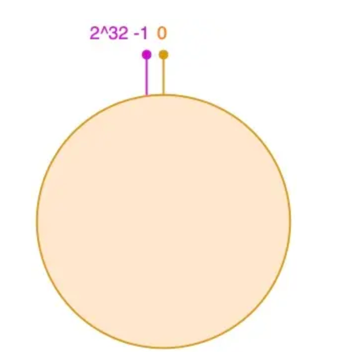
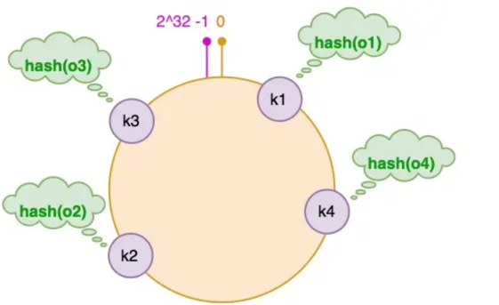
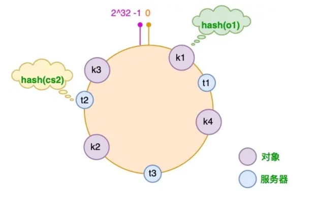
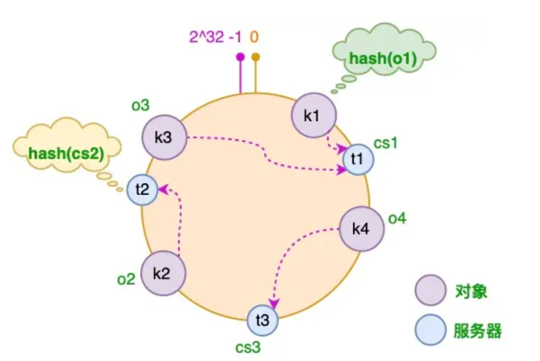
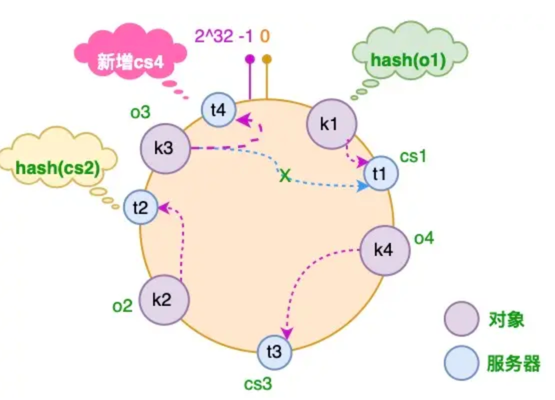
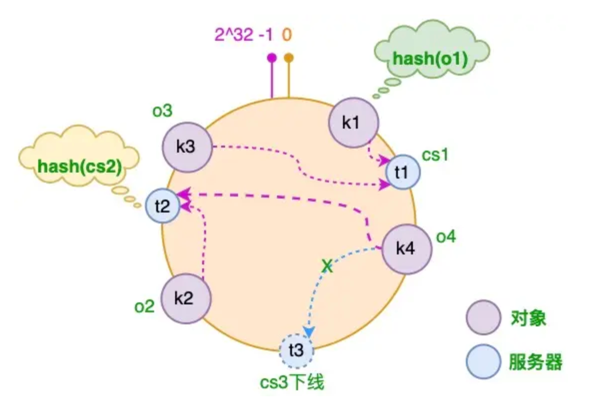
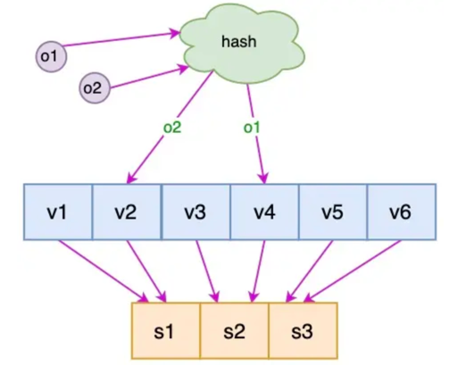

<!-- START doctoc generated TOC please keep comment here to allow auto update -->
<!-- DON'T EDIT THIS SECTION, INSTEAD RE-RUN doctoc TO UPDATE -->
**Table of Contents**  *generated with [DocToc](https://github.com/thlorenz/doctoc)*

- [一致性hash](#%E4%B8%80%E8%87%B4%E6%80%A7hash)
  - [使用场景](#%E4%BD%BF%E7%94%A8%E5%9C%BA%E6%99%AF)
  - [算法特点](#%E7%AE%97%E6%B3%95%E7%89%B9%E7%82%B9)
    - [均衡性(Balance)](#%E5%9D%87%E8%A1%A1%E6%80%A7balance)
    - [单调性(Monotonicity)](#%E5%8D%95%E8%B0%83%E6%80%A7monotonicity)
    - [分散性(Spread)](#%E5%88%86%E6%95%A3%E6%80%A7spread)
  - [一致性哈希算法原理](#%E4%B8%80%E8%87%B4%E6%80%A7%E5%93%88%E5%B8%8C%E7%AE%97%E6%B3%95%E5%8E%9F%E7%90%86)
  - [库](#%E5%BA%93)
    - [github.com/serialx/hashring -->buildkit 使用](#githubcomserialxhashring---buildkit-%E4%BD%BF%E7%94%A8)
    - [go-zero实现](#go-zero%E5%AE%9E%E7%8E%B0)
  - [参考](#%E5%8F%82%E8%80%83)

<!-- END doctoc generated TOC please keep comment here to allow auto update -->

# 一致性hash 
哈希算法是一种从任何一种数据中创建小的数字“指纹”的方法，解决如何将数据映射到固定槽问题。而一致性哈希算法是为了解决当槽数目变化的时候如何将映射结果的变化降到最小

## 使用场景

- 分布式缓存。可以在 redis cluster 这种存储系统上构建一个 cache proxy，自由控制路由。而这个路由规则就可以使用一致性hash算法
- 服务发现
- 分布式调度任务

## 算法特点

### 均衡性(Balance)
均衡性主要指,通过算法分配, 集群中各节点应该要尽可能均衡.

### 单调性(Monotonicity)
单调性主要指当集群发生变化时, 已经分配到老节点的key, 尽可能的任然分配到之前节点,以防止大量数据迁移, 这里一般的hash取模就很难满足这点,而一致性hash算法能够将发生迁移的key数量控制在较低的水平.

当加入一个新的节点时，新加入（剔除）节点后，只会影响该节点附近的数据。其他节点的数据不会收到影响，从而解决了节点变化的问题。

### 分散性(Spread)
分散性主要针对同一个key, 当在不同客户端操作时,可能存在客户端获取到的缓存集群的数量不一致,从而导致将key映射到不同节点的问题,这会引发数据的不一致性.好的hash算法应该要尽可能避免分散性.

## 一致性哈希算法原理



1. 这个环的起点是 0，终点是 2^32 - 1，并且起点与终点连接，故这个环的整数分布范围是 [0, 2^32-1]

2. 将对象放置到哈希环

假设我们有 "semlinker"、"kakuqo"、"lolo"、"fer" 四个对象，分别简写为 o1、o2、o3 和 o4，然后使用哈希函数计算这个对象的 hash 值，值的范围是 [0, 2^32-1]




3. 将服务器放置到哈希环

这里假设我们有 3 台缓存服务器，分别为 cs1、cs2 和 cs3：



4. 为对象选择服务器


将对象和服务器都放置到同一个哈希环后，在哈希环上顺时针查找距离这个对象的 hash 值最近的机器，即是这个对象所属的机器。
以 o2 对象为例，顺序针找到最近的机器是 cs2，故服务器 cs2 会缓存 o2 对象。
而服务器 cs1 则缓存 o1，o3 对象，服务器 cs3 则缓存 o4 对象。


5. 服务器增加的情况


需要增加一台服务器 cs4，经过同样的 hash 运算，该服务器最终落于 t1 和 t2 服务器之间，
只有 t1 和 t2 服务器之间的对象需要重新分配。在以上示例中只有 o3 对象需要重新分配，即它被重新到 cs4 服务器。


6. 服务器减少的情况


假设 cs3 服务器出现故障导致服务下线，这时原本存储于 cs3 服务器的对象 o4，需要被重新分配至 cs2 服务器，其它对象仍存储在原有的机器上。


7. 虚拟节点


对于新增服务器的情况还存在一些问题。新增的服务器 cs4 只分担了 cs1 服务器的负载，服务器 cs2 和 cs3 并没有因为 cs4 服务器的加入而减少负载压力。如果 cs4 服务器的性能与原有服务器的性能一致甚至可能更高，那么这种结果并不是我们所期望的。

针对这个问题，我们可以通过引入虚拟节点来解决负载不均衡的问题。即将每台物理服务器虚拟为一组虚拟服务器，将虚拟服务器放置到哈希环上，如果要确定对象的服务器，需先确定对象的虚拟服务器，再由虚拟服务器确定物理服务器。


## 库

### github.com/serialx/hashring -->buildkit 使用

初始化
```go
// 默认hash 函数
var defaultHashFunc = func() HashFunc {
	hashFunc, err := NewHash(md5.New).Use(NewInt64PairHashKey)
	if err != nil {
		panic(fmt.Sprintf("failed to create defaultHashFunc: %s", err.Error()))
	}
	return hashFunc
}()


func New(nodes []string) *HashRing {
	return NewWithHash(nodes, defaultHashFunc)
}

func NewWithHash(
	nodes []string,
	hashKey HashFunc,
) *HashRing {
	hashRing := &HashRing{
		ring:       make(map[HashKey]string),
		sortedKeys: make([]HashKey, 0),
		nodes:      nodes,
		weights:    make(map[string]int),
		hashFunc:   hashKey,
	}
	hashRing.generateCircle()
	return hashRing
}

```


```go
// github.com/serialx/hashring@v0.0.0-20200727003509-22c0c7ab6b1b/hashring.go

// 将服务的key按该hash算法计算,得到在服务在一致性hash环上的位置.
func (h *HashRing) generateCircle() {
	totalWeight := 0
	for _, node := range h.nodes {
		if weight, ok := h.weights[node]; ok {
			totalWeight += weight
		} else {
			totalWeight += 1
			h.weights[node] = 1
		}
	}

	for _, node := range h.nodes {
		weight := h.weights[node]

		for j := 0; j < weight; j++ {
			nodeKey := node + "-" + strconv.FormatInt(int64(j), 10)
			key := h.hashFunc([]byte(nodeKey))
			h.ring[key] = node
			h.sortedKeys = append(h.sortedKeys, key)
		}
	}
    
	// 排序
	sort.Sort(HashKeyOrder(h.sortedKeys))
}
```

查找过程
```go
func (h *HashRing) GetNode(stringKey string) (node string, ok bool) {
	pos, ok := h.GetNodePos(stringKey)
	if !ok {
		return "", false
	}
	return h.ring[h.sortedKeys[pos]], true
}

func (h *HashRing) GetNodePos(stringKey string) (pos int, ok bool) {
	if len(h.ring) == 0 {
		return 0, false
	}

	// hash 生成 key 
	key := h.GenKey(stringKey)

	// 二分查找
	nodes := h.sortedKeys
	pos = sort.Search(len(nodes), func(i int) bool { return key.Less(nodes[i]) })

	if pos == len(nodes) {
		// Wrap the search, should return First node
		return 0, true
	} else {
		return pos, true
	}
}

func (h *HashRing) GenKey(key string) HashKey {
	return h.hashFunc([]byte(key))
}
```


Note: 这里使用的是 md5 算法

### go-zero实现
```go
// github.com/zeromicro/go-zero@v1.3.5/core/hash/consistenthash.go

type ConsistentHash struct {
  hashFunc Func       // hash 函数
  replicas int       // 虚拟节点放大因子
  keys     []uint64     // 存储虚拟节点hash
  ring     map[uint64][]interface{}     // 虚拟节点与实际node的对应关系
  nodes    map[string]lang.PlaceholderType // 实际节点存储【便于快速查找，所以使用map】
  lock     sync.RWMutex
}
```


## 参考
- [一文搞懂一致性hash的原理和实现](https://cloud.tencent.com/developer/article/1907867)
- [图解一致性哈希算法](https://segmentfault.com/a/1190000021199728)