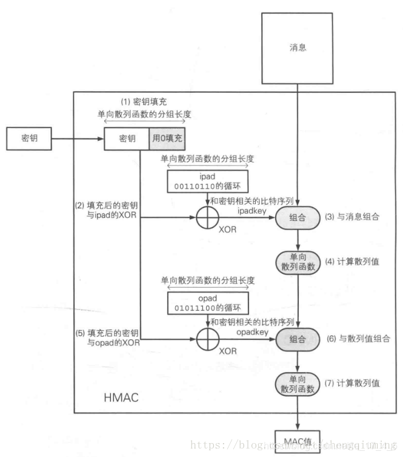

# HMAC 哈希运算消息认证码(Hash-based Message Authentication Code)

由H.Krawezyk，M.Bellare，R.Canetti于1996年提出的一种基于Hash函数和密钥进行消息认证的方法，并于1997年作为RFC2104被公布，并在IPSec和其他网络协议（如SSL）中得以广泛应用，现在已经成为事实上的Internet安全标准。它可以与任何迭代散列函数捆绑使用。
HMAC运算利用hash算法，以一个消息M和一个密钥K作为输入，生成一个定长的消息摘要作为输出。HMAC算法利用已有的Hash函数，关键问题是如何使用密钥。


和我们自定义的加salt算法不同，Hmac算法针对所有哈希算法都通用，无论是MD5还是SHA-1。
采用Hmac替代我们自己的salt算法，可以使程序算法更标准化，也更安全。


HMAC的密钥长度可以是任意大小，如果小于n（hash输出值的大小），那么将会消弱算法安全的强度。建议使用长度大于n的密钥，但是采用长度大的密钥并不意味着增强了函数的安全性。密钥应该是随机选取的，可以采用一种强伪随机发生器，并且密钥需要周期性更新，这样可以减少散列函数弱密钥的危险性以及已经暴露密钥所带来的破坏
使用SHA-1、SHA-224、SHA-256、SHA-384、SHA-512所构造的HMAC，分别称为HMAC-SHA1、HMAC-SHA-224、HMAC-SHA-384、HMAC-SHA-512。


## GO源码
```go
//key随意设置 data 要加密数据
func Hmac(key, data string) string {
	hash:= hmac.New(md5.New, []byte(key)) // 创建对应的md5哈希加密算法
	hash.Write([]byte(data))
	return hex.EncodeToString(hash.Sum([]byte("")))
}
func HmacSha256(key, data string) string {
	hash:= hmac.New(sha256.New, []byte(key)) //创建对应的sha256哈希加密算法
	hash.Write([]byte(data))
	return hex.EncodeToString(hash.Sum([]byte("")))
}

```