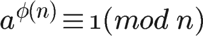
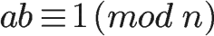
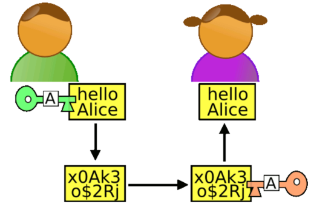

# RSA（Rivest–Shamir–Adleman）加密
1977年，三位数学家Rivest、Shamir 和 Adleman 设计了一种算法，可以实现非对称加密。
这种算法用他们三个人的名字命名，叫做RSA算法。从那时直到现在，RSA算法一直是最广为使用的"非对称加密算法"。
毫不夸张地说，只要有计算机网络的地方，就有RSA算法。

这种算法非常可靠，密钥越长，它就越难破解。根据已经披露的文献，目前被破解的最长RSA密钥是768个二进制位。也就是说，长度超过768位的密钥，还无法破解（至少没人公开宣布）。
因此可以认为，1024位的RSA密钥基本安全，2048位的密钥极其安全。

RSA算法的安全性基于RSA问题的困难性，也就是基于大整数因子分解的困难性上。但是RSA问题不会比因子分解问题更加困难，
也就是说，在没有解决因子分解问题的情况下可能解决RSA问题，因此RSA算法并不是完全基于大整数因子分解的困难性上的。

它是一种非对称加密算法，也叫”单向加密“。用这种方式，任何人都可以很容易地对数据进行加密，而只有用正确的”秘钥“才能解密
RSA加密是最常用的非对称加密方式，原理是对一极大整数做因数分解的困难性来保证安全性。通常个人保存私钥，公钥是公开的（可能同时多人持有）

## 前置知识

### 1. 欧拉函数
>任意给定正整数n，请问在小于等于n的正整数之中，有多少个与n构成互质关系？（比如，在1到8之中，有多少个数与8构成互质关系？）

计算这个值的方法就叫做欧拉函数，以φ(n)表示。在1到8之中，与8形成互质关系的是1、3、5、7，所以 φ(n) = 4。

### 2. 欧拉定理
拉函数的用处，在于[欧拉定理]。"欧拉定理"指的是:如果两个正整数a和n互质，则n的欧拉函数 φ(n) 可以让下面的等式成立：


也就是说，a的φ(n)次方被n除的余数为1。或者说，a的φ(n)次方减去1，可以被n整除。
比如，3和7互质，而7的欧拉函数φ(7)等于6，所以3的6次方（729）减去1，可以被7整除（728/7=104）

### 3. 模反元素
如果两个正整数a和n互质，那么一定可以找到整数b，使得 ab-1 被n整除，或者说ab被n除的余数是1。
  
这时，b就叫做a的"模反元素"。

比如，3和11互质，那么3的模反元素就是4，因为 (3 × 4)-1 可以被11整除。显然，模反元素不止一个， 4加减11的整数倍都是3的模反元素 {...,-18,-7,4,15,26,...}，即如果b是a的模反元素，则 b+kn 都是a的模反元素。


## RSA密钥对生成算法


1. 随机选择两个不相等的质数p和q。
> 爱丽丝选择了61和53。（实际应用中，这两个质数越大，就越难破解。）
   
2. 计算p和q的乘积n。
> 爱丽丝就把61和53相乘。n = 61×53 = 3233;   

n的长度就是密钥长度.  3233写成二进制是110010100001，一共有12位，所以这个密钥就是12位。实际应用中，RSA密钥一般是1024位，重要场合则为2048位。

3. 计算n的欧拉函数φ(n)。
> φ(n) = (p-1)(q-1)    

爱丽丝算出φ(3233)等于60×52，即3120。

4. 随机选择一个整数e
>爱丽丝就在1到3120之间，随机选择了17。（实际应用中，常常选择65537）
 
5. 计算e对于φ(n)的模反元素d: 所谓"模反元素"就是指有一个整数d，可以使得ed被φ(n)除的余数为1
> ed ≡ 1 (mod φ(n)) 这个式子等价于 ed - 1 = kφ(n)

于是，找到模反元素d，实质上就是对下面这个二元一次方程求解。

> ex + φ(n)y = 1

这个方程可以用"扩展欧几里得算法"求解，此处省略具体过程。总之，爱丽丝算出一组整数解为 (x,y)=(2753,-15)，即 d=2753。

至此所有计算完成。

6. 将n和e封装成公钥，n和d封装成私钥。
> 在爱丽丝的例子中，n=3233，e=17，d=2753，所以公钥就是 (3233,17)，私钥就是（3233, 2753）。

## RSA加密有常见的三种情况

1. 公钥加密，私钥解密   
    最常用的一种情况，对接过支付宝就应该碰到过。
    接收方存一个私钥，发送方保存对应的公钥用来发送消息加密，能够确认消息不被泄露。
    所以支付宝会把他生成的一份公钥给你， 你需要把你生成的公钥给支付宝，你们的通信是建立在两对公私钥之上的。

2. 私钥加密，公钥验签   
    发送者把原文和密文同时发布，客户端使用公钥确认是由真正的发送者发出的。
    这种情况一般用于确认消息发布的真实性，可用于推送、广播和公开消息验证场景。

3. 私钥加密，公钥解密   
    这个本身不在推荐规范内的场景，现在却是很常见。
    例如离线软件授权，发布出去的软件里面保存一个公钥，软件厂商使用私钥加密包含到期时间的原文，得到密文，也就是授权码，
    软件验证的时候使用公钥解密授权码，对比当前时间，确认是否过期。

### 实现  

go标准库中仅有"公钥加密，私钥解密"，而没有“私钥加密、公钥解密”。经过考虑，我认为GO的开发者是故意这样设计的

原因如下：
1. 非对称加密相比对称加密的好处就是：私钥自己保留，公钥公布出去，公钥加密后只有私钥能解开，私钥加密后只有公钥能解开。  
2. 如果仅有一对密钥，与对称加密区别就不大了。

假如你是服务提供方，使用私钥进行加密后，接入方使用你提供的公钥进行解密，一旦这个公钥泄漏，带来的后果和对称加密密钥泄漏是一样的。
只有双方互换公钥（均使用对方公钥加密，己方私钥解密），才能充分发挥非对称加密的优势。

## 应用
RSA 算法需要的计算量比 AES 高，所以速度要慢得多。它比较适合用于加密少量数据。

## 相关概念

### x.509

X.509标准是Public Key Certificates的格式标准。X.509 证书己应用在包括TLS/SSL（WWW万维网安全浏览的基石）在内的众多 Internet协议里，同时它也有很多非在线的应用场景，比如电子签名服务。

而所谓Public Key Certificates又被称为Digital Certificate 或 Identity Certificate。

X.509证书含有公钥和标识（主机名、组织或个人），并由证书颁发机构（CA）签名（或自签名）。对于一份经由可信的证书签发机构签名（或者可以通过其它方式验证）的证书，证书的拥有者就可以用证书及相应的私钥来创建安全的通信，以及对文档进行数字签名。
X.509证书的结构是用ASN.1(Abstract Syntax Notation One：抽象语法标记)来描述其数据结构，并使用ASN1语法进行编码。

X.509标准定义了数字证书结构、格式与字段，还指定了发布公钥的过程。为了扩展这类标准，使其通用，
Internet工程任务组（IETF）建立了公钥基础设施X.509（Public Key Infrastructure X.509，PKIX）工作组，扩展X.509标准的基本思想，指定Internet世界中如何部署数字证书。


X.509 v3数字证书的结构如下：
```
Certificate:
    Data:
        Version: 3 (0x2)
        Serial Number:
            10:e6:fc:62:b7:41:8a:d5:00:5e:45:b6
    Signature Algorithm: sha256WithRSAEncryption
        Issuer: C=BE, O=GlobalSign nv-sa, CN=GlobalSign Organization Validation CA - SHA256 - G2
        Validity
            Not Before: Nov 21 08:00:00 2016 GMT
            Not After : Nov 22 07:59:59 2017 GMT
        Subject: C=US, ST=California, L=San Francisco, O=Wikimedia Foundation, Inc., CN=*.wikipedia.org
        Subject Public Key Info:
            Public Key Algorithm: id-ecPublicKey
                Public-Key: (256 bit)
                pub: 
                    04:c9:22:69:31:8a:d6:6c:ea:da:c3:7f:2c:ac:a5:
                    af:c0:02:ea:81:cb:65:b9:fd:0c:6d:46:5b:c9:1e:
                    ed:b2:ac:2a:1b:4a:ec:80:7b:e7:1a:51:e0:df:f7:
                    c7:4a:20:7b:91:4b:20:07:21:ce:cf:68:65:8c:c6:
                    9d:3b:ef:d5:c1
                ASN1 OID: prime256v1
                NIST CURVE: P-256
        X509v3 extensions:
            X509v3 Key Usage: critical
                Digital Signature, Key Agreement
            Authority Information Access: 
                CA Issuers - URI:http://secure.globalsign.com/cacert/gsorganizationvalsha2g2r1.crt
                OCSP - URI:http://ocsp2.globalsign.com/gsorganizationvalsha2g2
 
            X509v3 Certificate Policies: 
                Policy: 1.3.6.1.4.1.4146.1.20
                  CPS: https://www.globalsign.com/repository/
                Policy: 2.23.140.1.2.2
 
            X509v3 Basic Constraints: 
                CA:FALSE
            X509v3 CRL Distribution Points: 
 
                Full Name:
                  URI:http://crl.globalsign.com/gs/gsorganizationvalsha2g2.crl
 
            X509v3 Subject Alternative Name: 
                DNS:*.wikipedia.org, DNS:*.m.mediawiki.org, DNS:*.m.wikibooks.org, DNS:*.m.wikidata.org, DNS:*.m.wikimedia.org, DNS:*.m.wikimediafoundation.org, DNS:*.m.wikinews.org, DNS:*.m.wikipedia.org, DNS:*.m.wikiquote.org, DNS:*.m.wikisource.org, DNS:*.m.wikiversity.org, DNS:*.m.wikivoyage.org, DNS:*.m.wiktionary.org, DNS:*.mediawiki.org, DNS:*.planet.wikimedia.org, DNS:*.wikibooks.org, DNS:*.wikidata.org, DNS:*.wikimedia.org, DNS:*.wikimediafoundation.org, DNS:*.wikinews.org, DNS:*.wikiquote.org, DNS:*.wikisource.org, DNS:*.wikiversity.org, DNS:*.wikivoyage.org, DNS:*.wiktionary.org, DNS:*.wmfusercontent.org, DNS:*.zero.wikipedia.org, DNS:mediawiki.org, DNS:w.wiki, DNS:wikibooks.org, DNS:wikidata.org, DNS:wikimedia.org, DNS:wikimediafoundation.org, DNS:wikinews.org, DNS:wikiquote.org, DNS:wikisource.org, DNS:wikiversity.org, DNS:wikivoyage.org, DNS:wiktionary.org, DNS:wmfusercontent.org, DNS:wikipedia.org
            X509v3 Extended Key Usage: 
                TLS Web Server Authentication, TLS Web Client Authentication
            X509v3 Subject Key Identifier: 
                28:2A:26:2A:57:8B:3B:CE:B4:D6:AB:54:EF:D7:38:21:2C:49:5C:36
            X509v3 Authority Key Identifier: 
                keyid:96:DE:61:F1:BD:1C:16:29:53:1C:C0:CC:7D:3B:83:00:40:E6:1A:7C
 
    Signature Algorithm: sha256WithRSAEncryption
         8b:c3:ed:d1:9d:39:6f:af:40:72:bd:1e:18:5e:30:54:23:35:
         ...
```
- Certificate 证书

    - Version Number版本号
    
    - Serial Number序列号

    - ID Signature Algorithm ID签名算法

        - Issuer Name颁发者名称
        
        - Validity period 有效期 
        
            - Not before起始日期 
            - Not after截至日期
    
        - Subject Name主题名称
        
        - Subject pbulic Key Info 主题公钥信息 
    
            - Public Key Algorithm公钥算法
    
                - Subject Public Key主题公钥

    - Issuer Unique Identifier (optional)颁发者唯一标识符（可选）
    
    - Subject Unique Identifier (optional)主题唯一标识符（可选）

    - Extensions (optional) 证书的扩展项（可选）

    - Certificate Sigature Algorithm证书签名算法
    
    - Certificate Signature证书的签名

Note：对于所有的版本，同一个CA颁发的证书序列号都必须是唯一的。

### PKCS（The Public-Key Cryptography Standards）公钥密码学标准
第一代PKI标准主要包括美国RSA公司的公钥加密标准（Public Key Cryptography Standards，PKCS）系列、
国际电信联盟的ITU-T X.509、IETF组织的公钥基础设施X.509（Public Key Infrastructure X.509，PKIX）标准系列、
无线应用协议（Wireless Application Protocol ,WAP）论坛的无线公钥基础设施（Wireless Public Key Infrastructure，WPKI）标准等。


PKCS代表“公钥密码学标准”。这是一组由RSA Security Inc.设计和发布的公钥密码标准，始于20世纪90年代初，该公司发布这些标准是为了推广使用他们拥有专利的密码技术，如RSA算法、Schnorr签名算法和其他一些算法。

尽管不是行业标准（因为该公司保留了对它们的控制权），但近年来某些标准已经开始进入IETF和PKIX工作组等相关标准化组织的“标准跟踪”过程

● PKCS＃1，RSA Cryptography Standard，定义了RSA Public Key和Private Key数学属性和格式，详见RFC8017

● PKCS＃8 1.2私钥信息语法标准，请参见RFC5958。用于携带私钥证书密钥对（加密或未加密）。

● PKCS＃9 2.0选定的属性类型[，请参见RFC2985。定义选定的属性类型，以便在PKCS＃6扩展证书、PKCS＃7数字签名消息、PKCS＃8私钥信息和PKCS＃10证书签名请求中使用。

● PKCS＃10 1.7认证请求标准，请参阅RFC2986。发送给认证机构以请求公钥证书的消息格式，请参阅证书签名请求。

● PKCS＃11 2.40密码令牌接口，也称为“ Cryptoki”。定义密码令牌通用接口的API（另请参阅硬件安全模块）。常用于单点登录，公共密钥加密和磁盘加密[10]系统。 RSA Security已将PKCS＃11标准的进一步开发移交给了OASIS PKCS 11技术委员会。

● PKCS＃12 1.1个人信息交换语法标准，请参阅RFC7292。定义一种文件格式，个人信息交换语法标准[11]见RFC 7292。定义一种文件格式，通常用于存储私钥和附带的公钥证书，并使用基于Password的对称密钥进行保护。PFX是PKCS#12的前身。

第一代PKI标准主要是基于抽象语法符号（Abstract Syntax Notation One，ASN.1）编码的，实现比较困难，这也在一定程度上影响了标准的推广。


### ASN.1抽象语法标记（Abstract Syntax Notation One）

ASN.1是一种 ISO/ITU-T 标准，描述了一种对数据进行表示、编码、传输和解码的数据格式。它提供了一整套正规的格式用于描述对象的结构，而不管语言上如何执行及这些数据的具体指代，也不用去管到底是什么样的应用程序。

    
## 密钥
常见的几种秘钥存储格式有：字符串、证书文件、n/e参数等

### 1. 字符串格式
这是最常见的一种形式，通常RSA的秘钥都是以hex、base64编码后的字符串提供，如证书内的秘钥格式即是base64编码的字符串，然后添加前后的具体标识实现的。可以通过解码字符串，构建公钥/私钥。

Note:base64存在几种细节不同的编码格式，StdEncoding、URLEncoding、RawStdEncoding、RawURLEncoding，使用时还需要进一步确认秘钥具体编码格式，避免解码出错。
以下未特殊说明的例子中均默认使用StdEncoding。

（1）公钥
直接hex、base64解码后调用x509.ParsePKIXPublicKey即可
```go
key, _ := hex.DecodeString(publicKeyStr)
publicKey, _ := x509.ParsePKIXPublicKey(key)

```

（2）私钥
由于RSA私钥存在PKCS1和PKCS8两种格式，因此解码后需要根据格式类型调用对应的方法即可。一般java使用pkcs8格式的私钥，其他语言使用pkcs1格式的私钥。使用时，记得确认下格式。
```go
//解析pkcs1格式私钥
key, _ := base64.StdEncoding.DecodeString(pkcs1keyStr)
privateKey, _ := x509.ParsePKCS1PrivateKey(key)

//解析pkcs8格式私钥
key, _ := hex.DecodeString(pkcs8keyStr)
privateKey, err := x509.ParsePKCS8PrivateKey(key)

```

### 2. 证书文件扩展名

Note: 其中一些扩展名也有其它用途，就是说具有这个扩展名的文件可能并不是证书，比如说可能只是保存了私钥。

（1）.pem、.cert、.cer、.crt

.pem、.cert、.cer、.crt等都是pem格式的文件，只是文件后缀不一。

- PEM是Privacy Enhance Mail(隐私增强型电子邮件)的缩写，DER编码的证书再进行Base64编码(即对字符串格式私钥的文件化处理)，再加上开始和结束行,即数据存放于“--- BEGIN CERTIFICATE ---”和“ --- END CERTIFICATE ---”之间

- .cer，.crt，.der：通常采用二进制DER形式，但Base64编码也很常见

解析方式：读取文件，调用pem.Decode，然后按照base64解码，再解析成公钥/私钥。
```go
key,_ := ioutil.ReadFile("pem_file_path")
block, _ := pem.Decode(key)
//解析成pkcs8格式私钥
privateKey, err := x509.ParsePKCS8PrivateKey(block.Bytes)
//解析成pkcs1格式私钥
privateKey, err := x509.ParsePKCS8PrivateKey(block.Bytes)
//解析成公钥
publicKey, _ := x509.ParsePKIXPublicKey(key)


```

（2）.pkcs12、.pfx、.p12

.pkcs12、.pfx、.p12这些文件格式存储的是已加密后的内容，可以通过openssl转换成pem文件后进行处理。

-  .p12-PKCS＃12：可以包含证书（公钥），也可同时包含受密码保护的私钥
-  .pfx ：PKCS＃12的前身（通常用PKCS＃12格式，例如IIS产生的PFX文件）

提取密钥对：
```shell
openssl pkcs12 -in in.p12 -out out.pem -nodes
```

### 3. N,E参数

例如：login with apple keys的公钥就是这种格式的，需要根据n,e构造出公钥。
```shell
{
      "kty": "RSA",
      "kid": "eXaunmL",
      "use": "sig",
      "alg": "RS256",
      "n": "4dGQ7bQK8LgILOdLsYzfZjkEAoQeVC_aqyc8GC6RX7dq_KvRAQAWPvkam8VQv4GK5T4ogklEKEvj5ISBamdDNq1n52TpxQwI2EqxSk7I9fKPKhRt4F8-2yETlYvye-2s6NeWJim0KBtOVrk0gWvEDgd6WOqJl_yt5WBISvILNyVg1qAAM8JeX6dRPosahRVDjA52G2X-Tip84wqwyRpUlq2ybzcLh3zyhCitBOebiRWDQfG26EH9lTlJhll-p_Dg8vAXxJLIJ4SNLcqgFeZe4OfHLgdzMvxXZJnPp_VgmkcpUdRotazKZumj6dBPcXI_XID4Z4Z3OM1KrZPJNdUhxw",
      "e": "AQAB"
    }

```

使用时就需要，将N，E解析成big.Int格式，注意N、E的base64的具体编码格式：

```go
pubN, _ := parse2bigInt(n)
pubE, _ := parse2bigInt(e)
pub = &rsa.PublicKey{
    N: pubN,
    E: int(pubE.Int64()),
}

// parse string to big.Int
func parse2bigInt(s string) (bi *big.Int, err error) {
    bi = &big.Int{}
    b, err := base64.RawURLEncoding.DecodeString(s)//此处使用的是RawURLEncoding
    if err != nil {
        return
    }
    bi.SetBytes(b)
    return
}

```


## Go源码RSA

### encoding/pem包
```go
var pemStart = []byte("\n-----BEGIN ")
var pemEnd = []byte("\n-----END ")
var pemEndOfLine = []byte("-----")


// /usr/local/go/src/encoding/pem/pem.go
func Decode(data []byte) (p *Block, rest []byte)
```
Decode函数会从输入里查找到下一个PEM格式的块（证书、私钥等）。
它返回解码得到的Block和剩余未解码的数据。如果未发现PEM数据，返回(nil, data)

### crypto/x509包
#### 序列化
```go
// /usr/local/go/src/crypto/x509/pkcs1.go
func MarshalPKCS1PrivateKey(key *rsa.PrivateKey) []byte
```
MarshalPKCS1PrivateKey将rsa私钥序列化为ASN.1 PKCS#1 DER编码。

```go
func MarshalPKIXPublicKey(pub interface{}) ([]byte, error)
```
MarshalPKIXPublicKey将公钥序列化为PKIX格式DER编码。


#### 解析
```go
func ParsePKIXPublicKey(derBytes []byte) (pub interface{}, err error)
```
ParsePKIXPublicKey解析一个DER编码的公钥。这些公钥一般在以"BEGIN PUBLIC KEY"出现的PEM块中。

```go
func ParsePKCS1PrivateKey(der []byte) (key *rsa.PrivateKey, err error)
```
ParsePKCS1PrivateKey解析ASN.1 PKCS#1 DER编码的rsa私钥。


### crypto/rsa包

```go
func EncryptPKCS1v15(rand io.Reader, pub *PublicKey, msg []byte) (out []byte, err error)
```
EncryptPKCS1v15使用PKCS#1 v1.5规定的填充方案和RSA算法加密msg。信息不能超过((公共模数的长度)-11)字节。
注意：使用本函数加密明文（而不是会话密钥）是危险的，请尽量在新协议中使用RSA OAEP。

```go
func DecryptPKCS1v15(rand io.Reader, priv *PrivateKey, ciphertext []byte) (out []byte, err error)
```
DecryptPKCS1v15使用PKCS#1 v1.5规定的填充方案和RSA算法解密密文。如果random不是nil，函数会注意规避时间侧信道攻击。

#### 生成RSA密钥对
1. 使用rsa.GenerateKey生成私钥
2. 使用x509.MarshalPKCS1PrivateKey序列化私钥为derText
3. 使用pem.Block转为Block
4. 使用pem.Encode写入文件
5. 从私钥中获取公钥
6. 使用x509.MarshalPKIXPublicKey序列化公钥为derStream
7. 使用pem.Block转为Block
8. 使用pem.Encode写入文件


## 参考链接
1. rsa算法原理：https://www.kancloud.cn/kancloud/rsa_algorithm/48484