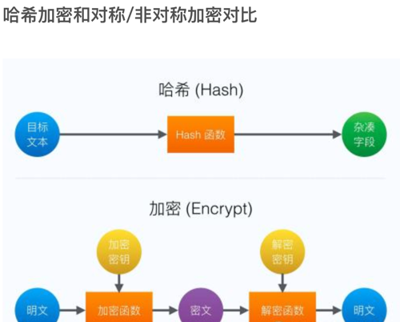

# 加解密
第三方参考链接：https://github.com/weblazy/crypto

一般待加密的内容被叫作明文，加密使用的关键元素被称为秘钥，加密的结果被称为密文.

常用加解密分为：“对称式”、“非对称式”和”数字签名“。

- 对称式：对称加密(也叫私钥加密)指加密和解密使用相同密钥的加密算法。具体算法主要有DES算法，3DES算法，TDEA算法，Blowfish算法，RC5算法，IDEA算法。

- 非对称加密(公钥加密)：指加密和解密使用不同密钥的加密算法，也称为公私钥加密。具体算法主要有RSA、Elgamal、背包算法、Rabin、D-H、ECC（椭圆曲线加密算法）。

- 数字签名：数字签名是*非对称密钥加密技术*与*数字摘要技术*的应用。主要算法有md5、hmac、sha1等。

## 哈希加密和对称/非对称加密 区别
1. 哈希密码是不可逆的，因此无法从密文中获取到原文，而对称/非对称加密可以；
2. 哈希密码加密大部分不需要密钥（除了HMAC），而对称/非对称加密需要；
3. 哈希加密不管是短数据还是长数据，加密后得到的密文长度是固定的，而对称/非对称通常和原文的长度成正比；
4. 哈希加密有可能碰撞，虽然理论的哈希加密是不可能碰撞的，但是只是理论，王小云教授之前就提出碰撞的方法。而对于对称/非对称，一个密文用密钥解密后的结果一定是唯一的；

## 1. 对称加密
用过程： 在对称加密算法中，数据发信方将明文（原始数据）和加密密钥一起经过特殊加密算法处理后，使其变成复杂的加密密文发送出去。收信方收到密文后，若想解读原文，则需要使用加密用过的密钥及相同算法的逆算法对密文进行解密，才能使其恢复成可读明文。
在对称加密算法中，使用的密钥只有一个，发收信双方都使用这个密钥对数据进行加密和解密，这就要求解密方事先必须知道加密密钥。

### 分类
对称加密分为序列密码和分组加密。 
- 序列密码，也叫流加密(stream cyphers)，依次加密明文中的每一个字节。加密是指利用用户的密钥通过某种复杂的运算（密码算法）产生大量的伪随机流，对明文流的加密。解密是指用同样的密钥和密码算法及与加密相同的伪随机流，用以还原明文流。

- 分组密码，也叫块加密(block cyphers)，一次加密明文中的一个块。是将明文按一定的位长分组，明文组经过加密运算得到密文组，密文组经过解密运算（加密运算的逆运算），还原成明文组。

#### 1. 序列密码
序列密码具有实现简单、便于硬件实施、加解密处理速度快、没有或只有有限的错误传播等特点，但是因为这类密码主要运用在军事，政治机密机构上，因此它的研究成果较少有公开。目前可以公开在其他领域应用的算法有RC4，SEAL，A5等

同步流密码产生密码流的过程分为两部分，一个是密钥流产生器，另一个是加密变换器。 加密过程表达式是：ci=E(ki,mi)，参数都是字节数组的单个元素。解密过程和加密过程必须同步，表达式是一个。因为密钥流的产生每次都是不一样的。所以加密时，每次产生的密钥流元素先缓存到寄存器中，等解密用完这个元素以后再继续进行加密。整个过程有点类似tcp协议。目前最为常用的流密码体制是有限域GF(2)上的二元加法流密码，其加密变换可表示为ci=ki⊕mi。 特点： 1）同步要求 在同步流密码中，发送方和接收方必须是同步的，即双方使用同样的密钥，对同一位置进行操作。一旦密文字符在传输中出现丢失，损坏或者删除，那么解密将失败 2）无错误传播 密文字符在传输过程中被修改，只是对该字符产生影响，并不影响其他密文字符的解密。 3）主动攻击性破坏同步性 作为同步要求的结果，主动攻击者对传输中的密文字符进行重放，插入，删除等破坏操作，直接会造成加解密过程的同步性。所以在使用时，需要借助其他密码学技术对传输的密文进行认证和完整性的验证操作。

自同步密码的密钥流的产生不独立于明文流和密文流，通常第i个密钥字的产生不仅与主密钥有关，而且与前面已经产生的若干个密文字有关。 

特点： 1）自同步 发送方在传输密文流过程中，某些密文字符被攻击，接收方的解密只是在这些被攻击过的密文与发送方不同步，而其他密文流解密同步不会有问题。

2）有限的错误传播 接收方的解密只是对攻击过的i个密文字符有影响，而对其他密文流不会有问题。所以产生的明文至多有i个错误。

3）主动攻击破坏当前的同步性

4）明文统计扩算 每个明文字符都会影响其后的整个密文，即明文的统计学特性扩散到了密文中。因此，自同步流密码在抵抗利用明文冗余而发起的攻击方面要强于同步流密码

#### 2. 分组密码
分组密码，也叫块加密，英文Block Cyper，一般先对明文m进行填充得到一个长度是固定分组长度s的整数倍明文串M；
然后将M划分成一个个长度为s的分组；最后对每个分组使用同一个密钥执行加密变换。比较常见的算法有AES;DES;3DES。

分组密码中，无论是明文块还是密文块，块与块之间都有一些逻辑运算关系，这些关系即为运算的模式 
- Electronic Code Book(ECB)电子密码本模式 
- Cipher Block Chaining(CBC)密码分组链接模式 
- Cipher Feedback Mode(CFB)加密反馈模式
- Output Feedback Mode(OFB)输出反馈模式 
- Counter mode（CTR）计数器模式 

目前推荐使用的是CBC模式和CTR模式，其它模式较少使用或不推荐使用。

### 特点
对称加密算法的特点是算法公开、计算量小、加密速度快、加密效率高， 安全性差（双方都知道秘钥容易泄露），管理秘钥困难，没有签名功能

## 2. 非对称加密

非对称加密也叫公钥密码。 1976年，两位美国计算机学家Whitfield Diffie 和 Martin Hellman，提出了一种崭新构思，可以在不直接传递密钥的情况下，完成解密。这被称为"Diffie-Hellman密钥交换算法"。
在当时几乎所有的密码体制都是对称密码体制，原理都是基于替换和置换这些较简单方法。公钥密码体制完全与之不同，它是非对称的，
有两个不同的密钥，分别是公钥和私钥，加密的原理也不是之前的简单置换或替换，而是一些复杂的数学函数。这些数学函数都是基于数学难题。

其所依据的难题一般分为三类：大整数分解问题类、离散对数问题类、椭圆曲线类。

有时也把椭圆曲线类归为离散对数类。公钥密码体制是一次革命性的变革，突破了原有的密码体制模式，它解决了传统密码体制的两个大难题：密钥分配和数字签名

### 背景
传统密码体制用的都是一个密钥，发送方传输密钥给接收方成本很高，而且风险很大。
接收方收到的密文如果在传输过程中被修改，接收方无法判断密文的真伪性。
公钥体制完美地解决了上述问题。它有一对密钥，一个是公钥，完全公开，任何人都可以收到该密钥；另一个是私钥，自己保存，不需要告诉任何人。
通过公开的公钥是无法计算出私钥的，所以私钥是安全的。发送方A用公钥对明文进行加密，接收方B用对应的私钥进行解密。为保证传输密文的完整性和消息来源的准确性，需要对密文进行数字签名。
A对密文用自己的私钥进行再次加密，此过程叫数字签名；B接收到密文用该私钥对应的公钥进行解密，此过程叫验签。 所以公钥密码体制可以分为两个模型：加密解密模型和签名验签模型。两个模型可以独立使用，也可以一起混用。

具体按照自己的应用场景使用，一般情况下发送的密文都是需要进行数字签名的，发送的内容包括密文和签名两部分。接受者先进行验签，验签通过后，再进行解密。 非对称加密的方式有很多，以下讲解RSA，DSA，ECDSA这三种加密方式。

### 公钥密码体制的要求
1. 产生一对密钥对，即公私钥对，在计算上是容易的；
2. 通过公钥对明文进行加密，在计算上是容易的；
3. 通过私钥对密文进行解密，在计算上是容易的； 
4. 已知公钥，无法计算出私钥；
5. 已知公钥和密文，无法计算出明文；
6. 加密和解密的顺序可以交换。

## 3. 数字签名（Digital Signature）

数字签名（Digital Signature）是电子信息技术发展的产物，是针对电子信息 的一种签名确认方法，它是利用数学方法和密码算法对该电子信息进行关键信息提取并进行加密而形成的，所要达到的目的是：对数字对象的合法化、真实性进行标记，并提供签名者的承诺

数字签名基于两条基本的假设：

* 一是私钥是安全的，只有其拥有者才能获得；

* 二是产生数字签名的惟一途径是使用私钥。

哈希函数（Hash Function），也称为散列函数或杂凑函数。哈希函数是一个公开函数，可以将任意长度的消息M映射成为一个长度较短且长度固定的值H（M），
称H（M）为哈希值、散列值（Hash Value）、杂凑值或者消息摘要（Message Digest）。它是一种单向密码体制，即一个从明文到密文的不可逆映射，只有加密过程，没有解密过程。

它的函数表达式为：
> h=H（m）

- M:任意长度的消息
- H:哈希(Hash)函数或杂凑函数或散列函数
- h:固定长度的哈希值

无论输入是什么数字格式、文件有多大，输出都是固定长度的比特串。以比特币使用的Sha256算法为例，无论输入是什么数据文件，输出就是256bit。

- 散列算法MD族是在上个世纪90年代初由Ron●Rivest设计的，MD代表消息摘要(message-digest)， MD2(1989)、MD4(1990)和MD5(1991)都产生一个128位的信息摘要
- SHA系列算法是美国国家标准与技术研究院(NIST)根据Rivest设计的MD4和MD5而开发的算法，国家安全当局发布SHA作为美国政府标准，SHA(Secure Hash Algorithm)表示安全散列算法。

### 用途
提取内容摘要、生成签名、文件对比、区块链等等

### 哈希算法
把网址A，转换成数字1。网址B，转换成数字2。

一个网址X，转换成数字N，根据数字N作为下标，就可以快速地查找出网址X的信息。这个转换的过程就是哈希算法。

比如这里有一万首歌，给你一首新的歌X，要求你确认这首歌是否在那一万首歌之内。

无疑，将一万首歌一个一个比对非常慢。但如果存在一种方式，能将一万首歌的每首数据浓缩到一个数字（称为哈希码）中，于是得到一万个数字，那么用同样的算法计算新的歌X的编码，看看歌X的编码是否在之前那一万个数字中，就能知道歌X是否在那一万首歌中。

作为例子，如果要你组织那一万首歌，一个简单的哈希算法就是让歌曲所占硬盘的字节数作为哈希码。这样的话，你可以让一万首歌“按照大小排序”，然后遇到一首新的歌，只要看看新的歌的字节数是否和已有的一万首歌中的某一首的字节数相同，就知道新的歌是否在那一万首歌之内了。

一个可靠的哈希算法，应该满足：

对于给定的数据M,很容易算出哈希值X=F(M);

根据X很难反算出M;

很难找到M和N使得F(N)=F(M)

### 哈希加密的特点

- 易压缩：对于任意大小的输入x，Hash值的长度很小，在实际应用中，函数H产生的Hash值其长度是固定的。

- 易计算：对于任意给定的消息，计算其Hash值比较容易。

- 不可逆：对于给定的Hash值，要找到使得在计算上是不可行的，即求Hash的逆很困难。在给定某个哈希函数H和哈希值H（M）的情况下，得出M在计算上是不可行的。即从哈希输出无法倒推输入的原始数值。这是哈希函数安全性的基础。

- 抗碰撞性：理想的Hash函数是无碰撞的，但在实际算法的设计中很难做到这一点。
有两种抗碰撞性：一种是弱抗碰撞性，即对于给定的消息，要发现另一个消息，满足在计算上是不可行的；另一种是强抗碰撞性，即对于任意一对不同的消息，使得在计算上也是不可行的。

- 高灵敏性：这是从比特位角度出发的，指的是1比特位的输入变化会造成1/2的比特位发生变化。消息M的任何改变都会导致哈希值H（M）发生改变。即如果输入有微小不同，哈希运算后的输出一定不同。

哈希加密并非不可破解，2004年，王小云教授在国际密码学大会上公布了破解Hash函数的关键技术。

## 参考链接
1. ECC（EllipticCurve Cryptosystem椭圆曲线密码体制): https://blog.csdn.net/lady_killer9/article/details/118028287?spm=1001.2014.3001.5502

