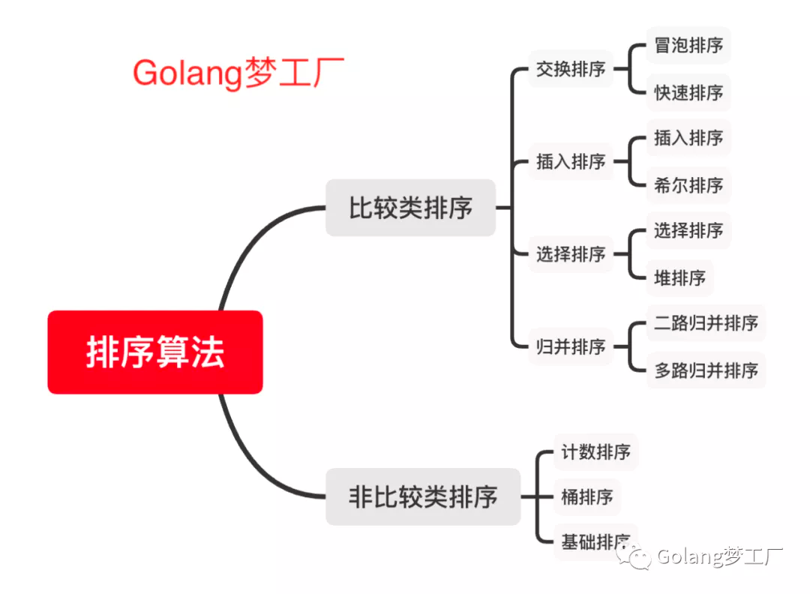

# 算法分类

我们常见的排序算法可以分为两大类：

    比较类排序：通过比较来决定元素间的相对次序，由于其时间复杂度不能突破O(nlogn)，因此也称为非线性时间比较类排序。
    非比较类排序：不通过比较来决定元素间的相对次序，它可以突破基于比较排序的时间下界，以线性时间运行，因此也称为线性时间非比较类排序。

```css
排序算法	时间复杂度(平均)	时间复杂度(最坏)	时间复杂度(最优)	空间复杂度           稳定性

冒泡排序	O(𝑛2)	        O(𝑛2)	        O(𝑛)	        O(1)                稳定
快速排序	O(nlogn)        O(𝑛2)	        O(nlogn)        O(nlogn)～O(n)       不稳定
插入排序	O(𝑛2)	        O(𝑛2)	        O(𝑛)	        O(1)                稳定
希尔排序	O(nlogn)~O(𝑛2)	O(𝑛2)	        O(𝑛1.3)	        O(1)                不稳定
选择排序	O(𝑛2)	        O(𝑛2)	        O(𝑛2)	        O(1)                稳定
堆排序	O(nlogn)        O(nlogn)        O(nlogn)        O(1)                不稳定
归并排序	O(nlogn)        O(nlogn)        O(nlogn)        O(n)	            稳定

计数排序	O(n+k)          O(n+k)          O(n+k)          O(k)                稳定
桶排序	O(n+k)          O(𝑛2)           O(𝑛2)           O(n+k)                稳定
基数排序	O(n*k)]         O(n*k)          O(n*k)          O(n+k)              稳定
```
## 1.冒泡排序


步骤

1. 比较相邻的元素。如果第一个比第二个大，就交换他们两个。
2. 对每一对相邻元素作同样的工作，从开始第一对到结尾的最后一对。这步做完后，最后的元素会是最大的数。
3. 针对所有的元素重复以上的步骤，除了最后一个。
4. 持续每次对越来越少的元素重复上面的步骤，直到没有任何一对数字需要比较

## 2.快速排序


步骤

1. 从数列中挑出一个元素，称为 “基准”（pivot）;
2. 重新排序数列，所有元素比基准值小的摆放在基准前面，所有元素比基准值大的摆在基准的后面（相同的数可以到任一边）。在这个分区退出之后，该基准就处于数列的中间位置。这个称为分区（partition）操作；
3. 递归地（recursive）把小于基准值元素的子数列和大于基准值元素的子数列排序；

