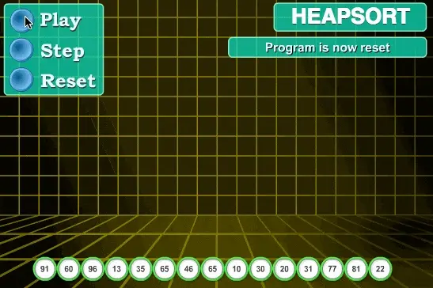
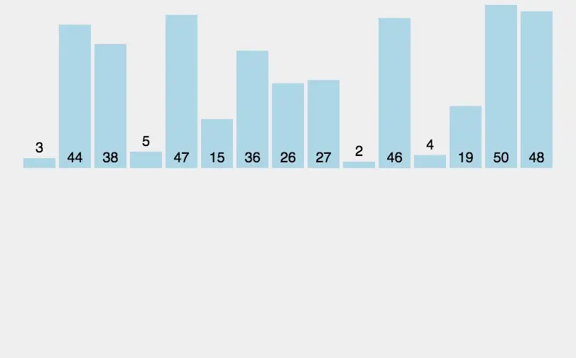

<!-- START doctoc generated TOC please keep comment here to allow auto update -->
<!-- DON'T EDIT THIS SECTION, INSTEAD RE-RUN doctoc TO UPDATE -->
**Table of Contents**  *generated with [DocToc](https://github.com/thlorenz/doctoc)*

- [排序算法分类](#%E6%8E%92%E5%BA%8F%E7%AE%97%E6%B3%95%E5%88%86%E7%B1%BB)
  - [1. 冒泡排序](#1-%E5%86%92%E6%B3%A1%E6%8E%92%E5%BA%8F)
  - [2. 快速排序（quickSort）](#2-%E5%BF%AB%E9%80%9F%E6%8E%92%E5%BA%8Fquicksort)
  - [3. 插入排序 (Insertion Sort)](#3-%E6%8F%92%E5%85%A5%E6%8E%92%E5%BA%8F-insertion-sort)
  - [4. 希尔排序，也称递减增量排序算法，实质是插入排序的优化（分组插入排序）](#4-%E5%B8%8C%E5%B0%94%E6%8E%92%E5%BA%8F%E4%B9%9F%E7%A7%B0%E9%80%92%E5%87%8F%E5%A2%9E%E9%87%8F%E6%8E%92%E5%BA%8F%E7%AE%97%E6%B3%95%E5%AE%9E%E8%B4%A8%E6%98%AF%E6%8F%92%E5%85%A5%E6%8E%92%E5%BA%8F%E7%9A%84%E4%BC%98%E5%8C%96%E5%88%86%E7%BB%84%E6%8F%92%E5%85%A5%E6%8E%92%E5%BA%8F)
  - [5. 堆排序（heapSort）](#5-%E5%A0%86%E6%8E%92%E5%BA%8Fheapsort)
  - [6. 归并排序（SymMerge）](#6-%E5%BD%92%E5%B9%B6%E6%8E%92%E5%BA%8Fsymmerge)
  - [sort 使用](#sort-%E4%BD%BF%E7%94%A8)
  - [sort 包分析](#sort-%E5%8C%85%E5%88%86%E6%9E%90)
    - [不稳定排序](#%E4%B8%8D%E7%A8%B3%E5%AE%9A%E6%8E%92%E5%BA%8F)
    - [稳定排序](#%E7%A8%B3%E5%AE%9A%E6%8E%92%E5%BA%8F)
    - [sort.Search](#sortsearch)
  - [参考](#%E5%8F%82%E8%80%83)

<!-- END doctoc generated TOC please keep comment here to allow auto update -->

# 排序算法分类


我们常见的排序算法可以分为两大类：

- 比较类排序：通过比较来决定元素间的相对次序，由于其时间复杂度不能突破O(nlogn)，因此也称为非线性时间比较类排序。
- 非比较类排序：不通过比较来决定元素间的相对次序，它可以突破基于比较排序的时间下界，以线性时间运行，因此也称为线性时间非比较类排序。

```css
排序算法	时间复杂度(平均)	时间复杂度(最坏)	时间复杂度(最优)	空间复杂度           稳定性

冒泡排序	O(𝑛2)	        O(𝑛2)	        O(𝑛)	        O(1)                稳定
快速排序	O(nlogn)        O(𝑛2)	        O(nlogn)        O(nlogn)～O(n)      不稳定
插入排序	O(𝑛2)	        O(𝑛2)	        O(𝑛)	        O(1)                稳定
希尔排序	O(nlogn)~O(𝑛2)	O(𝑛2)	        O(𝑛1.3)	        O(1)                不稳定
选择排序	O(𝑛2)	        O(𝑛2)	        O(𝑛2)	        O(1)                稳定
堆排序	O(nlogn)        O(nlogn)        O(nlogn)        O(1)                不稳定
归并排序	O(nlogn)        O(nlogn)        O(nlogn)        O(n)	            稳定
计数排序	O(n+k)          O(n+k)          O(n+k)          O(k)                稳定
桶排序	O(n+k)          O(𝑛2)           O(𝑛2)           O(n+k)              稳定
基数排序	O(n*k)]         O(n*k)          O(n*k)          O(n+k)              稳定
```


常见的快速排序、归并排序、堆排序以及冒泡排序等都属于比较类排序算法。比较类排序是通过比较来决定元素间的相对次序，由于其时间复杂度不能突破 O(nlogn)，因此也称为非线性时间比较类排序。

在冒泡排序之类的排序中，问题规模为 n，又因为需要比较 n 次，所以平均时间复杂度为 O(n²)。
在归并排序、快速排序之类的排序中，问题规模通过分治法消减为 logn 次，所以时间复杂度平均 O(nlogn)。
比较类排序的优势是，适用于各种规模的数据，也不在乎数据的分布，都能进行排序。可以说，比较排序适用于一切需要排序的情况。

而计数排序、基数排序、桶排序则属于非比较类排序算法。非比较排序不通过比较来决定元素间的相对次序，而是通过确定每个元素之前，应该有多少个元素来排序。
由于它可以突破基于比较排序的时间下界，以线性时间运行，因此称为线性时间非比较类排序。 
非比较排序只要确定每个元素之前的已有的元素个数即可，所有一次遍历即可解决。算法时间复杂度 O(n)。

非比较排序时间复杂度低，但由于非比较排序需要占用空间来确定唯一位置。所以对数据规模和数据分布有一定的要求。


## 1. 冒泡排序
它重复地遍历要排序的序列，依次比较两个元素，如果它们的顺序错误就把它们交换过来。遍历序列的工作是重复地进行直到没有再需要交换为止，此时说明该序列已经排序完成。

这个算法的名字由来是因为越小的元素会经由交换慢慢 “浮” 到数列的顶端


步骤

1. 比较相邻的元素。如果第一个比第二个大，就交换他们两个。
2. 对每一对相邻元素作同样的工作，从开始第一对到结尾的最后一对。这步做完后，最后的元素会是最大的数。
3. 针对所有的元素重复以上的步骤，除了最后一个。
4. 持续每次对越来越少的元素重复上面的步骤，直到没有任何一对数字需要比较

## 2. 快速排序（quickSort）


通过一趟排序将待排记录分隔成独立的两部分，其中一部分的关键字比另一部分的关键字小

步骤

1. 从数列中挑出一个元素，称为 “基准”（pivot）;
2. 重新排序数列，所有元素比基准值小的摆放在基准前面，所有元素比基准值大的摆在基准的后面（相同的数可以到任一边）。在这个分区退出之后，该基准就处于数列的中间位置。这个称为分区（partition）操作；
3. 递归地（recursive）把小于基准值元素的子数列和大于基准值元素的子数列排序；


## 3. 插入排序 (Insertion Sort)


对于未排序数据，在已排序序列中从后向前扫描，找到相应位置并插入。

尽管其平均时间复杂度高达 O(n^2)，但是在 array 长度较短(这个值一般是 16 ~ 32)的情况下，在实际应用中拥有良好的性能表现。

## 4. 希尔排序，也称递减增量排序算法，实质是插入排序的优化（分组插入排序）

对于大规模的数组，插入排序很慢，因为它只能交换相邻的元素位置，每次只能将未排序序列数量减少 1。希尔排序的出现就是为了解决插入排序的这种局限性，通过交换不相邻的元素位置，使每次可以将未排序序列的减少数量变多


## 5. 堆排序（heapSort）



## 6. 归并排序（SymMerge）
原理： 将数组分成两个子数组， 分别进行排序，然后再将它们归并起来（自上而下）

具体算法描述：先考虑合并两个有序数组，基本思路是比较两个数组的最前面的数，谁小就先取谁，取了后相应的指针就往后移一位。然后再比较，直至一个数组为空，最后把另一个数组的剩余部分复制过来即可

归并算法是分治法 的一个典型应用， 所以它有两种实现方法：

- 自上而下的递归： 每次将数组对半分成两个子数组再归并（分治）
- 自下而上的迭代：先归并子数组，然后成对归并得到的子数组

## sort 使用

sort 包本身完成了 int float64 和 string 类型的数据排序， 使用起来也很简单

```go
// go1.21.5/src/sort/sort.go
// Convenience wrappers for common cases

// Ints sorts a slice of ints in increasing order.
//
// Note: consider using the newer slices.Sort function, which runs faster.
func Ints(x []int) { Sort(IntSlice(x)) }

// Float64s sorts a slice of float64s in increasing order.
// Not-a-number (NaN) values are ordered before other values.
//
// Note: consider using the newer slices.Sort function, which runs faster.
func Float64s(x []float64) { Sort(Float64Slice(x)) }

// Strings sorts a slice of strings in increasing order.
//
// Note: consider using the newer slices.Sort function, which runs faster.
func Strings(x []string) { Sort(StringSlice(x)) }
```
分别维护了一个 IntSlice 、 Float64Slice 和 StringSlice 的结构

搜索
```go
// /go1.21.5/src/sort/search.go

// Convenience wrappers for common cases.

// SearchInts searches for x in a sorted slice of ints and returns the index
// as specified by Search. The return value is the index to insert x if x is
// not present (it could be len(a)).
// The slice must be sorted in ascending order.
func SearchInts(a []int, x int) int {
	return Search(len(a), func(i int) bool { return a[i] >= x })
}

// SearchFloat64s searches for x in a sorted slice of float64s and returns the index
// as specified by Search. The return value is the index to insert x if x is not
// present (it could be len(a)).
// The slice must be sorted in ascending order.
func SearchFloat64s(a []float64, x float64) int {
	return Search(len(a), func(i int) bool { return a[i] >= x })
}

// SearchStrings searches for x in a sorted slice of strings and returns the index
// as specified by Search. The return value is the index to insert x if x is not
// present (it could be len(a)).
// The slice must be sorted in ascending order.
func SearchStrings(a []string, x string) int {
	return Search(len(a), func(i int) bool { return a[i] >= x })
}

```


## sort 包分析

切片排序

```go
// go1.21.5/src/sort/slice.go

// The sort is not guaranteed to be stable: equal elements
// may be reversed from their original order.
// For a stable sort, use SliceStable.
func Slice(x any, less func(i, j int) bool) {
	rv := reflectlite.ValueOf(x)
	swap := reflectlite.Swapper(x)
	length := rv.Len()
	limit := bits.Len(uint(length))
	pdqsort_func(lessSwap{less, swap}, 0, length, limit)
}

func SliceStable(x any, less func(i, j int) bool) {
	rv := reflectlite.ValueOf(x)
	swap := reflectlite.Swapper(x)
	stable_func(lessSwap{less, swap}, rv.Len())
}

```

> 稳定排序：假定在待排序的序列中存在多个具有相同值的元素，若经过排序，这些元素的相对次序保持不变，
> 即在原序列中，若r[i]=r[j]且r[i]在r[j]之前，在排序后的序列中，若r[i]仍在r[j]之前，则称这种排序算法是稳定的(stable)；否则称为不稳定的。

- Sort 不稳定排序 
- Stable 是稳定排序: 相同元素会保证原始顺序

### 不稳定排序
pdqsort (pattern-defating quicksort) 是 Rust、C++ Boost 中默认的 unstable 排序算法，其实质为一种混合排序算法，
会在不同情况下切换到不同的排序机制，是 C++ 标准库算法 introsort 的一种改进。可以认为是 unstable 混合排序算法的较新成果

其理想情况下的时间复杂度为 O(n)，最坏情况下的时间复杂度为 O(n* logn)，不需要额外的空间

```go
// pdqsort_func sorts data[a:b].
// The algorithm based on pattern-defeating quicksort(pdqsort), but without the optimizations from BlockQuicksort.
// pdqsort paper: https://arxiv.org/pdf/2106.05123.pdf
// C++ implementation: https://github.com/orlp/pdqsort
// Rust implementation: https://docs.rs/pdqsort/latest/pdqsort/
// limit is the number of allowed bad (very unbalanced) pivots before falling back to heapsort.
func pdqsort_func(data lessSwap, a, b, limit int) {
	const maxInsertion = 12

	var (
		wasBalanced    = true // whether the last partitioning was reasonably balanced
		wasPartitioned = true // whether the slice was already partitioned
	)

	for {
		length := b - a

		if length <= maxInsertion {
			// 长度<=12,选择插入排序
			insertionSort_func(data, a, b)
			return
		}

		// Fall back to heapsort if too many bad choices were made.
		if limit == 0 {
			// 堆排序
			heapSort_func(data, a, b)
			return
		}

		// If the last partitioning was imbalanced, we need to breaking patterns.
		if !wasBalanced {
			breakPatterns_func(data, a, b)
			limit--
		}

		pivot, hint := choosePivot_func(data, a, b)
		if hint == decreasingHint {
			reverseRange_func(data, a, b)
			// The chosen pivot was pivot-a elements after the start of the array.
			// After reversing it is pivot-a elements before the end of the array.
			// The idea came from Rust's implementation.
			pivot = (b - 1) - (pivot - a)
			hint = increasingHint
		}

		// The slice is likely already sorted.
		if wasBalanced && wasPartitioned && hint == increasingHint {
			if partialInsertionSort_func(data, a, b) {
				return
			}
		}

		// Probably the slice contains many duplicate elements, partition the slice into
		// elements equal to and elements greater than the pivot.
		if a > 0 && !data.Less(a-1, pivot) {
			mid := partitionEqual_func(data, a, b, pivot)
			a = mid
			continue
		}

		mid, alreadyPartitioned := partition_func(data, a, b, pivot)
		wasPartitioned = alreadyPartitioned

		leftLen, rightLen := mid-a, b-mid
		balanceThreshold := length / 8
		if leftLen < rightLen {
			wasBalanced = leftLen >= balanceThreshold
			pdqsort_func(data, a, mid, limit)
			a = mid + 1
		} else {
			wasBalanced = rightLen >= balanceThreshold
			pdqsort_func(data, mid+1, b, limit)
			b = mid
		}
	}
}
```

### 稳定排序

```go
func stable_func(data lessSwap, n int) {
	blockSize := 20 // must be > 0
	a, b := 0, blockSize
	for b <= n {
		insertionSort_func(data, a, b)
		a = b
		b += blockSize
	}
	insertionSort_func(data, a, n)

	for blockSize < n {
		a, b = 0, 2*blockSize
		for b <= n {
			symMerge_func(data, a, a+blockSize, b)
			a = b
			b += 2 * blockSize
		}
		if m := a + blockSize; m < n {
			symMerge_func(data, a, m, n)
		}
		blockSize *= 2
	}
}
```


Golang中 sort包内部实现了四种基本的排序算法

1. 插入排序 insertionSort: 对于未排序数据，在已排序序列由后向前扫描，找到相应位置并插入。

```go
// go1.21.5/src/sort/zsortfunc.go

// insertionSort_func sorts data[a:b] using insertion sort.
func insertionSort_func(data lessSwap, a, b int) {
	for i := a + 1; i < b; i++ {
		for j := i; j > a && data.Less(j, j-1); j-- {
			data.Swap(j, j-1)
		}
	}
}

```

2. 归并排序 symMerge


```go
// 归并排序
func symMerge(data Interface, a, m, b int) {
	// Avoid unnecessary recursions of symMerge
	// by direct insertion of data[a] into data[m:b]
	// if data[a:m] only contains one element.
	if m-a == 1 {
		// Use binary search to find the lowest index i
		// such that data[i] >= data[a] for m <= i < b.
		// Exit the search loop with i == b in case no such index exists.
		i := m
		j := b
		for i < j {
			h := int(uint(i+j) >> 1)
			if data.Less(h, a) {
				i = h + 1
			} else {
				j = h
			}
		}
		// Swap values until data[a] reaches the position before i.
		for k := a; k < i-1; k++ {
			data.Swap(k, k+1)
		}
		return
	}

	// Avoid unnecessary recursions of symMerge
	// by direct insertion of data[m] into data[a:m]
	// if data[m:b] only contains one element.
	if b-m == 1 {
		// Use binary search to find the lowest index i
		// such that data[i] > data[m] for a <= i < m.
		// Exit the search loop with i == m in case no such index exists.
		i := a
		j := m
		for i < j {
			h := int(uint(i+j) >> 1)
			if !data.Less(m, h) {
				i = h + 1
			} else {
				j = h
			}
		}
		// Swap values until data[m] reaches the position i.
		for k := m; k > i; k-- {
			data.Swap(k, k-1)
		}
		return
	}

	mid := int(uint(a+b) >> 1)
	n := mid + m
	var start, r int
	if m > mid {
		start = n - b
		r = mid
	} else {
		start = a
		r = m
	}
	p := n - 1

	for start < r {
		c := int(uint(start+r) >> 1)
		if !data.Less(p-c, c) {
			start = c + 1
		} else {
			r = c
		}
	}

	end := n - start
	if start < m && m < end {
		rotate(data, start, m, end)
	}
	if a < start && start < mid {
		symMerge(data, a, start, mid)
	}
	if mid < end && end < b {
		symMerge(data, mid, end, b)
	}
}
```

3. 堆排序 heapSort: 利用堆这种数据结构所设计的一种排序算法
```go
// 堆排序
func heapSort(data Interface, a, b int) {
	first := a
	lo := 0
	hi := b - a

	// Build heap with greatest element at top.
	for i := (hi - 1) / 2; i >= 0; i-- {
		siftDown(data, i, hi, first)
	}

	// Pop elements, largest first, into end of data.
	for i := hi - 1; i >= 0; i-- {
		data.Swap(first, first+i)
		siftDown(data, lo, i, first)
	}
}
```

4. 快速排序 quickSort
```go
// go1.18/src/sort/zfuncversion.go
func quickSort_func(data lessSwap, a, b, maxDepth int)
```


sort包内置的四种排序方法是不公开的，只能被用于sort包内部使用。因此，对数据集合排序时， 不必考虑应当选择哪一种，只需要实现sort.Interface接口定义三个接口即可
```go
type Interface interface{
    Len() int //返回集合中的元素个数
    Less(i,j int) bool//i>j 返回索引i的元素是否比索引j的元素小
    Swap(i,j int)//交换i和j的值
}
```
这里其实隐含要求这个容器或数据集合是slice类型或Array类型。否则，没法按照索引号取值
逆序:sort包提供了Reverse()方法，允许将数据按Less()定义的排序方式逆序排序，而无需修改Less()代码。

Note：Go的sort包已经为基本数据类型都实现了sort功能，其函数名的最后一个字母是s，表示sort之意。比如：Ints, Float64s, Strings，等等。


### sort.Search
该函数使用二分查找的方法，会从[0, n)中取出一个值index，index为[0, n)中最小的使函数f(index)为True的值，并且f(index+1)也为True

```go
func Search(n int, f func(int) bool) int {
	// Define f(-1) == false and f(n) == true.
	// Invariant: f(i-1) == false, f(j) == true.
	i, j := 0, n
	for i < j {
		// uint是无符号的int，范围是2^32即0到4294967295。使用uint可以避免因为i+j太大而造成的溢出
		//这里使用了移位操作， 向后移动一位，其结果与(i+j)/2一样
		h := int(uint(i+j) >> 1) // avoid overflow when computing h
		// i ≤ h < j
        // 如果f(h)返回false，说明从i到h中没有目标值。这时更新i为h+1 从原先的i到现在的i之间的数就不会再次扫描了 
        //相反的，如果f(h)返回true，说明从i到h中有目标值。这时更新j为 h
		if !f(h) {
			i = h + 1 // preserves f(i-1) == false
		} else {
			j = h // preserves f(j) == true
		}
	}
	// i == j, f(i-1) == false, and f(j) (= f(i)) == true  =>  answer is i.
	// 当 i==j 时，说明找到了（或者找完了但是没有找到，这时返回的是数组长度）
	return i
}
```

## 参考

- [常见排序算法总结和 Go 标准库排序源码分析](https://segmentfault.com/a/1190000039668324)
- [使用 pdqsort 提案](https://github.com/golang/go/issues/50154)